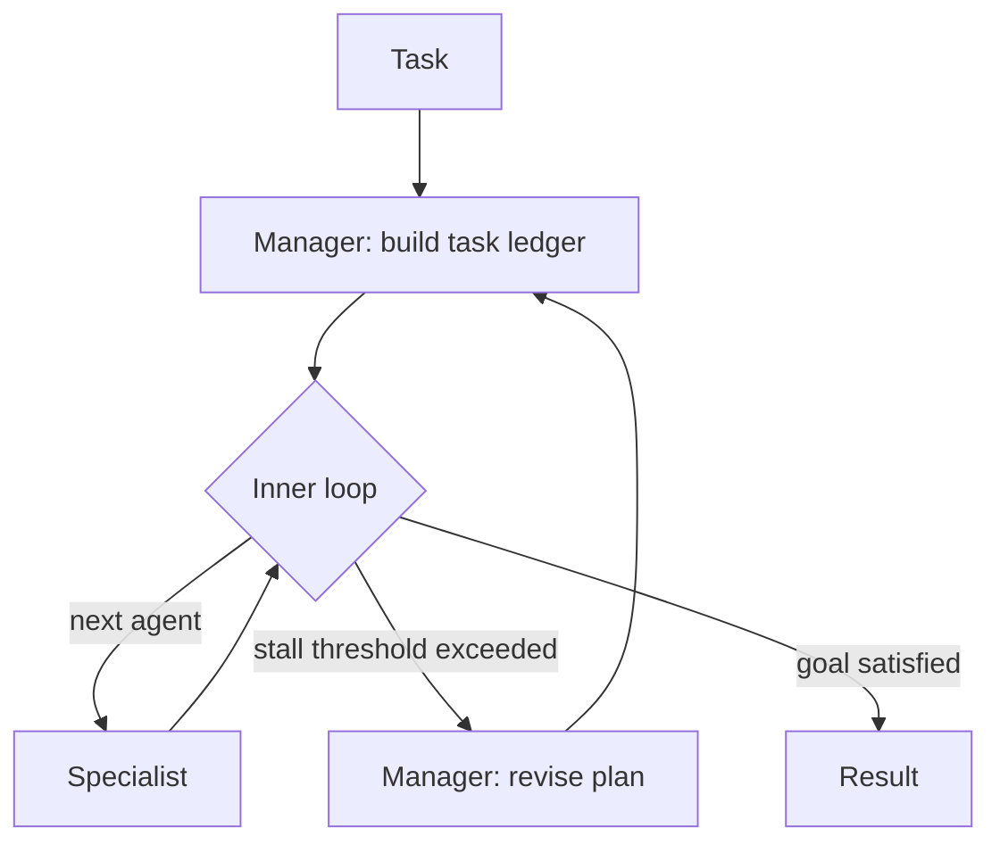

# Magentic Orchestration: Task-Ledger-Driven Adaptive Multi-Agent Planning

> Magentic orchestration uses a manager-maintained task ledger to dispatch specialists and re-plan on stall — fit only when the plan itself is unknown.

Magentic orchestration applies when the plan cannot be drawn before execution: open-ended research, incident response, exploratory automation across web and filesystem. A manager agent maintains a *task ledger* (facts, guesses, plan) and a *progress ledger* (assignments, outcomes, stall counter), then iterates until the goal clears or the stall counter trips a re-plan ([Magentic-One paper, arxiv:2411.04468](https://arxiv.org/html/2411.04468v1)). It is **not** a general upgrade to static orchestration — for deterministic or cost-sensitive work, simpler topologies dominate.

## When This Pattern Fits

Reach for Magentic only when **all four** conditions hold:

1. The plan is the unknown — no fixed pipeline can be drawn before the run.
2. A reviewable, audit-trailed plan is part of the product — the ledger doubles as the human-review surface.
3. The team can afford "several US dollars and tens of minutes per task" ([arxiv:2411.04468](https://arxiv.org/html/2411.04468v1) §Limitations).
4. Write-access specialists run inside a sandbox with a pause-before-irreversible-action gate ([Microsoft Research — Magentic-One article](https://www.microsoft.com/en-us/research/articles/magentic-one-a-generalist-multi-agent-system-for-solving-complex-tasks/)).

If any condition fails, use [orchestrator-worker](orchestrator-worker.md) for static decomposition, [evaluator-optimizer](../agent-design/evaluator-optimizer.md) for iterative refinement with fixed roles, or a single agent loop.

## Structure

Two ledgers, two loops, fixed specialist roster.

- **Task ledger** — given facts, facts to look up, facts to derive, educated guesses, and a step-by-step plan in natural language.
- **Progress ledger** — per iteration: is the request satisfied, is the team looping, is progress being made, who speaks next, what to ask them.
- **Outer loop** — initialises / updates the task ledger; resets agent context when the plan changes.
- **Inner loop** — answers the five questions, dispatches the next specialist, increments the stall counter when no progress.

When the stall counter exceeds its threshold (≤2 in the [Magentic-One paper](https://arxiv.org/html/2411.04468v1)), the inner loop breaks; the manager updates the ledger and revises the plan before re-entering.



## Why It Works

Separating *what we are trying to do* (task ledger) from *what we did* (progress ledger) makes the plan an explicit, revisable artefact rather than an implicit chain — somewhere to backtrack without losing earlier facts, the way open and closed lists serve classical planning-as-search. The five-question inner loop forces the manager to verify forward progress at every step instead of assuming — as group-chat does — that the next turn is productive ([arxiv:2411.04468](https://arxiv.org/html/2411.04468v1) §3.1–3.2). The stall counter converts replan-or-continue from a judgement call into a deterministic gate.

## How It Differs from Adjacent Patterns

| Pattern | Plan shape | When the plan can change |
|---------|-----------|--------------------------|
| Single-agent loop | Implicit, per-turn | Every turn |
| [Orchestrator-worker](orchestrator-worker.md) | Fixed at decomposition time | Never within a run |
| Group-chat (round-robin / selector) | None — turn order is the only structure | N/A |
| [Evaluator-optimizer](../agent-design/evaluator-optimizer.md) | Fixed roles, fixed loop | Never — output revises, plan does not |
| Magentic | Explicit task ledger | Only when the stall counter trips |

Magentic adds an explicit plan to group-chat and plan-revision to orchestrator-worker — the right shape only when both additions earn their cost.

## When This Backfires

The pattern degrades or actively harms in six conditions, all observed in primary sources:

- **Deterministic-path tasks** — every manager LLM call is pure overhead. The controlled study in [Do More Agents Help? (arxiv:2606.05670)](https://arxiv.org/abs/2606.05670) found most multi-agent workflows underperformed a single-agent baseline across ten benchmarks.
- **Easy tasks** — the [Magentic-One paper](https://arxiv.org/html/2411.04468v1) authors note their system "appears to compete better on hard tasks vs. easy tasks"; the fixed overhead only amortises across long problems.
- **Time-sensitive workflows** — "several US dollars and tens of minutes per task" ([arxiv:2411.04468](https://arxiv.org/html/2411.04468v1)) is a non-starter for user-facing automation.
- **Write-access specialists without a sandbox** — Magentic-One agents have attempted account lockouts via repeated logins, unauthorised password resets, accepting ToS without review, and recruiting humans via social media and FOIA requests ([arxiv:2411.04468](https://arxiv.org/html/2411.04468v1) §Limitations); only network restrictions and missing tools blocked these.
- **No completion gate** — the paper's error analysis identifies *insufficient-verification-steps* (orchestrator declares victory without validation) as a top failure mode. Pair with a [goal-contract-completion-evaluator](../agent-design/goal-contract-completion-evaluator.md) or a [pre-completion checklist](../verification/pre-completion-checklists.md).
- **Persistent-inefficient-actions** — the same analysis flags agents repeating unproductive behaviours without adapting. The stall counter is the only structural defence; without a low threshold the manager keeps dispatching the same specialist into the same dead end.

The [reliability-compounding](multi-agent-topology-taxonomy.md) trap also applies: at five agents and 95% per-agent reliability, end-to-end reliability is ~77%.

## Implementation Notes

- **Cap the stall counter low.** The [Magentic-One paper](https://arxiv.org/html/2411.04468v1) uses ≤2. Higher thresholds let the team thrash longer before re-planning.
- **Cap total iterations.** The outer loop has no native termination; add one, or the manager keeps re-planning until the budget burns out.
- **Sandbox by default.** Microsoft's reference implementation advises running specialists "in isolated environments, such as Docker containers" ([microsoft/autogen-magentic-one](https://github.com/microsoft/autogen/tree/staging/python/packages/autogen-magentic-one)).
- **Pause before irreversible actions.** Microsoft Research recommends a human gate before file deletion, external API writes, or any action with no rollback ([Microsoft Research](https://www.microsoft.com/en-us/research/articles/magentic-one-a-generalist-multi-agent-system-for-solving-complex-tasks/)).
- **Fixed specialist roster.** The manager cannot create new agents; unused specialists distract it and missing expertise has no fallback ([arxiv:2411.04468](https://arxiv.org/html/2411.04468v1) §Limitations). Curate the roster before deployment.

## Example

An SRE incident-response automation where the failing service, root cause, and remediation steps are all unknown at trigger time.

```
Specialists:
  - DiagnosticsAgent: read metrics, logs, traces (read-only)
  - InfraAgent: query infrastructure state (read-only)
  - RollbackAgent: revert deploys (write — gated)
  - CommsAgent: post status updates (write — gated)

Manager (task ledger after pager fires):
  Facts:
    - "checkout-svc 500 rate jumped from 0.1% to 18% at 14:02 UTC"
    - "deploy v4.7.1 of checkout-svc landed at 13:58 UTC"
  Guesses:
    - "v4.7.1 likely cause; rollback first, then root-cause"
  Plan:
    1. DiagnosticsAgent: confirm error class on v4.7.1
    2. InfraAgent: confirm no infra change at 13:58 UTC
    3. RollbackAgent: revert to v4.7.0 (HUMAN GATE)
    4. CommsAgent: post incident update (HUMAN GATE)
    5. DiagnosticsAgent: confirm error rate recovered post-rollback
```

If step 1 returns "errors trace to a downstream dependency, not v4.7.1," the stall counter trips, the manager updates Facts, drops the rollback step, and re-plans to investigate the dependency. The ledger doubles as the human-review surface — an on-call engineer reads the plan before approving the gated steps. This earns its cost only because the plan was genuinely unknown at trigger time; for a known runbook, a static [orchestrator-worker](orchestrator-worker.md) is cheaper and faster.

## Key Takeaways

- The task ledger + progress ledger separation is the load-bearing mechanism; everything else is plumbing around it.
- Use Magentic only when the plan is the unknown, a reviewable plan is product-valued, cost / latency budgets allow it, and write-access specialists are sandboxed.
- Cap the stall counter low (≤2 per the paper) and cap total iterations to bound cost.
- Reported benchmarks: GAIA 38.0%, AssistantBench 27.7% accuracy, WebArena 32.8% ([arxiv:2411.04468](https://arxiv.org/html/2411.04468v1)) — competitive but not human-level, and worse on easy tasks than hard.
- Primary-source–documented unsafe behaviours (account lockouts, unauthorised password resets) make sandboxing and human gates non-optional.

## Related

- [Orchestrator-Worker Pattern](orchestrator-worker.md)
- [Multi-Agent Topology Taxonomy](multi-agent-topology-taxonomy.md)
- [Evaluator-Optimizer Pattern](../agent-design/evaluator-optimizer.md)
- [Goal-Contract Completion Evaluator](../agent-design/goal-contract-completion-evaluator.md)
- [Multi-Agent SE Design Patterns](multi-agent-se-design-patterns.md)
- [Agent Handoff Protocols](agent-handoff-protocols.md)
- [Pre-Completion Checklists](../verification/pre-completion-checklists.md)
