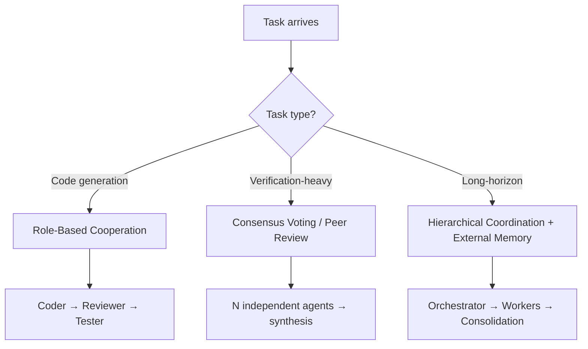

# Multi-Agent SE Design Patterns: A Taxonomy Across 94 Papers

> A systematic study of 94 LLM-based multi-agent SE papers identifies 16 design patterns, with Role-Based Cooperation as the dominant pattern and Functional Suitability as the primary quality attribute designers optimize for.

!!! info "Also known as"
    Multi-Agent Topology Taxonomy, Multi-Agent Architecture Patterns

## Background

[arXiv:2511.08475](https://arxiv.org/abs/2511.08475) presents a systematic literature review of 94 papers, producing an empirical taxonomy of multi-agent SE design patterns. The taxonomy gives developers a vocabulary for design decisions rather than ad-hoc architecture choices.

## The 16 Patterns

The study identifies 16 design patterns across five categories:

**Cooperation patterns** (how agents divide and coordinate work):

- **Role-Based Cooperation** — agents with distinct functional roles (coder, reviewer, tester) collaborate on a shared task. Most common pattern in the corpus.
- **Hierarchical Coordination** — orchestrator agents direct worker agents; workers report back structured results.
- **Peer-to-Peer Collaboration** — agents communicate directly without a designated coordinator.

**Memory patterns** (how agents retain and share state — see [Agent Memory Patterns](../agent-design/agent-memory-patterns.md)):

- **Shared Memory** — agents read and write to a common knowledge store.
- **Individual Memory** — each agent maintains private state; sharing is explicit and structured.
- **External Memory** — agents offload long-term state to databases or files outside the context window.

**Execution patterns** (how agents sequence and coordinate action):

- **Sequential Execution** — agents execute one after another in a fixed order.
- **Parallel Execution** — independent agents execute simultaneously.
- **Conditional Execution** — downstream agents activate based on upstream results.

**Verification patterns** (how agents validate outputs):

- **Peer Review** — a separate agent validates another agent's output.
- **Consensus Voting** — multiple agents independently produce outputs; the majority or synthesized answer is accepted. See [Voting / Ensemble Pattern](voting-ensemble-pattern.md).
- **Iterative Refinement** — an agent repeatedly improves its output until a quality criterion is met.

**Communication patterns** (how agents exchange information):

- **Structured Message Passing** — agents exchange typed, schema-validated payloads.
- **Shared Workspace** — agents communicate through shared artifacts (files, tickets, code).
- **Broadcast** — one agent publishes state changes that all others observe.
- **Request-Response** — point-to-point query/reply between agents.

## Dominant Design Choices

**Role-Based Cooperation is the most frequently used pattern** — the coder/reviewer/tester split appears across code generation, bug repair, and refactoring ([arXiv:2511.08475](https://arxiv.org/abs/2511.08475)).

**Functional Suitability is the primary quality attribute** — designers optimize for output correctness; MAS-level performance, maintainability, and security receive far less attention ([arXiv:2511.08475](https://arxiv.org/abs/2511.08475)).

**Code Generation dominates SE tasks** — test generation, bug repair, and refactoring follow as secondary tasks ([arXiv:2511.08475](https://arxiv.org/abs/2511.08475)).

**The primary rationale for multi-agent over single-agent** is output quality — parallelism, specialization, and cross-agent verification deliver gains a single generalist agent cannot achieve ([arXiv:2511.08475](https://arxiv.org/abs/2511.08475)).

## Research Gaps to Watch

Three under-researched areas represent practical production risks:

1. **MAS performance and scalability** — most studies measure output quality, not coordination overhead or latency under load.
2. **MAS maintainability** — evolving agent prompts, roles, and protocols as requirements change is under-studied.
3. **MAS security** — resistance to injection, manipulation, and trust boundary violations receives minimal attention.

## Using the Taxonomy

The 16 patterns provide a shared vocabulary for design reviews. When evaluating an existing architecture or planning a new one:

- Name the patterns in use — "we're using Role-Based Cooperation with Peer Review and Shared Workspace"
- Identify which quality attributes are being optimized and which are being ignored
- Check whether the dominant patterns in the literature align with your task type (code generation benefits most from the role-based + peer-review combination)

## Key Takeaways

- 16 patterns across five categories; Role-Based Cooperation is most common
- Functional Suitability (correctness) dominates; MAS performance and security are under-addressed
- Code generation benefits most from role-based + peer-review combinations
- Research gaps in performance, maintainability, and security are practical production risks

## Related

- [Agent Composition Patterns: Chains, Fan-Out, Pipelines, Supervisors](../agent-design/agent-composition-patterns.md)
- [Orchestrator-Worker Pattern](orchestrator-worker.md)
- [Specialized Agent Roles](../agent-design/specialized-agent-roles.md)
- [Committee Review Pattern](../code-review/committee-review-pattern.md)
- [Fan-Out Synthesis Pattern](fan-out-synthesis.md)
- [Multi-Agent Topology Taxonomy](multi-agent-topology-taxonomy.md)
- [LLM Map-Reduce](llm-map-reduce.md)
- [CRDT Observation-Driven Coordination](crdt-observation-driven-coordination.md)
- [Subagent Schema-Level Tool Filtering](subagent-schema-level-tool-filtering.md)
- [Closed-Loop Role-Based Refinement](closed-loop-role-based-refinement.md)
- [Sub-Agents Fan-Out](sub-agents-fan-out.md)
- [Adversarial Multi-Model Pipeline](adversarial-multi-model-pipeline.md)
- [Agent Handoff Protocols](agent-handoff-protocols.md)
- [Bounded Batch Dispatch](bounded-batch-dispatch.md)
