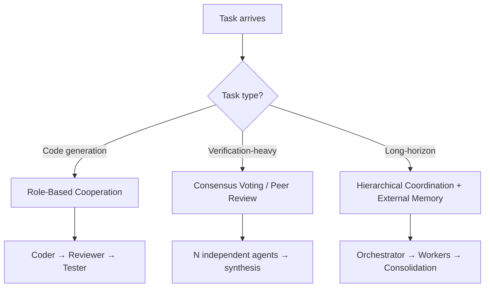

# Multi-Agent SE Design Patterns: A Taxonomy Across 94 Papers

> A study of 94 LLM-based multi-agent SE papers identifies 16 design patterns across five categories, with Role-Based Cooperation the dominant pattern.

!!! info "Also known as"
    Multi-Agent Topology Taxonomy, Multi-Agent Architecture Patterns

## Background

[arXiv:2511.08475](https://arxiv.org/abs/2511.08475) presents a systematic literature review of 94 papers, producing an empirical taxonomy of multi-agent SE design patterns. The taxonomy gives developers a vocabulary for design decisions rather than ad-hoc architecture choices.

## The 16 Patterns

The study identifies 16 design patterns across five categories:

**Cooperation** — how agents divide work:

- **Role-Based Cooperation** — distinct functional roles (coder, reviewer, tester); most common in the corpus.
- **Hierarchical Coordination** — orchestrator directs workers; workers report structured results.
- **Peer-to-Peer Collaboration** — direct agent-to-agent communication, no coordinator.

**Memory** — how state is retained and shared (see [Agent Memory Patterns](../agent-design/agent-memory-patterns.md)):

- **Shared Memory** — common knowledge store.
- **Individual Memory** — private per-agent state; sharing is explicit.
- **External Memory** — long-term state offloaded to databases or files.

**Execution** — how action is sequenced:

- **Sequential** — fixed order, one after another.
- **Parallel** — independent agents run simultaneously.
- **Conditional** — downstream agents activate based on upstream results.

**Verification** — how outputs are validated:

- **Peer Review** — separate agent validates another's output.
- **Consensus Voting** — multiple agents produce outputs independently; majority or synthesis wins. See [Voting / Ensemble](voting-ensemble-pattern.md).
- **Iterative Refinement** — agent improves output until a quality criterion is met.

**Communication** — how information flows:

- **Structured Message Passing** — typed, schema-validated payloads.
- **Shared Workspace** — communication through shared artifacts (files, tickets, code).
- **Broadcast** — one publishes, all observe.
- **Request-Response** — point-to-point query/reply.

## Dominant Design Choices

From the same corpus ([arXiv:2511.08475](https://arxiv.org/abs/2511.08475)):

- **Role-Based Cooperation is most frequent** — the coder/reviewer/tester split spans code generation, bug repair, and refactoring.
- **Functional Suitability dominates as the optimised quality attribute** — MAS-level performance, maintainability, and security receive far less attention.
- **Code Generation is the dominant task** — test generation, bug repair, and refactoring follow.
- **Quality is the rationale for multi-agent over single-agent** — parallelism, specialization, and cross-agent verification deliver gains a generalist cannot.

## Research Gaps to Watch

Three under-researched areas represent practical production risks:

1. **MAS performance and scalability** — most studies measure output quality, not coordination overhead or latency under load.
2. **MAS maintainability** — evolving agent prompts, roles, and protocols as requirements change is under-studied.
3. **MAS security** — resistance to injection, manipulation, and trust boundary violations receives minimal attention.

## Why It Works

Role-Based Cooperation produces quality gains because narrowing each agent's task scope aligns its prompt to tighter constraints. A reviewer agent can be primed to critique without sunk-cost bias toward the original output — the mechanism that makes peer review catch errors single-agent self-correction misses ([arXiv:2511.08475](https://arxiv.org/abs/2511.08475)). Gains are most reliable for code generation, where correctness is verifiable; open-ended tasks with ambiguous success criteria show weaker returns.

## When This Backfires

Multi-agent patterns are optimized for quality on benchmarks; production failure modes differ ([arXiv:2503.13657](https://arxiv.org/abs/2503.13657)):

1. **Coordination overhead exceeds quality gain** — parallel agents multiply LLM calls; latency is bounded by the slowest worker. When the quality delta over a strong single-agent is small, the cost increase rarely justifies the architecture.
2. **Role adherence degrades under drift** — as tasks lengthen or models update, inter-agent misalignment accounts for 36.9% of failures in the MAST taxonomy (communication breakdowns, inconsistent goal understanding, protocol violations).
3. **Strong single-agent baselines close the gap** — 41.8% of MAST failures trace to design issues, not model capability; capable frontier models often match multi-agent orchestration on SE tasks while avoiding specification complexity.
4. **Trust surface expands without security benefit** — adding agents multiplies attack surfaces; role and prompt evolution introduces brittleness absent in single-agent systems.

## Using the Taxonomy

The 16 patterns provide a shared vocabulary for design reviews. When evaluating an existing architecture or planning a new one:

- Name the patterns in use — "we're using Role-Based Cooperation with Peer Review and Shared Workspace"
- Identify which quality attributes are being optimized and which are being ignored
- Check whether the dominant patterns in the literature align with your task type (code generation benefits most from the role-based + peer-review combination)

```mermaid
graph TD
    A[Task arrives] --> B{Task type?}
    B -->|Code generation| C[Role-Based Cooperation]
    B -->|Verification-heavy| D[Consensus Voting / Peer Review]
    B -->|Long-horizon| E[Hierarchical Coordination + External Memory]
    C --> F[Coder → Reviewer → Tester]
    D --> G[N independent agents → synthesis]
    E --> H[Orchestrator → Workers → Consolidation]
```

## Example

A team is designing a multi-agent system for automated pull request review. Using the taxonomy, they label their architecture decisions:

- **Cooperation**: Role-Based Cooperation — three agents with distinct roles: static-analysis agent, security-scan agent, style-review agent
- **Memory**: Shared Memory — all agents read from and write to a shared review context object containing the diff, file tree, and accumulated comments
- **Execution**: Parallel Execution — the three review agents run concurrently on the same diff
- **Verification**: Consensus Voting — a synthesis agent merges overlapping comments and flags contradictions; only comments with agreement from 2+ agents are surfaced to the developer
- **Communication**: Structured Message Passing — each agent emits a typed `ReviewComment` payload with fields for file, line, severity, and rationale

During the design review, the team notes they are optimizing for Functional Suitability (comment accuracy) but have not addressed MAS Performance (latency when all three agents hit the LLM provider simultaneously) or MAS Security (whether the security-scan agent can be manipulated via crafted diff content). The taxonomy flags these as known research gaps worth mitigating before production deployment.

## Key Takeaways

- 16 patterns across five categories; Role-Based Cooperation is most common
- Functional Suitability (correctness) dominates; MAS performance and security are under-addressed
- Code generation benefits most from role-based + peer-review combinations
- Research gaps in performance, maintainability, and security are practical production risks

## Related

- [Multi-Agent Topology Taxonomy](multi-agent-topology-taxonomy.md) — direct sibling: topology vocabulary for the same multi-agent design space
- [Agent Composition Patterns: Chains, Fan-Out, Pipelines, Supervisors](../agent-design/agent-composition-patterns.md) — engineering-level composition patterns these design patterns instantiate
- [Orchestrator-Worker Pattern](orchestrator-worker.md) — concrete instantiation of Hierarchical Coordination
- [Fan-Out Synthesis Pattern](fan-out-synthesis.md) — concrete instantiation of Parallel Execution + Consensus Voting
- [Specialized Agent Roles](../agent-design/specialized-agent-roles.md) — the role design discipline behind Role-Based Cooperation
- [Agent Handoff Protocols](agent-handoff-protocols.md) — schema/contract layer that makes Structured Message Passing work in practice
- [Closed-Loop Role-Based Refinement](closed-loop-role-based-refinement.md) — Iterative Refinement instantiation across roles
- [Declarative Multi-Agent Topology](declarative-multi-agent-topology.md) — config-driven expression of the cooperation + execution patterns
