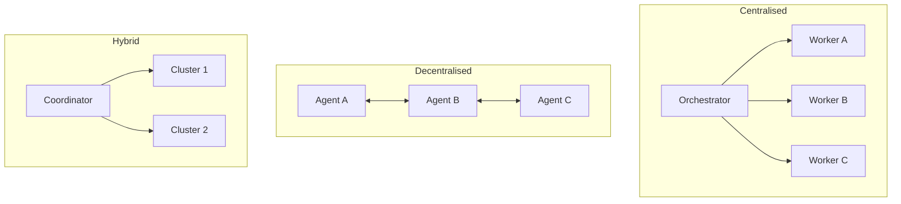

# Multi-Agent Topology Taxonomy: Centralised, Decentralised, and Hybrid

> Choosing the wrong coordination topology for a task type is a primary source of production agent failures — each topology carries distinct failure modes that must be mitigated in the harness design.

!!! info "Also known as"
    Multi-Agent SE Design Patterns, Multi-Agent Architecture Patterns

## The Three Topologies

The [arXiv:2602.10479 survey](https://arxiv.org/abs/2602.10479) identifies three coordination topologies across production platforms.

### Centralised Orchestration

One orchestrator LLM holds the task graph, delegates subtasks to workers, and aggregates results.

**When to use**: Sequential dependencies, shared global state, or result synthesis requiring awareness of all worker outputs.

**Failure modes**:

- **Orchestrator context saturation** — the coordinator accumulates worker results until it can no longer reason coherently about remaining subtasks
- **Single point of failure** — orchestrator errors or stalls halt the entire pipeline
- **Worker result flooding** — verbose worker results overwhelm the coordinator's context window

### Decentralised Peer-to-Peer

Agents coordinate via shared state or message passing. No central coordinator holds the task graph.

**When to use**: Genuinely independent subtasks where global coherence is not required at runtime.

**Failure modes**:

- **Coordination storms** — agents send competing updates to shared state, producing thrash
- **Conflicting edits** — agents modify the same artifact without awareness of each other's changes
- **Lack of global coherence** — agents make locally correct but globally inconsistent decisions

### Hybrid

A coordinator manages clusters of peer agents. Each cluster handles a domain; the coordinator manages inter-cluster routing.

**When to use**: Large pipelines with distinct phases where intra-phase parallelism is high but inter-phase dependencies exist.

**Failure modes**: Combines both centralised and decentralised failure modes. Requires explicit topology boundaries and typed [handoff contracts](agent-handoff-protocols.md) between clusters.

## Cross-Topology Failure Modes

Three failure modes appear across all topologies:

**Self-verification bias** — an agent confirms its own output without independent checking. Mitigation: route outputs to an independent evaluator agent.

**Doom loops** — an agent iterates 10+ times on the same broken approach. Mitigation: [loop detection](../observability/loop-detection.md) and budget warnings in the harness. [LangChain's harness engineering research](https://blog.langchain.com/improving-deep-agents-with-harness-engineering/) recommends [pre-completion checklists](../verification/pre-completion-checklists.md) as a structural counter.

**Context blindness** — agents act without orientation in unfamiliar environments, producing directory-unaware or toolchain-unaware errors. Mitigation: inject directory structure and tooling inventories at initialisation.

## Topology Constraints as Failure Prevention

[Claude Code's agent team architecture](https://code.claude.com/docs/en/agent-teams) enforces a topology constraint: sub-agents cannot spawn sub-agents, eliminating unbounded nesting by structural enforcement. The [sub-agents documentation](https://code.claude.com/docs/en/sub-agents) describes a single-coordinator model as the canonical Claude Code topology.

[Anthropic's agent design patterns](https://www.anthropic.com/engineering/building-effective-agents) describe orchestrator-workers, parallelisation, and routing as general workflow patterns (alongside [prompt chaining](../context-engineering/prompt-chaining.md) and [evaluator-optimizer](../agent-design/evaluator-optimizer.md)). The guidance recommends starting with the simplest topology and adding complexity only when failure modes appear in production.

## Choosing a Topology

| Task characteristic | Topology |
|--------------------|----------|
| Sequential dependencies, shared state | Centralised |
| Independent subtasks, no shared state | Decentralised |
| Mixed: phased with intra-phase parallelism | Hybrid |
| Unknown — start here | Centralised |

Centralised is the default because its failure modes are deterministic. Decentralised topologies require shared state primitives (file locks, [CRDTs](crdt-observation-driven-coordination.md)) that add implementation surface.

## Example

A document processing pipeline that ingests legal contracts, extracts clauses, classifies risks, and generates a summary report illustrates all three topologies.

**Centralised** — an orchestrator agent receives each contract, delegates clause extraction to Worker A and risk classification to Worker B, and waits for both before synthesising the summary. The orchestrator accumulates worker results in its context; on large contracts (100+ pages) it hits context saturation before synthesis, requiring the harness to chunk worker outputs before returning them.

**Decentralised** — extraction and classification agents pull contracts from a shared queue and write results to a shared JSON store. No orchestrator coordinates intra-batch work. Conflicting edits emerge when two agents process the same contract simultaneously; a file lock or CRDT on the shared store resolves this (see [CRDT-Based Parallel Agent Coordination](crdt-observation-driven-coordination.md)).

**Hybrid** — a coordinator routes contracts by type (NDA, MSA, SOW) to domain-specific clusters. Each cluster runs extraction and classification agents in parallel (decentralised intra-cluster). The coordinator handles inter-cluster routing and final report assembly. The topology boundary between coordinator and clusters must be typed: each cluster returns a structured report object, not raw text, to prevent coordinator context flooding.

## Key Takeaways

- Centralised orchestration fails via context saturation and single points of failure; decentralised fails via coordination storms and conflicting edits.
- Self-verification bias, doom loops, and context blindness are cross-topology failure modes requiring harness mitigations.
- Claude Code enforces a topology constraint (no sub-agent spawning) that eliminates unbounded nesting.
- Start with centralised; move to decentralised only when independent subtask structure is proven and shared-state primitives are in place.

## Related

- [Orchestrator-Worker Pattern](orchestrator-worker.md)
- [Agent Composition Patterns](../agent-design/agent-composition-patterns.md)
- [Circuit Breakers for Agent Loops](../observability/circuit-breakers.md)
- [File-Based Agent Coordination](file-based-agent-coordination.md)
- [Cognitive Reasoning vs Execution: A Two-Layer Agent Architecture](../agent-design/cognitive-reasoning-execution-separation.md)
- [Observation-Driven Coordination: CRDT-Based Parallel Agent](crdt-observation-driven-coordination.md)
- [Multi-Agent SE Design Patterns: A Taxonomy Across 94 Papers](multi-agent-se-design-patterns.md)
- [Fan-Out and Synthesis Pattern](fan-out-synthesis.md)
- [Emergent Behavior Sensitivity](emergent-behavior-sensitivity.md)
- [LLM Map-Reduce Pattern for Parallel Input Processing](llm-map-reduce.md)
- [Multi-Model Plan Synthesis for System Architecture](multi-model-plan-synthesis.md)
- [Bounded Batch Dispatch](bounded-batch-dispatch.md)
- [Voting / Ensemble Pattern](voting-ensemble-pattern.md)
- [Harness Engineering](../agent-design/harness-engineering.md) — environment design that constrains multi-agent architectures through mechanical enforcement
- [Sub-Agents for Fan-Out Research](sub-agents-fan-out.md)
- [Closed-Loop Role-Based Refinement](closed-loop-role-based-refinement.md)
- [Staggered Agent Launch](staggered-agent-launch.md)
