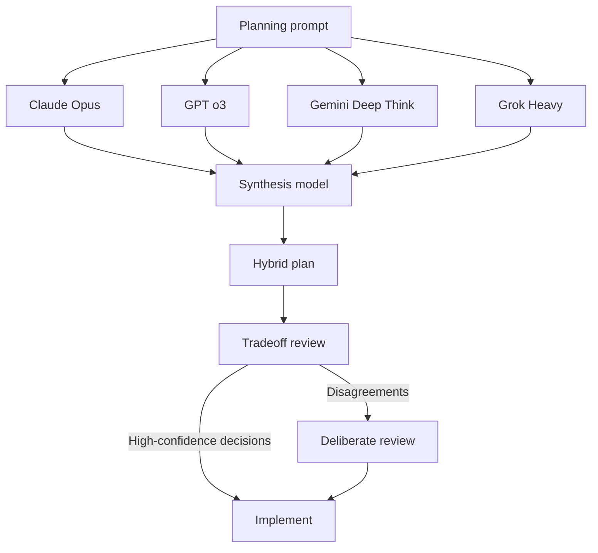

# Multi-Model Plan Synthesis

> Get independent project plans from multiple frontier models, then synthesize a hybrid architecture from the strongest ideas of each — before writing a single line of code.

## Why Triangulate

Frontier models have distinct training distributions that produce systematic biases in architectural decisions. One model tends to over-abstract; another under-specifies error handling; a third skips observability concerns `[unverified]`. Committing to a single model's plan imports those biases wholesale.

Running plans in parallel across 3-4 models is cheap: planning tokens are a small fraction of implementation tokens. The synthesis step converts model disagreement from a problem into signal — where models agree, the decision is high-confidence; where they disagree, the tradeoff is worth examining.

## Workflow

### 1. Independent Planning

Send the same planning prompt to each model in parallel. Each model must produce a **complete** plan before seeing any other output. Common models to include: Claude Opus, GPT o3, Gemini with Deep Think, Grok Heavy.

Prompt each model identically:

```
Produce a complete architecture plan for: <task>

Include: component breakdown, data flow, error handling strategy,
observability approach, and the top 3 risks you see.
```

Do not share outputs between models during this phase — cross-contamination eliminates the diversity you need.

### 2. Synthesis

Feed all plans to a synthesis model (or one of the planners) and ask it to build a hybrid:

```
You have received architecture plans from multiple AI models.
Be intellectually honest about what each does better than your own approach.
Produce a best-of-all-worlds hybrid plan.

For each major decision, note:
- Where models agree (high-confidence)
- Where they disagree (tradeoff to examine)
- Which model's approach you adopted and why
```

Ask for git-diff style change annotations rather than a free-form rewrite — this forces precision and prevents the synthesizer from producing a vague summary that loses the specifics.

### 3. Tradeoff Review

Inspect the disagreement map the synthesizer produces. Disagreements between models are architectural tradeoff candidates worth deliberate human review before implementation begins. Agreement signals decisions that can be made with confidence.

## Diagram



## Tradeoff Map

| | Benefit | Cost |
|---|---|---|
| vs single model | Catches systematic blind spots; tradeoffs made explicit | 3-4× planning tokens; coordination overhead |
| vs voting/ensemble | Extracts complementary strengths instead of picking majority answer | Synthesis requires a capable model and a precise prompt |
| vs adversarial review | Front-loads architectural diversity before implementation; cheaper than post-implementation critique | Does not replace implementation-phase adversarial review |

## When to Use

- High-stakes architecture decisions where reverting is expensive
- Tasks where different models have visibly different "tastes" (API design, error handling strategy, storage topology)
- Before long agentic runs where incorrect architecture compounds into deep rework

Not warranted for routine well-defined tasks with strong single-model baselines.

## Key Takeaways

- Different frontier models have different training distributions and therefore different architectural biases — independent plans expose those biases
- Model agreement signals high-confidence decisions; disagreement surfaces tradeoffs worth deliberate review
- Planning tokens are cheap relative to implementation tokens — front-loading diversity has a favorable cost profile
- Synthesis must be explicit assembly, not summarization: ask for per-decision attribution and a disagreement map
- This pattern is pre-implementation; it complements but does not replace adversarial review during implementation

## Example

**Task**: Design a background job system for a SaaS app that needs to process user-uploaded CSV files, send email notifications, and handle retries.

**Independent planning phase** — each model receives the same prompt in parallel:

```
Produce a complete architecture plan for: background job system for
CSV processing, email notifications, and retries in a SaaS app.

Include: component breakdown, data flow, error handling strategy,
observability approach, and the top 3 risks you see.
```

**Sample model outputs (abbreviated)**:

- **Claude Opus**: Proposes a queue-per-job-type design (3 queues: csv_processing, email, retry_dlq), exponential backoff with jitter, structured logs per job ID, and flags data-loss-on-crash as risk #1.
- **GPT o3**: Proposes a single priority queue with job-type routing, idempotency keys on every job, distributed tracing (OpenTelemetry), and flags thundering-herd on retry spikes as risk #1.
- **Gemini Deep Think**: Proposes a workflow DAG (CSV → parse → validate → notify), saga-pattern compensation for partial failures, and flags cross-service transaction consistency as risk #1.

**Synthesis output (abbreviated)**:

| Decision | Agreement | Adopted approach |
|---|---|---|
| Queue topology | Disagree (1 vs 3 queues) | 3 queues (Claude): cleaner isolation, easier per-type scaling |
| Idempotency | Agree (all flag as required) | Idempotency keys on all jobs (GPT o3 most explicit) |
| Observability | Disagree (logs vs tracing) | OpenTelemetry traces + structured logs (GPT o3 + Claude combined) |
| Retry strategy | Partially agree | Exponential backoff with jitter (Claude) + thundering-herd cap (GPT o3) |
| Failure model | Disagree (DLQ vs saga) | DLQ for csv/email; saga compensation for multi-step DAG flows (Gemini) |

**Tradeoff review**: Queue topology is the only high-stakes disagreement requiring deliberate decision — the team opts for 3 queues based on operational clarity. All other decisions have sufficient agreement to proceed with confidence.

## Unverified Claims

- Each model finds blind spots the others missed `[unverified]` — documented in practitioner workflows but not validated in controlled studies
- Specific failure modes per model family (over-abstraction, under-specified error handling, missed observability) `[unverified]` — pattern observed in practitioner reports, not systematically studied

## Related

- [Fan-Out Synthesis Pattern](fan-out-synthesis.md)
- [Sub-Agents for Fan-Out Research and Context Isolation](sub-agents-fan-out.md)
- [Voting / Ensemble Pattern](voting-ensemble-pattern.md)
- [Adversarial Multi-Model Pipeline](adversarial-multi-model-pipeline.md)
- [Cost-Aware Agent Design](../agent-design/cost-aware-agent-design.md)
- [OpenTelemetry for AI Agent Observability and Tracing](../standards/opentelemetry-agent-observability.md)
- [Idempotent Agent Operations: Safe to Retry](../agent-design/idempotent-agent-operations.md)
- [Multi-Agent Topology Taxonomy](multi-agent-topology-taxonomy.md)
- [LLM Map-Reduce Pattern](llm-map-reduce.md)
- [Orchestrator-Worker Pattern](orchestrator-worker.md)
- [Multi-Agent SE Design Patterns](multi-agent-se-design-patterns.md)
