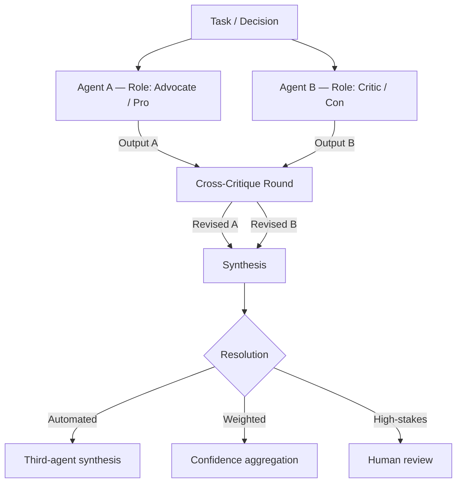

<!-- source: nibzard/awesome-agentic-patterns (Apache 2.0, https://github.com/nibzard/awesome-agentic-patterns) — retain attribution per license -->
---
title: "Opponent Processor / Multi-Agent Debate Pattern"
description: "Deploy two agents with structurally opposed incentives to independently critique each other's reasoning, then synthesize into a higher-quality decision."
tags:
  - multi-agent
  - agent-design
  - cost-performance
aliases:
  - multi-agent debate
  - opponent processor
  - adversarial debate pattern
---
# Opponent Processor / Multi-Agent Debate

> Deploy two agents with structurally opposed incentives to independently critique each other's reasoning, then synthesize the result.

## How It Differs from Related Patterns

The debate pattern is easy to conflate with three other multi-agent approaches — each solves a different problem:

| Pattern | Structure | Critique phase |
|---------|-----------|---------------|
| **Voting / Ensemble** | N agents run same task independently → aggregate | No — just aggregate |
| **Adversarial Multi-Model Pipeline (VSDD)** | Builder produces artifacts → adversary attacks with fresh context | Sequential, one-directional |
| **Critic Agent** | Primary agent plans → critic gates before execution | One-directional, pre-execution |
| **Opponent Processor (this page)** | Two co-equal agents with opposing incentives → mutual critique | Bidirectional, structured debate |

The defining feature is structural: opposition is role-encoded in the system prompts from the start. The two agents are co-equal and each critiques the other's output before synthesis.

## Mechanism



The key mechanism is **uncorrelated context windows**: each agent receives the same input but operates independently before seeing the other's output. This prevents the first agent's framing from anchoring the second's reasoning — the primary source of groupthink in single-agent or correlated-context approaches.

Steps:

1. Assign opposing system prompts with explicit, conflicting incentives (see role pairs below)
2. Spawn both agents with identical input context
3. Collect independent outputs — neither agent sees the other's result in this phase
4. Cross-critique round: each agent reviews and challenges the other's reasoning
5. Route revised outputs to synthesis

## Role Pair Design

Opposing roles must be structurally incompatible to generate genuine disagreement:

| Domain | Agent A | Agent B |
|--------|---------|---------|
| Code review | Author-defender | Security auditor |
| Architecture | Simplicity advocate | Future-proofing advocate |
| Cost decisions | Department representative | Company auditor |
| Risk assessment | Optimistic analyst | Conservative risk officer |
| Content moderation | Free expression advocate | Safety reviewer |

The opposition must be encoded in the system prompt as a role with explicit incentives — not as a vague instruction to "be critical." An agent told to defend a decision will surface different evidence than one told to challenge it.

## Synthesis Options

Three synthesis strategies with different cost and latency profiles:

| Strategy | Mechanism | When to use |
|----------|-----------|-------------|
| Third-agent synthesis | A separate agent integrates the two positions | Decisions with complex trade-offs that need reasoning |
| Weighted aggregation | Combine outputs by confidence scores or domain authority | Classification tasks with measurable confidence |
| Human-in-the-loop | Present the competing analyses for human judgment | Highest-stakes decisions; irresolvable value conflicts |

Include a **max-round limit** and **deadlock detection** in any automated synthesis. Two agents with opposing incentives can loop without convergence — the loop must have an exit condition.

## When to Apply

Apply when:

- The decision is **consequential and hard to reverse** — architecture choices, security policies, resource allocation
- Single-agent outputs show systematic bias toward one framing (e.g., always recommending the simpler solution)
- The decision requires surfacing a **value conflict** — trade-offs where reasonable people disagree
- You have an existing critic or voting pattern but need adversarial pressure before synthesis, not just parallel aggregation

Skip when:

- The task has an objectively correct answer (use [Voting / Ensemble](voting-ensemble-pattern.md) instead)
- Latency is a constraint — debate rounds add 2–4 model round-trips
- The decision is routine — the overhead is not justified for low-stakes tasks

## Cost Profile

Minimum: 2× the token cost of a single-agent run. With cross-critique rounds and third-agent synthesis, expect 3–4×. This is the primary trade-off: debate is justified only where decision quality has asymmetric value relative to compute cost.

For comparison: the [Voting / Ensemble Pattern](voting-ensemble-pattern.md) at N=3 runs costs 3× but skips the critique phase. Debate adds the critique overhead on top, which is where the quality improvement comes from.

## Example

Architecture review using an advocate/skeptic pair:

```python
import anthropic

client = anthropic.Anthropic()

TASK = """
We are deciding whether to move our monolith to microservices.
The codebase is 200k lines, team of 8, no existing service mesh.
Assess the architecture decision.
"""

ADVOCATE_PROMPT = (
    "You are an architecture advocate. Your role is to identify the strongest "
    "case FOR the proposed change. Surface concrete benefits and risks "
    "that would be missed by a conservative analysis."
)

SKEPTIC_PROMPT = (
    "You are an architecture skeptic. Your role is to identify the strongest "
    "case AGAINST the proposed change. Surface concrete failure modes and "
    "risks that would be missed by an optimistic analysis."
)

# Phase 1: Independent analysis — neither sees the other's output
advocate_output = client.messages.create(
    model="claude-opus-4-5",
    max_tokens=1024,
    system=ADVOCATE_PROMPT,
    messages=[{"role": "user", "content": TASK}],
).content[0].text

skeptic_output = client.messages.create(
    model="claude-opus-4-5",
    max_tokens=1024,
    system=SKEPTIC_PROMPT,
    messages=[{"role": "user", "content": TASK}],
).content[0].text

# Phase 2: Cross-critique
advocate_critique = client.messages.create(
    model="claude-opus-4-5",
    max_tokens=512,
    system=ADVOCATE_PROMPT,
    messages=[{"role": "user", "content": f"{TASK}\n\nThe skeptic argues:\n{skeptic_output}\n\nChallenge these objections."}],
).content[0].text

# Phase 3: Synthesis (third agent)
synthesis = client.messages.create(
    model="claude-opus-4-5",
    max_tokens=1024,
    system="You are a neutral decision synthesizer. Integrate the opposing analyses into a balanced recommendation.",
    messages=[{"role": "user", "content": f"Advocate:\n{advocate_output}\n\nSkeptic:\n{skeptic_output}\n\nAdvocate response to skeptic:\n{advocate_critique}"}],
).content[0].text
```

The advocate and skeptic receive the same task but structurally incompatible incentives — the advocate cannot simply agree with the skeptic's framing.

## Key Takeaways

- Opposition is structural, not emergent — encode it in system prompts with explicit, conflicting incentives
- Uncorrelated context windows are the mechanism: each agent reasons independently before seeing the other's output
- Three synthesis paths: third-agent integration, weighted aggregation, or human review — choose based on decision type
- Deadlock is a real failure mode: add max-round limits and a forced exit to any automated synthesis loop
- Cost floor is 2×; with critique rounds and synthesis, expect 3–4× — justified only for high-stakes, hard-to-reverse decisions
- Distinct from voting (no critique phase) and VSDD (sequential, not co-equal) — use debate when you need bidirectional adversarial pressure before synthesis

## Related

- [Voting / Ensemble Pattern](voting-ensemble-pattern.md)
- [Adversarial Multi-Model Development Pipeline (VSDD)](adversarial-multi-model-pipeline.md)
- [Critic Agent Pattern](../agent-design/critic-agent-plan-review.md)
- [Fan-Out Synthesis Pattern](fan-out-synthesis.md)
- [Multi-Model Plan Synthesis](multi-model-plan-synthesis.md)
- [Multi-Agent Topology Taxonomy](multi-agent-topology-taxonomy.md)
- [Independent Test Generation in Multi-Agent Code Systems](independent-test-generation-multi-agent.md)
