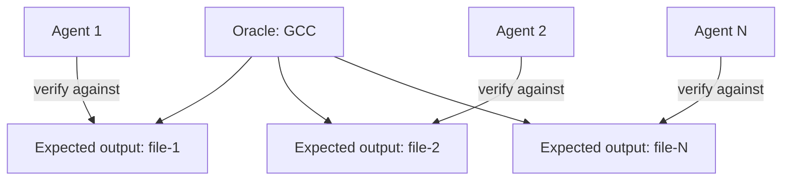

# Oracle-Based Task Decomposition

> When a task is too large and interconnected for parallel agents to work on independently, introduce a reference oracle to generate per-unit expected outputs, converting one monolithic task into hundreds of independently verifiable subtasks.

## The Monolith Problem

Parallelization is trivial when tasks are naturally independent. Many real-world engineering tasks are not. A single end-to-end integration test that requires the entire system to compile and run is a sequential bottleneck: no agent can verify its contribution until all contributions are assembled.

Without decomposition, parallel agents either block on each other's output or produce unverifiable partial work. The oracle pattern dissolves the bottleneck.

## The Oracle Mechanism

A known-good reference implementation — a "known-good oracle" — provides per-unit expected outputs. Agents verify their work against the oracle's output rather than waiting for an end-to-end integration test.

Per [Anthropic's C compiler case study](https://www.anthropic.com/engineering/building-c-compiler), a differential testing approach used GCC to compile a random subset of Linux kernel files while Claude's compiler handled the rest. Each agent worked in parallel, fixing different bugs in different files. When the kernel failed to boot, the team applied delta debugging to find pairs of files that failed together but worked independently. This two-layered approach addressed both isolated bugs and subtle cross-file interactions.

## What Qualifies as an Oracle

An oracle is any reference tool or dataset that produces authoritative expected outputs for isolated units:

- A reference compiler (GCC, Clang) for per-file compilation output
- A golden dataset of expected transformations for a data pipeline
- A reference implementation of an algorithm for output comparison
- A known-good API for expected response validation

The oracle does not need to be perfect — it needs to be authoritative relative to the task. If the goal is to produce output equivalent to GCC, then GCC is the oracle. If the goal is to pass a test suite, the test suite's expected output is the oracle.

## Independence Requires Per-Unit Verification

The oracle enables independence because each agent's verification step does not depend on any other agent. Agent 1 verifies file-1 against oracle(file-1); Agent 2 verifies file-2 against oracle(file-2). Neither agent waits for the other.

This only works when:

- The oracle can produce output for each unit in isolation
- The agent's contribution is fully captured at the unit level (not requiring cross-unit integration)

If a file's correct output depends on another file's implementation, oracle verification at the file level is insufficient — cross-file dependencies push the verification boundary up.

## Generalization

The pattern generalizes to any domain with a reference implementation or ground truth: [unverified]

- **Translation:** reference translations for per-sentence verification
- **Refactoring:** original tests as oracle for behavioral equivalence checking
- **Data transformation:** sample expected outputs from a known-correct run
- **API compatibility:** reference API responses for per-endpoint verification

The question to ask: is there a trusted artifact that can produce expected outputs at a unit level? If yes, the monolith can be decomposed.

## Key Takeaways

- Oracle-based decomposition converts one blocking integration test into independently verifiable unit-level checks
- The oracle is any reference tool or dataset that produces authoritative per-unit expected outputs
- Agents working on separate units never block each other — independence is structural, not assumed
- The pattern requires per-unit independence: if units have cross-dependencies, the verification boundary must be raised
- The generalization criterion: any domain with a trusted reference implementation can apply this pattern

## Example

A Python data pipeline team needs to migrate 400 transformation functions from pandas v1 to pandas v2. Each function has subtly different API changes. Running a full integration test takes 45 minutes — too slow for parallel agents to verify their individual fixes.

**Oracle setup**: Run all 400 functions through the pandas v1 implementation on a frozen dataset and record expected outputs.

**Parallel agent dispatch**: Assign each agent a batch of functions. Each agent applies the pandas v2 migration and verifies against the oracle output immediately.

**Cross-function dependency handling**: If any function output depends on another, group dependent functions into one work unit.

## Related

- [Specialized Agent Roles](../agent-design/specialized-agent-roles.md)
- [File-Based Agent Coordination](file-based-agent-coordination.md)
- [Orchestrator-Worker Pattern](orchestrator-worker.md)
- [Incremental Verification](../verification/incremental-verification.md)
- [Fan-Out Synthesis Pattern](fan-out-synthesis.md)
- [Sub-Agents Fan-Out](sub-agents-fan-out.md)
- [Emergent Behavior Sensitivity](emergent-behavior-sensitivity.md)
- [Bounded Batch Dispatch](bounded-batch-dispatch.md)
- [Adversarial Multi-Model Development Pipeline](adversarial-multi-model-pipeline.md)
- [LLM Map-Reduce Pattern](llm-map-reduce.md)
- [Multi-Agent SE Design Patterns](multi-agent-se-design-patterns.md)
- [Observation-Driven Coordination: CRDT-Based Parallel Agent Code Generation](crdt-observation-driven-coordination.md)
- [Multi-Agent Topology Taxonomy](multi-agent-topology-taxonomy.md)
- [Closed-Loop Role-Based Refinement](closed-loop-role-based-refinement.md)
