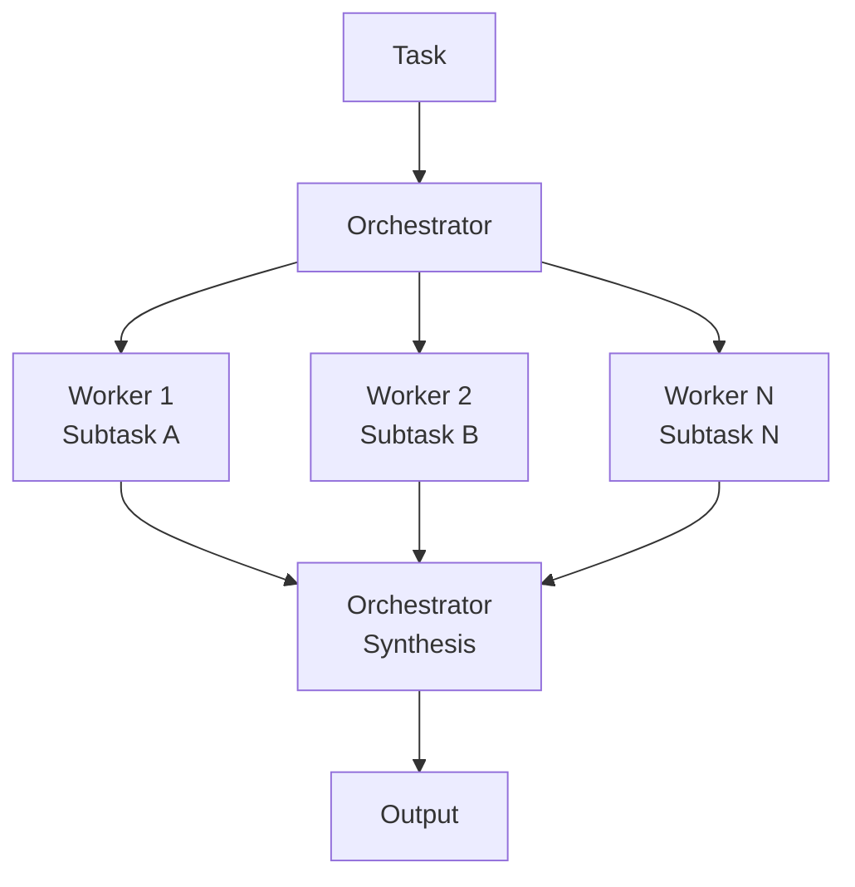

# Orchestrator-Worker Pattern

> A lead agent decomposes a complex task and assigns independent subtasks to specialized workers running in parallel, reducing resolution time compared to sequential single-agent approaches.

!!! note "Also known as"
    Orchestrator-Worker, Parallel Dispatch, Scatter-Gather. The delegation variant is described here. For the broader pattern survey, see [Agent Composition Patterns](../agent-design/agent-composition-patterns.md). For the synthesis variant, see [Fan-Out Synthesis](fan-out-synthesis.md). For implementation guidance, see [Sub-Agents Fan-Out](sub-agents-fan-out.md).

## Structure

The pattern has two roles:

- **Orchestrator** -- receives the task, analyzes its structure, decomposes it into independent subtasks, assigns each to a worker, and synthesizes results
- **Workers** -- each receives a bounded subtask with its own tool set, explores independently, and returns results to the orchestrator

The orchestrator does not execute subtasks. Workers do not coordinate with each other.



## When Parallelization Helps

Parallelization is effective when the task requires "multiple independent directions simultaneously" ([Anthropic's multi-agent research system post](https://www.anthropic.com/engineering/multi-agent-research-system)). A review of 94 multi-agent SE papers ([arXiv:2511.08475](https://arxiv.org/abs/2511.08475)) confirms parallelism and specialization as the primary rationale for multi-agent over single-agent architectures. This includes:

- Research tasks spanning multiple independent sources or domains
- Analysis requiring different methodologies applied to the same dataset
- Code review across separate modules with no shared state

It is not effective when subtasks are sequentially dependent -- sequential dependencies require chaining, not parallelization.

## Effort Scaling

The orchestrator should match worker count and tool allocation to task complexity. [Anthropic's research system](https://www.anthropic.com/engineering/multi-agent-research-system) documents explicit effort-scaling rules:

- Simple queries: 1 agent, 3--10 tool calls
- Moderate queries: 2--4 subagents with clearly divided responsibilities
- Complex queries: 10+ subagents with carefully partitioned search spaces

These rules belong in the orchestrator's system prompt, not in code. Hard-coding agent counts removes the flexibility to match scale to complexity.

## Worker Independence

Each worker should have:

- A bounded, self-contained subtask description
- Its own tool set scoped to what the subtask requires
- An independent exploration trajectory -- workers that coordinate create coupling that undermines parallelization

Workers returning results to the orchestrator is the only coordination point. Any state sharing between workers during execution is a design smell.

## Orchestrator Sensitivity

[Anthropic's post](https://www.anthropic.com/engineering/multi-agent-research-system) reports that small changes to the orchestrator's prompt can unpredictably affect subagent behavior. The orchestrator's decomposition decisions determine which subtasks workers receive, making it the highest-leverage component. Test decomposition behavior explicitly across a range of input queries.

## Synthesis

After workers complete, the orchestrator synthesizes their outputs. Synthesis is not aggregation -- it is a reasoning step where the orchestrator:

- Evaluates the reliability of each worker's findings
- Identifies conflicts or gaps between results
- Produces a unified output that draws on the strongest elements from each worker

If the orchestrator simply concatenates worker outputs, the pattern adds latency without improving quality.

## Token Economics

Multi-agent orchestration multiplies token consumption. [Anthropic's research system data](https://www.anthropic.com/engineering/multi-agent-research-system) reports multipliers of ~4x for single agents and ~15x for multi-agent (orchestrator + workers), with token usage explaining roughly 80% of performance variance across research tasks. Effort-scaling rules in the orchestrator's prompt are the primary cost-control mechanism.

## Performance

[Anthropic's internal evaluations](https://www.anthropic.com/engineering/multi-agent-research-system) report multi-agent systems with Opus 4 orchestrating Sonnet 4 workers outperformed single-agent Opus by 90.2% on complex research tasks. The orchestrator needs stronger reasoning for decomposition and synthesis; workers need adequate capability for bounded subtasks.

## Common Failure Modes

- **Over-spawning** -- launching too many workers for simple queries; effort-scaling rules prevent this
- **Source quality drift** -- workers selecting SEO-optimized content farms over authoritative sources
- **Premature termination** -- workers stopping after first results rather than exploring thoroughly
- **Sequential bottleneck** -- synchronous wait for all workers creates latency spikes when one worker is slow
- **Orchestrator as single point of failure** -- misclassified decompositions route every worker to the wrong subtask, and the orchestrator's own LLM call caps throughput ([Cogent, *Multi-Agent Orchestration Failure Playbook for 2026*](https://cogentinfo.com/resources/when-ai-agents-collide-multi-agent-orchestration-failure-playbook-for-2026))
- **Synthesis context overflow** -- the orchestrator must hold the task plus every worker's results; beyond 4+ substantive outputs this routinely exceeds practical context budgets

## Example

A codebase audit across 50 repositories. The orchestrator receives the task and decomposes it into per-repository subtasks:

```
Orchestrator system prompt:
  "You receive a list of repository paths. For each path, spawn a worker
   with tool access limited to that repo. Workers run in parallel.
   When all workers return findings, synthesize into a ranked list
   of issues by severity."

Worker prompt (per repo):
  "Audit the repository at <path>. Check for: outdated dependencies,
   missing test coverage, secrets in code. Return structured findings."
```

The orchestrator dispatches 50 workers simultaneously, each scoped to one repository with read-only file tools. Workers return structured JSON findings. The orchestrator then evaluates conflicts (e.g., a dependency flagged critical in one repo but patched in another) and produces a consolidated report -- rather than concatenating 50 raw outputs.

## Key Takeaways

- Workers run independently on bounded subtasks with separate tool sets; no inter-worker coordination
- Match worker count to task complexity via explicit scaling rules in the orchestrator prompt
- The orchestrator prompt is the highest-leverage component -- small changes have large downstream effects
- Synthesis is a reasoning step, not aggregation
- Multi-agent systems consume ~15x the tokens of chat -- task value must justify the cost

## Related

- [Agent Composition Patterns](../agent-design/agent-composition-patterns.md)
- [Heuristic-Based Effort Scaling in Agent Prompts](../agent-design/heuristic-effort-scaling.md)
- [Prompt Chaining](../context-engineering/prompt-chaining.md)
- [Fan-Out Synthesis Pattern](fan-out-synthesis.md)
- [Specialized Agent Roles](../agent-design/specialized-agent-roles.md)
- [Sub-Agents Fan-Out](sub-agents-fan-out.md)
- [Bounded Batch Dispatch](bounded-batch-dispatch.md)
- [Adaptive Sandbox Fan-Out Controller](adaptive-sandbox-fanout-controller.md)
- [Async Non-Blocking Subagent Dispatch](async-non-blocking-subagent-dispatch.md)
- [LLM Map-Reduce](llm-map-reduce.md)
- [Subagent Schema-Level Tool Filtering](subagent-schema-level-tool-filtering.md)
- [Multi-Agent Topology Taxonomy](multi-agent-topology-taxonomy.md)
- [Voting / Ensemble Pattern](voting-ensemble-pattern.md)
- [Emergent Behavior Sensitivity](emergent-behavior-sensitivity.md)
- [Claude Code Sub-Agents](../tools/claude/sub-agents.md)
- [Cost-Aware Agent Design](../agent-design/cost-aware-agent-design.md)
- [Rainbow Deployments for Agents](rainbow-deployments-agents.md)
- [Oracle-Based Task Decomposition](oracle-task-decomposition.md)
- [Staggered Agent Launch](staggered-agent-launch.md)
- [Agent Handoff Protocols](agent-handoff-protocols.md)
- [Declarative Multi-Agent Composition](declarative-multi-agent-composition.md)
- [Adversarial Multi-Model Pipeline](adversarial-multi-model-pipeline.md)
- [Multi-Agent SE Design Patterns](multi-agent-se-design-patterns.md)
- [System-Level Optimization Pipeline](system-level-optimization-pipeline.md)
- [Economic Value Signaling](economic-value-signaling.md)
