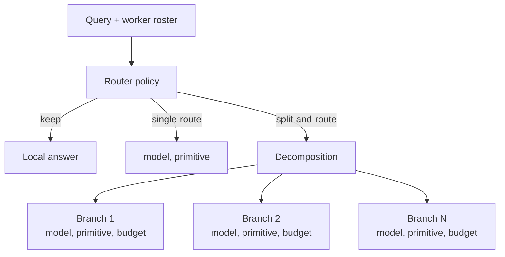

# Parsimonious Agent Routing for Multi-Agent Dispatch

> A learned router emits one delegation plan — keep, single-route, or split-and-route — with per-branch budget, jointly optimizing three decisions that hand-engineered pipelines treat as independent.

## The Disjoint-Decisions Problem

Multi-agent dispatch involves three latent decisions: whether to decompose at all, which worker to send each branch to, and how much inference budget that branch deserves. Most production orchestrators bind two of the three at design time — decomposition depth in a workflow graph, budget in a global cap — and learn only the worker choice. The result is globally-wasteful plans: deep decompositions sent to expensive models, or shallow plans starving complex queries.

[Cemri et al. (2025)](https://arxiv.org/abs/2503.13657) attribute a primary cluster of multi-agent failures to agent-selection errors. Budget misallocation and unnecessary decomposition are adjacent failure modes a worker-only router cannot fix.

## The Pattern

A single learned policy observes the query and the current worker roster, then emits a three-way action plus a per-branch budget:

- **Keep** — answer with the current model and current context, no delegation.
- **Single-route** — delegate the whole query to one (model, primitive) pair.
- **Split-and-route** — decompose into branches, dispatch each to its own (model, primitive) pair, allocate budget per branch.



[Uno-Orchestra (2026)](https://arxiv.org/abs/2605.05007) trains the policy on curated RL trajectories grounded in real worker interactions; reward combines task outcome and per-query cost, so the policy learns when keep beats route and when single-route beats split.

## Reported Results

Uno-Orchestra reports 77.0% macro pass@1 on a 13-benchmark suite spanning math, code, knowledge, long-context, and agentic tool-use — about 16 points above the strongest workflow baseline at roughly an order-of-magnitude lower per-query cost ([Uno-Orchestra, 2026](https://arxiv.org/abs/2605.05007)). Treat as a single-paper claim pending independent replication; the cost reduction depends on a worker roster that includes cheap leaf models.

## Convergent Evidence

[MasRouter (Yue et al., 2025)](https://aclanthology.org/2025.acl-long.757.pdf) and [Optimal-Agent-Selection (2025)](https://arxiv.org/abs/2511.02200) frame multi-agent routing as a learned policy but route per-query without joint decomposition or budget. The novelty in Uno-Orchestra is emitting all three decisions from one policy.

## When the Pattern Pays Off

Three conditions gate the gain:

**Heterogeneous worker roster.** The router needs cheap workers that win some branches and expensive workers that win others. With homogeneous capability the keep / single-route / split decision collapses and router inference cost exceeds routing gain.

**Stable task distribution.** RL-trained routers ship with their training distribution baked in. Roster churn and distribution drift invalidate the learned policy without a re-curation pipeline.

**Rare sequential dependencies.** Split-and-route adds handoff latency and context-token overhead. When subtasks share state, [Cemri et al. (2025)](https://arxiv.org/abs/2503.13657) shows single-agent baselines often win.

Below any threshold, prefer static rule-based routing or a posterior-based selector over a learned three-way policy.

## Failure Conditions

- **Small or homogeneous roster.** The router's inference latency dominates the routing gain.
- **Roster churn.** Each add/remove/upgrade requires re-curated RL trajectories; the policy lags and routes to retired workers.
- **Out-of-distribution queries.** Novel domains (security review, regulatory compliance) sit outside the training envelope; the router emits incorrect plans without a fallback.
- **One-shot plans without re-evaluation.** When an early branch reveals the decomposition was wrong, budget the option to re-plan or pair with [recursive best-of-N delegation](recursive-best-of-n-delegation.md) at leaves.

## Relationship to Other Routing Patterns

| Pattern | What is learned | Decisions emitted |
|---------|-----------------|-------------------|
| [Contextual capability calibration](contextual-capability-calibration.md) | Per (agent, context) Beta posterior | Worker only |
| [Code-health-gated tier routing](../agent-design/code-health-gated-tier-routing.md) | Static rules over file-health score | Worker only |
| [Cross-vendor competitive routing](../agent-design/cross-vendor-competitive-routing.md) | None — both run, select after | None during dispatch |
| [Recursive best-of-N delegation](recursive-best-of-n-delegation.md) | None — judge picks among K candidates | None during dispatch |
| Parsimonious agent routing | RL policy over query + roster | Decomposition + worker + budget |

Parsimonious routing is the only pattern that emits all three decisions from one policy. Pair it with recursive best-of-N at leaves when the leaf judge has stronger signal than the router's prior.

## Example

A coding-agent platform serves three query classes: refactor (cheap, fast worker wins), multi-file feature (expensive worker wins), and ambiguous spec (decomposition into clarification + sketch + implementation wins). A static workflow either pays the deep-decomposition tax on refactors or starves features that need it.

A parsimonious router, given the query and the current roster `[fast-7B, mid-70B, frontier-thinking]`, emits:

```yaml
# Refactor
plan: keep  # answer with local model, no delegation

# Multi-file feature
plan: single-route
worker: frontier-thinking
budget: 50_000_tokens

# Ambiguous spec
plan: split-and-route
branches:
  - subtask: clarify-intent
    worker: mid-70B
    budget: 4_000_tokens
  - subtask: design-sketch
    worker: frontier-thinking
    budget: 20_000_tokens
  - subtask: implement
    worker: mid-70B
    budget: 30_000_tokens
```

The same router learns from observed reward to shift more refactors to keep, more features to single-route, and to widen or narrow split budgets per class. A worker-only router cannot make the keep decision at all and cannot reallocate budget across branches.

## Key Takeaways

- Three latent decisions in agent dispatch — decompose / which worker / how much budget — are mutually constraining; optimizing any in isolation produces globally-wasteful plans.
- Parsimonious routing emits all three from one learned policy as a keep / single-route / split-and-route plan with per-branch budget.
- Reported gains (77.0% macro pass@1, ~16 points over the strongest workflow baseline at ~10× lower cost on Uno-Orchestra's 13-benchmark suite) are a single-paper claim pending replication.
- Three conditions gate the gain: heterogeneous roster, stable task distribution, rare sequential dependencies. Below any threshold, static or posterior-based routing wins.
- Pair with recursive best-of-N at the leaves when the leaf judge has stronger signal than the router's prior — the router and the judge address different sources of routing error.

## Related

- [Contextual Capability Calibration](contextual-capability-calibration.md) — per-context Beta posteriors for the worker-choice decision alone
- [Recursive Best-of-N Delegation](recursive-best-of-n-delegation.md) — K-candidate selection at leaves; complements the router at branch leaves
- [Orchestrator-Worker Pattern](orchestrator-worker.md) — the structural pattern parsimonious routing parameterizes
- [Oracle-Based Task Decomposition](oracle-task-decomposition.md) — decomposition via reference oracles, the non-learned alternative
- [The Delegation Decision](../agent-design/delegation-decision.md) — the human-vs-agent decision that sits above any learned router
- [Multi-Agent SE Design Patterns](multi-agent-se-design-patterns.md) — taxonomy of 94 papers including routing-policy variants
