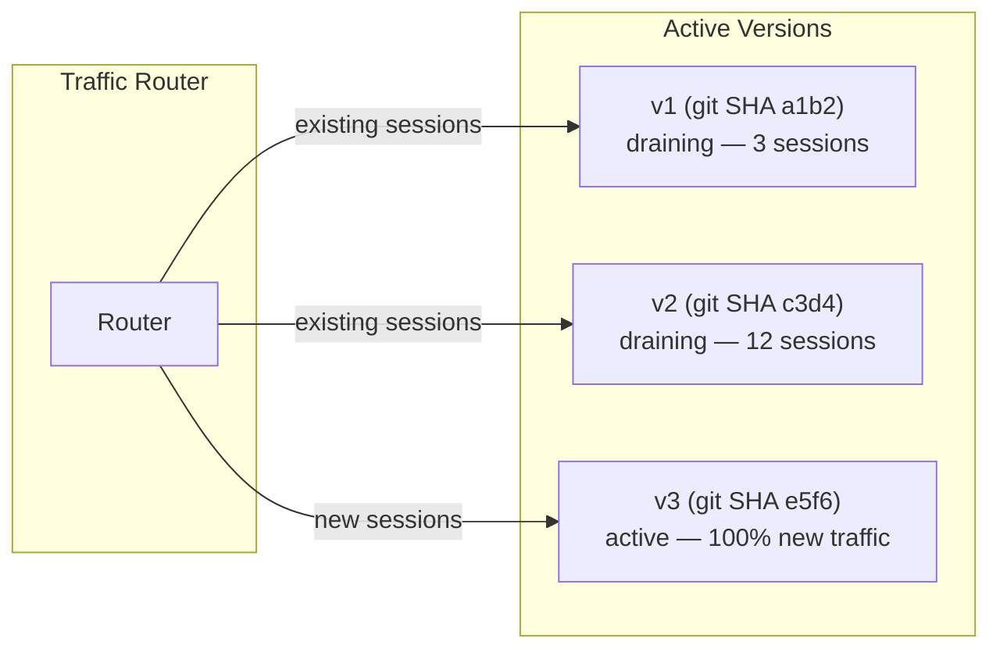
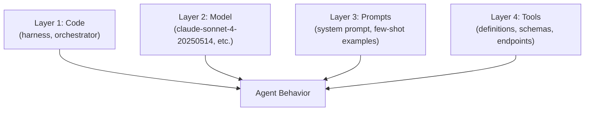

# Rainbow Deployments for Agents: Gradual Version Migration

> Shift traffic between agent versions gradually rather than atomically. New versions prove themselves alongside old ones before full cutover, preventing broken in-flight sessions.

Rainbow deployment keeps N versions of an agent running simultaneously. New sessions route to the latest version; existing sessions continue on whichever version started them and drain naturally when they complete. There is no forced cutover and no two-version ceiling.

## Why Agents Cannot Blue-Green

Traditional services are stateless HTTP handlers. Swap the load balancer, drain connections, done. Agents are different:

- **Stateful execution** -- agents maintain conversation context, tool state, and multi-step plans across long-running sessions
- **Behavioral sensitivity** -- minor changes to prompts, tools, or models cascade into large behavioral changes
- **Expensive restarts** -- forcing a session restart loses accumulated context and progress, which is costly for users and for compute

Blue-green deployment assumes you can atomically cut over. With agents, active sessions cannot be interrupted without data loss. Canary deployment improves this with gradual traffic percentages, but limits you to two concurrent versions. Rainbow deployments remove the version ceiling entirely.

## The Rainbow Model



Each deployment is identified by a unique label (typically a git SHA). New traffic routes to the latest version. Existing sessions continue on whatever version started them. Old versions drain naturally as their sessions complete. There is no two-environment limit -- any number of versions coexist.

The term originates from [Brandon Dimcheff's work at Olark (2018)](https://brandon.dimcheff.com/2018/02/rainbow-deploys-with-kubernetes/), solving the same problem for stateful WebSocket chat services on Kubernetes. Anthropic adopted the concept for their [multi-agent research system](https://www.anthropic.com/engineering/multi-agent-research-system).

## What Changes Require Rainbow Deploys

Not every change needs gradual migration. The cost is worth it when the change affects agent behavior in ways that are hard to predict or test exhaustively.

| Change Type | Risk Level | Rainbow Deploy? |
|---|---|---|
| Model version swap | High -- behavior shifts unpredictably | Yes |
| System prompt rewrite | High -- cascading behavioral changes | Yes |
| Tool definition change | High -- breaks existing tool-call patterns | Yes |
| Bug fix in harness code | Low -- deterministic, testable | Usually no |
| Adding a new tool (no removal) | Medium -- may alter tool selection | Case by case |

## The Four-Layer Version Problem

Agent behavior depends on four independently versioned layers. A change to any one can alter output.



Each layer needs independent version tracking. A deployment version is the tuple of all four. Rollback means reverting to a known-good tuple, not just rolling back code.

## Monitoring During Migration

During traffic shifting, compare canary metrics against the baseline version before increasing the percentage.

| Metric | What to Watch |
|---|---|
| Response accuracy | Are outputs correct for representative inputs? |
| Error rate | Are tool calls, API calls, or completions failing more? |
| Latency | Is the new version slower per turn? |
| Cost per session | Is token usage higher (different model, longer prompts)? |
| Hallucination rate | Is the new version fabricating more? |
| User feedback | Are users rejecting or correcting outputs more often? |

A typical progression: 5% of new sessions to the new version, then 25%, then 50%, then 100% -- advancing only when metrics hold steady at each stage.

## Rollback

Rollback is changing the router to point new traffic at the previous version. Old versions are still running (they were draining), so rollback is near-instant -- no redeployment required. This is the primary advantage over blue-green, where the previous environment may already be torn down.

## When This Backfires

Rainbow deployment is not always the right choice. Three specific conditions make it worse than the alternative:

- **Version sprawl with long-lived sessions**: If agents run tasks that span hours or days (deep research, multi-day planning pipelines), old versions may never fully drain. Each deployment adds another live version consuming infrastructure. Without an explicit session timeout or forced drain policy, the fleet fragments indefinitely.
- **Cross-version debugging complexity**: Behavioral regressions that span a version boundary are harder to isolate. If v2 and v3 sessions coexist and users report degraded output, correlating errors to a specific version tuple (code × model × prompt × tools) requires robust version tagging on every log line and trace. Teams without mature observability often spend more time on version attribution than on the fix itself.
- **Short-lived stateless agents**: For agents with sessions under a few seconds -- single-turn Q&A, inline completions, code suggestions -- atomic blue-green deployment is simpler, equally safe, and eliminates the operational overhead of running multiple concurrent deployments. The rainbow model's value scales with session duration.

## Example

A Kubernetes implementation using label selectors:

```yaml
# Deployment — each version gets a unique label
apiVersion: apps/v1
kind: Deployment
metadata:
  name: agent-e5f6
spec:
  selector:
    matchLabels:
      app: research-agent
      version: e5f6
  template:
    metadata:
      labels:
        app: research-agent
        version: e5f6
    spec:
      containers:
        - name: agent
          image: agent:e5f6
          env:
            - name: MODEL_VERSION
              value: "claude-sonnet-4-20250514"
            - name: PROMPT_VERSION
              value: "v3.2"
---
# Service — routes new traffic to current version
apiVersion: v1
kind: Service
metadata:
  name: research-agent
spec:
  selector:
    app: research-agent
    version: e5f6  # Change this to roll back
```

Rollback: change `version: e5f6` to `version: c3d4`. Old pods are still running and accepting their existing sessions.

## Key Takeaways

- Agents are stateful -- atomic version cutover breaks in-flight sessions
- Rainbow deployments allow N concurrent versions, each draining independently
- Agent versions are tuples of (code, model, prompt, tools) -- all four layers must be tracked
- Monitor accuracy, error rate, latency, and cost before advancing traffic percentages
- Rollback is a selector change, not a redeployment

## Related

- [Rollback-First Design: Every Agent Action Should Be Reversible](../agent-design/rollback-first-design.md)
- [Circuit Breakers for Agent Loops](../observability/circuit-breakers.md)
- [Continuous AI-Agentic CI/CD](../workflows/continuous-ai-agentic-cicd.md)
- [Agent Harness](../agent-design/agent-harness.md)
- [Emergent Behavior Sensitivity](emergent-behavior-sensitivity.md)
