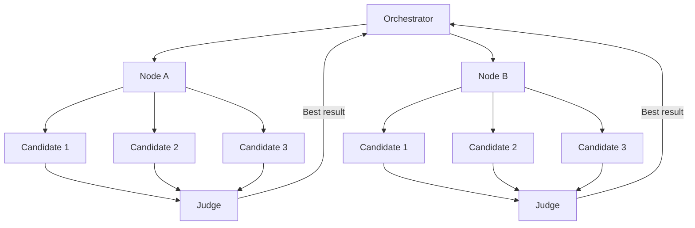

# Recursive Best-of-N Delegation

> Run K parallel candidate workers at each recursion node and select the best result via a judge before the parent consumes it — preventing error compounding in recursive agent trees.

## The problem

In recursive delegation, each subtask's output becomes input for the parent agent. A weak result at any node does not stay local. It poisons every decision above it in the tree. Single-path recursion compounds errors upward, with no way to recover short of a full retry.

## Structure

At each recursion node, do not send one candidate result to the parent. Instead:

1. Fan out: spawn K candidate workers (typically 2 to 5) in independent sandboxes for the same subtask.
2. Score: a judge combines automated signals (tests, lint, exit codes) with LLM-as-judge rubric evaluation.
3. Select: the top-scoring candidate becomes the canonical result for the parent.
4. Escalate: if no candidate clears the confidence threshold, raise K or spawn investigator sub-agents.
5. Aggregate: selected results move upward and the parent continues its own recursion.


```mermaid
graph TD
    O[Orchestrator] --> N1[Node A]
    O --> N2[Node B]
    N1 --> C1[Candidate 1]
    N1 --> C2[Candidate 2]
    N1 --> C3[Candidate 3]
    C1 & C2 & C3 --> J1[Judge]
    J1 -->|Best result| O
    N2 --> D1[Candidate 1]
    N2 --> D2[Candidate 2]
    N2 --> D3[Candidate 3]
    D1 & D2 & D3 --> J2[Judge]
    J2 -->|Best result| O
```

This differs from the [voting and ensemble pattern](voting-ensemble-pattern.md) (flat parallel evaluation of the same task) and from [fan-out synthesis](fan-out-synthesis.md) (merging complementary strengths). Here, selection happens at each internal node of a decomposition tree, not at a single top-level aggregation point. The [ReDel toolkit](https://arxiv.org/abs/2408.02248) gives a reference implementation of recursive multi-agent delegation with configurable delegation schemes.

## Judge design

Judge quality decides how reliable the pattern is. A judge that rationalizes poor outputs is worse than no judge. Failure analysis of multi-agent systems repeatedly names task verification as a primary failure cluster. Judges that accept weak outputs spread errors rather than catch them ([Cemri et al., 2025](https://arxiv.org/abs/2503.13657)).

| Signal type | Examples | Role |
|-------------|----------|------|
| Objective checks | Test pass rate, lint warnings, exit codes, diff size | Hard gate — failing outputs are eliminated before LLM scoring |
| LLM-as-judge rubric | Correctness, adherence to repo conventions, completeness | Discriminates between candidates that pass objective checks |

Run objective checks first. Drop candidates that fail before LLM scoring. This saves evaluation budget and stops the judge from rationalizing broken outputs as acceptable.

## Dynamic K allocation

Applying K uniformly across all nodes wastes compute. A node running a well-understood, deterministic subtask gains nothing from K=5. A node handling ambiguous API behavior or repo-specific convention mapping does.

Reasons to raise K at a node:

- Prior failures at this subtask type in the same run
- High output variance across early candidates
- Subtask touches security-sensitive code, schema migrations, or high-impact paths
- Cheap verification available (tight test coverage exists for this module)

Use a lower K (or K=1) when subtask outputs are deterministic and machine-verifiable with high confidence.

## When to apply

Best fit:

- Shardable subtasks where outputs are cheap to score, such as tight unit tests, type checking, and lint
- High-cost failure modes, such as migrations, security changes, and large refactors where a wrong answer is expensive to undo
- Tasks with repo-specific ambiguity, such as API conventions and naming patterns that a single agent might misread

Poor fit:

- Tasks without a cheap verification signal: if you cannot score candidates objectively, judge quality drops
- Low-impact leaf nodes where the cost of K candidates is more than the cost of a retry
- Real-time pipelines where latency is the main constraint

## Cost trade-off

Each node with K=3 costs roughly 3 times the per-node compute of single-path recursion, plus judge overhead. The cost pays off when:

- Failures in the subtask are expensive to catch and fix downstream
- The verification signal is cheap next to the subtask cost

Targeted K allocation puts extra candidates only on uncertain or high-stakes nodes. It recovers most of the reliability benefit at a fraction of the uniform-K cost.

## Example

A large refactor task splits into three subtasks: rename a public API, update call sites, and update tests. Each subtask spawns K=3 candidate workers in isolated sandboxes:

```python
# Pseudocode: recursive best-of-N node
async def delegate_with_selection(subtask, k=3, threshold=0.8):
    candidates = await asyncio.gather(*[
        run_worker(subtask, sandbox_id=i) for i in range(k)
    ])
    # Objective gate: eliminate candidates failing hard checks
    passing = [c for c in candidates if c.tests_pass and c.lint_clean]
    if not passing:
        # No candidate cleared — escalate
        return await delegate_with_selection(subtask, k=k+2, threshold=threshold)
    # LLM-as-judge scores remaining candidates
    scored = await judge.rank(passing, rubric=subtask.rubric)
    best = scored[0]
    if best.score < threshold:
        return await delegate_with_selection(subtask, k=k+2, threshold=threshold)
    return best.result
```

The rename subtask uses K=3 because it touches a public API boundary, where a mistake has wide reach. The test-update subtask uses K=1 because the existing test suite gives a tight verification signal, so any broken candidate fails right away. The judge for the rename subtask runs `mypy --strict` and checks diff size before LLM scoring. The LLM rubric runs only on candidates that pass both hard gates.

## Key Takeaways

- K parallel candidates at each recursion node prevent weak results from compounding upward through the tree
- Judge design is critical: pair automated objective checks with LLM scoring; objective checks eliminate failing candidates before LLM evaluation runs
- Apply dynamic K — higher at uncertain or high-stakes nodes, lower at deterministic leaf nodes — to contain cost
- Escalation path matters: when no candidate clears the confidence threshold, increase K or spawn investigator sub-agents rather than accepting a weak result
- Best suited for subtasks with cheap, objective verification signals and high-cost failure modes

## Related

- [Voting / Ensemble Pattern](voting-ensemble-pattern.md)
- [Fan-Out Synthesis Pattern](fan-out-synthesis.md)
- [Orchestrator-Worker Pattern](orchestrator-worker.md)
- [Sub-Agents Fan-Out](sub-agents-fan-out.md)
- [Evaluator-Optimizer](../agent-design/evaluator-optimizer.md)
- [Cost-Aware Agent Design](../token-engineering/cost-aware-agent-design.md)
- [Multi-Agent Topology Taxonomy](multi-agent-topology-taxonomy.md)
- [LLM-as-Judge Evaluation](../workflows/llm-as-judge-evaluation.md) — scoring candidate outputs with rubric-based LLM judges at scale
