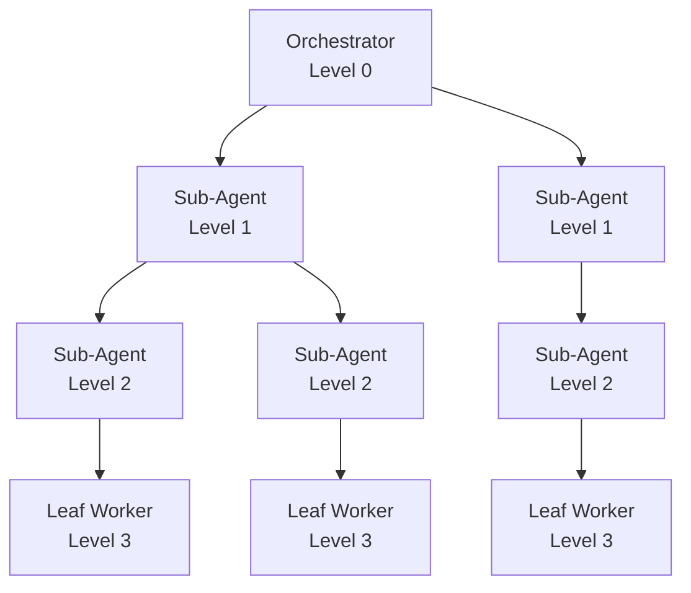

# Recursive Sub-Agent Delegation: Depth Limits and Trade-offs in Nested Hierarchies

> Nested sub-agent hierarchies trade compounding token cost, latency, and tracing burden for one more isolated context window at each delegation level.

A sub-agent that itself spawns sub-agents produces a delegation tree rather than the star of flat [Sub-Agents for Fan-Out](sub-agents-fan-out.md) or single-level [Orchestrator-Worker](orchestrator-worker.md). The relevant design parameter is **depth**, and its trade-offs differ from the trade-offs of wider fan-out at one level.

## When the Depth Is Worth Buying

Apply the pattern only when each level corresponds to a sub-problem cohesive enough to fit one context window, and when cross-level tracing is already instrumented. Recursive nesting earns its keep when:

- The problem tree is genuinely hierarchical — a codebase investigation that opens N subsystems where each opens M modules, or a multi-tool migration with per-tool sub-stacks. A flat dispatch funnels every leaf result through the parent's context window, wasting the isolation sub-agents exist to provide ([Anthropic — How we built our multi-agent research system](https://www.anthropic.com/engineering/multi-agent-research-system) frames sub-agents as "intelligent information filters").
- The deepest leaf performs real work, not another re-dispatch. The [opencode #18100](https://github.com/anomalyco/opencode/issues/18100) failure documents the opposite: 47 sessions across 20 levels, with depths 2–18 pure explore-to-explore pass-through until depth 19 finally ran a `grep`.
- Each level has a different model or prompt assignment that materially improves the leaf decision. Cursor's SDK keeps a per-level prompt and model ([Cursor changelog, 4 Jun 2026](https://cursor.com/changelog)) — the runtime feature that makes depth a useful lever rather than a cost multiplier.

## Cross-Tool Depth Posture (June 2026)

Major coding assistants ship three different defaults, reflecting three views on where the risk sits:

| Tool | Depth posture | Source |
|---|---|---|
| Claude Code 2.1.172 | Hard cap at 5 levels; leaf sub-agents at depth 5 do not receive the Agent tool | [Claude Code changelog](https://code.claude.com/docs/en/changelog) |
| Cursor SDK (Jun 4 2026) | No depth limit; nesting works automatically for any agent that defines sub-agents | [Cursor changelog](https://cursor.com/changelog) |
| OpenAI Codex | Configurable `agents.max_depth`, defaults to 1 | [Codex subagents docs](https://developers.openai.com/codex/subagents) |

Claude Code's fixed cap protects against runaway recursion at the cost of flattening genuinely deep problems. Codex makes the same default decision with an opt-out. Cursor treats depth as purely a problem-shape question and pushes cost control to the operator. Read your tool's choice as a constraint on which shapes it can address out of the box.

## What Each Level Costs



**Token cost compounds with branching, not just depth.** Anthropic's multi-agent research system already uses ~15× chat tokens at one level of orchestration ([Anthropic engineering post](https://www.anthropic.com/engineering/multi-agent-research-system)); the multiplier compounds again at each additional level. Depth 3 with branching 3 produces roughly an order of magnitude more tokens than a single-level fan-out across the same leaves. The opencode failure is the worst case: every intermediate session bills full coordination tokens for zero useful output.

**Context loss is per-boundary.** Each level summarises its children before returning to its parent, so a leaf's finding is re-compressed once per level on the way up. Nuance that mattered to the leaf can be silently dropped at level 2 because the summariser judged it unimportant — and downstream agents treat upstream output "as trusted input, invisible by default" ([Augment — Multi-Agent AI Systems](https://www.augmentcode.com/guides/multi-agent-ai-systems)).

**Observability degrades faster than depth.** A flat fan-out has one parent and N children — a debugger reads two transcripts and reconstructs the run. A depth-3, branching-3 tree has 13 sessions; reconstructing why a leaf failed requires correlation IDs and a nested trace view ([MLflow on multi-agent observability](https://mlflow.org/blog/observability-multi-agent-part-1/) recommends OpenTelemetry GenAI conventions to keep the full execution graph visible).

## Why It Works

The mechanism when it works is per-level context isolation: each sub-agent at level N owns one sub-problem whose entire exploration fits in its own context window, and returns a small distilled artefact to level N-1. The root never sees the file reads, failed greps, or dead ends from level 3 — only the summary of level 1, which absorbed and compressed everything below. Anthropic's framing of sub-agents as "intelligent information filters" ([engineering post](https://www.anthropic.com/engineering/multi-agent-research-system)) generalises across depth precisely when each level corresponds to a real partition of the problem. Per-level prompt and model assignment ([Cursor SDK](https://cursor.com/changelog)) is what makes depth a lever rather than a cost multiplier — strong models at the root, cheap models at the leaves.

## When This Backfires

- **Leaf re-dispatch loops.** A sub-agent whose tool set overlaps its parent's tends to re-delegate rather than execute. [opencode #18100](https://github.com/anomalyco/opencode/issues/18100) documents 18 layers of pure pass-through before any real work happened. Mitigation: give leaf agents no Agent/Task tool (Claude Code's depth-5 leaves explicitly lose the Agent tool — [changelog](https://code.claude.com/docs/en/changelog)) and require each level's sub-agent to declare what it returns, not just what it delegates.
- **Synthesis context overflow at the root.** Even when each level summarises cleanly, the root must reason over N-level-deep distilled outputs from every branch. The same overflow that hits single-level fan-out at 4+ substantive worker outputs ([Orchestrator-Worker](orchestrator-worker.md) failure modes) compounds with depth because each level's summary is itself a synthesis of its children's summaries.
- **Latency-sensitive workflows.** Each level adds a synchronous orchestration step; coordination overhead has been observed to scale super-linearly with chained agents — one analysis of a four-agent pipeline measured ~950ms of coordination overhead against ~500ms of processing ([Towards Data Science — The Multi-Agent Trap](https://towardsdatascience.com/the-multi-agent-trap/)). For interactive coding sessions, depth 4 adds seconds before any leaf does work.
- **Cost-sensitive batch work.** The ~15× baseline ([Anthropic post](https://www.anthropic.com/engineering/multi-agent-research-system)) multiplies again at each additional level. A scheduled audit across N repositories using depth 3 with branching 3 burns ~27× the tokens of a flat dispatch covering the same leaves.
- **Cross-level tracing not instrumented.** Without correlation IDs and a tree-shaped trace view, a failing run is undebuggable — the orchestrator only sees its direct children's summaries, and which grand-child caused the failure is invisible. Treat tracing as a prerequisite, not a follow-up. See [Emergent Behavior Sensitivity](emergent-behavior-sensitivity.md) for the per-prompt fragility that compounds with depth.

## Example

A real example of recursive delegation earning its keep is Claude Code's depth-5 cap applied to a refactor that touches five subsystems. The root orchestrator at level 0 receives "migrate fetch() to apiClient across the auth, billing, search, notifications, and admin subsystems." It spawns one sub-agent per subsystem at level 1. The auth sub-agent further decomposes its subsystem into "login flow," "session middleware," and "OAuth callbacks" at level 2, and the login-flow sub-agent at level 2 spawns one leaf per file at level 3. Levels 3 and 4 perform the actual edits; level 5 is unreachable in this run.

```yaml
# Claude Code: leaf migration worker
---
name: leaf-migrator
tools: [Read, Edit, Bash]   # no Agent tool — leaves cannot re-delegate
model: haiku
maxTurns: 12
isolation: worktree
---

Apply the fetch -> apiClient migration to the single file path passed in.
Run the targeted test for that file. Return: { path, edits_applied, tests_pass }.
```

The leaf worker is deliberately tool-restricted: no `Agent` (or `Task`) tool, no further nesting. This is the same posture Claude Code enforces at depth 5 ([changelog](https://code.claude.com/docs/en/changelog)) and the mitigation the opencode issue argues for ([#18100](https://github.com/anomalyco/opencode/issues/18100)). Each higher level summarises its children's structured returns into a parent-shaped report; the root receives five subsystem summaries rather than the ~40 per-file edit logs.

If the same refactor used flat fan-out, the root would directly own ~40 leaf workers and either synthesise 40 structured returns (orchestrator context overflow) or batch them in chunks (eliminating most of the parallelism benefit). Depth here is buying coherent per-subsystem aggregation at the cost of three extra orchestration rounds.

## Key Takeaways

- Depth is a design lever, distinct from fan-out width — each level buys one more isolated context window and compounds tokens, latency, summarisation loss, and tracing burden.
- Cap depth by tool posture (Claude Code's 5, Codex's default 1) and by problem shape: nest only when sub-problems are themselves cohesively filterable.
- Strip the `Agent`/`Task` tool from leaf sub-agents to prevent re-dispatch loops — the dominant failure mode of unbounded recursion.
- Treat OpenTelemetry-style nested tracing with correlation IDs as a prerequisite for any depth ≥3 hierarchy; without it, root-cause analysis is intractable.
- Default to flat fan-out; reach for depth only when the problem tree has real hierarchical structure and per-level prompt/model assignment is doing useful work.

## Related

- [Sub-Agents for Fan-Out Research and Context Isolation](sub-agents-fan-out.md)
- [Orchestrator-Worker Pattern](orchestrator-worker.md)
- [Recursive Best-of-N Delegation](recursive-best-of-n-delegation.md)
- [Agent Composition Patterns](../agent-design/agent-composition-patterns.md)
- [Multi-Agent Topology Taxonomy](multi-agent-topology-taxonomy.md)
- [Emergent Behavior Sensitivity](emergent-behavior-sensitivity.md)
