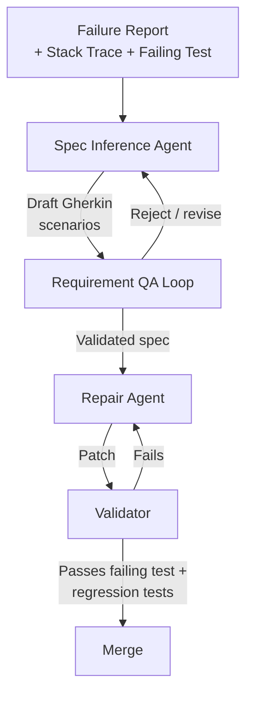

# Reverse-Engineered Executable Specifications for Agentic Program Repair

> Instead of asking an agent to propose a patch directly, a specification-inference agent first derives executable Gherkin scenarios from the failing behaviour; a repair agent then generates the minimal edit that satisfies the inferred spec. The split narrows the ["Intent Gap"](../verification/test-driven-intent-clarification.md) by making the target explicit before any code is written.

## The Pattern

Direct-repair agents such as [RepairAgent](https://arxiv.org/abs/2403.17134) interleave information gathering, patch generation, and test execution in one loop — inferring intent, proposing code, and validating simultaneously. Prometheus decomposes the loop into specification inference followed by constrained patch generation ([Wang & Huang, 2026](https://arxiv.org/abs/2604.17464)).



The first stage produces an executable contract — Given/When/Then scenarios describing the program's *intended* behaviour. The second stage treats that contract as an invariant the patch must preserve ([Wang & Huang, 2026](https://arxiv.org/abs/2604.17464)).

## Why Decouple Spec Inference from Patching

A single agent patching directly optimises two objectives at once: "understand what was meant" and "change as little as possible to achieve it". Failure modes conflate — an over-broad patch can be symptomatic of a misread spec, test, or stack trace, with no artefact isolating which.

Separating the stages produces an inspectable intermediate. The inferred Gherkin scenarios are the contract; if they are wrong, the failure localises to the inference stage. The mechanism mirrors [test-driven intent clarification](../verification/test-driven-intent-clarification.md): validating a small input-output contract is cheaper than reviewing implementation ([Fakhoury et al., IEEE TSE 2024](https://arxiv.org/abs/2404.10100)).

## The Requirement Quality Assurance Loop

Inferred specs can be wrong in the same ways patches can. Prometheus adds an inner loop: the inferred Gherkin is checked against a ground-truth oracle, and specs that disagree are rejected and regenerated before patching begins ([Wang & Huang, 2026](https://arxiv.org/abs/2604.17464)).

This step most constrains where the pattern applies. On Defects4J, the oracle is the curated fixed version of each bug. In production repair, no such oracle exists — if correct code existed, there would be no bug. Teams adapting the pattern replace the oracle with whatever partial ground truth is available: the original regression test, stakeholder clarification, or an independent model voting on spec correctness.

## Pattern Distinctions

| Pattern | Direction | When the spec is written |
|---------|-----------|---|
| [Spec-driven development](../workflows/spec-driven-development.md) | Spec → code | Before implementation |
| [Multi-Agent RAG spec-to-test](../verification/multi-agent-rag-spec-to-test.md) | Spec → test | Before test authoring |
| [Test-driven intent clarification](../verification/test-driven-intent-clarification.md) | Test → spec | While generating new code |
| Reverse-engineered specs for APR | Failing test → spec → patch | After a bug is reported |

The Prometheus contribution is running specification inference *after the fact* — the specification is derived from the observed failure rather than elicited from the developer.

## Reported Results and Contamination Caveat

Prometheus reports 93.97% correct patch rate (639/680) on Defects4J and a 74.4% "Rescue Rate" — bugs fixed by the spec-first pipeline that a strong baseline agent could not ([Wang & Huang, 2026](https://arxiv.org/abs/2604.17464)). Defects4J-family benchmarks leak into foundation-model training data: LessLeak-Bench found up to 4.9× Pass@1 inflation on leaked APPS samples, and SWE-rebench measured an 18.4-point gap between SWE-bench Verified and decontaminated fresh tasks for DeepSeek-V3 ([Zhou et al., 2025](https://arxiv.org/abs/2502.06215); [Badertdinov et al., 2025](https://arxiv.org/abs/2505.20411)). Treat the *architectural contribution* (spec inference as a first-class stage) as the transferable finding, not the percentage.

## When This Pattern Helps

- **Underspecified bug reports** where the failing test captures symptoms but not intended behaviour; the inferred Gherkin forces the agent to commit to a behavioural reading before it touches code.
- **Bugs that require multi-line or cross-file edits** — the explicit spec bounds the scope of the patch and reduces the incentive to over-rewrite ([Wang & Huang, 2026](https://arxiv.org/abs/2604.17464)).
- **Teams already using BDD** — the inferred scenarios slot into the existing Gherkin suite as regression tests once the patch lands.

## When Direct Repair Dominates

- **One-line fixes and obvious regressions** — generating and validating a spec costs more than reading the stack trace and applying the patch. RepairAgent's ~$0.14/bug direct loop is a strong baseline for this class ([Bouzenia et al., 2024](https://arxiv.org/abs/2403.17134)).
- **No usable oracle** — the RQA Loop depends on ground truth. Without one, a wrong spec validated by a correlated wrong oracle yields a confidently wrong patch. A specific instance of [spec complexity displacement](../anti-patterns/spec-complexity-displacement.md): spec inference moves the work, it does not remove it.
- **Shared-backbone failure correlation** — if the spec inferer and the repair agent share a model, systematic biases appear in both stages. The benefit of the split depends on the inferer's errors being uncorrelated with the patcher's.

## Example

A null-pointer dereference in a date-parsing utility fails the test `should_return_null_for_malformed_input`. A direct-repair agent might wrap the body in a try/catch, producing a passing test but swallowing other exceptions. The spec-inference stage produces:

```gherkin
Feature: Date parsing contract
  Scenario: Malformed input returns null
    Given input string "2024-13-45"
    When parseDate is called
    Then the return value is null
    And no exception escapes the method

  Scenario: Valid input parses correctly
    Given input string "2024-06-15"
    When parseDate is called
    Then the return value equals LocalDate.of(2024, 6, 15)
```

The RQA step checks the scenarios against the reference implementation — the second scenario rules out a patch that returns null unconditionally. The repair agent then produces the minimal edit: a format check that returns null only for the specific malformed class, preserving valid-input behaviour. The inferred scenarios persist as regression tests.

## Key Takeaways

- Decomposing APR into specification inference then constrained patching produces an inspectable intermediate artefact that direct-repair agents lack.
- The mechanism — explicit contracts narrow the space of acceptable patches — is the same one that drives [test-driven intent clarification](../verification/test-driven-intent-clarification.md), applied in the repair direction.
- The RQA Loop's ground-truth oracle is the main portability constraint; benchmark results do not transfer to settings without one.
- Defects4J numbers should be read with contamination caveats; treat the *pattern* as the contribution, not the percentage.

## Related

- [Spec-Driven Development](../workflows/spec-driven-development.md)
- [Test-Driven Intent Clarification](../verification/test-driven-intent-clarification.md)
- [Multi-Agent RAG for Spec-to-Test Automation](../verification/multi-agent-rag-spec-to-test.md)
- [Spec Complexity Displacement](../anti-patterns/spec-complexity-displacement.md)
- [Orchestrator-Worker Pattern](orchestrator-worker.md)
- [Oracle-Based Task Decomposition](oracle-task-decomposition.md)
- [Benchmark Contamination as Eval Risk](../verification/benchmark-contamination-eval-risk.md)
