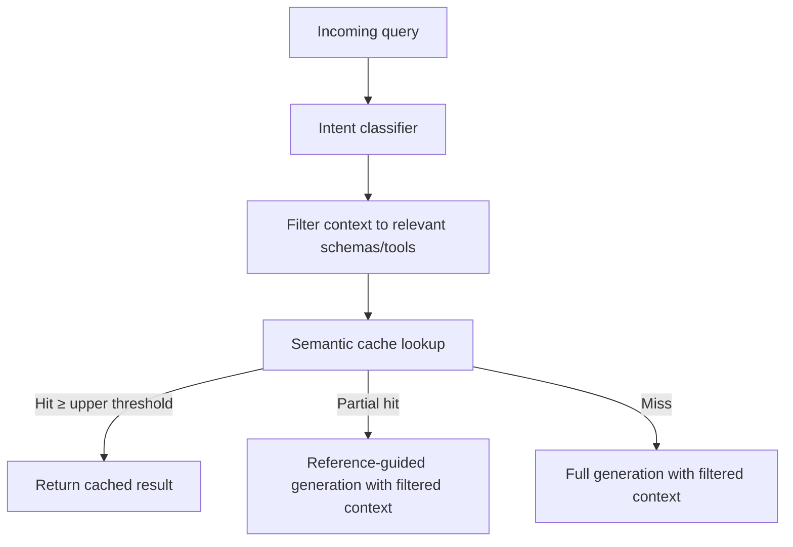

# Semantic Caching for Multi-Agent Code Systems

> Semantic caching with LLM-based equivalence detection achieves 67% cache hit rates in production and reduces token consumption by 40–60% when combined with intent-driven context filtering.

## The Cost Problem

Multi-agent systems amplify token costs: each request may trigger several LLM calls across orchestrators, sub-agents, and reviewers. Exact-match caching helps little because users rarely phrase the same query identically. Semantic caching closes the gap by detecting equivalence rather than requiring exact repetition.

MeanCache (2025) finds repeated queries constitute about 31% of production LLM queries — the practical ceiling for semantic cache hit rates. ([arXiv:2403.02694](https://arxiv.org/abs/2403.02694))

## Semantic Caching

Semantic caching replaces exact string matching with embedding-based similarity comparison. Two queries are considered equivalent if their embeddings exceed a similarity threshold, regardless of surface phrasing.

A production deployment processing 10,000+ natural language-to-code queries achieves a 67% cache hit rate using this approach. ([arXiv:2601.11687](https://arxiv.org/abs/2601.11687))

### Dual-Threshold Mechanism

A single similarity threshold is insufficient: very close queries can be served directly, while weaker matches still benefit from scaffolded reuse. A dual-threshold mechanism handles both:

| Similarity range | Action |
|-----------------|--------|
| `similarity >= upper_threshold` | Serve cached result directly — exact cache hit |
| `lower_threshold <= similarity < upper_threshold` | Reference-guided generation: scaffold response from cached result |
| `similarity < lower_threshold` | Full generation — no usable cache entry |

The middle tier extracts value from partial matches that single-threshold systems discard. ([arXiv:2601.11687](https://arxiv.org/abs/2601.11687))

### Open-Source Implementation

GPTCache provides a production-ready open-source implementation with pluggable embedding backends (ONNX, OpenAI, HuggingFace), vector stores (FAISS, Milvus), and LLM adapters. ([github.com/zilliztech/GPTCache](https://github.com/zilliztech/GPTCache))

## Intent-Driven Context Filtering

Semantic caching reduces cost for repeat queries; intent-driven filtering reduces cost for every query, cache hit or miss.

Classify the incoming query's intent, then include only the schemas, tools, or documents relevant to it. A query about inventory analytics receives only inventory schemas; payment schemas are excluded. This yields 40–60% token reduction without accuracy loss. ([arXiv:2601.11687](https://arxiv.org/abs/2601.11687))

Anthropic's just-in-time [context engineering](../context-engineering/context-engineering.md) pattern applies the same principle architecturally: agents keep lightweight references to available context and load only what is needed at runtime. ([Anthropic: Effective Context Engineering](https://www.anthropic.com/engineering/effective-context-engineering-for-ai-agents))

## Combining Both Mechanisms

The two techniques are orthogonal:



- Semantic caching serves or scaffolds responses from cached results on repeat queries.
- Intent-driven filtering shrinks the context window on every query.
- Applied together, the savings stack — cached queries also pay reduced token cost on lookup.

## Distinction from Provider Prompt Caching

Semantic caching and provider-level prompt caching are complementary, not competing:

| | Semantic caching | Provider prompt caching |
|--|-----------------|------------------------|
| What is cached | Full query results | KV states of static prompt prefixes |
| Savings | Entire LLM call | Recomputation of unchanged prefix tokens |
| Hit condition | Semantic similarity | Exact byte-level prefix match |
| Implementation | Application layer | API parameter (`cache_control`) |

Anthropic's prompt caching delivers 90% cost reduction on cache hits for the static prefix (system prompt, tool definitions) at a 1,024–4,096 token minimum. ([Anthropic prompt caching docs](https://docs.anthropic.com/en/docs/build-with-claude/prompt-caching)) Both can run simultaneously: prompt caching cuts per-call token cost; semantic caching eliminates the call entirely on high-similarity hits.

## Applicability

Return is highest in systems with repetitive query patterns: analytics agents, code-generation pipelines, and customer support bots. Highly varied query mixes see hit rates closer to the 31% baseline. ([arXiv:2403.02694](https://arxiv.org/abs/2403.02694))

## When This Backfires

Every request pays for an embedding computation plus a vector-store lookup before the cache decision. On low-repetition workloads this overhead raises mean latency without proportional savings; a cache miss can cost more than 2× the latency of a direct LLM call. ([Catchpoint, 2025](https://www.catchpoint.com/blog/semantic-caching-what-we-measured-why-it-matters))

Three conditions where the pattern underperforms:

1. **Threshold instability**: One similarity threshold across diverse query types produces either false positives (wrong cached responses served) or false negatives (valid matches missed). Heterogeneous query mixes demand per-intent thresholds.
2. **Embedding drift on model updates**: Cached embeddings are tied to a specific embedding model. When that model is replaced, existing entries no longer match reliably, requiring a full cache flush and warm-up period.
3. **Cache invalidation complexity**: Results correct when cached can go stale — a product inventory answer from Tuesday may be wrong by Thursday. Unlike prompt caching (which caches computation), semantic caches cache *answers*, requiring explicit invalidation for any domain where ground truth changes.

## Example

The following uses GPTCache with a FAISS vector store and a dual-threshold configuration. It demonstrates both the direct cache hit and the reference-guided generation tier for partial matches.

```python
from gptcache import cache
from gptcache.adapter import openai
from gptcache.embedding import Onnx
from gptcache.manager import CacheBase, VectorBase, get_data_manager
from gptcache.similarity_evaluation.distance import SearchDistanceEvaluation

# Configure dual-threshold semantic cache
onnx = Onnx()
data_manager = get_data_manager(
    CacheBase("sqlite"),
    VectorBase("faiss", dimension=onnx.dimension),
)

cache.init(
    embedding_func=onnx.to_embeddings,
    data_manager=data_manager,
    similarity_evaluation=SearchDistanceEvaluation(),
    # upper_threshold: serve cached result directly
    # lower_threshold: reference-guided generation
    similarity_threshold=0.85,
)
cache.set_openai_key()

# First call — populates cache
response1 = openai.ChatCompletion.create(
    model="gpt-4o-mini",
    messages=[{"role": "user", "content": "List the top 3 inventory SKUs by sales volume"}],
)

# Semantically equivalent query — hits cache directly (no LLM call)
response2 = openai.ChatCompletion.create(
    model="gpt-4o-mini",
    messages=[{"role": "user", "content": "What are the three best-selling inventory items?"}],
)
```

To add intent-driven context filtering before the cache lookup, classify the query and restrict the schema passed to the prompt:

```python
SCHEMA_MAP = {
    "inventory": ["inventory_items", "stock_levels", "reorder_points"],
    "payments":  ["invoices", "payment_methods", "transactions"],
}

def filter_context(query: str, all_schemas: list[str]) -> list[str]:
    intent = classify_intent(query)  # lightweight classifier, not an LLM call
    return SCHEMA_MAP.get(intent, all_schemas)

# Only inventory schemas are passed — payment tables excluded from context
relevant_schemas = filter_context(
    "List the top 3 inventory SKUs by sales volume",
    all_schemas=list({s for schemas in SCHEMA_MAP.values() for s in schemas}),
)
```

Combining both: the cache lookup uses filtered context as part of the prompt, so cached results also benefit from the reduced token footprint.

## Key Takeaways

- Semantic caching uses embedding-based equivalence detection — not exact match — achieving 67% hit rates on natural language inputs in production.
- A dual-threshold mechanism handles both exact hits (serve directly) and partial matches (reference-guided generation).
- Intent-driven context filtering reduces per-request token cost by 40–60% regardless of cache state.
- Semantic caching and provider prompt caching are orthogonal and can be used together.
- Highest return in high-repetition systems (analytics, code templates, support bots); ~31% of LLM queries are repeated queries in general production.

## Related

- [Prompt Caching as Architectural Discipline](../context-engineering/prompt-caching-architectural-discipline.md)
- [Static Content First: Maximizing Prompt Cache Hits](../context-engineering/static-content-first-caching.md)
- [Retrieval-Augmented Agent Workflows](../context-engineering/retrieval-augmented-agent-workflows.md)
- [Cost-Aware Agent Design](../agent-design/cost-aware-agent-design.md)
- [Token-Efficient Tool Design](../tool-engineering/token-efficient-tool-design.md)
- [LLM Map-Reduce Pattern for Parallel Input Processing](llm-map-reduce.md)
