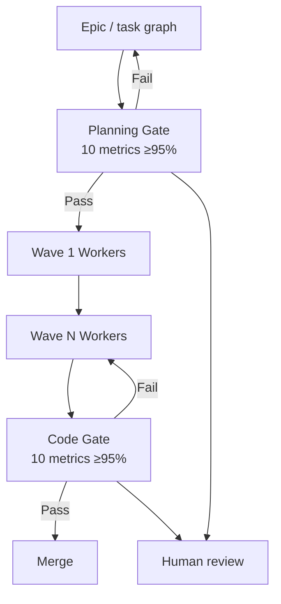

# Specialist Orchestrated Queuing for Multi-Agent SE (SPOQ)

> SPOQ composes wave-based dispatch, dual validation gates, a tiered model roster, and Human-as-an-Agent — gains hold only when four conditions are met.

SPOQ ([Carbowitz & Kumar, 2026](https://arxiv.org/abs/2606.03115)) is a full multi-agent pipeline, not a single primitive — it composes four mechanisms (wave-based DAG dispatch, planning + code validation gates, a three-tier Opus/Sonnet/Haiku roster, and a human specialist at decomposition and validation) into one orchestration loop. Reported gains (defects 0.34 → 0.20 automated, 0.47 → 0.03 with HaaA; test pass 91.25% → 99.75%; speedups up to 14.3× in cloud) are real but conditional.

## When the Composition Pays

All four conditions must hold:

- **Task DAG has a genuinely sparse cut.** Wave dispatch buys parallelism only when the dependency graph admits multiple zero-in-degree tasks at the same level. On near-complete coupling, wave assignment collapses to one task per wave and execution degrades to sequential ([§Failure Conditions, arXiv:2606.03115](https://arxiv.org/abs/2606.03115); see [Cohesion-Aware Task Partitioning](cohesion-aware-task-partitioning.md) for the partition-density check upstream of any wave dispatch).
- **Deterministic ground truth exists at the code gate.** Six of the ten code-validation metrics (compile, tests-exist, tests-pass, security, error-handling, completeness) lean on deterministic checks; the rest (SOLID, clarity, scalability, requirements-fidelity) are LLM judgement. Without the deterministic six the gate becomes a sibling-model opinion poll — the paper flags this as a Construct Threat ([§6.8, arXiv:2606.03115](https://arxiv.org/abs/2606.03115)).
- **A human specialist is available to staff HaaA.** The 0.47 → 0.03 defect reduction comes from human review, not automation alone. Without a specialist participating at decomposition and validation, teams drop to the automated-only envelope (0.34 → 0.20). Human time per task is unquantified in the paper.
- **Blocked precision is measured before the gate is enforcing.** [Nguyen & Tran (2026)](https://arxiv.org/abs/2605.17998) report a deployed read-only verifier at 98.58% rule agreement but *0.39% blocked precision* — almost every rejection a false positive. Any external dual gate inherits this risk class. Keep SPOQ's gates advisory until precision is measured.

If any condition fails, prefer a strong single-agent loop with deterministic verifiers — frontier models match multi-agent orchestration on many SE tasks while avoiding coordination overhead ([arXiv:2511.08475](https://arxiv.org/abs/2511.08475); [arXiv:2503.13657](https://arxiv.org/abs/2503.13657)).

## The Four Mechanisms

**Wave-based dispatch.** A wave assignment `W` maps each task in the DAG to a non-negative integer such that for every dependency `(t_i, t_j)`, `W(t_i) < W(t_j)` ([Definition 3.3, arXiv:2606.03115](https://arxiv.org/abs/2606.03115)). Algorithm 1 iterates zero-in-degree selection. Theorem 3.1 bounds wall-clock by `Σ max_duration(wave_w)`. Critical-path ratios fall in 1.03–1.11 on synthetic DAGs; speedups range 3.25×–14.31× in cloud and stabilise at ~1.4× on a 2-slot hardware-constrained backend. SPOQ assumes the DAG is given — partitioning quality is a precondition.

**Dual validation gates.** The planning gate runs ten metrics (vision, architecture, decomposition, DAG acyclicity, coverage, phase ordering, scope, success-criteria SMART-ness, risks, integration) at ≥95% aggregate / ≥90% per-metric. The code gate runs ten (syntactic, tests-exist, tests-pass, requirements, SOLID, security, error-handling, scalability, clarity, completeness) at ≥95% / ≥80%. The architecture is a specific instance of [Verify-Gated Completion as Admission Control](verify-gated-completion-admission-control.md) — the same independence and precision requirements apply.

**Tiered roster.** Three tiers (Table 1): Opus workers execute tasks, Sonnet reviewers run the gates, Haiku investigators triage build failures. Cross-provider mapping in Table 2. The split is cost-asymmetric routing — reasoning-class compute spent where it earns its rate, cheap models on scoring and triage. [Anthropic's research-system data](https://www.anthropic.com/engineering/multi-agent-research-system) reports Opus-orchestrating-Sonnet outperformed single-agent Opus by 90.2% on complex research; tier separation does much of the work.

**Human-as-an-Agent.** HaaA enters at three points ([Definition 3.4, arXiv:2606.03115](https://arxiv.org/abs/2606.03115)): humans draft epics with ~1–4 hour task scope, participate in the planning gate with override authority, and respond to in-execution consultation requests on ambiguous requirements. Impact is the largest single lever in the paper: residual defects 0.47 → 0.03, pass rate 96.5% → 99.75%.



## Why It Works

Separating producer from validator removes self-judgement bias — LLMs prefer their own generations when evaluating them, and self-refinement amplifies the preference rather than correcting it ([Xu et al., 2024](https://arxiv.org/abs/2402.11436)). An external gate breaks that loop at the cheapest point — before code execution for planning, after for implementation. The planning gate catches the dominant failure class in production multi-agent systems: [Cemri et al. (arXiv:2503.13657)](https://arxiv.org/abs/2503.13657) found 41.8% of failures are design issues and 36.9% are inter-agent misalignment — both caught upstream by a planning gate that verifies the DAG before any worker executes. The HaaA contribution is independent: a human at validation breaks LLM-consensus failures where verifier and producer share training distribution. The tiered roster works because cost-asymmetric routing matches model capability to subtask difficulty, the same mechanism behind the [Orchestrator-Worker Pattern](orchestrator-worker.md) ([Anthropic effective agents](https://www.anthropic.com/engineering/building-effective-agents)).

## When This Backfires

- **Dense dependency graphs.** Wave dispatch returns one wave per task; orchestration cost remains, parallelism gain vanishes ([arXiv:2606.00953](https://arxiv.org/abs/2606.00953)).
- **Coordination overhead exceeds parallelism dividend.** [Cemri et al.](https://arxiv.org/abs/2503.13657) measured parallel coordination at up to 21.1% speedup on some tasks and up to 39.4% *slowdown* on others. Multi-agent communication structures inflate token cost 2×–11.8× over single-chain baselines ([arXiv:2410.02506](https://arxiv.org/abs/2410.02506)).
- **Dual gate enforced without precision evidence.** A gate at 0.39% blocked precision blocks more valid work than invalid ([Nguyen & Tran, 2026](https://arxiv.org/abs/2605.17998)).
- **No human available for HaaA.** Without a specialist, teams drop to the automated-only envelope (0.34 → 0.20) and pay the orchestration cost regardless.
- **Single-tier provider access.** The tiered roster assumes three model tiers; teams capped to one capability tier lose the cost-asymmetric routing.
- **Small task surface (≤5 files).** Up-front graph construction, wave assignment, three-tier scheduling, and dual gates exceed the parallelism gain.
- **Strong single-agent baseline closes the gap.** Frontier single-agent systems match multi-agent orchestration on many SE tasks while avoiding the 36.9% inter-agent misalignment failure class ([arXiv:2511.08475](https://arxiv.org/abs/2511.08475); [arXiv:2503.13657](https://arxiv.org/abs/2503.13657)).

The paper's own §7.2 lists 17-repository sample size, Anthropic-only reference implementation, and unquantified human effort as known limitations ([arXiv:2606.03115](https://arxiv.org/abs/2606.03115)).

## Example

A platform team extracting a billing module from a monolith into three downstream services — they have a static-analysis dependency graph, a domain specialist on staff, and CI tests with high coverage:

```
Wave 0 (parallel, 4 Opus workers):
  - Extract billing.invoice, billing.charge, billing.refund modules
  - Define shared billing.types contracts

Wave 1 (parallel, 3 Opus workers, depends on Wave 0):
  - Migrate service-A/B/C to the new modules

Planning Gate (Sonnet): verifies the DAG is acyclic, coverage complete,
each task atomic, success criteria testable. Human approves before any
worker executes.

Code Gate (Sonnet, after each wave): runs the 10 code metrics. Failures
route to a Haiku investigator for triage, then back to the originating
Opus worker.

HaaA: specialist drafts the epic, validates the wave plan, answers an
in-execution consultation on service-B's backward-compatibility ambiguity.
```

The pipeline is worth it because all four conditions hold. The same team would not run SPOQ on a 3-file bug fix — the wave-assignment overhead alone exceeds the work.

## Key Takeaways

- SPOQ is a composition pattern: wave dispatch + dual gates + tiered roster + HaaA
- Headline gains are conditional on a sparse DAG cut, deterministic ground truth at the code gate, an available human specialist, and measured gate precision before enforcement
- Wave dispatch degenerates to sequential on dense graphs — partition-density belongs upstream
- HaaA, not automation, is the largest single quality lever in the paper's numbers
- Dual gates inherit the [Verify-Gated Completion](verify-gated-completion-admission-control.md) precision risk

## Related

- [Cohesion-Aware Task Partitioning for Multi-Agent Coding](cohesion-aware-task-partitioning.md) — partition-density check belongs upstream of any wave decision
- [Verify-Gated Completion as Admission Control](verify-gated-completion-admission-control.md) — SPOQ's dual gates are a specific instance; the precision requirement carries over
- [Orchestrator-Worker Pattern](orchestrator-worker.md) — the tiered-roster mechanism is the same cost-asymmetric split, scaled to three tiers
- [Multi-Agent SE Design Patterns: A Taxonomy Across 94 Papers](multi-agent-se-design-patterns.md) — places SPOQ in the broader Role-Based Cooperation + Peer Review + Hierarchical Coordination cluster
- [Structured Agentic Software Engineering](../agent-design/structured-agentic-software-engineering.md) — adjacent framework for human-trust gating; SPOQ instantiates similar artifacts at the wave level
