# Staggered Agent Launch

> Launch parallel agents 30 seconds apart to break the thundering-herd dynamic — each agent claims work before the next one reads the queue.

## The Thundering-Herd Problem

When multiple agents start simultaneously, they all read the same queue snapshot and contend for the same high-priority items. The result:

- Repeated reservation conflicts on the same tasks
- Wasted compute re-reading and re-evaluating already-claimed work
- Inconsistent throughput as agents pile onto a narrow frontier

This is the agent-swarm analog of the thundering-herd problem in distributed caching: all clients simultaneously request a cold cache entry, generating a burst of redundant backend calls.

## The Staggered Launch Pattern

The fix is de-synchronizing queue reads by launching agents with a delay between each start:

```
launch agent-1
wait 30s
launch agent-2
wait 30s
launch agent-3
...
```

Each agent reads the queue in a different state: agent-2 sees a queue already partially claimed by agent-1. Contention on top-priority items drops because the items no longer appear available.

A 30-second stagger is a common practitioner convention. Adding a short delay between agent launch and sending the first prompt gives [session initialization](../agent-design/session-initialization-ritual.md) time to settle before the agent reads the queue. Neither figure is empirically derived — the real principle is ensuring each agent has enough time to read-and-reserve before the next agent reads.

```mermaid
gantt
    title Staggered Launch — Queue Coverage Over Time
    dateFormat  ss
    axisFormat  %Ss
    Agent 1 starts : milestone, 00, 0s
    Agent 1 reads + claims : a1, 00, 25s
    Agent 2 starts : milestone, 30, 0s
    Agent 2 reads + claims : a2, 30, 25s
    Agent 3 starts : milestone, 60, 0s
    Agent 3 reads + claims : a3, 60, 25s
```



## When This Is Enough

Staggered launch works well when:

- No task-claiming infrastructure exists yet (bootstrap or prototype swarms)
- Tasks are genuinely independent with no dependency ordering
- Swarm size is small (≤5 agents) — a 10-agent swarm with 30s stagger takes 5 minutes to fully ramp
- Queue read latency is consistent and short

It is a **zero-infrastructure change** — no agent logic, queue design, or coordination code requires modification.

## When to Upgrade

Timing-based coordination is fragile. It breaks down under:

| Condition | Why Stagger Fails | Better Alternative |
|-----------|------------------|-------------------|
| Variable queue-read latency | Agent 2 may read before Agent 1 finishes reserving | File-locked task claims |
| Slow agent initialization | 30s window may not be enough | Worktree isolation |
| Large swarms (10+) | Ramp time becomes operationally significant | FIFO queue serialization |
| Re-contention after launch | Later task picks can still collide | Advisory file reservations |

### Structural alternatives

**[Claude Code agent teams](../tools/claude/agent-teams.md)** use file locks on task claims: when a teammate writes a lock file and pushes it to the shared repo, git's push rejection prevents a second agent from claiming the same task — regardless of timing. This is more robust because it is enforced by the coordination mechanism, not by a timing assumption. See [File-Based Agent Coordination](file-based-agent-coordination.md).

**[Worktree isolation](../workflows/worktree-isolation.md)** (`isolation: worktree` in Claude Code sub-agents) eliminates file-level contention entirely by giving each agent its own git worktree. Agents never compete for the same file paths. Orthogonal to launch timing, but removes a major contention source.

**[Block's agent-task-queue](https://github.com/block/agent-task-queue)** MCP server serializes expensive concurrent operations (builds, tests) via strict FIFO queuing, preventing agents from thrashing shared resources regardless of when they were launched.

## Relationship to Fungible Agent Architecture

Staggered launch is most effective when combined with a **fungible agent design** — where any agent can pick up any available task. Agents that are specialized or stateful reduce the pool of claimable work, making timing-based de-synchronization less useful. The stagger works by ensuring agents see different queue frontiers; if each agent is only eligible for a small subset of tasks, those subsets may overlap regardless of timing.

## Example

A bash launcher that staggers Claude Code sub-agents across a task list:

```bash
#!/usr/bin/env bash
STAGGER=30
TASKS=("refactor auth module" "add retry logic to API client" "write integration tests for billing")

for i in "${!TASKS[@]}"; do
  if [ "$i" -gt 0 ]; then
    echo "Waiting ${STAGGER}s before next launch..."
    sleep "$STAGGER"
  fi
  echo "Launching agent $((i+1)): ${TASKS[$i]}"
  claude --message "Complete this task: ${TASKS[$i]}" \
    --allowedTools "Edit,Write,Bash,Read" &
done

echo "All agents launched. Waiting for completion..."
wait
echo "All agents finished."
```

Each agent starts 30 seconds after the previous one. By the time agent 2 reads the working directory, agent 1 has already begun modifying its target files, reducing the chance of overlapping edits.

## Key Takeaways

- Simultaneous launch causes all agents to read the same queue state and contend for the same top-priority items
- A 30-second stagger de-synchronizes queue reads so each agent claims work before the next agent reads
- No changes to agent logic or coordination infrastructure are required
- The 30-second figure is a practitioner heuristic, not an empirically validated interval — tune based on your queue-read latency
- For swarms larger than ~5 agents or with variable latency, prefer file-locked task claims or worktree isolation

## Related

- [File-Based Agent Coordination](file-based-agent-coordination.md)
- [Sub-Agents Fan-Out](sub-agents-fan-out.md)
- [Orchestrator-Worker Pattern](orchestrator-worker.md)
- [Agent Backpressure](../agent-design/agent-backpressure.md)
- [Bounded Batch Dispatch](bounded-batch-dispatch.md)
- [Developer Attention Management with Parallel Agents](../human/attention-management-parallel-agents.md)
- [Observation-Driven Coordination: CRDT-Based Parallel Agent](crdt-observation-driven-coordination.md)
- [Fan-Out Synthesis Pattern](fan-out-synthesis.md)
- [Multi-Agent Topology Taxonomy](multi-agent-topology-taxonomy.md)
- [LLM Map-Reduce Pattern](llm-map-reduce.md)
- [Swarm Migration Pattern](swarm-migration-pattern.md)
- [Emergent Behavior Sensitivity](emergent-behavior-sensitivity.md)
- [MCP: The Open Protocol Connecting Agents to External Tools](../standards/mcp-protocol.md) — the standard enabling MCP server-based coordination patterns
