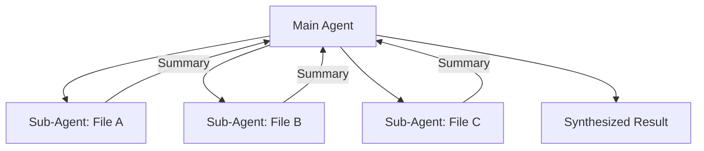

# Sub-Agents for Fan-Out Research and Context Isolation

> Spawn sub-agents to parallelize independent work in isolated context windows — the main thread receives only distilled results, not raw exploration.

!!! note "Also known as"
    Sub-Agents Fan-Out, Parallel Dispatch, Scatter-Gather. For the broader pattern survey, see [Agent Composition Patterns](../agent-design/agent-composition-patterns.md). For the synthesis variant, see [Fan-Out Synthesis](fan-out-synthesis.md). For the delegation variant, see [Orchestrator-Worker](orchestrator-worker.md).

## The Problem

Sequential in-thread research exhausts context fast. An agent tasked with reviewing ten files, fetching five URLs, or analyzing multiple data sources accumulates all raw material in its context window. By the time it synthesizes results, the window is crowded with exploration artifacts — partial reads, dead ends, intermediate notes — that compete with the work that actually matters.

## Context Isolation as the Core Benefit

Sub-agents solve two problems, but isolation is the more important one:

1. **Parallelism** — spawn N sub-agents simultaneously instead of doing N things sequentially
2. **Context isolation** — each sub-agent has its own context window; its exploration never enters the main thread

The main thread dispatches tasks and receives only synthesized results. The raw work — file reads, URL fetches, error handling, retries — happens entirely within sub-agent contexts that are discarded when the sub-agent finishes.

This is the principle behind the [Anthropic context engineering post](https://www.anthropic.com/engineering/effective-context-engineering-for-ai-agents): sub-agents as a context management strategy, not just a parallelism strategy.

## Fan-Out Pattern



Each sub-agent receives a focused task and returns a distilled summary, not the full file contents.

## Claude Code Implementation

Claude Code sub-agents are defined in `.claude/agents/` with YAML frontmatter controlling scope, tools, and permissions ([docs](https://code.claude.com/docs/en/sub-agents)). The parent agent invokes them by name; Claude Code manages the context boundary.

Key frontmatter fields for sub-agents:

- `tools`: restrict to only what the task needs (a research sub-agent may not need `Write`)
- `model`: route to a cheaper or faster model for simpler sub-tasks
- `isolation: worktree`: run in an isolated git worktree for file-writing sub-agents

## Agent Teams

[Agent teams](../tools/claude/agent-teams.md) ([docs](https://code.claude.com/docs/en/agent-teams)) are a distinct pattern from sub-agents: multiple coordinated agents working in parallel on related tasks with shared state. Sub-agents are fire-and-forget with isolated context; teams are persistent with coordination overhead.

Use sub-agents when:

- Tasks are independent and produce distillable results
- Context isolation matters more than shared state
- You want fast fan-out with minimal coordination

Use agent teams when:

- Agents need to share evolving state
- Tasks are interdependent
- Coordination is worth the overhead

## What to Return from Sub-Agents

Sub-agents should return the minimum needed for synthesis, not the raw material:

- Not: full file contents, raw HTML, complete API responses
- Yes: extracted findings, structured summaries, specific facts with source attribution

A sub-agent reading a 5000-token documentation page should return a 200-token summary of the relevant facts. The 4800 tokens of context it consumed vanish when it finishes.

## Example

The following shows a Claude Code sub-agent definition and its invocation pattern. The sub-agent is scoped to read-only file analysis — the parent agent fans out to three of these in parallel, each reading a different module, and receives only distilled summaries back.

```yaml
# .claude/agents/file-summarizer.md
---
name: file-summarizer
description: Reads a single source file and returns a concise summary of its purpose,
  exports, and key dependencies. Used internally for fan-out research tasks.
tools:
  - Read
  - Glob
model: claude-haiku-3-5
---

Read the file at the path provided. Return:
- One sentence describing what the file does
- List of exported functions/classes (names only)
- External dependencies imported

Return only these three items. Do not include file contents.
```

The parent agent dispatches three sub-agents in parallel:

```
Analyze the authentication module. Use the file-summarizer sub-agent to read
each of these files simultaneously and return summaries:
- src/auth/login.ts
- src/auth/session.ts
- src/auth/middleware.ts
```

The main thread receives three 200-token summaries. The raw file contents — potentially thousands of tokens of implementation detail — never enter the main context window. The parent agent synthesizes the architecture from summaries alone.

## Error Isolation in Parallel Tool Calls

As of Claude Code v2.1.72 [unverified], parallel tool calls for `Read`, `WebFetch`, and `Glob` isolate failures — a single failed call no longer cancels sibling tool calls running in parallel. Only `Bash` errors still cascade and abort concurrent calls.

This matters for fan-out patterns because sub-agents routinely issue parallel reads and fetches. Before this change, one bad file path or unreachable URL would abort every parallel call in flight. Now, the successful calls complete and return results; only the failed call reports an error. Fan-out sub-agents can handle partial failures gracefully instead of losing all concurrent work.

## Key Takeaways

- Sub-agents have isolated context windows — exploration never pollutes the main thread
- Fan-out: N tasks dispatched in parallel, distilled results returned to main
- Main thread sees summaries, not raw work — context stays clean for synthesis
- Claude Code sub-agent frontmatter controls tools, model, and worktree per sub-task
- Sub-agents differ from agent teams: fire-and-forget vs persistent coordination
- Parallel `Read`/`WebFetch`/`Glob` calls isolate failures — one bad call does not cancel siblings (Bash errors still cascade)

## Related

- [Agent Composition Patterns: Chains, Fan-Out, Pipelines, Supervisors](../agent-design/agent-composition-patterns.md)
- [Fan-Out Synthesis Pattern](fan-out-synthesis.md)
- [Orchestrator-Worker Pattern](orchestrator-worker.md)
- [Bounded Batch Dispatch](bounded-batch-dispatch.md)
- [Agent Handoff Protocols](agent-handoff-protocols.md)
- [Worktree Isolation](../workflows/worktree-isolation.md)
- [Blast Radius Containment: Least Privilege for AI Agents](../security/blast-radius-containment.md)
- [Subagent Schema-Level Tool Filtering](subagent-schema-level-tool-filtering.md)
- [Claude Code Sub-Agents](../tools/claude/sub-agents.md)
- [Staggered Agent Launch](staggered-agent-launch.md)
- [LLM Map-Reduce Pattern](llm-map-reduce.md)
- [Multi-Agent Topology Taxonomy](multi-agent-topology-taxonomy.md)
- [Multi-Agent SE Design Patterns](multi-agent-se-design-patterns.md)
