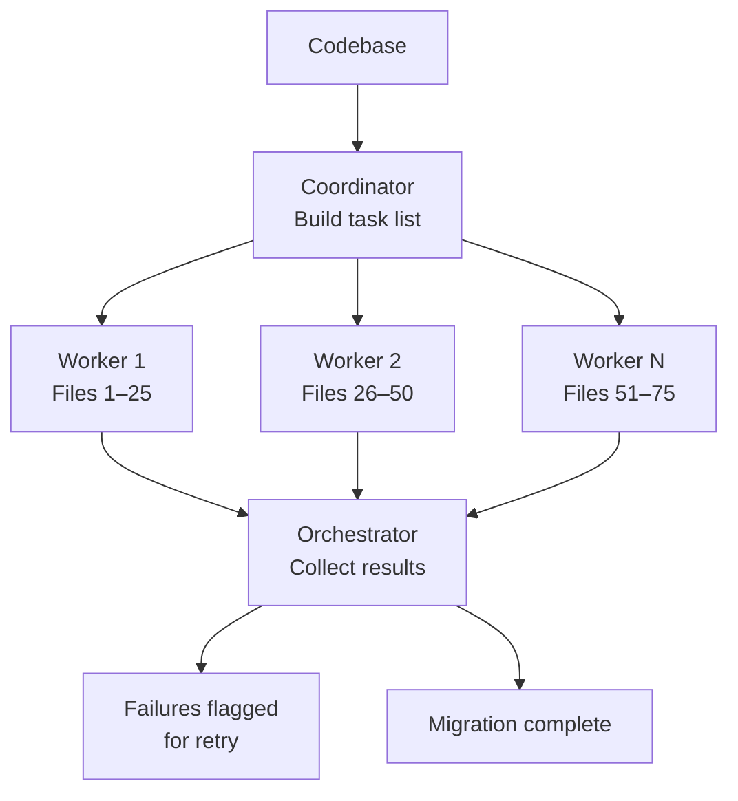

<!-- source: nibzard/awesome-agentic-patterns (Apache 2.0, https://github.com/nibzard/awesome-agentic-patterns) — retain attribution per license -->

# Swarm Migration Pattern

> A coordinator agent builds a complete task list, then fans out to 10–20 parallel workers — each independently migrating a chunk of files — achieving 6–10x speedup for large-scale atomic transformations.

## How It Works

Two phases:

1. **Coordinator** — a single orchestrator enumerates all affected files and produces a complete task list. No workers run yet.
2. **Workers** — the orchestrator dispatches workers in parallel; each receives a bounded file slice and an unambiguous migration spec, then reports results.

Workers have no cross-worker communication. The only coordination point is the orchestrator collecting results.



Boris Cherny (Anthropic): "The main agent makes a big to-do list for everything and then map reduces over a bunch of subagents. You start 10 agents and migrate all the stuff over." ([nibzard/awesome-agentic-patterns](https://github.com/nibzard/awesome-agentic-patterns/blob/main/patterns/swarm-migration-pattern.md))

## Eligible Migrations

The critical constraint is **atomicity**: each file must be migratable without reading or depending on changes in other files being migrated concurrently. If a worker's output on file A affects the correct transformation of file B, the migration is not swarm-eligible.

Eligible:

- Testing library upgrades (Jest → Vitest, Mocha → Jest)
- Lint rule enforcement across a codebase
- Import path refactoring
- API version updates applied file-by-file
- Code modernization (CommonJS → ESM, class components → hooks)

Not eligible:

- Tightly coupled code where file B imports from file A and both change semantically
- Transformations requiring a global refactor pass (e.g., renaming a shared interface used across hundreds of files simultaneously)
- Files with expected failure rates above 30% — worker retries compound cost rapidly

## Swarm Size

Optimal swarm size is 10–20 agents. Below 10, sequential execution is comparable. Beyond 20, coordination overhead and API rate limits dominate, and marginal throughput gains diminish. [nibzard catalog](https://github.com/nibzard/awesome-agentic-patterns/blob/main/patterns/swarm-migration-pattern.md)

Reported speedup for qualifying migrations: 6–10x versus sequential. Token costs increase ~10x, but the wall-clock reduction typically yields a net positive ROI for migrations exceeding 50–100 files. [nibzard catalog](https://github.com/nibzard/awesome-agentic-patterns/blob/main/patterns/swarm-migration-pattern.md)

## Running with Claude Code

[Claude Code best practices](https://code.claude.com/docs/en/best-practices) document this workflow explicitly under "Fan out across files":

```bash
# 1. Generate the task list
claude -p "list all Python files that need migrating from unittest to pytest" > files.txt

# 2. Fan out one worker per file
for file in $(cat files.txt); do
  claude -p "Migrate $file from unittest to pytest. Return OK or FAIL." \
    --allowedTools "Edit,Bash(git commit *)"
done
```

The `--allowedTools` flag scopes each worker's permissions — critical for unattended runs. Without it, workers can take actions beyond the migration scope.

## Prerequisites Before Fan-Out

- **Test coverage** — workers must verify their output. Lint rule migrations and test library upgrades are "super easy to verify" ([nibzard catalog](https://github.com/nibzard/awesome-agentic-patterns/blob/main/patterns/swarm-migration-pattern.md)); without a fast verification step, failures accumulate silently.
- **Unambiguous migration spec** — ambiguous prompts produce inconsistent results across workers.
- **Sandboxed execution** — workers must commit only their own file slice; shared-state side effects (e.g., modifying a shared config file) create merge conflicts.

## Staged Rollout

Always validate before full fan-out:

1. Run on 2–3 representative files; correct the worker prompt on any errors
2. Run on a 10–20 file subset; review failures and adjust swarm size
3. Scale to the full file list

A prompt defect propagates to every file in a full swarm simultaneously — staged rollout is the only cost-effective catch.

## Failure Handling

The orchestrator should record failed files without stopping the queue, surface a failure report at the end, and support targeted retry on failed items only. Do not retry inline — a stuck worker occupies a slot that could be processing other files.

## Why It Works

Sequential migration takes `N × t`; a swarm of `W` workers collapses that to `⌈N / W⌉ × t`. The key enabler is inter-file independence: each worker reads and writes its slice without reading any other worker's output, so there is no coordination latency to pay. The orchestrator handles bookkeeping only — adding workers does not increase coordination overhead proportionally.

## When This Backfires

- **Rate limit exhaustion** — 10–20 simultaneous calls frequently hit provider rate limits, serializing execution. Stagger launches or queue to stay under per-minute token budgets.
- **Context window overflow** — files exceeding the model's usable context produce silent partial migrations. Pre-filter large files and handle them with a narrower-scope prompt.
- **LLM non-determinism** — parallel workers on similar code patterns make inconsistent stylistic choices. For strict uniformity requirements, run a normalization pass after the swarm.
- **Partial-migration state** — failure rates above ~30% leave the codebase in a mixed state harder to reason about than a fully-unmigrated one. Isolate with a feature flag or dedicated branch.
- **Token cost vs ROI** — at ~10x sequential token cost, the break-even is roughly 50–100 files. Below that threshold, manual staged migration is cheaper.

## Key Takeaways

- Atomicity is the eligibility gate — if file A's correct transformation depends on file B's concurrent transformation, the migration is not swarm-eligible
- Swarm size of 10–20 agents is the practical optimum; beyond 20, returns diminish
- Stage rollouts: validate on 2–3 files → subset → full swarm
- Scope each worker with `--allowedTools` to prevent unintended side effects during unattended runs
- Record failures without stopping the queue; retry targeted failures in a second pass

## Example

A codebase has 400 JavaScript files using the `require()` CommonJS syntax that must migrate to ES module `import` syntax.

**Coordinator prompt:**
```
List all .js files in src/ that contain require() calls. Output one filepath per line.
```

**Worker prompt (per file):**
```
Convert all require() calls in $file to ES module import syntax.
Do not modify any other files.
Run `node --input-type=module < $file` to verify syntax.
Return OK if the file passes, FAIL with a one-line reason if it does not.
```

The orchestrator fans out 20 workers at a time (to stay within API rate limits), collecting results. Files returning FAIL are written to `failed.txt` for a targeted follow-up pass. Total wall time for 400 files: ~20 batches × ~30 seconds per batch = ~10 minutes, versus ~200 minutes sequentially.

## Related

- [Orchestrator-Worker Pattern](orchestrator-worker.md)
- [Bounded Batch Dispatch](bounded-batch-dispatch.md)
- [Fan-Out Synthesis Pattern](fan-out-synthesis.md)
- [LLM Map-Reduce Pattern](llm-map-reduce.md)
- [Staggered Agent Launch](staggered-agent-launch.md)
- [Sub-Agents Fan-Out](sub-agents-fan-out.md)
- [File-Based Agent Coordination](file-based-agent-coordination.md)
