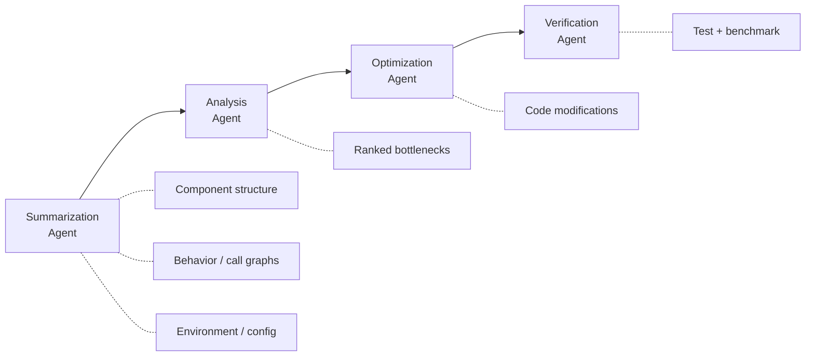

# System-Level Optimization Pipeline

> A four-stage agent pipeline decomposes performance engineering into summarization, analysis, optimization, and verification — enabling AI agents to reason about bottlenecks that span component boundaries rather than optimizing functions in isolation.

!!! info "Also known as"
    Multi-Agent Performance Optimization, System-Wide Optimization Pipeline

## The Problem with Local Optimization

Most AI coding agents optimize at the function or file level — point at a function, ask the agent to "make it faster," and it restructures the algorithm. This works for CPU-bound hot paths but misses the bottlenecks that matter most in distributed systems: connection pool exhaustion across services, lock contention on shared request paths, redundant object allocation in serialization layers.

These system-level problems emerge from **cross-component interactions** — how services call each other, share resources, and contend for locks. No single-file pass can find them because the evidence is spread across multiple services and configuration layers.

## The Four-Stage Pipeline

The system-level optimization pipeline assigns each phase of performance engineering to a specialized agent role, following the [orchestrator-worker pattern](orchestrator-worker.md) with sequential handoff.



### Stage 1: Summarization

The summarization agent extracts architectural context that downstream agents need, decomposed into three sub-tasks:

| Sub-Agent | Extracts |
|-----------|----------|
| **Component Summary** | Service boundaries, dependency maps, exported interfaces |
| **Behavior Summary** | Call graphs, control-flow complexity, database interactions, concurrency patterns |
| **Environment Summary** | Build config, runtime settings, deployment topology |

This stage differentiates system-level from local optimization. Without architectural context, agents default to function-level reasoning.

### Stage 2: Analysis

The analysis agent receives the summarization output, identifies optimization opportunities, and ranks them by estimated impact and confidence.

### Stage 3: Optimization

The optimization agent translates each bottleneck into concrete code changes under a non-breaking constraint: public APIs and service interfaces remain stable. Changes target internal implementation only.

### Stage 4: Verification

The verification agent validates functional correctness (existing tests pass) and measures performance impact through benchmarking. Only verified improvements are retained.

## Early Evidence

[Peng et al. (2026)](https://arxiv.org/abs/2603.14703) evaluated this pipeline on TeaStore, a Java microservices benchmark with six interacting services:

| Metric | Before | After | Change |
|--------|--------|-------|--------|
| Throughput (req/s) | 1,198 | 1,636 | **+36.6%** |
| Avg response time (ms) | 12.84 | 9.27 | **-27.8%** |
| p50 latency (ms) | 13.0 | 9.0 | **-30.8%** |
| p99 latency (ms) | 26.0 | 23.0 | **-11.5%** |

The three optimizations were well-known patterns: HTTP client reuse via singleton, replacing synchronized methods with volatile flags, and sharing static ObjectMapper instances. The value was in **automated discovery** across service boundaries, not novelty of the fixes.

!!! warning "Early-stage research"
    These results come from a single benchmark system. Comparative evaluations against existing tools (OpenCode, CodeX, SysLLMatic) are planned but not yet conducted. The framework assumes comprehensive existing test suites for correctness validation.

## Practical Takeaway: Context Shapes Optimization Scope

**The context you provide determines the scope of optimization the agent can perform.**

- **File-level context** → agents find local algorithm improvements
- **Repository-level context** → agents find cross-file refactoring opportunities
- **System-level context** (dependency maps, call graphs, deployment config) → agents reason about cross-service bottlenecks

If you want agents to find system-level performance issues, provide system-level context:

1. **Dependency maps** — which services call which, and how
2. **Call graphs** — interprocedural flow across service boundaries
3. **Runtime configuration** — connection pools, thread counts, cache settings
4. **Deployment topology** — co-located vs. networked services, resource constraints

Without this, agents default to the optimization scope their context window supports — usually a single file.

## Example

A team runs the four-stage pipeline against a Java microservices application with three services: `api-gateway`, `order-service`, and `inventory-service`.

**Stage 1 — Summarization** produces structured context:

```yaml
components:
  api-gateway:
    calls: [order-service, inventory-service]
    http_client: new HttpClient() per request
  order-service:
    calls: [inventory-service]
    concurrency: synchronized updateStock()
  inventory-service:
    serialization: new ObjectMapper() per call
```

**Stage 2 — Analysis** identifies three ranked bottlenecks:

1. `api-gateway` creates a new HTTP client per request — connection pool exhaustion under load
2. `order-service.updateStock()` uses `synchronized` — thread contention on every order
3. `inventory-service` allocates a new `ObjectMapper` per serialization call — GC pressure

**Stage 3 — Optimization** generates patches: singleton `HttpClient`, `volatile` flag replacing `synchronized`, static shared `ObjectMapper`.

**Stage 4 — Verification** runs the existing test suite (all pass) and benchmarks throughput before and after, confirming a 36% improvement.

None of these fixes are novel. The value is that the pipeline found cross-service bottlenecks no single-file agent pass would detect.

## Key Takeaways

- System-level bottlenecks emerge from cross-component interactions that no single-file agent pass can detect
- Four specialized stages (summarize, analyze, optimize, verify) let each agent reason within a bounded scope while collectively covering the full system
- The context you feed an agent determines its optimization ceiling — provide architecture-level inputs for architecture-level results
- Early results are promising (+36.6% throughput on one benchmark) but remain single-system and uncompared to existing tools

## Related

- [Specialized Agent Roles](../agent-design/specialized-agent-roles.md) — each pipeline stage has a distinct, non-overlapping responsibility
- [Orchestrator-Worker Pattern](orchestrator-worker.md) — sequential handoff with structured intermediate outputs
- [Agent Handoff Protocols](agent-handoff-protocols.md) — the summarization output serves as the contract between stages
- [Closed-Loop Role-Based Refinement](closed-loop-role-based-refinement.md) — the verification stage provides the feedback signal
- [Multi-Agent Topology Taxonomy](multi-agent-topology-taxonomy.md) — sequential pipeline is one coordination topology among several

## References

- [Peng et al. (2026). Beyond Local Code Optimization: Multi-Agent Reasoning for Software System Optimization. arXiv:2603.14703](https://arxiv.org/abs/2603.14703)
