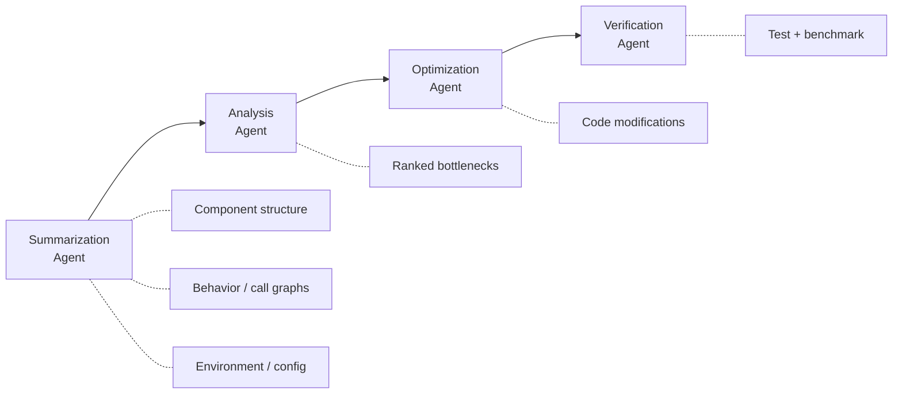

# System-Level Optimization Pipeline

> A four-stage agent pipeline decomposes performance engineering into summarization, analysis, optimization, and verification — enabling AI agents to reason about bottlenecks that span component boundaries rather than optimizing functions in isolation.

!!! info "Also known as"
    Multi-Agent Performance Optimization, System-Wide Optimization Pipeline

## Why Local Optimization Misses System Bottlenecks

The system-level optimization pipeline is a sequential multi-agent workflow that splits performance engineering across four specialized agents — summarizer, analyst, optimizer, and verifier — each reasoning within a bounded scope while collectively surfacing bottlenecks that span multiple services.

Most AI coding agents optimize at the function level: point at a function, ask for it to be faster, and the agent restructures the algorithm. This misses the bottlenecks that matter most in distributed systems — connection pool exhaustion, lock contention on shared request paths, redundant allocation in serialization layers. These emerge from **cross-component interactions** that no single-file pass can find, because the evidence is spread across services and configuration layers.

## The Four-Stage Pipeline

The pipeline assigns each phase of performance engineering to a specialized agent role, following the [orchestrator-worker pattern](orchestrator-worker.md) with sequential handoff.



### Stage 1: Summarization

The summarization agent extracts architectural context that downstream agents need, decomposed into three sub-tasks:

| Sub-Agent | Extracts |
|-----------|----------|
| **Component Summary** | Service boundaries, dependency maps, exported interfaces |
| **Behavior Summary** | Call graphs, control-flow complexity, database interactions, concurrency patterns |
| **Environment Summary** | Build config, runtime settings, deployment topology |

Without this architectural context, agents default to function-level reasoning.

### Stage 2: Analysis

The analysis agent receives the summarization output, identifies optimization opportunities, and ranks them by estimated impact and confidence.

### Stage 3: Optimization

The optimization agent translates each bottleneck into concrete code changes under a non-breaking constraint: public APIs and service interfaces remain stable. Changes target internal implementation only.

### Stage 4: Verification

The verification agent validates functional correctness (existing tests pass) and measures performance impact through benchmarking. Only verified improvements are retained.

## Early Evidence

[Peng et al. (2026)](https://arxiv.org/abs/2603.14703) evaluated this pipeline on TeaStore, a Java microservices benchmark with six interacting services:

| Metric | Before | After | Change |
|--------|--------|-------|--------|
| Throughput (req/s) | 1,198 | 1,636 | **+36.6%** |
| Avg response time (ms) | 12.84 | 9.27 | **-27.8%** |
| p50 latency (ms) | 13.0 | 9.0 | **-30.8%** |
| p99 latency (ms) | 26.0 | 23.0 | **-11.5%** |

The three optimizations were well-known patterns: singleton HTTP client reuse, replacing synchronized methods with volatile flags, and sharing static ObjectMapper instances. The value was **automated discovery** across service boundaries, not novelty. [TeaStore](https://github.com/DescartesResearch/TeaStore) is maintained by the Descartes Research Group.

!!! warning "Early-stage research"
    Results come from a single benchmark. Comparisons against existing tools (OpenCode, CodeX, SysLLMatic) are planned but not yet conducted, and the framework assumes comprehensive existing test suites.

## Context Shapes Optimization Scope

The context you provide determines the scope of optimization the agent can perform:

- **File-level** → local algorithm improvements
- **Repository-level** → cross-file refactoring
- **System-level** (dependency maps, call graphs, deployment config) → cross-service bottlenecks

To surface system-level issues, provide dependency maps, call graphs, runtime configuration (connection pools, thread counts, cache settings), and deployment topology. Without them, agents default to the optimization scope their context window supports — usually a single file.

## Example

A team runs the four-stage pipeline against a Java microservices application with three services: `api-gateway`, `order-service`, and `inventory-service`.

**Stage 1 — Summarization** produces structured context:

```yaml
components:
  api-gateway:
    calls: [order-service, inventory-service]
    http_client: new HttpClient() per request
  order-service:
    calls: [inventory-service]
    concurrency: synchronized updateStock()
  inventory-service:
    serialization: new ObjectMapper() per call
```

**Stage 2 — Analysis** identifies three ranked bottlenecks:

1. `api-gateway` creates a new HTTP client per request — connection pool exhaustion under load
2. `order-service.updateStock()` uses `synchronized` — thread contention on every order
3. `inventory-service` allocates a new `ObjectMapper` per serialization call — GC pressure

**Stage 3 — Optimization** generates patches: singleton `HttpClient`, `volatile` flag replacing `synchronized`, static shared `ObjectMapper`.

**Stage 4 — Verification** runs the existing test suite (all pass) and benchmarks throughput before and after, confirming a 36% improvement.

None of these fixes are novel. The value is that the pipeline found cross-service bottlenecks no single-file agent pass would detect.

## When This Backfires

The pipeline requires conditions that not all codebases meet:

1. **No existing test suite** — Stage 4 (verification) depends on passing tests to validate correctness. Without them, the pipeline cannot distinguish a valid optimization from a regression. A single failing assumption in the optimization stage silently ships broken code.
2. **Simple or monolithic codebases** — Cross-component bottlenecks don't emerge in single-service or small-monolith systems. The four-agent coordination overhead (summarization, analysis, optimization, verification) adds latency and cost that outweighs the benefit vs. a direct single-agent pass.
3. **Poorly documented service boundaries** — The summarization stage extracts dependency maps and call graphs from code and config. If service contracts are implicit or undocumented, summaries will be incomplete and the analysis stage will miss bottlenecks that cross those boundaries.
4. **Single-benchmark evidence** — Current results come from one Java microservices benchmark (TeaStore). Applying the pattern to heterogeneous stacks, stateful services, or event-driven architectures may produce different outcomes.

## Key Takeaways

- System-level bottlenecks emerge from cross-component interactions that no single-file agent pass can detect
- Four specialized stages (summarize, analyze, optimize, verify) let each agent reason within a bounded scope while collectively covering the full system
- The context you feed an agent determines its optimization ceiling — provide architecture-level inputs for architecture-level results
- Early results are promising (+36.6% throughput on one benchmark) but remain single-system and uncompared to existing tools

## Related

- [Specialized Agent Roles](../agent-design/specialized-agent-roles.md) — each pipeline stage has a distinct, non-overlapping responsibility
- [Orchestrator-Worker Pattern](orchestrator-worker.md) — sequential handoff with structured intermediate outputs
- [Agent Handoff Protocols](agent-handoff-protocols.md) — the summarization output serves as the contract between stages
- [Closed-Loop Role-Based Refinement](closed-loop-role-based-refinement.md) — the verification stage provides the feedback signal
- [Multi-Agent Topology Taxonomy](multi-agent-topology-taxonomy.md) — sequential pipeline is one coordination topology among several
- [Multi-Agent SE Design Patterns](multi-agent-se-design-patterns.md) — MAS performance and scalability are identified as under-addressed quality attributes in current research

## References

- [Peng et al. (2026). Beyond Local Code Optimization: Multi-Agent Reasoning for Software System Optimization. arXiv:2603.14703](https://arxiv.org/abs/2603.14703)
- [TeaStore: A Micro-Service Reference Application. DescartesResearch, GitHub](https://github.com/DescartesResearch/TeaStore)
