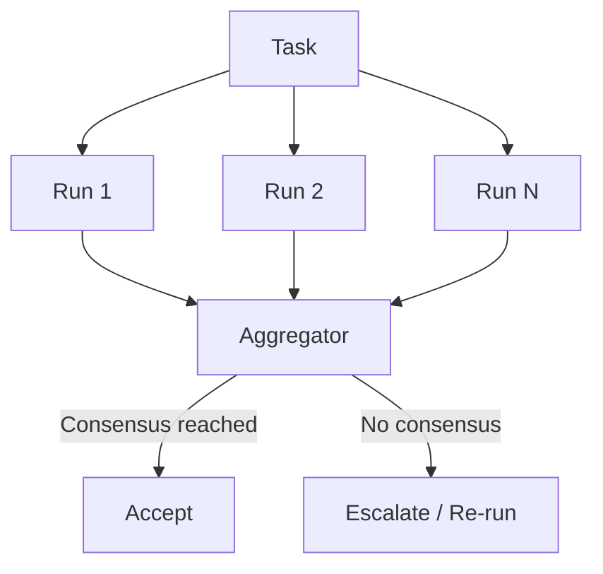

# Voting / Ensemble Pattern

> Run the same task N times in parallel, then aggregate results through voting to trade compute for confidence.

!!! note "Also known as"
    Self-Consistency, Majority Voting, Multi-Model Consensus. For the complementary pattern that merges strengths rather than voting, see [Fan-Out Synthesis](fan-out-synthesis.md). For specialized multi-lens review, see [Committee Review](../code-review/committee-review-pattern.md).

## Structure



Unlike fan-out synthesis (which assembles the best parts from diverse outputs) or committee review (which applies different lenses), voting runs **identical tasks** and picks the answer the runs agree on.

## Three Fan-Out Tactics

| Tactic | Setup | Diversity source |
|--------|-------|-----------------|
| Self-consistency sampling | Same model, same prompt, high temperature | Stochastic variation across reasoning paths |
| Prompt ensembles | Same model, varied prompts | Different framings surface different reasoning |
| Multi-model consensus | Different models, same prompt | Independent training data and failure modes |

Multi-model consensus provides the strongest diversity. Calling the same model N times tends to repeat the same mistakes; different models fail independently.

## When Voting Helps

Voting works best on tasks with **discrete, verifiable outputs** where the correct answer exists but a single run might miss it:

- **Classification** — is this input malicious, compliant, or out-of-scope?
- **Security flagging** — does this diff introduce a vulnerability?
- **Content moderation** — does this output violate policy?
- **Code correctness checks** — does this function handle the edge case?

Voting adds little value for creative synthesis, open-ended generation, or real-time responses where latency matters more than marginal accuracy.

## Choosing N

The foundational self-consistency paper ([Wang et al. 2023](https://arxiv.org/abs/2203.11171)) showed +17.9% accuracy on GSM8K by majority-voting over sampled reasoning paths. But more is not always better.

| N | Effect |
|---|--------|
| 1 | Baseline — no voting benefit |
| 3 | Strong gains for most classification and verification tasks |
| 5 | Marginal improvement over 3; good ceiling for most use cases |
| 7+ | Diminishing or **inverted** returns — more calls can hurt on hard queries |

Kore.ai's [scaling law research](https://blog.kore.ai/cobus-greyling/performing-multiple-llm-calls-voting-on-the-best-result-are-subject-to-scaling-laws) confirms that performance initially increases then **decreases** with N — more calls help on easy queries but hurt on hard ones. The optimal count is task-dependent; determine it empirically.

## Aggregation Strategies

Simple majority voting treats all runs equally but leaves accuracy on the table.

| Strategy | Mechanism | Trade-off |
|----------|-----------|-----------|
| Majority vote | Most common answer wins | Simple; ignores model quality differences |
| Weighted vote | Runs scored by model capability or historical accuracy | Better accuracy; requires calibration data |
| Confidence-weighted | Weight by model's reported confidence score | ~46% compute reduction at equivalent accuracy ([Kossen et al. 2025](https://arxiv.org/abs/2502.06233)) |
| Unanimous | All runs must agree; else escalate | High precision, low recall — good for safety-critical |
| Semantic similarity | Cluster answers by meaning, pick densest cluster | Handles paraphrased equivalents |

Advanced methods like Optimal Weight and Inverse Surprisingly Popular algorithms improve accuracy by 1–3% over standard majority voting by accounting for model heterogeneity and answer correlations ([Plaat et al. 2024](https://arxiv.org/abs/2510.01499)).

## Cost Trade-Off

N runs costs N× tokens. Confidence-weighted voting can cut this nearly in half by early-stopping when confidence is high. Two practical levers:

1. **Start with N=3** and measure whether accuracy justifies scaling to 5
2. **Use confidence thresholds** — if 3/3 agree with high confidence, skip additional runs

For routine tasks with strong single-run baselines, voting is wasteful. Reserve it for decisions where a false positive or false negative carries real cost.

## Why It Works

LLMs are stochastic: the same prompt samples from a distribution of reasoning paths. Incorrect answers are scattered across that distribution — each error arises from a distinct spurious chain of thought. Correct answers, by contrast, cluster: multiple independent paths tend to converge on the same right answer because the underlying logic is consistent. Majority voting amplifies this signal by selecting the answer most paths agree on, drowning out idiosyncratic errors ([Wang et al. 2023](https://arxiv.org/abs/2203.11171)).

Multi-model consensus strengthens this further. Different models have independent failure modes rooted in distinct training data and architectures, so an error that is systematic for one model is uncorrelated with errors in another — the correct answer remains the densest cluster even as ensemble size grows.

## Example

Security review of a pull request using 3-model consensus:

```python
import asyncio, json
from anthropic import Anthropic
from openai import OpenAI

PROMPT = "Review this diff for security vulnerabilities. Return JSON: {\"verdict\": \"SAFE\" | \"UNSAFE\", \"findings\": [...]}\n\n"

async def review_with_model(name, call_fn, diff):
    resp = await call_fn(PROMPT + diff)
    return {"model": name, **json.loads(resp)}

async def vote_on_diff(diff: str):
    results = await asyncio.gather(
        review_with_model("claude", call_claude, diff),
        review_with_model("gpt4", call_gpt4, diff),
        review_with_model("gemini", call_gemini, diff),
    )
    unsafe = sum(1 for r in results if r["verdict"] == "UNSAFE")
    if unsafe >= 2:
        return {"action": "BLOCK", "findings": merge_findings(results)}
    if unsafe == 1:
        return {"action": "MERGE", "dissent": [r for r in results if r["verdict"] == "UNSAFE"]}
    return {"action": "MERGE", "findings": []}
```

The three models have independent failure modes: a vulnerability one model misses, another is likely to catch.

## Key Takeaways

- Voting trades compute for confidence — same task, multiple runs, aggregated verdict
- Multi-model diversity beats same-model repetition for genuine independence
- 3-5 runs covers most use cases; beyond that, returns diminish or invert
- Confidence-weighted aggregation cuts compute by ~46% vs naive majority voting ([Kossen et al. 2025](https://arxiv.org/abs/2502.06233))
- Reserve voting for discrete, verifiable tasks (classification, security, compliance) — not open-ended generation
- Distinct from fan-out synthesis (which merges complementary strengths) and committee review (which applies specialized lenses)

## Related

- [Fan-Out Synthesis Pattern](fan-out-synthesis.md)
- [Sub-Agents Fan-Out](sub-agents-fan-out.md)
- [Committee Review Pattern](../code-review/committee-review-pattern.md)
- [Adversarial Multi-Model Pipeline](adversarial-multi-model-pipeline.md)
- [LLM Map-Reduce](llm-map-reduce.md)
- [Multi-Model Plan Synthesis](multi-model-plan-synthesis.md)
- [Orchestrator-Worker](orchestrator-worker.md)
- [Multi-Agent Topology Taxonomy](multi-agent-topology-taxonomy.md)
- [Cost-Aware Agent Design](../agent-design/cost-aware-agent-design.md)
- [Agent Composition Patterns](../agent-design/agent-composition-patterns.md)
