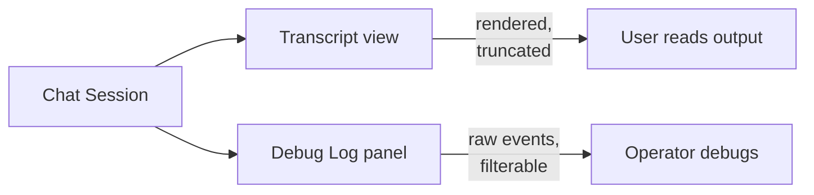

# Agent Debug Log Panel: Chronological Event Inspection for Session Debugging

> A persistent, chronological event-log surface separate from the user-facing transcript — operators replay and debug past agent sessions from the same events the agent saw.

## Transcript vs. Debug Log

The chat transcript and the debugging artifact have conflicting requirements. Transcripts are rendered for readability: long tool outputs are truncated, system prompts hidden, customization loads and skill-discovery messages omitted. Debugging requires the opposite — every event, in order, filterable by type, with full payloads.

VS Code resolves this by shipping two complementary surfaces. The Chat view is the readable transcript; the Agent Debug Log panel is "the primary tool for understanding what happens when you send a prompt", showing "a chronological event log of agent interactions during a chat session" ([VS Code docs — Debug chat interactions](https://code.visualstudio.com/docs/copilot/chat/chat-debug-view#_agent-debug-log-panel)).

## Event Granularity

Events captured by the panel include tool calls, LLM requests, prompt-file discovery, and errors ([VS Code docs](https://code.visualstudio.com/docs/copilot/chat/chat-debug-view#_agent-debug-log-panel)). Each event carries a timestamp, event type, and summary; expanding an event reveals the full payload — the complete system prompt for an LLM request, or input and output for a tool call.

Three views share the same underlying event stream:

- **Logs** — flat or subagent-tree list with event-type filters
- **Agent Flow Chart** — pan/zoom visualisation of interactions between agents and sub-agents
- **Summary** — aggregate statistics: total tool calls, token usage, error count, duration

## Persistence Across Sessions

The panel is only useful for live debugging unless logs outlive the session. VS Code 1.116 (April 2026) generalised the panel to cover historical sessions: "you can now view the log for the current session as well as previous sessions, with logs persisted locally on disk. This enables you to review and debug past agent interactions even after the session has ended" ([VS Code 1.116 release notes](https://code.visualstudio.com/updates/v1_116)).

Two settings control the behaviour ([Copilot settings reference](https://code.visualstudio.com/docs/copilot/reference/copilot-settings)):

- `github.copilot.chat.agentDebugLog.enabled` — turns the panel and `/troubleshoot` slash command on
- `github.copilot.chat.agentDebugLog.fileLogging.enabled` — writes events to disk so past sessions remain inspectable

Both default to `false` — the disk-write cost and privacy exposure are opt-in.

## Complement to Progress Files and Event Sourcing

The debug log is machine-authored raw events for human debugging. Two adjacent observability patterns solve different problems:

- [Trajectory logging via progress files](trajectory-logging-progress-files.md) — agent-authored summaries for the agent's own future sessions, not for human forensics
- [Event sourcing for agents](event-sourcing-for-agents.md) — orchestrator-authored append-only log for replay-verifiable state mutation, not for prompt-path inspection

The debug log sits in the third slot: machine-authored, human-consumed, scoped to a session rather than the whole project.

## Cross-Tool: OTel Raw Bodies

The same event data feeds external tooling when expressed as OpenTelemetry. Claude Code 2.1.111 (April 16, 2026) added `OTEL_LOG_RAW_API_BODIES`, which "emit[s] full API request and response bodies as OpenTelemetry log events for debugging" ([Claude Code changelog](https://code.claude.com/docs/en/changelog)). The event schemas — `claude_code.api_request_body` and `claude_code.api_response_body` — are emitted per API attempt, so retries with adjusted parameters each produce their own event ([Claude Code monitoring reference](https://docs.claude.com/en/docs/claude-code/monitoring-usage)).

This lets a team pipe the same raw events into Datadog, Honeycomb, or an internal log store — the event-sourced debug surface is the UI; OTel is the export path.

## Trade-offs

- **Disk pressure** — persisted event logs grow with session length. The panel is off by default; enable selectively on sessions you expect to debug.
- **Privacy exposure** — raw events capture verbatim prompts, tool inputs, and tool outputs. Claude Code's documentation notes that tool-content capture "can include raw file contents from Read tool results and Bash command output" and recommends backend-side redaction ([monitoring reference](https://docs.claude.com/en/docs/claude-code/monitoring-usage)). Secrets pasted into context or API keys in bash output persist to disk as readable text.
- **Redundant on linear sessions** — when there are no sub-agents or custom agents, the transcript alone usually shows enough. The flow chart and subagent-tree views add signal only when multiple actors are involved.

## Example

A custom sub-agent is not loading a prompt file as expected. The transcript shows the parent agent delegating, then the sub-agent producing output without the expected style conventions — no indication of why.

Opening the Agent Debug Logs panel for the session reveals a chronological list of events. Filtering to prompt-file discovery events shows the sub-agent attempted to load `.github/prompts/style-guide.md` but the path resolved against the wrong workspace root. The Summary view confirms the sub-agent made zero `readFile` calls against that path; the Flow Chart shows the delegation edge but no attached customization node.

The operator then attaches the debug events as chat context and runs `/troubleshoot list all paths you tried to load customizations`, getting back a concrete answer sourced from the captured events rather than regenerating the session ([VS Code docs — Attach debug events to chat](https://code.visualstudio.com/docs/copilot/chat/chat-debug-view#_attach-debug-events-to-chat)).

The fix is a workspace configuration change, not a prompt or model change. Without persisted logs, the operator would have re-run the session and hoped to reproduce the failure.

## Key Takeaways

- A debug log panel is a separate surface from the transcript — same events, different presentation, no truncation.
- Persistence to disk lets operators debug sessions that already ended; without it, each failed session has to be re-run to investigate.
- Event granularity matters: tool calls, LLM requests, prompt-file discovery, and errors — enough to reconstruct the agent's path, not just its output.
- Default-off for a reason: raw events contain verbatim prompts, tool inputs, and tool outputs that may include secrets or PII.
- OpenTelemetry raw-body export is the cross-tool equivalent — same data, different consumer (external observability backend rather than an in-IDE panel).

## Related

- [Agent Debugging: Diagnosing Bad Agent Output](agent-debugging.md) — the systematic process that a debug log feeds
- [Trajectory Logging via Progress Files and Git History](trajectory-logging-progress-files.md) — agent-authored summaries for the agent's own future sessions
- [Event Sourcing for Agents](event-sourcing-for-agents.md) — orchestrator-authored append-only log for replay-verifiable state mutation
- [Agent Observability: OTel, Cost Tracking, and Trajectory Logging](agent-observability-otel.md) — the OpenTelemetry path for exporting the same data to external backends
- [OpenTelemetry for AI Agent Observability and Tracing](../standards/opentelemetry-agent-observability.md) — span and log conventions that underpin cross-tool exports
- [Making Observability Legible to Agents](observability-legible-to-agents.md) — the inverse pattern: agents reading application observability, not humans reading agent observability
- [Loop Detection](loop-detection.md) — a signal surface that a debug log can confirm
- [Circuit Breakers for Agent Loops](circuit-breakers.md) — halting based on observable signals captured in the debug log
