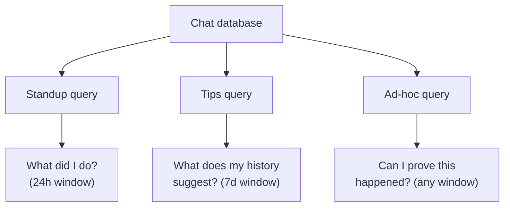

# Agent Chat History as a First-Class Artifact

> Every chat turn already names files, runs commands, and references issues. Persisted as a queryable database, that trace serves practitioner-facing questions — what did I do today, what does my history suggest, can I prove this happened — without re-instrumenting the workflow.

## Three Surfaces, Three Consumers

| Surface | Consumer | Scope | Question it answers |
|---------|----------|-------|---------------------|
| [In-session transcript search](transcript-search.md) | Practitioner, mid-session | One session | "Where did the plan change?" |
| [Trajectory logging via progress files](trajectory-logging-progress-files.md) | Agent, next session | Cross-session, agent-shaped | "What was decided last time?" |
| **History-as-artifact** | Practitioner, after the fact | Cross-session, practitioner-shaped | "What did I do this week?" |

This page covers the third surface. The audience is the engineer who wants a standup summary, a coaching tip, or an audit answer — not the harness developer debugging an agent, and not the next-session agent reconstructing state.

## The Concrete Implementation

VS Code 1.118 (2026-04-29) ships **Chronicle**, an experimental feature that "tracks your chat interactions in a local SQLite database" and exposes three query commands ([VS Code 1.118 release notes](https://code.visualstudio.com/updates/v1_118)):

- `/chronicle:standup` — generates a standup report from the last 24 hours of coding sessions, grouped by feature/branch, with summaries, file lists, and PR links
- `/chronicle:tips` — analyzes 7 days of usage to give personalized tips on prompting, tool usage, and workflow
- `/chronicle [query]` — free-form natural-language search across session history (e.g. "what files did I edit yesterday?")

Chronicle is gated behind `github.copilot.chat.localIndex.enabled` and stores data locally. Recorded shape: session metadata (branch, repo, timestamps), conversation turns, files touched via tool calls, and references to PRs, issues, and commits ([VS Code 1.118](https://code.visualstudio.com/updates/v1_118)).

Chronicle is the first commodity implementation. The same idea at infrastructure level appears in the [OTel GenAI span conventions](https://opentelemetry.io/docs/specs/semconv/gen-ai/gen-ai-spans/), which define structured attributes for chat turns, tool calls, and outputs that any harness can emit and any backend can query.

## The Three Query Shapes



The shapes differ in window length, output format, and risk profile — and each fails differently when misused.

- **Standup** — 24h window grouped by feature or branch. Value is recall (surfacing work the practitioner forgot), not narrative.
- **Tips** — 7d analysis of prompting and tool-usage patterns. The riskiest shape: implies a causal model ("you do better when you X") from correlation in a sample of one. Treat as a prompt for reflection, not a recommendation.
- **Ad-hoc** — free-form NL query ("did I touch auth/login.py this week?"). Closest to traditional log search; most defensible — value is audit, not coaching.

## Mechanism: Why Chat History Has Leverage

Chat history is already a structured trace of the work. Every turn names files, runs commands, references issues, and produces decisions. Querying the existing database has lower marginal cost than building a parallel tracker, for the same reason `git log` is a useful productivity surface — the artifact is produced as a side-effect of normal work.

The leverage compounds because the chat database is the only surface that captures *intent*. Git captures the diff; CI captures the test result; the chat turn captures why the diff was made and what was tried before it succeeded.

## When This Backfires

- **Privacy leak through generated reports.** Standup output naming files, branches, or issues can be pasted into a Slack channel that includes people without access to the repo. Pasted secrets in prior chat turns appear verbatim in NL query results. Local-first storage protects data at rest; it does not protect what the practitioner shares.
- **History-driven tips become superstition.** A 7-day correlation in a sample of one is not a causal claim. Acting on "you prompt better when you start with X" as advice over-fits to noise.
- **Standup theatre.** A generated summary read aloud without prior reflection replaces the reasoning conversation with a list of touched files.
- **Cross-tool gaps.** Practitioners using more than one agent surface (VS Code Copilot Chat plus Claude Code in a terminal) get a Chronicle that only sees the VS Code half — partial picture, complete framing.
- **Noise overwhelms signal in long sessions.** Twenty-four hours of exploratory work can produce thirty equally-weighted bullets. Without salience scoring, the report is harder to scan than the practitioner's own memory.

When more than one condition applies, the database is still useful for ad-hoc queries (the audit shape) but the standup and tips shapes should be disabled or treated as drafts the practitioner edits before sharing.

## Example

A practitioner finishing a Friday afternoon wants a standup note for Monday morning, a sense of whether their week looked productive, and a record of which PRs they actually pushed.

```text
> /chronicle:standup
## Standup — past 24h

### feature/auth-refactor (branch)
- Migrated UserService to constructor injection
- Updated 8 tests to inject DbUserRepository mock
- Files: src/services/user_service.py, tests/services/test_user_service.py
- PRs: #4127

### main (branch)
- Reviewed and merged dependabot bumps
- Files: package.json, package-lock.json
- PRs: #4128 (merged), #4129 (merged)
```

The note is one paste away from a Slack message — and it is also one paste away from leaking the branch name `feature/auth-refactor` to a channel where the feature is not yet announced. The standup shape carries the privacy trade-off; the audit shape (ad-hoc query of the same database) does not.

```text
> /chronicle did I touch auth/login.py this week?
## Matches in past 7d
- 2026-04-25 14:02 — src/auth/login.py — read (planning turn)
- 2026-04-25 14:48 — src/auth/login.py — edited (added rate-limit branch)
- 2026-04-28 09:15 — src/auth/login.py — edited (extracted retry helper)
- 2026-04-29 10:33 — src/auth/login.py — read (reviewing PR #4127)
```

The audit shape answers a yes/no question with timestamps and turn types — useful for a postmortem, a contractor's invoice, or a code-review write-up, with no inferential leap.

## Key Takeaways

- Chat history is a structured trace; a queryable database over it is a practitioner-facing surface distinct from in-session search and agent-facing trajectory logs
- VS Code 1.118's Chronicle is the first commodity implementation; the OTel GenAI span conventions are the standardised infrastructure equivalent
- Three query shapes — standup, tips, ad-hoc — differ in window length, risk profile, and the inferential leap the consumer must make
- The tips shape is the riskiest: a 7-day correlation in a sample of one is not causal advice
- Privacy boundaries are on the *generated output*, not the database — local-first storage protects data at rest, not what the practitioner pastes into Slack

## Related

- [In-Session Transcript Search](transcript-search.md) — single-session navigation, the in-session counterpart
- [Trajectory Logging via Progress Files and Git History](trajectory-logging-progress-files.md) — agent-facing trajectory log, sibling pattern with a different consumer
- [Agent Observability: OTel, Cost Tracking, and Trajectory Logging](agent-observability-otel.md) — structured telemetry that can feed the same query shapes at infrastructure level
- [Using the Agent to Analyze Its Own Evaluation Transcripts](../verification/agent-transcript-analysis.md) — the harness-developer angle on the same trace data
- [Session Recap: Goal-Shaped Handoff at Context Boundaries](../agent-design/session-recap.md) — per-session handoff, not cross-session aggregate
- [Memory Synthesis from Execution Logs](../agent-design/memory-synthesis-execution-logs.md) — extracting durable lessons for the agent's future runs
