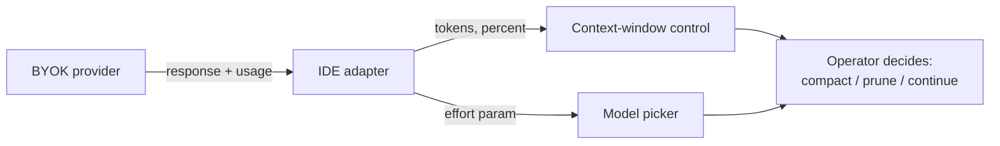

# BYOK Model Token Visibility

> BYOK model token visibility surfaces in-IDE token counts, context-window percent, and thinking effort for bring-your-own-key routes — the same telemetry IDE-owned routes already get.

## The gap

An IDE owns its first-party route end to end. BYOK breaks that contract: you do not know the provider until you configure it, the response shape varies, and the IDE sees only what the adapter forwards. Until VS Code 1.120, BYOK token counts showed zero because accounting ran only for built-in models. Version 1.120 feeds adapter responses into the existing indicator ([VS Code 1.120 release notes](https://code.visualstudio.com/updates/v1_120)).

This pattern gives first-class telemetry to routes the IDE does not own. A provider's billing dashboard lags by minutes and sits in another tab, so it cannot inform prompt-time choices about compacting, pruning skills, or falling back to a cheaper model.

## Telemetry slots a BYOK route must fill

Four slots, each tied to a distinct decision:

| Slot | Decision it drives | Source |
|------|-------------------|--------|
| Input + output tokens for the turn | Per-turn cost attribution; budget enforcement | Provider `usage` object on the response |
| Context-window percent full | Compact-now vs continue | Client-side count against the model's declared window |
| Applied thinking effort | Tune latency-vs-quality before sending | User selection in the model picker |
| Cache-hit signal (where available) | Detect cache busting from prompt drift | Provider response metadata |

VS Code surfaces the first two on the chat input and the third on the model picker for reasoning models ([VS Code 1.120 release notes](https://code.visualstudio.com/updates/v1_120)). The effort knob trades latency for quality before the request, not after the bill arrives. Claude Code's OTel exporter ships the same counts as `claude_code.token.usage` attributes (`type`, `query_source`, `model`, `effort`) — exported instead of displayed ([Claude Code monitoring reference](https://code.claude.com/docs/en/monitoring-usage)).

## When the displayed number diverges from billing

The IDE only shows what the adapter receives. Four drift conditions:

- No `usage` object returned. Self-hosted endpoints and proxies that strip non-essential fields report nothing. The indicator then falls back to zero or a client tokenizer estimate.
- Streaming without explicit usage opt-in. OpenAI-compatible streaming omits the usage chunk unless the adapter sets `stream_options: {"include_usage": true}`. Otherwise the per-turn count stays at zero for every stream ([OpenAI streaming reference](https://developers.openai.com/api/reference/resources/chat/subresources/completions/streaming-events)).
- Tokenizer drift. The percent uses the client's tokenizer, but the provider may bill on its own (BPE variants across Llama, GPT, Claude). The percent points the right way but is not the billing total.
- Effort knob with no effect. Non-reasoning models ignore the parameter. Showing the control teaches operators that the knob does nothing.

Name these conditions or the indicator's authority will exceed its accuracy.

## Scope is chat only

The visibility fix applies to the chat experience. VS Code is explicit that BYOK "only applies to the chat experience and doesn't affect inline suggestions or other AI-powered features in VS Code" ([VS Code language-models docs](https://code.visualstudio.com/docs/copilot/customization/language-models)). Inline completions, edits, and background agents still route through first-party infrastructure on most IDEs. The BYOK observability gap closes only for the surface where developers see context-window percent today.

## Route observability versus source observability

This pattern is the route-level sibling of [context-usage attribution](context-usage-attribution.md). Source attribution answers which configuration source is filling the window. Route observability answers whether the BYOK route reports at all, and at what cost. Both use the same `usage` counts on different axes. Expose both: operators pick route-level when a custom provider may misreport, and source-level when the percent is high and they need to know which input to prune.

## When this backfires

In-IDE BYOK telemetry is net-negative under three conditions:

- Provider billing is the only contract. When finance owns cost and reconciles provider dashboards monthly, the in-IDE indicator becomes a false-precision anchor: developers trust a number the provider does not bill on (tokenizer drift, missing usage chunk). The dashboard is authoritative. The indicator is at best a hint.
- High-variance routes mislead trend reading. Self-hosted endpoints with intermittent `usage` reporting (streaming without opt-in, custom proxies stripping fields) produce indicator values that swing between accurate and zero turn to turn. Operators reading a swinging indicator over-react to noise instead of tracking real spend.
- Effort knob on non-reasoning routes. Showing the thinking-effort dropdown for a route whose model ignores the parameter teaches the operator that the knob does nothing, which erodes trust in the same control for routes where it does work.

## Example

A developer routes VS Code chat through a local vLLM server running a 70B model. Pre-1.120, every turn shows `0 tokens used` and the context-window bar stays empty — the model truncates input at 32k and the developer only finds out from the gibberish output. After 1.120, the chat input shows `4,812 / 32,768 (15%)` after the first turn and the developer compacts manually at 78% instead of waiting for silent truncation. The thinking-effort dropdown on the picker drops a reasoning model from `high` to `medium` when latency matters more than quality on a routine refactor — the same lever the IDE exposes for first-party reasoning models, now on the BYOK route.

## Key Takeaways

- BYOK routes need the same in-IDE telemetry — tokens, percent, effort — as IDE-owned routes; without it, the operator decides blind at the point of action.
- Four telemetry slots map to four distinct decisions: per-turn cost, compact-now, latency-vs-quality, cache-hit detection.
- The displayed number diverges from billing when the provider omits `usage`, when streaming runs without explicit opt-in, when client and provider tokenizers differ, or when the effort knob hits a non-reasoning model. Name the conditions; do not pretend the indicator is the bill.
- The fix scopes to the chat surface — inline completions and background agents still route through first-party infrastructure on most IDEs.
- Route observability and [source attribution](context-usage-attribution.md) consume the same counts on different axes; expose both so operators can pick the right slice for the symptom.

## Related

- [Context-Usage Attribution: Per-Source Breakdown of Agent Context](context-usage-attribution.md) — the source-level sibling cut of the same usage telemetry
- [Per-Plugin Token-Cost Attribution](plugin-token-cost-attribution.md) — per-component split of the same usage counts on a different axis
- [Cost-Aware Tracing via Skill Distillation](cost-aware-tracing-skill-distillation.md) — downstream consumer turning per-step USD cost into actionable feedback
- [Gateway Model Routing](../patterns/agent-design/gateway-model-routing.md) — the BYOK routing surface this page makes observable
- [Copilot CLI BYOK and Local Model Support](../tools/copilot/copilot-cli-byok-local-models.md) — comparable BYOK pattern in a different harness
- [Copilot vs Claude Billing Semantics](../human/copilot-vs-claude-billing-semantics.md) — the billing-side counterpart to in-IDE token visibility
- [Centralized LLM Gateway for Per-Dimension Agent Budgets](llm-gateway-per-dimension-budgets.md) — the fleet-wide enforcement layer that caps the per-route spend this page surfaces
- [Agent Observability: OTel, Cost Tracking, Trajectory Logs](agent-observability-otel.md) — the export path for the same telemetry when the IDE indicator is not enough
