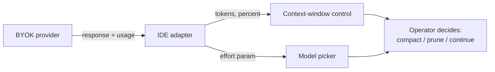

# BYOK Model Token Visibility

> Bring-Your-Own-Key routes deserve the same in-IDE telemetry — input/output tokens, context-window percent, applied thinking effort — as IDE-owned routes. Without it, the operator either context-blinds or compacts too early.

## The Gap

A coding IDE owns its first-party route end-to-end: model, tokenizer, request and response shape, billing tokens. A BYOK route inverts that contract — the provider is unknown until configured, the response shape varies, and the IDE only sees what the adapter forwards. Until VS Code 1.120, BYOK token counts in the chat view displayed as zero because accounting only ran for built-in offerings; 1.120 plumbs the adapter's response into the existing indicator so that "the context window control in the Chat view now shows accurate token usage and percent-full for BYOK models" ([VS Code 1.120 release notes](https://code.visualstudio.com/updates/v1_120)).

The pattern is **first-class telemetry for routes the IDE does not own**. The mechanism is locality of feedback: a provider's billing dashboard lags by minutes and lives in another tab, so it cannot drive prompt-time decisions about whether to compact, prune skills, or fall back to a cheaper model.

## Telemetry Slots a BYOK Route Must Fill

Four slots, each tied to a distinct decision:

| Slot | Decision it drives | Source |
|------|-------------------|--------|
| Input + output tokens for the turn | Per-turn cost attribution; budget enforcement | Provider `usage` object on the response |
| Context-window percent full | Compact-now vs continue | Client-side count against the model's declared window |
| Applied thinking effort | Tune latency-vs-quality before sending | User selection in the model picker |
| Cache-hit signal (where available) | Detect cache busting from prompt drift | Provider response metadata |

VS Code surfaces the first two on the chat input and the third "directly from the model picker in the Chat view" for reasoning models ([VS Code 1.120 release notes](https://code.visualstudio.com/updates/v1_120)). The effort knob lets the user balance latency and cost against answer quality before the request, not after the bill arrives. Claude Code's OTel exporter ships the equivalent attributes (`type`, `query_source`, `model`, `effort`) on the `claude_code.token.usage` metric — the same counts, exported instead of displayed ([Claude Code monitoring reference](https://code.claude.com/docs/en/monitoring-usage)).

## When the Displayed Number Diverges From Billing

The IDE only shows what the adapter receives. Four conditions cause drift:

- **No `usage` object returned.** Some self-hosted endpoints and custom proxies that strip non-essential fields report nothing; the indicator falls back to zero or to a client-side tokenizer estimate.
- **Streaming without explicit usage opt-in.** OpenAI-compatible streaming responses omit the usage chunk by default; the adapter must set `stream_options: {"include_usage": true}` to receive a final chunk containing token totals, otherwise the per-turn count stays at zero for every stream ([OpenAI streaming reference](https://developers.openai.com/api/reference/resources/chat/subresources/completions/streaming-events)).
- **Tokenizer drift between client and provider.** Context-window percent is computed against the client's tokenizer; the provider may bill on its own (BPE variants between Llama, GPT, Claude families differ). The percent is directionally right but does not equal the billing total.
- **Effort knob with no effect.** Non-reasoning models silently ignore the parameter. Surfacing the control for every BYOK model lets the operator tune a knob that does nothing.

The page that names BYOK observability has to name these conditions too — otherwise the indicator's authority exceeds its accuracy.

## Scope: Chat Only

The visibility fix applies to the chat experience. VS Code is explicit that BYOK "only applies to the chat experience and doesn't affect inline suggestions or other AI-powered features in VS Code" ([VS Code language-models docs](https://code.visualstudio.com/docs/copilot/customization/language-models)). Inline completions, edits, and background agents still route through first-party infrastructure on most IDEs — the BYOK observability gap closes for the surface where developers see context-window percent today.

## Route Observability vs Source Observability

This pattern is the route-level sibling of [context-usage attribution](context-usage-attribution.md). Source attribution answers *which configuration source is filling the window*; route observability answers *is the BYOK route reporting at all, and at what cost*. Both consume the same `usage` counts on different axes. Expose both so operators pick route-level when their custom provider may silently misreport, and source-level when the percent is high and they need to know which input to prune.

## Example

A developer routes VS Code chat through a local vLLM server running a 70B model. Pre-1.120, every turn shows `0 tokens used` and the context-window bar stays empty — the model truncates input at 32k and the developer only finds out from the gibberish output. After 1.120, the chat input shows `4,812 / 32,768 (15%)` after the first turn and the developer compacts manually at 78% instead of waiting for silent truncation. The thinking-effort dropdown on the picker drops a reasoning model from `high` to `medium` when latency matters more than quality on a routine refactor — the same lever the IDE exposes for first-party reasoning models, now on the BYOK route.

## Key Takeaways

- BYOK routes need the same in-IDE telemetry — tokens, percent, effort — as IDE-owned routes; without it, the operator decides blind at the point of action.
- Four telemetry slots map to four distinct decisions: per-turn cost, compact-now, latency-vs-quality, cache-hit detection.
- The displayed number diverges from billing when the provider omits `usage`, when streaming runs without explicit opt-in, when client and provider tokenizers differ, or when the effort knob hits a non-reasoning model. Name the conditions; do not pretend the indicator is the bill.
- The fix scopes to the chat surface — inline completions and background agents still route through first-party infrastructure on most IDEs.
- Route observability and [source attribution](context-usage-attribution.md) consume the same counts on different axes; expose both so operators can pick the right slice for the symptom.

## Related

- [Context-Usage Attribution: Per-Source Breakdown of Agent Context](context-usage-attribution.md) — the source-level sibling cut of the same usage telemetry
- [Gateway Model Routing](../agent-design/gateway-model-routing.md) — the BYOK routing surface this page makes observable
- [Copilot CLI BYOK and Local Model Support](../tools/copilot/copilot-cli-byok-local-models.md) — comparable BYOK pattern in a different harness
- [Copilot vs Claude Billing Semantics](../human/copilot-vs-claude-billing-semantics.md) — the billing-side counterpart to in-IDE token visibility
- [Agent Observability: OTel, Cost Tracking, Trajectory Logs](agent-observability-otel.md) — the export path for the same telemetry when the IDE indicator is not enough
