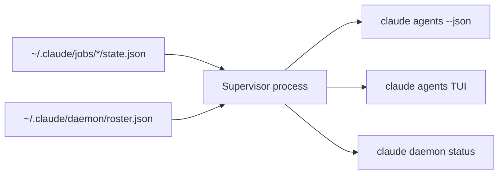

# Programmatic Agent Session Export via `claude agents --json`

> `claude agents --json` prints every live background Claude Code session as a JSON array, turning the agent view's TUI inventory into a scriptable substrate for status bars, dashboards, and fleet checks.

`claude agents --json` is the read-only inventory surface for background sessions — it answers "what is running, where, in what state" without scraping the TUI or reading state files.

## When the Inventory Primitive Earns Its Complexity

Use `claude agents --json` only when one of these holds — otherwise the agent view TUI already groups sessions by state, surfaces PR status, and filters by `a:<name>`, `s:<state>`, or `#<pr>` ([agent view docs](https://code.claude.com/docs/en/agent-view#monitor-sessions-with-agent-view)):

- Two or more background sessions per machine, where a status bar beats opening `claude agents`
- A scripted check that gates dispatches on whether a named session is still working
- A tmux-resurrect or shell-restart integration that reattaches to surviving sessions
- A local webhook that fires when a session transitions out of `working`

For one session on one project, the JSON does not pay back the integration cost.

## The JSON Schema

Added in v2.1.145 ([CHANGELOG](https://github.com/anthropics/claude-code/blob/main/CHANGELOG.md)): "Print[s] live sessions as a JSON array and exit. Each entry has `pid`, `cwd`, `kind`, and `startedAt`, plus `sessionId`, `name`, and `status` when set. Combine with `--cwd <path>` to filter" ([agent view docs](https://code.claude.com/docs/en/agent-view#manage-sessions-from-the-shell)).

| Field | Always present | Operator question it answers |
|-------|---------------|------------------------------|
| `pid` | yes | Is the process alive? |
| `cwd` | yes | Which project owns it? Survives moves into `.claude/worktrees/`. |
| `kind` | yes | How was it launched — `claude --bg`, agent view, `/bg`? |
| `startedAt` | yes | How long has it been running? |
| `sessionId` | when set | Handle for `claude attach`, `logs`, `stop`, `respawn`, `rm`. |
| `name` | when set | Display name from `claude --bg --name` or `Ctrl+R`. |
| `status` | when set | Lifecycle state — drives "needs input"/"completed"/"failed" rollups. |

The "when set" fields are absent rather than `null` during parts of the lifecycle. Treat missing keys as missing data.

## Filtering by Project

`--cwd <path>` (v2.1.141) scopes output to sessions started under that directory. The filter is project-aware: a session that "has moved into a worktree under `~/projects/my-app/.claude/worktrees/` still counts as belonging to `~/projects/my-app`" ([agent view docs](https://code.claude.com/docs/en/agent-view#monitor-sessions-with-agent-view)).

## Where the Data Comes From

The supervisor process holds the source of truth. Session state lives at `~/.claude/jobs/<id>/state.json`; the live-session roster at `~/.claude/daemon/roster.json` ([agent view docs](https://code.claude.com/docs/en/agent-view#where-state-is-stored)). `claude agents --json` is a thin reader over the same IPC `claude daemon status` and `/doctor` use. Treat the CLI as the supported surface; read the files at your own risk.



## Pair the Inventory With OTEL for Sub-Session Attribution

`claude agents --json` lists top-level background sessions only. "Subagents and teammates a session spawns aren't listed as separate rows" ([agent view docs](https://code.claude.com/docs/en/agent-view#monitor-sessions-with-agent-view)). Per-subagent attribution lives one layer down in OTEL spans.

The same v2.1.145 release added `agent_id` and `parent_agent_id` to `claude_code.tool` OTEL spans, "and fixed trace parenting so background subagent spans nest under the dispatching Agent tool span" ([CHANGELOG](https://github.com/anthropics/claude-code/blob/main/CHANGELOG.md)). JSON answers "what is running"; spans answer "what did each sub-step do". See [Subagent OTel Trace Correlation via `agent_id` Attribute](subagent-otel-trace-correlation.md).

## When This Backfires

- **`sessionId` as a metric label**: per-instance identifiers create unbounded time series in Prometheus-style stores. Apply the same discipline as `prompt.id` in [Agent Observability: OTel, Cost Tracking, and Trajectory Logging](agent-observability-otel.md) — aggregate by `cwd`, `kind`, or `agent.name`.
- **Page-on-`failed`**: shutdown marks every session failed ([agent view docs](https://code.claude.com/docs/en/agent-view#sessions-show-as-failed-after-shutdown)). A paging rule on `status: "failed"` fires after every reboot — correlate with `claude daemon status` first.
- **Multi-machine fleet assumptions**: `~/.claude/jobs/` is per-user, per-machine. Fleet aggregation across machines needs a separate transport.
- **Schema drift**: agent view is in research preview and "the interface and keyboard shortcuts may change as the feature evolves" ([agent view docs](https://code.claude.com/docs/en/agent-view)). Pin to documented fields and degrade gracefully on missing or new keys.

## Why It Works

**Enumeration** (what sessions exist, where, in what state) and **execution detail** (what each call cost, why it failed) are distinct data shapes with distinct query patterns. A status bar polling once a second pays one IPC read — the path `claude daemon status` already exercises. A trace store answering "p99 latency by subagent" pays the OTEL pipeline cost. Conflating them forces every consumer to pay the higher cost. Anthropic shipping `agent_id` on `claude_code.tool` spans **in the same release** as `--json` acknowledges that fleet observability needs both ([CHANGELOG, v2.1.145](https://github.com/anthropics/claude-code/blob/main/CHANGELOG.md)).

## Example

A tmux status bar that flags sessions awaiting input in the current repo:

```bash
needs_input=$(claude agents --json --cwd "$PWD" \
  | jq '[.[] | select(.status == "needs_input")] | length')

if [ "$needs_input" -gt 0 ]; then
  printf '#[fg=yellow]%d agent(s) awaiting input' "$needs_input"
fi
```

The script uses `--cwd "$PWD"` rather than parsing the JSON to filter, because the project-aware filter handles worktree-isolated sessions correctly. For a dashboard that survives reboot, skip the alert when `claude daemon status` reports the supervisor was restarted within the polling window — otherwise the post-reboot wave of `failed` sessions floods the indicator.

## Key Takeaways

- `claude agents --json` is the operator-facing inventory primitive; documented fields are `pid`, `cwd`, `kind`, `startedAt`, plus `sessionId`, `name`, and `status` when set
- The `--cwd` filter is project-aware — sessions in `.claude/worktrees/` still attribute to the originating project root
- The inventory surface and OTEL `agent_id` ship together for a reason: one answers "what is running", the other answers "what did each sub-step do"
- `sessionId` as a metric label creates unbounded cardinality; `status: "failed"` is the signal a machine shut down
- The primitive is local to one user on one machine — fleet-of-machines aggregation needs a separate transport
- Agent view is in research preview; pin to documented fields and degrade gracefully on schema changes

## Related

- [Subagent OTel Trace Correlation via `agent_id` Attribute](subagent-otel-trace-correlation.md)
- [Agent Observability: OTel, Cost Tracking, and Trajectory Logging](agent-observability-otel.md)
- [In-Session Transcript Search](transcript-search.md)
- [Plugin Background Monitors](../tools/claude/plugin-background-monitors.md)
- [Monitor Tool: Event Streaming from Background Scripts](../tools/claude/monitor-tool.md)
