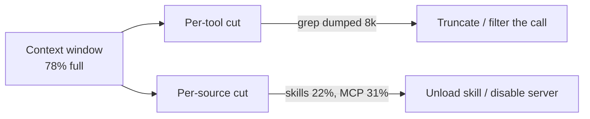

# Context-Usage Attribution: Per-Source Breakdown of Agent Context

> Break the context window into rules, skills, MCP returns, subagent transcripts, and conversation history — so operators prune the source actually responsible instead of removing the wrong one.

## Two Cuts of the Same Telemetry

A single *"78% of the context window"* indicator names the symptom, not the cause. Two attribution cuts close the gap:

- **Per-tool attribution** — which tool calls dumped the most tokens. Claude Code's [`/context` command](../context-engineering/context-window-diagnostic-tooling.md) is the developer-facing example ([Claude Code changelog](https://code.claude.com/docs/en/changelog)).
- **Per-source attribution** — which configuration source (rules, skills, MCP servers, subagents, conversation) is consuming the budget, regardless of which call put it there.

Cursor shipped per-source attribution on 2026-05-06: *"You can now see a breakdown of your agent's context usage"* ([Cursor changelog](https://cursor.com/changelog)). The categories — rules, skills, MCPs, subagents — match the units an operator can act on: unload a skill, disable an MCP server, prune a rule file, kill a subagent.

## Categories the Breakdown Should Expose

Each category maps to a distinct remediation surface. A breakdown that collapses two of them — *"static prompt: 36%"* — leaves the operator unable to choose between unloading a skill and pruning a rule.

| Category | Why it's separate | Remediation |
|----------|-------------------|-------------|
| Rules / instruction files | Loaded at session start, persistent | Prune CLAUDE.md / AGENTS.md against [audit-instruction-rule-budget](../agent-readiness/audit-instruction-rule-budget.md) |
| Skill definitions | Descriptions always-on; full body loads on use | Mark low-value skills `name-only` or `off` via [skill overrides](https://code.claude.com/docs/en/skills#override-skill-visibility-from-settings) |
| MCP tool returns | Grow with each call; cumulative | Drop server, narrow tool selection, [audit tool-output token cost](../agent-readiness/audit-tool-output-token-cost.md) |
| Subagent transcripts | Forwarded back to parent on completion | Tighten subagent output schema, summarise instead of forward |
| Tool outputs (non-MCP) | File reads, grep, build logs | Truncate at the call site; apply [observation masking](../context-engineering/observation-masking.md) |
| Conversation history | Compounds with turns | Compact, or split into a fresh session |
| Cache prefix | Read-only; cheap but counts against window | Stable across turns — flag only when prefix bloats |

## OTel Path: The Same Cut, Exported

Claude Code's OTel exporter ships the attributes that make per-source attribution computable from telemetry rather than UI inspection. The `claude_code.token.usage` metric carries ([Claude Code monitoring reference](https://code.claude.com/docs/en/monitoring-usage)):

- `type` — `"input"`, `"output"`, `"cacheRead"`, `"cacheCreation"`
- `query_source` — `"main"`, `"subagent"`, `"auxiliary"`, or compaction/auxiliary thread names
- `model`, `effort`, request-id correlation

Grouping by `query_source` produces the subagent-vs-main split; grouping by `type` separates active-input from cached-prefix tokens. The UI breakdown and the OTel export are two consumers of the same counts — Cursor's panel is the always-on surface, an OTel collector is the post-hoc audit path. See [agent observability via OTel](agent-observability-otel.md) for export wiring.

## Action Signals

A breakdown without thresholds is just a chart. Useful signals:

- **MCP returns > 30% with rising trend** — at least one server's outputs are unbounded. Drill into [audit tool-output token cost](../agent-readiness/audit-tool-output-token-cost.md) to find the offender.
- **Skills > 20% on a session that didn't invoke them** — descriptions are too verbose; trim or move low-priority skills to `name-only`.
- **Subagent transcripts > 15%** — handoff schemas are missing; agents are forwarding raw transcripts. See [handoff protocols](../agent-readiness/audit-handoff-protocols.md).
- **Cache prefix > 50% with active < 30%** — the harness is paying full attention cost on cached tokens. Confirm cache hit rate via OTel `cacheRead` tokens.

## When the Cut Is Wrong

Per-source attribution is the right axis when configuration sources are non-trivial. It misleads when:

- **Tool calls dominate the session.** A long agentic run accumulates large file reads and grep output that all bucket as "tools" or "MCP" — the per-source breakdown shows one giant slice and points at no specific call. Switch to per-tool attribution ([`/context`](../context-engineering/context-window-diagnostic-tooling.md)) for these sessions.
- **Single-shot deterministic prompts.** No compounding, no point in attribution.
- **Tightly-pruned harnesses.** When rules, skills, and MCPs are already minimal and scoped per-task, the breakdown reports rounding noise.
- **The harness can't act on the cut.** Without per-skill or per-MCP unload commands, knowing skills consume 22% offers no remediation path beyond restarting the session.

The two cuts are complementary — a harness that exposes both lets operators choose the axis matching the suspected cause. [The Infinite Context anti-pattern](../anti-patterns/infinite-context.md) is the failure both cuts work against; per-source attribution is the cheaper, always-on signal that points operators toward the slow-growing static sources before the session needs an emergency compaction.

## Example

A session is at 82% full after twelve turns. Without attribution, the operator's options are: compact, restart, or guess.

The per-source breakdown shows: rules 8%, skills 28%, MCP returns 34%, subagent transcripts 6%, conversation 6%. The skills slice is the surprise — the session never explicitly invoked a skill. Listing loaded skills shows fourteen descriptions in the always-on context, each averaging 1,200 characters. The operator marks ten of them `"name-only"` in `skillOverrides` ([Claude Code skills reference](https://code.claude.com/docs/en/skills#override-skill-visibility-from-settings)). The next session at the same point loads at 64%.

The breakdown made the difference between *"prune skills"* (right answer) and *"compact the conversation"* (the default reflex when only a single percentage is visible).

## Key Takeaways

- A single "X% full" indicator names the symptom, not the cause. Attribution cuts the same number into a remediation surface.
- Per-source and per-tool attribution are complementary — different cuts of the same telemetry, each pointing at a different class of remediation.
- The categories must match the remediation primitives: rules, skills, MCPs, subagents, tool outputs, conversation, cache prefix. Collapsing two of them defeats the cut.
- Claude Code's OTel exporter already carries the attributes (`type`, `query_source`) needed to compute the breakdown from telemetry; the UI surface is one consumer, an OTel collector is another.
- When configuration sources are minimal and tool calls dominate, per-tool attribution is the more actionable cut — pick the axis matching the suspected cause.

## Related

- [Context-Window Diagnostic Tooling: Identifying Context-Heavy Tools](../context-engineering/context-window-diagnostic-tooling.md) — per-tool attribution, the complementary cut
- [Context Budget Allocation: Every Token Has a Cost](../context-engineering/context-budget-allocation.md) — the budget the breakdown serves
- [The Infinite Context anti-pattern](../anti-patterns/infinite-context.md) — the failure mode attribution prevents
- [Agent Observability: OTel, Cost Tracking, Trajectory Logs](agent-observability-otel.md) — the export path for attribution telemetry
- [Agent Debug Log Panel](agent-debug-log-panel.md) — the adjacent always-on surface for events rather than tokens
- [Audit Tool Output Token Cost](../agent-readiness/audit-tool-output-token-cost.md) — drill-down when the breakdown points at MCP or tool outputs
- [Audit Instruction Rule Budget](../agent-readiness/audit-instruction-rule-budget.md) — drill-down when the breakdown points at rules
- [Per-Plugin Token-Cost Attribution via `claude plugin details`](plugin-token-cost-attribution.md) — the same attribution axis at plugin granularity
