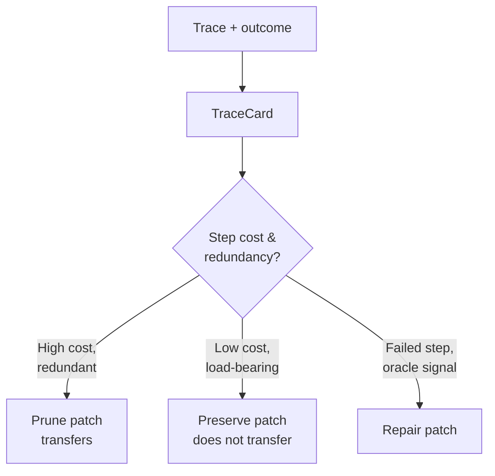

# Cost-Aware Tracing for Skill Distillation

> Skill distillation needs two orthogonal signals: outcome tells you whether a step contributed; cost tells you how much it cost. Without both, prune decisions have no economic meaning and preserve decisions over-fit to one trace.

## The Disambiguation Problem

A distillation pipeline reads agent traces and emits reusable rules. Without per-step cost, it cannot tell *adding a missing step that fixes a bug* apart from *removing an expensive step that never affected the outcome* — both look like edits to the trace ([ClawTrace, 2026](https://arxiv.org/abs/2604.23853)).

Cost makes the prune decision economically meaningful. Outcome makes the same decision causally meaningful. The product — cost-weighted outcome contribution — is what a useful patch optimises against.

## The TraceCard Format

ClawTrace records every LLM call, tool use, and sub-agent spawn during a session, then compiles the trace into a TraceCard: a compact YAML summary with per-step USD cost, token counts, and a redundancy flag computed from a counterfactual replay of the trace minus the candidate step ([ClawTrace, 2026](https://arxiv.org/abs/2604.23853)).

The redundancy flag is what distinguishes a TraceCard from raw OTel spans. Claude Code's `claude_code.cost.usage` metric tags spend by `model` and `user.account_uuid` but does not link cost to outcome contribution ([Anthropic monitoring docs](https://code.claude.com/docs/en/monitoring-usage#metrics)). The TraceCard step adds that link.

## Three Patch Types

CostCraft consumes TraceCards and emits three patch types ([ClawTrace, 2026](https://arxiv.org/abs/2604.23853)):

| Patch | Source signal | Argument required |
|-------|---------------|-------------------|
| Preserve | Successful outcome on a step sequence | Identify the behaviour that drove the success |
| Prune | High cost + redundancy flag | Counterfactual: removing this named step does not change the outcome |
| Repair | Failed outcome with oracle evidence | Specific fix grounded in the verifier's signal |

Prune patches must name a high-cost step and supply the counterfactual. Aesthetic minimisation ("this step looked unnecessary") is not a valid argument — the redundancy flag has to come from a replay.

## The Transfer Asymmetry

The empirical finding in the paper is that prune patches and preserve patches do not behave alike across tasks. On 30 held-out SpreadsheetBench tasks, prune rules cut median cost by 32% across benchmarks; preserve rules caused regressions on new task types ([ClawTrace, 2026](https://arxiv.org/abs/2604.23853)).



The asymmetry has a mechanism: removing a step is a local edit defended by an explicit counterfactual on the same trace; preserving a step encodes a positive claim about *why* the trace succeeded, and that claim over-fits to the originating task.

## When This Backfires

Cost-aware distillation pays off only under specific conditions. Skip it when any of the following holds.

- **Short sessions** — when a session has only a handful of steps, prune analysis has little to work with and counterfactual arguments collapse to "remove the cheapest step that didn't write a file."
- **Latency-bound workloads** — USD cost is dominated by token spend, but if a session's bottleneck is a slow tool (browser, search, network calls), pruning expensive LLM calls saves money without reducing wall-clock time. Wrong optimisation target.
- **Stochastic sub-agents** — when sub-agents follow non-deterministic plans, a prune rule transferred to a new task can remove a step that was load-bearing under different inputs. Counterfactual arguments built on one trace do not necessarily hold under another.
- **No oracle verifier** — prune decisions must be tested against a held-out eval. Without a SpreadsheetBench-style oracle, prune rules degrade to confident-sounding regressions ([From Multi-Agent to Single-Agent, 2026](https://arxiv.org/abs/2604.01608) finds the same gap in single-agent skill distillation).

For teams already on OTel, a cheaper first move is to add redundancy detection at the trace-query layer — flag tool calls whose output was not read in any subsequent step — before introducing a TraceCard intermediate.

## Why Cost Is the Right Signal

Counterfactual-based distillation works without per-step cost ([Few-Shot Knowledge Distillation with Counterfactual Explanations, 2025](https://arxiv.org/abs/2510.21631)), and inference-time routing achieves cost savings without rewriting skills at all ([Inference-Time Distillation, 2025](https://arxiv.org/abs/2512.02543)). Per-step cost is one signal among several, not the only path to cheaper agents.

Its specific contribution is *prune transferability*: cost identifies which redundant steps are worth removing across tasks rather than just within one. Where the goal is a portable skill library that gets cheaper as it grows, this signal is what closes the gap between recording traces and learning from them — adjacent to but distinct from [memory synthesis from execution logs](../agent-design/memory-synthesis-execution-logs.md), which extracts lessons without cost grounding.

## Example

A TraceCard fragment from a session that succeeded but cost more than necessary:

```yaml
session_id: 7f3e
outcome: success
total_cost_usd: 0.42
steps:
  - id: 1
    kind: tool_use
    tool: read_file
    cost_usd: 0.001
    redundant: false
  - id: 2
    kind: llm_call
    model: opus
    cost_usd: 0.18
    redundant: true        # output never read by a downstream step
  - id: 3
    kind: tool_use
    tool: grep
    cost_usd: 0.002
    redundant: false
  - id: 4
    kind: llm_call
    model: sonnet
    cost_usd: 0.04
    redundant: false
```

The resulting prune patch:

```yaml
patch_kind: prune
target_step: 2
counterfactual: |
  Replay of trace 7f3e minus step 2 produces the same final outcome
  on the held-out oracle. Step 2 used opus to summarise a file that
  step 4 (sonnet) re-reads from disk. The summary was never consumed.
expected_savings_usd: 0.18
```

The patch is defensible because it names the high-cost step, supplies a counterfactual replay, and grounds the savings in the trace's own data.

## Key Takeaways

- Per-step cost is the disambiguation signal that makes prune decisions economically meaningful and outcome-grounded.
- TraceCard's redundancy flag — computed from a counterfactual replay — is what separates it from raw OTel spans.
- Prune patches transfer across tasks; preserve patches do not. Bias the distillation pipeline toward prune.
- Skip cost-aware distillation when sessions are short, workloads are latency-bound, sub-agents are stochastic, or no oracle verifier is available.
- For teams on OTel, redundancy detection at the trace-query layer is a cheaper first step than building a TraceCard intermediate.

## Related

- [Agent Observability: OTel, Cost Tracking, and Trajectory Logging](agent-observability-otel.md) — the cost-tracking foundation that TraceCard extends.
- [Memory Synthesis from Execution Logs](../agent-design/memory-synthesis-execution-logs.md) — synthesis without cost grounding; cost-aware distillation is the economic extension.
- [Cost-Aware Agent Design](../agent-design/cost-aware-agent-design.md) — routing decisions made before the trace; distillation refines them after.
- [Trajectory Logging via Progress Files](trajectory-logging-progress-files.md) — human-readable trail; TraceCard is the machine-readable counterpart with cost attribution.
- [Reasoning Budget Allocation](../agent-design/reasoning-budget-allocation.md) — budget set ex ante; prune patches enforce it ex post.
- [Agentic Flywheel](../agent-design/agentic-flywheel.md) — self-improving systems; cost-aware distillation is one mechanism for the flywheel's improvement step.
