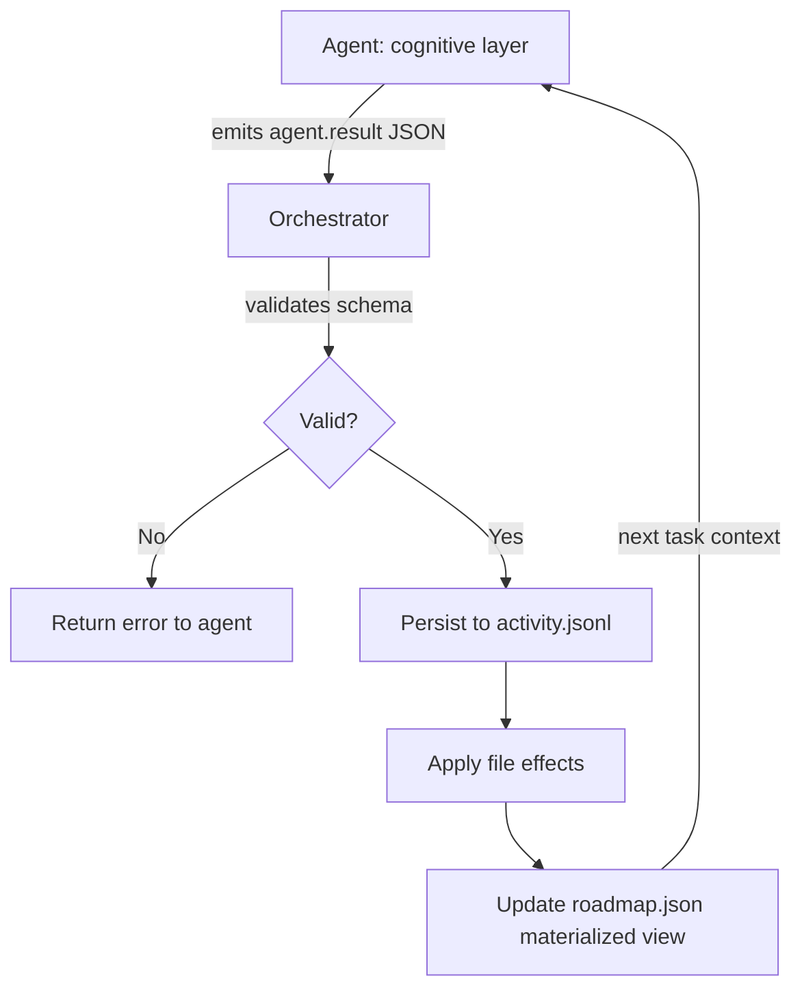

# Event Sourcing for Agents: Separating Cognitive Intention from State Mutation

> Agents emit structured intentions in validated JSON; a deterministic orchestrator validates, persists events in an append-only log, and applies file effects — producing immutable task history and replay-verifiable execution.

ESAA (Event Sourcing for Autonomous Agents) separates the cognitive layer — the LLM deciding what to do — from the execution layer that mutates state. Agents emit validated JSON events; a deterministic orchestrator persists them to an append-only log and applies effects. This enables replay verification, concurrent multi-agent coordination without write conflicts, and structured context injection that counters context degradation in long-horizon tasks.

## The Problem

Long-horizon agents accumulate two failure modes as tasks grow:

1. **Context degradation** — conversation history grows until earlier decisions are pushed out of the effective attention window, causing agents to repeat work or contradict earlier choices
2. **Non-deterministic state mutation** — agents apply file changes directly, making it impossible to audit what happened, replay execution, or verify that the recorded intention matches the actual effect

Both failure modes worsen as task length increases.

## The ESAA Pattern

[arXiv:2602.23193](https://arxiv.org/abs/2602.23193) presents the Event Sourcing for Autonomous Agents (ESAA) pattern, validated in two case studies including a 50-task clinical dashboard built by 4 concurrent heterogeneous LLMs.

The pattern applies event sourcing to agent execution:



**Agents emit intentions, not mutations.** An agent produces a structured event (`agent.result` or `issue.report`) describing what it intends to happen. The agent never directly writes files or modifies project state.

**A deterministic orchestrator executes effects.** The orchestrator validates the JSON schema, appends the event to `activity.jsonl` (append-only, never modified), then applies the described file effects. The orchestrator validates before persisting — malformed or out-of-contract events never reach the log.

**Boundary contracts define the interface.** `AGENT_CONTRACT.yaml` specifies the exact schema each agent must emit, the tools it may call, and the tasks it may handle. This typed boundary between cognitive and execution layers is enforced at runtime, not just by convention.

**A materialized view replaces conversation history.** `roadmap.json` is continuously updated from the event log to reflect current task status, completed work, and open issues. Agents receive this compact, structured view as context instead of growing conversation history — directly addressing context degradation.

## Replay Verification

The `esaa verify` command replays the `activity.jsonl` log and re-derives project state from scratch. If the derived state matches the actual filesystem, the execution record is verified. This provides:

- **Forensic traceability** — every state change is explained by a logged event with a timestamp and agent identity
- **Immutability guarantees** — append-only log with no in-place updates means historical execution cannot be silently revised
- **Reproducibility** — given the same event sequence, the same final state must emerge

The event log is the source of truth; current state is a derived projection.

## Concurrent Heterogeneous Agents

In the clinical dashboard case study, 4 concurrent heterogeneous LLMs worked on different tasks from the same roadmap. The orchestrator serializes event persistence and state mutation, preventing write conflicts without requiring agents to implement coordination logic. Agents are cognitively independent — they emit intentions and receive updated roadmap views.

## When to Apply

Apply when:

- Tasks span more than a single agent session (multi-day or multi-session work)
- Multiple concurrent agents work on a shared codebase or project
- Audit trails are required (compliance, regulated domains)
- You need replay verification to confirm execution correctness

Skip when:

- Tasks complete in a single session with a single agent
- Context degradation is not yet a demonstrated failure mode for your task length

## Example

The following shows the boundary contract and the event an agent emits, demonstrating how cognitive intention is separated from filesystem mutation.

`AGENT_CONTRACT.yaml` defines what a writer agent may emit and which tools it may call:

```yaml
agent: writer
tasks:
  - write_section
  - revise_section
tools_allowed:
  - read_file
  - emit_result
emit_schema:
  type: agent.result
  required: [task_id, file_path, content, action]
  properties:
    action:
      enum: [create, update]
```

When the writer agent completes a task, it emits a structured JSON intention — it does not write the file directly:

```json
{
  "type": "agent.result",
  "task_id": "T-014",
  "agent": "writer",
  "timestamp": "2025-11-03T14:22:10Z",
  "file_path": "docs/api/authentication.md",
  "action": "update",
  "content": "## Authentication\n\nAll requests require a Bearer token..."
}
```

The orchestrator validates this event against `AGENT_CONTRACT.yaml`, appends it to `activity.jsonl`, then applies the file write. To verify execution integrity at any point:

```bash
esaa verify --log activity.jsonl --root .
# ✓ 47 events replayed
# ✓ Derived state matches filesystem
```

If the derived state diverges from the filesystem, `esaa verify` reports which events produced unexpected effects — providing forensic traceability without requiring agents to implement any audit logic themselves.

## Key Takeaways

- Agents emit structured JSON intentions; a deterministic orchestrator applies effects — cognitive and execution layers are decoupled
- Append-only `activity.jsonl` provides immutable task history; `esaa verify` replay-verifies execution against the filesystem
- `roadmap.json` materialized view replaces growing conversation history, directly addressing context degradation in long-horizon tasks
- Boundary contracts (`AGENT_CONTRACT.yaml`) enforce the typed interface between agent and orchestrator at runtime
- Concurrent heterogeneous agents coordinate through the orchestrator, not with each other

## Related

- [Idempotent Agent Operations: Safe to Retry](../agent-design/idempotent-agent-operations.md)
- [File-Based Agent Coordination](../multi-agent/file-based-agent-coordination.md)
- [Rollback-First Design](../agent-design/rollback-first-design.md)
- [Verification Ledger](../verification/verification-ledger.md)
- [Orchestrator-Worker Pattern](../multi-agent/orchestrator-worker.md)
- [Trajectory Logging via Progress Files and Git History](trajectory-logging-progress-files.md)
- [Agent Observability in Practice: OTel, Cost Tracking, and Trajectory Logging](agent-observability-otel.md)
- [OpenTelemetry for AI Agent Observability and Tracing](../standards/opentelemetry-agent-observability.md)
- [Circuit Breakers for Agent Loops](circuit-breakers.md)
- [Making Application Observability Legible to Agents](observability-legible-to-agents.md)
- [Cognitive Reasoning vs Execution: A Two-Layer Agent Architecture](../agent-design/cognitive-reasoning-execution-separation.md)
- [Agent Debugging: Diagnosing and Fixing Bad Agent Output](agent-debugging.md)
