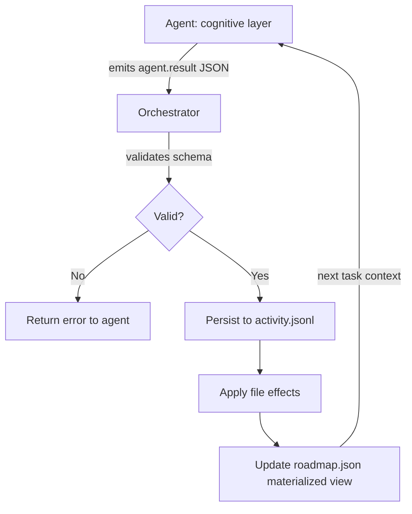

# Event Sourcing for Agents: Separating Cognitive Intention from State Mutation

> Agents emit structured JSON intentions; a deterministic orchestrator validates, persists them to an append-only log, and applies effects — producing immutable, replay-verifiable task history.

ESAA (Event Sourcing for Autonomous Agents) separates the cognitive layer — the LLM deciding what to do — from the execution layer that mutates state. Agents emit validated JSON events; a deterministic orchestrator persists them to an append-only log and applies effects. This enables replay verification, concurrent multi-agent coordination without write conflicts, and structured context injection that counters context degradation.

## The problem

Long-horizon agents accumulate two failure modes as tasks grow:

1. Context degradation — conversation history grows until earlier decisions fall out of the attention window, so agents repeat work or contradict earlier choices
2. Non-deterministic state mutation — agents write files directly, so you cannot audit, replay, or verify that the recorded intention matches the actual effect

Both worsen as task length increases.

## The ESAA pattern

[arXiv:2602.23193](https://arxiv.org/abs/2602.23193) presents the Event Sourcing for Autonomous Agents (ESAA) pattern — applying [Fowler's event sourcing model](https://martinfowler.com/eaaDev/EventSourcing.html) to LLM agents — validated in two case studies including a 50-task clinical dashboard built by 4 concurrent heterogeneous LLMs. The author has published a runnable MIT-licensed reference implementation, [`esaa-core`](https://github.com/elzobrito/esaa-core) (Python) — the file layout, CLI, and state machine below are drawn from it.

The pattern applies event sourcing to agent execution:


```mermaid
graph TD
    A[Agent: cognitive layer] -->|emits agent.result JSON| B[Orchestrator]
    B -->|validates schema| C{Valid?}
    C -->|No| D[Return error to agent]
    C -->|Yes| E[Persist to activity.jsonl]
    E --> F[Apply file effects]
    F --> G[Update roadmap.json materialized view]
    G -->|next task context| A
```

Agents emit intentions, not mutations. An agent produces a structured event (`agent.result` or `issue.report`) describing what it intends to happen. It never writes files or changes project state directly.

A deterministic orchestrator executes effects. The orchestrator validates the JSON schema, appends the event to `activity.jsonl` (append-only, never modified), then applies the file effects. Validation is fail-closed with structured error codes — malformed or out-of-contract events never reach the log. The orchestrator stores each effect as a content-addressed artifact under `.roadmap/artifacts/file-effects/<sha>.json`, backing the "validates before persisting" guarantee with deterministic, replayable transactions.

Boundary contracts define the interface. Governance lives under `.roadmap/`: `AGENT_CONTRACT.yaml` specifies the schema each agent must emit, the tools it may call, and the tasks it may handle; `ORCHESTRATOR_CONTRACT.yaml` encodes workflow gates and single-writer rules; `RUNTIME_POLICY.yaml` sets attempts, cooldown, TTL, and escalation. The runtime enforces these typed boundaries, not convention.

Tasks move through an explicit state machine. A task flows `todo → in_progress → review → done` (`claim` advances it to `in_progress`, `complete` to `review`, approval to `done`); a reviewer's `request_changes` returns it from `review` to `in_progress`. `done` is terminal — you fix defects through a new hotfix task, never by reopening or rewriting history.

A materialized view replaces conversation history. The event log continuously updates `roadmap.json` to reflect current task status, completed work, and open issues. Agents receive this compact view as context instead of growing conversation history — directly addressing context degradation.

## Replay verification

The `python -m esaa verify` command replays the `activity.jsonl` log and re-derives project state from scratch. (`verify` is one of the runtime's commands alongside `run`, `submit`, `claim`, `complete`, `review`, `state`, `eligible`, `metrics`, and `replay`.) If the derived state matches the actual filesystem, the execution record is verified. This provides:

- Forensic traceability — a logged event with a timestamp and agent identity explains every state change
- Immutability guarantees — an append-only log with no in-place updates means no one can silently revise historical execution
- Reproducibility — given the same event sequence, the same final state must emerge

The event log is the source of truth; current state is a derived projection.

## Concurrent heterogeneous agents

In the clinical dashboard case study, 4 concurrent heterogeneous LLMs worked different tasks from the same roadmap. The orchestrator serializes event persistence and state mutation, preventing write conflicts without agents implementing coordination logic — they stay cognitively independent, emitting intentions and receiving updated roadmap views.

## When to apply

Apply when:

- Tasks span more than a single agent session (multi-day or multi-session work)
- Multiple concurrent agents work on a shared codebase or project
- Audit trails are required (compliance, regulated domains)
- You need replay verification to confirm execution correctness

Skip when:

- Tasks complete in a single session with a single agent
- Context degradation is not yet a demonstrated failure mode for your task length

## When this backfires

Infrastructure overhead exceeds benefit for short tasks. ESAA requires an orchestrator process, schema validation, append-only log storage, and a materialized view. For single-session tasks this adds latency and complexity with no payoff — direct mutation is faster.

Schema rigidity slows early iteration. Early on, the event schema changes frequently; each change means updating `AGENT_CONTRACT.yaml`, regenerating validation, and migrating historical logs. Rapid prototyping may find this overhead exceeds the cost of context degradation.

Central orchestrator becomes a throughput bottleneck. Serialized event persistence limits aggregate throughput at high concurrency. Sharding state by domain mitigates this but adds coordination complexity.

## Example

The following shows the boundary contract and the event an agent emits, demonstrating how the pattern separates cognitive intention from filesystem mutation.

`AGENT_CONTRACT.yaml` defines what a writer agent may emit and which tools it may call:

```yaml
agent: writer
tasks:
  - write_section
  - revise_section
tools_allowed:
  - read_file
  - emit_result
emit_schema:
  type: agent.result
  required: [task_id, file_path, content, action]
  properties:
    action:
      enum: [create, update]
```

When the writer agent completes a task, it emits a structured JSON intention — it does not write the file directly:

```json
{
  "type": "agent.result",
  "task_id": "T-014",
  "agent": "writer",
  "timestamp": "2025-11-03T14:22:10Z",
  "file_path": "docs/api/authentication.md",
  "action": "update",
  "content": "## Authentication\n\nAll requests require a Bearer token..."
}
```

The orchestrator validates this event against `AGENT_CONTRACT.yaml`, appends it to `activity.jsonl`, then applies the file write. To verify execution integrity at any point:

```bash
python -m esaa verify --log activity.jsonl --root .
# ✓ 47 events replayed
# ✓ Derived state matches filesystem
```

If the derived state diverges from the filesystem, `verify` reports which events produced unexpected effects — forensic traceability without agents implementing any audit logic.

## Key Takeaways

- Agents emit structured JSON intentions; a deterministic orchestrator applies effects — cognitive and execution layers are decoupled
- Append-only `activity.jsonl` provides immutable task history; `python -m esaa verify` replay-verifies execution against the filesystem
- A runnable MIT reference implementation, [`esaa-core`](https://github.com/elzobrito/esaa-core), exists from the paper's author — the pattern is operational, not paper-only
- `roadmap.json` materialized view replaces growing conversation history, directly addressing context degradation in long-horizon tasks
- Boundary contracts (`AGENT_CONTRACT.yaml`, `ORCHESTRATOR_CONTRACT.yaml`, `RUNTIME_POLICY.yaml`) enforce the typed interface between agent and orchestrator at runtime
- Concurrent heterogeneous agents coordinate through the orchestrator, not with each other

## Related

- [Cognitive Reasoning vs Execution: A Two-Layer Agent Architecture](../patterns/agent-design/cognitive-reasoning-execution-separation.md)
- [Verification Ledger](../verification/verification-ledger.md)
- [Orchestrator-Worker Pattern](../patterns/multi-agent/orchestrator-worker.md)
- [File-Based Agent Coordination](../patterns/multi-agent/file-based-agent-coordination.md)
- [Idempotent Agent Operations: Safe to Retry](../patterns/agent-design/idempotent-agent-operations.md)
- [Rollback-First Design](../patterns/agent-design/rollback-first-design.md)
- [Trajectory Logging via Progress Files and Git History](trajectory-logging-progress-files.md)
- [Agent Observability in Practice: OTel, Cost Tracking, and Trajectory Logging](agent-observability-otel.md)
