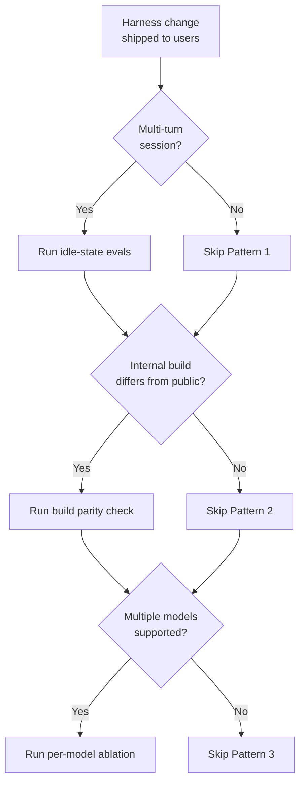

# Harness Bug Detection Patterns

> Three detection gaps — idle-state, build parity, per-model ablation — name the axes along which harness-layer bugs evade standard evals.

## The Case File

Anthropic's [April 23 2026 postmortem](https://www.anthropic.com/engineering/april-23-postmortem) documents three Claude Code harness bugs that each degraded output for days or weeks before detection. Each evaded the existing eval suite through a different structural gap:

| Bug | Duration | Eval gap it exposed |
|-----|----------|---------------------|
| Reasoning-effort default silently changed from `high` to `medium` | Mar 4 – Apr 7 (34 days) | Evals measured task intelligence vs. latency; did not measure user preference for either |
| Idle-session thinking-history cache clear fired every turn after idle instead of once | Mar 26 – Apr 10 (15 days) | Evals ran on fresh sessions; idle-then-resume path was untested |
| Verbosity-reduction system prompt capped inter-tool text at 25 words, final responses at 100 | Apr 16 – Apr 20 (4 days) | Narrow eval set showed no regression; per-model ablation later showed 3% drop for Opus 4.6 and 4.7 |

Source: [Anthropic postmortem](https://www.anthropic.com/engineering/april-23-postmortem). The bugs are specific; the detection gaps generalise.

## Pattern 1: Idle-State Evals

The thinking-history bug triggered only after a session was idle for one hour, then compounded across every subsequent turn. Unit tests, E2E tests, and dogfooding all ran on fresh sessions and did not reproduce it ([Anthropic postmortem](https://www.anthropic.com/engineering/april-23-postmortem)).

Standard evals sweep input space. Idle-state evals sweep *temporal* state space — where caches, TTL-bound headers, and partially-expired context interact with the next turn. Sessions that resume after a wait are a different input distribution than sessions that never paused.

Add eval cases that:

- Issue N turns, sleep past the longest TTL in the harness, resume, issue N more turns, and score the post-resume turns.
- Repeat on every TTL the harness declares (1 minute, 1 hour, 1 day) to cover boundary behaviour.

Structurally similar to [incident-to-eval synthesis](../verification/incident-to-eval-synthesis.md): a failure class no dev imagined becomes a concrete eval case.

## Pattern 2: Internal-vs-Public Build Parity

The thinking-history bug was active in the shipped public build but masked internally by "an internal-only server-side experiment related to message queuing" and by a CLI thinking-display suppression, so staff dogfooding did not reproduce it ([Anthropic postmortem](https://www.anthropic.com/engineering/april-23-postmortem)).

Dogfooding only catches regressions the dogfood build shares with the public build. When the internal build carries unshipped experiments, different feature flags, or different display layers, the public-only failure mode is invisible to the team running the same commands every day.

The postmortem's remedy is "increase staff usage of exact public builds". Practically:

- List every flag, experiment, and feature gate that differs between internal and public. Each difference is a potential masking path.
- Run a canary lane on the exact public artefact against the same eval suite and dogfood workflows.
- Track the diff as a first-class release artefact, not a deploy detail.

Complements [rainbow deployments for agents](../multi-agent/rainbow-deployments-agents.md): rainbow stages rollouts across versions; build parity ensures the version staff test *is* the one users run.

## Pattern 3: Per-Model Ablation

The verbosity-reduction prompt dropped quality 3% for both Opus 4.6 and Opus 4.7. The original evaluation set "showed no regressions"; the 3% drop only appeared when broader ablation ran per-model comparisons ([Anthropic postmortem](https://www.anthropic.com/engineering/april-23-postmortem)).

Aggregate evals average. A system prompt change that regresses one model and improves another — or regresses all models by a uniform small amount — disappears in the aggregate signal. Per-model ablation runs the same eval with the change on, then off, for each supported model and reports the delta separately.

Structure the ablation as:

- One pass with the change enabled, one without, for every model the harness serves.
- Report per-model deltas with a significance test. [McNemar's test adapted for LLMs](https://arxiv.org/html/2602.10144) distinguishes real regressions from noise down to ~0.3%.
- Gate on non-regression for every supported model, not on aggregate improvement.

The signal extends to the reviewer layer: the thinking-history bug was caught by a code-review eval run with Opus 4.7 and missed by the same eval with Opus 4.6 ([Anthropic postmortem](https://www.anthropic.com/engineering/april-23-postmortem)). Reviewer-model choice is itself a harness variable subject to ablation.

Inverse case covered in [perceived model degradation](../anti-patterns/perceived-model-degradation.md): users report degradation, evals show none, and the harness is ruled out without per-model testing.

## When These Patterns Apply



Apply when a change touches harness state (caches, TTLs, system prompts, reasoning defaults, tool-choice logic) and is visible to users. Skip for single-turn apps, throwaway sessions, or pre-production prototypes without real users.

## Example

**Before** — narrow eval run before shipping a verbosity-reduction system prompt:

```yaml
eval_suite: coding_quality_v3
models: [aggregate]
sessions: fresh
build: internal
result: no_regression
decision: ship
```

**After** — same change gated by the three patterns:

```yaml
eval_suite: coding_quality_v3
models: [opus-4-6, opus-4-7]          # Pattern 3: per-model ablation
sessions:
  - fresh
  - idle_1h_then_5_turns               # Pattern 1: idle-state
build: public_artifact                 # Pattern 2: build parity
result:
  opus-4-6: -3.0% (p<0.01)
  opus-4-7: -3.0% (p<0.01)
decision: revert
```

The first form is what shipped. The second is what [Anthropic reports](https://www.anthropic.com/engineering/april-23-postmortem) would have caught the regression before release.

## Key Takeaways

- Idle-state evals sweep temporal state; standard evals sweep input space. Both are required when harness caches or TTL-bound headers persist across turns.
- Internal-vs-public build parity is a first-class release artefact. Dogfooding on a divergent internal build cannot catch public-only regressions.
- Per-model ablation surfaces regressions that aggregate evals average out. Gate changes on per-model non-regression, not aggregate improvement.
- The reviewer model is a harness variable. Lower-capability reviewers can silently pass bugs that higher-capability reviewers catch.

## Related

- [Incident-to-Eval Synthesis](../verification/incident-to-eval-synthesis.md)
- [Perceived Model Degradation](../anti-patterns/perceived-model-degradation.md)
- [Rainbow Deployments for Agents](../multi-agent/rainbow-deployments-agents.md)
- [Harness Engineering](../agent-design/harness-engineering.md)
- [Eval Awareness](../verification/eval-awareness.md)
