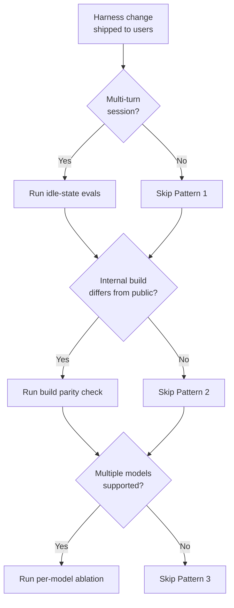

# Harness Bug Detection Patterns

> Three detection gaps — idle-state, build parity, per-model ablation — name the axes along which harness-layer bugs evade standard evals.

## The case file

Anthropic's [April 23 2026 postmortem](https://www.anthropic.com/engineering/april-23-postmortem) documents three Claude Code harness bugs that each degraded output for days or weeks before detection. Each evaded the existing eval suite through a different structural gap:

| Bug | Duration | Eval gap it exposed |
|-----|----------|---------------------|
| Reasoning-effort default silently changed from `high` to `medium` | Mar 4 – Apr 7 (34 days) | Evals measured intelligence vs. latency; not user preference |
| Idle-session thinking-history cache clear fired every turn after idle instead of once | Mar 26 – Apr 10 (15 days) | Evals ran on fresh sessions; idle-then-resume was untested |
| Verbosity-reduction system prompt capped inter-tool text at 25 words, final responses at 100 | Apr 16 – Apr 20 (4 days) | Narrow eval set passed; per-model ablation later showed 3% drop for Opus 4.6 and 4.7 |

The bugs are specific. The detection gaps generalize.

## Pattern 1: idle-state evals

The thinking-history bug only triggered after a session idled for one hour, then compounded every subsequent turn. Unit tests, E2E tests, and dogfooding all ran on fresh sessions and missed it ([Anthropic postmortem](https://www.anthropic.com/engineering/april-23-postmortem)).

Standard evals sweep input space. [Idle-state evals](../verification/incident-to-eval-synthesis.md) sweep temporal state — where caches, TTL-bound headers, and partially-expired context interact with the next turn. Resumed sessions are a different input distribution from sessions that never paused.

Add eval cases that:

- Issue N turns, sleep past the longest TTL, resume, issue N more turns, and score the post-resume turns.
- Repeat on every TTL the harness declares (1 minute, 1 hour, 1 day) for boundary behavior.

## Pattern 2: internal-versus-public build parity

The thinking-history bug was active in the public build but masked internally by "an internal-only server-side experiment related to message queuing" and a CLI thinking-display suppression, so staff dogfooding did not reproduce it ([Anthropic postmortem](https://www.anthropic.com/engineering/april-23-postmortem)).

When the internal build carries unshipped experiments, different flags, or different display layers, public-only failures stay invisible to staff running the same commands daily. The postmortem's remedy — "increase staff usage of exact public builds" — means:

- List every flag, experiment, and feature gate that differs between internal and public.
- Run a [canary lane](../patterns/multi-agent/rainbow-deployments-agents.md) on the exact public artifact against the same eval suite and dogfood workflows.
- Track the diff as a first-class release artifact.

## Pattern 3: per-model ablation

The verbosity-reduction prompt dropped quality 3% for both Opus 4.6 and Opus 4.7. The original evaluation "showed no regressions"; the drop only appeared when broader ablation ran per-model comparisons ([Anthropic postmortem](https://www.anthropic.com/engineering/april-23-postmortem)).

Aggregate evals average. A change that regresses one model and improves another — or regresses all models by a uniform small amount — vanishes in the aggregate. [Per-model ablation](../patterns/anti-patterns/perceived-model-degradation.md) runs the same eval with the change on, then off, per model and reports deltas separately.

Structure the ablation as:

- One pass with the change enabled, one without, for every model the harness serves.
- Report per-model deltas with a significance test. [McNemar's test adapted for LLMs](https://arxiv.org/html/2602.10144) distinguishes real regressions from noise down to ~0.3%.
- Gate on non-regression for every supported model, not on aggregate improvement.

The signal extends to the reviewer layer: the thinking-history bug was caught by a code-review eval with Opus 4.7 and missed with Opus 4.6 ([Anthropic postmortem](https://www.anthropic.com/engineering/april-23-postmortem)). Reviewer-model choice is itself a harness variable.

## When to apply

Apply when a change touches harness state (caches, TTLs, system prompts, reasoning defaults, tool-choice logic) and is visible to users:


```mermaid
graph TD
    A[Harness change<br/>shipped to users] --> B{Multi-turn<br/>session?}
    B -->|Yes| C[Run idle-state evals]
    B -->|No| D[Skip Pattern 1]
    C --> E{Internal build<br/>differs from public?}
    D --> E
    E -->|Yes| F[Run build parity check]
    E -->|No| G[Skip Pattern 2]
    F --> H{Multiple models<br/>supported?}
    G --> H
    H -->|Yes| I[Run per-model ablation]
    H -->|No| J[Skip Pattern 3]
```

## When this backfires

The patterns are detection insurance, not free coverage:

- Per-model ablation inflates CI cost. Running every suite twice for every model multiplies CI minutes by 2N. Reserve it for changes touching system prompts, tool-call formatting, or reasoning defaults. The [McNemar's-test paper](https://arxiv.org/html/2602.10144) sets the floor at ~0.3% empirical loss; below that, signal does not justify spend.
- Idle-state evals introduce wall-clock flakiness. Sleeping past a one-hour TTL is either expensive (real wait) or unfaithful (mocked clock that diverges from production). Scope to the specific TTLs the harness declares, not every temporal boundary.
- Build-parity gates block legitimate experimentation. A rigid gate treats every internal flag as a defect; track the diff as a release artifact and route only high-risk divergences through a [canary lane](../patterns/multi-agent/rainbow-deployments-agents.md).
- Skip all three for prototypes and single-turn apps — they presume multi-turn harnesses with caches, model fan-out, and an internal/public split.

## Example

Before — narrow eval run before shipping a verbosity-reduction system prompt:

```yaml
eval_suite: coding_quality_v3
models: [aggregate]
sessions: fresh
build: internal
result: no_regression
decision: ship
```

After — same change gated by the three patterns:

```yaml
eval_suite: coding_quality_v3
models: [opus-4-6, opus-4-7]          # Pattern 3: per-model ablation
sessions:
  - fresh
  - idle_1h_then_5_turns               # Pattern 1: idle-state
build: public_artifact                 # Pattern 2: build parity
result:
  opus-4-6: -3.0% (p<0.01)
  opus-4-7: -3.0% (p<0.01)
decision: revert
```

The first form is what shipped. The second is what [Anthropic reports](https://www.anthropic.com/engineering/april-23-postmortem) would have caught the regression before release.

## Key Takeaways

- Idle-state evals sweep temporal state; standard evals sweep input space. Both are required when harness caches or TTL-bound headers persist across turns.
- Internal-vs-public build parity is a first-class release artefact, enforced like any other [harness-engineering](../patterns/agent-design/harness-engineering.md) gate. Dogfooding on a divergent internal build cannot catch public-only regressions.
- Per-model ablation surfaces regressions that aggregate evals average out. Gate changes on per-model non-regression — the detection method for [perceived model degradation](../patterns/anti-patterns/perceived-model-degradation.md) — not aggregate improvement.
- The reviewer model is a harness variable. Lower-capability reviewers can silently pass bugs that higher-capability reviewers catch.

## Related

- [Incident-to-Eval Synthesis](../verification/incident-to-eval-synthesis.md)
- [Perceived Model Degradation](../patterns/anti-patterns/perceived-model-degradation.md)
- [Rainbow Deployments for Agents](../patterns/multi-agent/rainbow-deployments-agents.md)
- [Harness Engineering](../patterns/agent-design/harness-engineering.md)
- [Eval Awareness](../verification/eval-awareness.md)
- [Agent-Reactive Bugs at the Model-Harness Boundary](agent-reactive-bugs.md)
