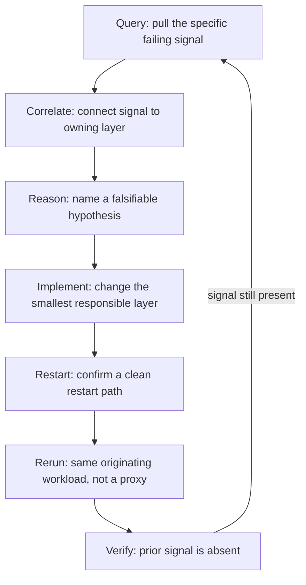

# Observability Feedback Loop: A 7-Step Debug Runbook

> A seven-step debug runbook — query, correlate, reason, implement, restart, rerun, verify — that ties the agent's verification predicate back to the originating signal.

## What the Loop Is

When runtime observability is the source of truth, agents debug from execution evidence, not code inspection alone. The [walkinglabs harness-engineering SOP](https://github.com/walkinglabs/learn-harness-engineering/blob/main/docs/en/resources/openai-advanced/sops/observability-feedback-loop.md) names seven explicit steps:

The steps are scaffolding. The load-bearing piece is the verification predicate at step 7 — *the originating signal is absent*, not "no errors now." This is the fix for the [trust-then-verify gap](https://code.claude.com/docs/en/best-practices).

## Prerequisites: The Minimum Stack

The loop assumes runtime signals exist and are queryable. The SOP enumerates the minimum: structured logs on startup and the critical path, metrics for latency and failure counts, traces for multi-step flows, query interfaces in dev, and one repeatable workload to rerun. Without this stack, there is nothing to query. See [Making Observability Legible to Agents](observability-legible-to-agents.md) for wiring patterns.

This loop is reactive — it starts once a signal has surfaced. A complementary posture, "active observability," shifts tooling from passively recording traces to continuously analysing them: clustering production traces into named patterns and surfacing the ones worth investigating before anyone queries for them ([Braintrust: AI observability is active observability](https://www.braintrust.dev/blog/active-observability)). Active analysis feeds step 1 with candidate signals; it does not replace the verification predicate the loop closes on.

## The Seven Steps

### 1. Query

Pull the specific signal that failed — a log line, a metric value, a trace span. Not "tail the logs." Claude Code contrasts the vague `"the build is failing"` with `"the build fails with this error: [paste error]"` ([best practices](https://code.claude.com/docs/en/best-practices)). The signal queried here is the same one verified absent in step 7 — pick it deliberately.

### 2. Correlate

Connect the signal to the responsible layer. A front-end exception triggered by a back-end data shape lives in the back-end. Under a [layered domain architecture](../agent-design/layered-domain-architecture.md), name the layer explicitly — the assignment determines what gets edited in step 4.

### 3. Reason

Name a hypothesis with falsifiable predictions *before* editing. This is the entry point to [hypothesis-driven debugging](../agent-design/hypothesis-driven-debugging.md) — enumerate competing explanations, then identify which one the evidence supports. The hypothetico-deductive method Google SRE codifies in its [Effective Troubleshooting chapter](https://sre.google/sre-book/effective-troubleshooting/) names the same discipline. Skipping it is the classic agent failure mode: edit-rerun-repeat cycles with no discrimination between causes.

### 4. Implement

Change the smallest responsible layer. Resist refactoring opportunism — unrelated improvements bundle in risk and obscure which edit fixed the signal. Claude Code's guide phrases this as "address the root cause, don't suppress the error" ([best practices](https://code.claude.com/docs/en/best-practices)).

### 5. Restart

Confirm a clean restart path before testing the fix. Anthropic's harness engineering article ships this as an `init.sh` step: "restart the development server and verify fundamental features are still working" ([harnesses for long-running agents](https://www.anthropic.com/engineering/effective-harnesses-for-long-running-agents)). State that survives between runs — cached configs, in-memory queues, leaked DB rows — corrupts step 7's verification.

### 6. Rerun

Exercise the workload that *originally surfaced* the signal, not a simpler proxy. A unit test passing while the integration scenario still fails is the most common false-positive in this loop.

### 7. Verify

The predicate says "the prior signal is absent" — not "no errors now," not "the test suite is green." Anthropic's [best-practices guide](https://code.claude.com/docs/en/best-practices) calls verification predicates "the single highest-leverage thing you can do" for agent quality. The predicate is bound at step 1 and consumed here — the same signal, now absent.

## Why the Steps Are Named

A named procedure lets a human or upstream agent invoke "run the observability feedback loop on bug X" with unambiguous steps. Each step produces an artefact (signal value, layer assignment, hypothesis, diff, restart log, rerun output, verification result) that the next consumes, and a [trajectory log](trajectory-logging-progress-files.md) of those seven artefacts makes the session reviewable after the fact.

## Example

A repeatable bug: API returns 500 on `/users/me` after token refresh, intermittently.

- **Query** — the 500 carries `error_id=auth-token-stale-3f2a` in the body and the log line `level=error fn=refreshToken cause=stale_cache`. That `error_id` is the signal.
- **Correlate** — the line is emitted by the auth middleware (`src/auth/middleware.ts`), not the route handler. Layer assignment: *middleware token-refresh*.
- **Reason** — three hypotheses: (a) cache invalidation runs after the refresh, (b) the refresh races a parallel refresh in another worker, (c) the cache TTL is shorter than the refresh window. One log line per hypothesis ([hypothesis-driven debugging](../agent-design/hypothesis-driven-debugging.md)) fires for (a).
- **Implement** — invalidate the cache before the refresh, not after. One-line change in `middleware.ts`.
- **Restart** — `init.sh` restarts the local API and verifies `/healthz` plus `/users/me` unauthenticated. Both pass; clean restart confirmed.
- **Rerun** — the original workload: authenticated session, idle past TTL, then `/users/me`. Not a cache-layer unit test — the same end-to-end path that surfaced the 500.
- **Verify** — search logs for `error_id=auth-token-stale-3f2a` across the rerun window. Zero occurrences. Signal absent. Loop closes.

Had verify returned occurrences, the loop restarts at step 1 with the new signal value — not at step 4 with a different fix.

## When This Backfires

Three conditions where the procedure adds ceremony without proportional value:

1. **Fast feedback loops with clear stack traces** — when `npm test` reports a line number and the fix is obvious, step-naming is overhead. The loop earns its keep when runtime evidence must discriminate hypotheses.
2. **Single-layer, single-signal failures** — if the failure surfaces in one log line with full context in one layer, "correlate to the layer" collapses to zero work.
3. **Exploratory bug hunts without a clear signal** — step 1 assumes a specific signal exists. For "feels slow sometimes" with no metric anchor, instrumentation comes first.

The rule from [research-plan-implement](../workflows/research-plan-implement.md): run the loop when runtime evidence is the source of truth; compress it when the stack trace is.

## Key Takeaways

- The seven steps are scaffolding; the verification predicate at step 7 — "the originating signal is absent" — is the load-bearing piece
- The signal you query for in step 1 is the same signal you verify the absence of in step 7. Bind them deliberately
- Skipping the restart step lets accumulated state corrupt the verification; skipping the rerun step lets a simpler proxy mask the real failure
- Compress the loop only when the failure surface is self-evident — the procedure is overhead when the stack trace already names the layer and cause
- A named procedure is invocable: "run the observability feedback loop on bug X" gives an agent unambiguous steps and checkpointable artefacts

## Related

- [Agent Debugging: Diagnosing Bad Agent Output](agent-debugging.md)
- [Hypothesis-Driven Debugging: Instrument Before You Patch](../agent-design/hypothesis-driven-debugging.md)
- [Making Observability Legible to Agents](observability-legible-to-agents.md)
- [Trajectory Logging via Progress Files](trajectory-logging-progress-files.md)
- [Loop Detection](loop-detection.md)
- [Verification-Centric Development](../workflows/verification-centric-development.md)
- [Research, Plan, Implement](../workflows/research-plan-implement.md)
- [Layered Mutability](../agent-design/layered-mutability.md)
