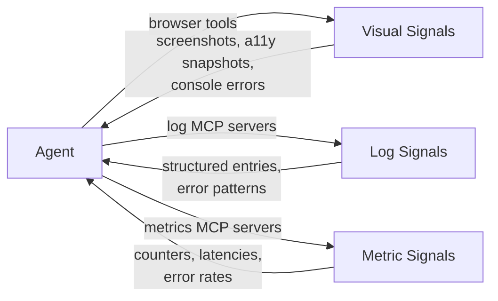

# Making Observability Legible to Agents

> Wire browser automation, application metrics, and structured logs into agent context so agents can reproduce bugs, verify fixes visually, and reason about system behavior from real signals.

!!! note "Not about observing agents"
    [Agent Observability (OTel)](agent-observability-otel.md) covers humans watching agent behavior. This page covers the inverse: **agents watching application behavior** through tools.

## The Gap

Agents write code, run tests, and read output. They cannot:

- Check whether a UI change renders correctly
- Query production metrics to confirm a fix reduced error rates
- Search logs for the error pattern a user reported

Without these signals, agents operate in "write and hope" mode. Closing the loop enables "write, observe, and verify" workflows.

## Three Signal Categories



### Visual Signals: Browser Automation

Agents verify rendering and UI behavior by driving a browser.

| Tool | Approach | Key capability |
|------|----------|----------------|
| [Playwright MCP](https://github.com/microsoft/playwright-mcp) | Accessibility snapshots | Structured a11y tree, console capture, network logging -- no screenshots needed |
| [Rodney](https://github.com/simonw/rodney) | Persistent headless Chrome via CDP | State persists across CLI calls; exit-code assertions for CI/CD |
| [agent-browser](https://github.com/vercel-labs/agent-browser) | Accessibility-first Rust CLI | Elements as `@e1`, `@e2` references; built-in network interception and profiling |
| Puppeteer MCP (generic) | Screenshots | Visual verification via captured images; no structured DOM access |

**Accessibility snapshots vs. screenshots.** Snapshots return structured text (roles, names, states) that LLMs reason about directly. Screenshots require a vision model -- use them only for layout bugs.

!!! warning "Blind spot: modal dialogs"
    Puppeteer MCP cannot see browser-native alert modals -- Anthropic's [harness engineering](../agent-design/harness-engineering.md) work found modal-dependent features were buggier as a result. Playwright MCP snapshots partially address this [unverified].

**Executable proof of work:** [Showboat](https://github.com/simonw/showboat) mixes narrative and runnable code blocks with captured output. Its `verify` command re-executes every block and checks outputs match.

### Log Signals: Structured Logs as Agent Context

Agents need structured, filterable log data -- not raw streams:

| Server | Platform | Capabilities |
|--------|----------|-------------|
| [Axiom MCP](https://github.com/axiomhq/mcp-server-axiom) | Axiom | Natural language queries via APL, trace analysis, alert monitoring |
| [Datadog MCP](https://github.com/winor30/mcp-server-datadog) | Datadog | Log search, APM traces, incident management, RUM events (20 tools) |
| [Datadog Labs MCP](https://github.com/datadog-labs/mcp-server) | Datadog | Official preview -- logs, metrics, traces, incidents |

### Metric Signals: Application Metrics as Verification

Agents use metrics to verify a change had the intended effect:

- After fixing an auth bug: query error rate, confirm it dropped
- After a performance optimization: query p99 latency, confirm it decreased
- After a deployment: check RUM data for regressions

The same MCP servers that expose logs also expose metrics. [Arize Phoenix MCP](https://github.com/Arize-ai/phoenix/tree/main/js/packages/phoenix-mcp) adds span retrieval and annotation.

## Context Management: JIT Loading

Observability data is high-volume. Two patterns keep context lean:

**JIT references:** Agents store lightweight identifiers -- query strings, metric names, time ranges -- and load data on demand rather than pulling full payloads upfront.

```text
# Agent stores a reference, not the data
log_query: "service:auth level:error @timestamp:[now-1h TO now]"

# Agent executes query only when it needs to verify a fix
datadog_log_search(query=log_query)
Result: 3 results (down from 47 before the fix)
```

**[Programmatic tool calling](../tool-engineering/advanced-tool-use.md#programmatic-tool-calling-code-based-orchestration):** Agents write code that calls observability tools and filters large payloads before they hit the context window.

## Verification Ladder: Cheap to Expensive

Simon Willison's [agentic manual testing guide](https://simonwillison.net/guides/agentic-engineering-patterns/agentic-manual-testing/) maps the verification spectrum:

| Signal type | Tool | Use case |
|-------------|------|----------|
| Unit-level | `python -c` | Quick assertions on code behavior |
| API-level | `curl` | Endpoint verification |
| Browser-level | Playwright, Rodney | Visual and interaction verification |
| Proof-of-work | Showboat | Self-verifying demo documents |

## Example

An agent fixes a login bug using all three signal categories:

```text
# 1. Agent reads the error report and searches logs via Datadog MCP
datadog_log_search(query="service:auth level:error @message:*InvalidCredentials* @timestamp:[now-24h TO now]")
→ 312 errors, stack trace points to session.validate()

# 2. Agent fixes session.validate(), runs tests — all pass

# 3. Agent verifies the UI fix via Playwright MCP
playwright_navigate("https://staging.example.com/login")
playwright_fill("#email", "test@example.com")
playwright_fill("#password", "valid-password")
playwright_click("#login-button")
playwright_snapshot()
→ a11y snapshot shows role=heading "Dashboard" — login succeeded

# 4. Agent checks metrics to confirm error rate dropped
datadog_metric_query(query="sum:auth.errors{service:auth}.as_count()", from="-1h")
→ 3 errors in the last hour (down from 312 in the prior 24h)
```

The agent closed the loop: logs identified the root cause, tests confirmed the code fix, browser automation verified the UI, and metrics proved errors dropped.

## Related

- [Agent Observability: OTel, Cost Tracking, and Trajectory Logging](agent-observability-otel.md) -- humans observing agent behavior (the inverse)
- [OpenTelemetry for AI Agent Observability and Tracing](../standards/opentelemetry-agent-observability.md) -- OTel semantic conventions for agent spans and instrumentation
- [Agent Debugging](agent-debugging.md) -- diagnosing agent failures using logs, traces, and tool call inspection
- [Browser Automation for Research](../tool-engineering/browser-automation-for-research.md) -- using Playwright to fetch web content, distinct from debugging applications
- [Semantic Tool Output](../tool-engineering/semantic-tool-output.md) -- designing tool outputs for agent readability
- [Loop Detection](loop-detection.md) -- detecting when agents get stuck
- [Trajectory Logging via Progress Files](trajectory-logging-progress-files.md) -- agent-written audit trails
- [Event Sourcing for Agents](event-sourcing-for-agents.md) -- immutable event logs as an observability substrate
- [Circuit Breakers](circuit-breakers.md) -- stopping runaway agents based on observable signals
- [Visible Thinking in AI Development](visible-thinking-ai-development.md) -- surfacing intermediate reasoning as an observability signal
- [Context Engineering](../context-engineering/context-engineering.md) -- JIT loading and [observation masking](../context-engineering/observation-masking.md)
