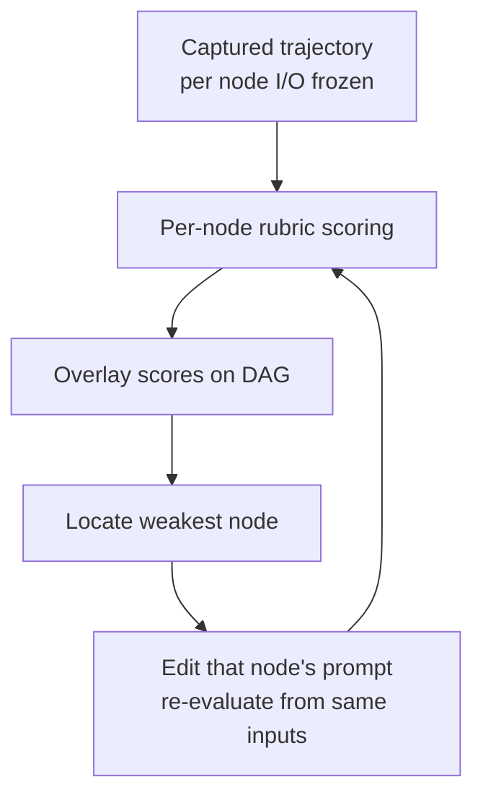

# Offline Trajectory Replay for Multi-Agent Workflow Debugging

> Replay captured multi-agent trajectories offline and score every intermediate node against a rubric — the score deltas localize blame to the upstream LLM call that introduced the failure, without re-running the end-to-end pipeline each time.

Offline trajectory replay is a node-level debugging surface for multi-agent LLM workflows. It applies when the workflow is a fixed DAG of role-specific LLM calls, per-node rubrics are graded, and captured traces still represent production. Under those conditions, replay plus per-node scoring isolates the failing node faster than end-to-end re-runs.

## When This Applies

Confirm all three conditions before adopting:

- **Fixed DAG topology.** Node positions and dependencies stable across runs. ReAct loops and runtime routing (LangGraph-style conditional edges) violate this; PROTEA is explicitly scoped to fixed DAGs ([PROTEA, arxiv 2605.18032](https://arxiv.org/abs/2605.18032)).
- **Graded per-node rubrics.** Each node has criteria producing more than two outcome buckets — near-binary rubrics give too little signal for iterative prompt refinement ([arxiv 2605.18032](https://arxiv.org/abs/2605.18032)).
- **Trace representativeness.** Captured trajectories still match production. Replay misses failures from upstream API schema changes, model version drift, or distribution shift — those need live monitoring ([LangChain, monitoring vs offline](https://www.langchain.com/articles/llm-monitoring-observability)).

If any condition is missing, fall back to live tracing in [agent-debugging](agent-debugging.md) and [traces-need-feedback-to-power-learning](traces-need-feedback-to-power-learning.md), or to counterfactual replay (see *When This Backfires*).

## The Three Pieces

### 1. Capture once, replay many

Trace every multi-agent run with inputs, intermediate outputs, and final answer. Observability platforms — [LangSmith](https://www.langchain.com/articles/agent-observability), [Langfuse](https://langfuse.com/blog/2024-07-ai-agent-observability-with-langfuse), Arize Phoenix — already nest per-node runs inside a graph run. The capture layer is commodity; the replay surface is what's new.

### 2. Per-node rubric scoring

Score each node's output against a rubric reflecting what the node should produce — field coverage, factual correctness against a reference, style or schema conformance. PROTEA uses LLM-graded rubrics overlaid on the DAG to highlight bottleneck nodes ([arxiv 2605.18032](https://arxiv.org/abs/2605.18032)). Glass-box trajectory and white-box single-step evaluation are already standard agent-observability practice ([LangChain agent observability](https://www.langchain.com/articles/agent-observability)).

### 3. Backward node evaluation when intermediate labels are missing

Production workflows usually have final-answer labels but no per-node ground truth. Backward node evaluation generates candidate expectations for each upstream node by reasoning backward from the final answer — what would node *k* have had to produce for downstream nodes to reach the observed output? This is PROTEA's specific contribution over plain rubric scoring ([arxiv 2605.18032](https://arxiv.org/abs/2605.18032)). The synthesised expectations encode the evaluator's view of the DAG, which is also their main weakness — see *When This Backfires*.

## Why It Works

Replay freezes upstream LLM stochasticity. In a 5-node DAG, end-to-end re-runs re-roll the dice on nodes 1–4 on every prompt edit; a 5-point accuracy shift could come from any of them. Replaying against a captured trajectory pins those outputs and isolates the variable to the node you actually edited. PROTEA reports this loop moved document-inspection accuracy from 64.3% to 83.9% on a 5-node DAG and conversational recommendation Hit@5 from 0.30 to 0.38 on a 6-node DAG ([arxiv 2605.18032](https://arxiv.org/abs/2605.18032)). Per-node overlays turn "the final answer was wrong" into "node *k* scored 0.4 while the others scored above 0.8" — the actionable signal a prompt edit can target.

## When This Backfires

- **Cyclic or dynamic control flow.** Runtime routing — ReAct loops, LangGraph conditional edges — breaks the fixed-DAG assumption. Node positions aren't stable across replays, so per-node scores can't be compared run-to-run. PROTEA restricts scope to fixed DAGs for this reason ([arxiv 2605.18032](https://arxiv.org/abs/2605.18032)).
- **Drift-driven failures.** Replay only surfaces bugs present in the captured runs. Failures from upstream API schema changes, dependency upgrades, or query distribution shift are invisible because the captured trajectory predates the drift. Online evals are required alongside replay ([LangChain monitoring vs offline](https://www.langchain.com/articles/llm-monitoring-observability)).
- **Tightly coupled joint failures.** When success requires coordination across agents, single-node attribution is often ill-posed: multiple distinct upstream edits can each independently repair the run. AgenTracer found off-the-shelf reasoning LLMs attribute multi-agent failures with <10% accuracy and proposes *counterfactual replay* — substituting agent actions with oracle outputs — because rubric-on-trace scoring underdetermines blame in coupled cases ([AgenTracer, arxiv 2509.03312](https://arxiv.org/abs/2509.03312)). For heavy cross-node dependencies, prefer counterfactual replay.
- **Binary-only outcomes.** Workflows whose only signal is "final answer correct" can't drive per-node prompt iteration ([arxiv 2605.18032](https://arxiv.org/abs/2605.18032)).
- **Over-trusting backward-derived expectations.** Backward node evaluation bakes in the evaluator's assumed task decomposition — a node that scores poorly may be doing the right thing under a different valid factoring. Treat the scores as a triage signal pointing at a node to inspect, not a verdict.

## Example

A 3-node document-inspection DAG: an extractor pulls fields from a PDF, a classifier assigns a document type, and a validator checks consistency. End-to-end accuracy is 70%. Without per-node scoring, a prompt-engineering team re-runs all three on every prompt variant — every iteration burns three LLM calls.

With offline trajectory replay:

1. Capture 100 production runs (inputs, all three intermediate outputs, final answer) via existing OTel tracing.
2. Score each captured trajectory per node against a graded rubric — extractor field-coverage, classifier confidence calibration, validator rule conformance.
3. Overlay scores on the DAG. The classifier scores 0.45 average while the other nodes score above 0.85.
4. Edit only the classifier prompt. Replay against the same captured extractor outputs — no re-extraction needed.
5. Classifier score moves to 0.82; final-answer accuracy moves with it.

The captured trajectories make every iteration of step 4 cost one LLM call per replayed run, not three.

## Key Takeaways

- Offline trajectory replay localises blame to the failing node in a multi-agent DAG without paying the cost of end-to-end re-runs.
- The pattern applies under three conditions: fixed-DAG topology, graded per-node rubrics, and captured traces that still represent production.
- Backward node evaluation lets you score intermediate nodes when only final-answer labels exist — but the synthesised expectations are a triage signal, not ground truth.
- Cyclic workflows, drift-driven failures, and tightly coupled joint failures break the pattern; use live tracing or counterfactual replay instead.
- Capture infrastructure (LangSmith, Langfuse, Phoenix, OTel) is already commodity — the new surface is the per-node rubric overlay plus editable prompt-revision UI ([PROTEA, arxiv 2605.18032](https://arxiv.org/abs/2605.18032)).

## Related

- [Simulation and Replay Testing for Agent Verification](../workflows/simulation-replay-testing.md) — workflow-level replay using git history as the fixture; offline trajectory replay is the node-level localisation layer beneath it.
- [Trajectory Decomposition: Diagnose Where Coding Agents Fail](../verification/trajectory-decomposition-diagnosis.md) — three-stage (search/read/edit) decomposition for single coding agents; this page extends the idea to multi-node multi-agent DAGs.
- [Agent Debugging: Diagnosing Bad Agent Output](agent-debugging.md) — the systematic process replay scores plug into when a failure is observed.
- [Traces Need Feedback to Power Learning](traces-need-feedback-to-power-learning.md) — the feedback-coupling layer that turns captured traces into the corpus replay needs.
- [Agent Observability: OTel, Cost Tracking, and Trajectory Logging](agent-observability-otel.md) — the OTel-based capture layer that produces the trajectories replay consumes.
