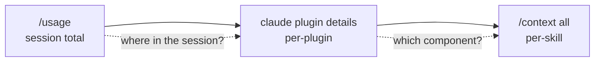

# Per-Plugin Token-Cost Attribution via `claude plugin details`

> Claude Code's `claude plugin details <name>` prints a plugin's component inventory and per-session token cost — the attribution cut between `/usage` and `/context all`.

**Related lesson:** [Attributing the Context](https://learn.agentpatterns.ai/observability/attributing-the-context/) — this concept features in a hands-on lesson with quizzes.

The plugin is the install/remove unit in Claude Code: one manifest bundles skills, agents, hooks, MCP servers, and LSP servers ([Plugins reference](https://code.claude.com/docs/en/plugins-reference)). Without per-plugin token accounting, a maintainer who sees the session at 78% cannot rank installed plugins by cost — the only action is *"disable a plugin"* without knowing which carries the weight. Claude Code v2.1.139 (2026-05-11) closed that gap with the `plugin details` subcommand ([Claude Code changelog](https://code.claude.com/docs/en/changelog)).

## The Attribution Hierarchy

Three cuts of the same telemetry, each pointing at a different remediation primitive:

| Cut | Surface | Remediation |
|-----|---------|-------------|
| Session | `/usage` (merged from `/cost` + `/stats` in v2.1.118) | compact, restart, swap models ([changelog](https://code.claude.com/docs/en/changelog)) |
| Plugin | `claude plugin details <name>` (v2.1.139) | `plugin disable`, split, prune skills ([Plugins reference](https://code.claude.com/docs/en/plugins-reference)) |
| Component | `/context all` per-skill estimates (refined v2.1.139), per-tool output audit | mark skill `name-only`, prune description, narrow tools |



Session names the symptom; plugin names the unit you act on with one command; component names the skill, tool, or hook to rewrite. [Context-usage attribution](context-usage-attribution.md) covers the orthogonal per-source cut (rules vs skills vs MCP vs subagent) — the same skill counts toward "skills 28%" in the source view and its parent plugin in the plugin view.

## Always-On vs On-Invoke

Two cost figures per component ([Plugins reference — plugin details](https://code.claude.com/docs/en/plugins-reference)):

- **Always-on** — tokens added to every session by listing text (skill descriptions, agent descriptions, command names). Paid whether any component fires or not.
- **On-invoke** — tokens a component costs when it fires. Shown per component, not summed, because a session invokes only a subset.

The always-on total is computed via `count_tokens` for the active model; per-component numbers are proportionally scaled. If the API is unreachable, the command falls back to a character-based estimate.

A single total confuses two budget regimes — a plugin can carry 50 tokens always-on and 8000 on-invoke, or the reverse. Always-on compounds across every session before any work is done ([Infinite Context anti-pattern](../anti-patterns/infinite-context.md) territory); on-invoke scales with invocation frequency. Sort each column separately, then cross-reference on-invoke with `/usage` for expensive-per-call components.

The always-on column is what argues for curating rather than maximizing installed skills: Microsoft notes that the count of installed skills imposes an upfront session-start metadata-injection tax — each skill's name, description, and trigger is paid whether or not the skill ever fires ([Microsoft Developer Blog — Stop skillmaxxing, save your tokens](https://developer.microsoft.com/blog/stop-skillmaxxing-save-your-tokens)). That tax is distinct from the per-invocation on-invoke cost above; it scales with how many skills are installed, not how many fire.

## Component Inventory

Components are grouped as Skills (skills and commands), Agents, Hooks, MCP servers, and LSP servers (added in v2.1.139). Hooks are tagged *"harness-only — no model context cost"* because they execute outside the model context — wall-clock and CPU, not tokens ([Plugins reference](https://code.claude.com/docs/en/plugins-reference)).

A plugin's budget is not its always-on number alone. A verbose MCP server returning 8000 tokens per call sits in the on-invoke column and only matters if it fires. Pair the detail view with `/usage` to separate cold heavy plugins from hot light ones.

## Workflow

1. List installed plugins: `claude plugin list`.
2. For each, run `claude plugin details <name>`. Capture the always-on total, the largest on-invoke component, and the LSP / MCP server count.
3. Rank plugins by always-on descending. Above ~500 tokens always-on, the plugin is a split candidate — each skill description loads regardless of use.
4. Cross-reference top on-invoke components against `/usage` traffic. A 2400-token skill firing 30 times costs more than a 4000-token skill firing once.
5. Remediate:
   - Always-on bloat → split the plugin, or set `name-only` / `off` in `skillOverrides` ([Claude Code skills reference](https://code.claude.com/docs/en/skills#override-skill-visibility-from-settings))
   - Hot on-invoke skill → rewrite output to cut tool-output token cost
   - Plugin unused in this workflow → `claude plugin disable <name>`

## When This Cut Misleads

Per-plugin attribution is the right axis when installed plugins carry non-trivial cost. It produces noise when:

- **Most config is standalone `.claude/`, not plugins.** When skills, agents, and hooks live in the project directory, the per-plugin column rounds the offenders into "everything else". Use the per-source cut ([context-usage attribution](context-usage-attribution.md)) instead.
- **Plugins are small and homogeneous.** Ranking ten plugins at 100–300 tokens always-on each is rounding noise — the target is one skill, not one plugin.
- **`count_tokens` is unreachable.** The character-based fallback overcounts JSON-heavy descriptions and undercounts dense prose. Rankings stay directionally useful; absolute numbers drift.
- **Heavy components billed on-invoke rarely fire.** Reading on-invoke without `/usage` mis-prioritises cold heavy plugins over hot light ones.

The per-component cut (`/context all`) is the right axis when the plugin column points to a plugin with one heavy skill among five.

## Example

A maintainer runs `claude plugin details security-guidance` and sees the canonical output from the reference docs ([Plugins reference](https://code.claude.com/docs/en/plugins-reference)):

```text
security-guidance 1.2.0
  Real-time security analysis for Claude Code sessions
  Source: security-guidance@claude-code-marketplace

Component inventory
  Skills (2)  scan-dependencies, review-changes
  Agents (0)
  Hooks (1)  (harness-only — no model context cost)
  MCP servers (0)

Projected token cost
  Always-on:   ~180 tok   added to every session

Per-component (rounded)
  component            always-on  on-invoke
  scan-dependencies        ~100      ~2400
  review-changes            ~80      ~1800

  On-invoke cost is paid each time a skill or agent fires.
  Token counts are estimates and may differ from actual usage.
```

The 180-token always-on figure is paid every session, regardless of whether either skill fires. Cross-checking `/usage` shows `scan-dependencies` fired six times in the previous session — six × 2400 = 14400 tokens of on-invoke cost from a 100-token always-on listing. The remediation is not to disable the plugin; the always-on cost is already minimal. It is to audit `scan-dependencies` output for tool-output token cost and shrink the per-call output.

The opposite finding from the same command: `claude plugin details` against a plugin with twelve skills shows ~1400 tokens always-on and ~0 on-invoke across the session — none fired. The remediation here is to split the plugin, or mark the unused skills `name-only` in `skillOverrides`.

## Key Takeaways

- The plugin is the install/remove unit; `claude plugin details <name>` is the token-cost cut that matches that unit, added in Claude Code v2.1.139 ([Claude Code changelog](https://code.claude.com/docs/en/changelog)).
- Two cost figures matter independently: always-on (paid every session by listing text) and on-invoke (paid when a component fires). Ranking by total collapses two budget regimes; rank each column separately.
- Hooks are harness-only and carry no model-context cost; their cost lives in wall-clock, not tokens ([Plugins reference](https://code.claude.com/docs/en/plugins-reference)).
- Cross-reference on-invoke numbers with `/usage` traffic — a cold heavy plugin can outrank a hot light plugin and still cost less in aggregate.
- The token total comes from the active model's tokenizer via `count_tokens`; the character-based fallback is directionally useful when the API is unreachable but absolute numbers drift.

## Related

- [Context-Usage Attribution: Per-Source Breakdown of Agent Context](context-usage-attribution.md) — the orthogonal per-source cut (rules / skills / MCP / subagent)
- [Plugin and Extension Packaging: Distributing Agent Capabilities](../standards/plugin-packaging.md) — what a plugin is and why it sits at this attribution layer
- [The Infinite Context anti-pattern](../anti-patterns/infinite-context.md) — the failure mode the always-on column makes visible
- [Agent Observability: OTel, Cost Tracking, Trajectory Logs](agent-observability-otel.md) — the export path for the same telemetry
