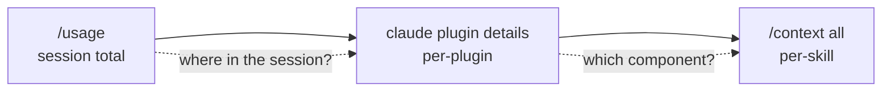

# Per-Plugin Token-Cost Attribution via `claude plugin details`

> Claude Code's `claude plugin details <name>` prints a plugin's component inventory and projected per-session token cost — the unit between session-level (`/usage`) and component-level (`/context all`) attribution at which plugins are installed, disabled, and held to a budget.

The plugin is the install/remove unit in Claude Code: one manifest bundles skills, agents, hooks, MCP servers, and LSP servers behind one command ([Plugins reference](https://code.claude.com/docs/en/plugins-reference)). Without per-plugin token accounting, a maintainer who sees the session at 78% has no way to rank installed plugins by context cost — the only available action is *"disable a plugin"* without knowing which one carries the most weight. Claude Code v2.1.139 (2026-05-11) closed that gap by adding the `plugin details` subcommand ([Claude Code changelog](https://code.claude.com/docs/en/changelog)).

## The Attribution Hierarchy

Three cuts of the same token telemetry, each pointing at a different remediation primitive:

| Cut | Surface | Remediation primitive |
|-----|---------|-----------------------|
| Session | `/usage` (merged from `/cost` + `/stats` in v2.1.118) | compact, restart, swap models ([Claude Code changelog](https://code.claude.com/docs/en/changelog)) |
| Plugin | `claude plugin details <name>` (v2.1.139) | `claude plugin disable <name>`, split the plugin, prune its skills ([Plugins reference](https://code.claude.com/docs/en/plugins-reference)) |
| Component | `/context all` per-skill estimates (refined v2.1.139), [per-tool output audit](../agent-readiness/audit-tool-output-token-cost.md) | mark skill `name-only`, prune description, narrow tool selection ([Claude Code changelog](https://code.claude.com/docs/en/changelog)) |



The session cut names the symptom. The plugin cut names the distribution unit you can act on with one command. The component cut names the specific skill, tool, or hook to rewrite. [Context-usage attribution](context-usage-attribution.md) covers the per-source cut (rules vs skills vs MCP vs subagent) that runs orthogonal to the per-plugin cut — the same skill counts toward both "skills 28%" in the source view and the plugin it ships with in the plugin view.

## Always-On vs On-Invoke

The reference documents two distinct cost figures per component ([Plugins reference — plugin details](https://code.claude.com/docs/en/plugins-reference)):

- **Always-on** — tokens added to every session by the plugin's listing text: skill descriptions, agent descriptions, command names. Paid whether or not any component fires.
- **On-invoke** — tokens a component costs when it actually fires. Shown per component, not summed across the plugin, because a typical session invokes only a subset.

The always-on total is computed against the active model's tokenizer via the `count_tokens` API; per-component numbers are proportionally scaled. If the API is unreachable the command falls back to a character-based estimate ([Plugins reference](https://code.claude.com/docs/en/plugins-reference)).

The split makes the cut actionable. Ranking plugins by total cost confuses two budget regimes — a plugin can carry 50 tokens always-on and 8000 tokens on-invoke, or the reverse. The always-on column is the static cost that compounds across every session before any work is done ([Infinite Context anti-pattern](../anti-patterns/infinite-context.md) territory); the on-invoke column is variable and matters only in proportion to how often the component fires. Sort by always-on to find slow-growing static cost; sort by on-invoke and cross-reference with `/usage` to find expensive-per-call components ([Claude Code changelog](https://code.claude.com/docs/en/changelog) v2.1.118 `/usage`).

## Component Inventory

The output groups components as Skills (skills and commands), Agents, Hooks, MCP servers, and LSP servers (added to the inventory in v2.1.139) ([Claude Code changelog](https://code.claude.com/docs/en/changelog)). Hooks are tagged *"harness-only — no model context cost"* because they execute outside the model context — they cost wall-clock and CPU, not tokens ([Plugins reference](https://code.claude.com/docs/en/plugins-reference)).

A plugin's budget is therefore not just its always-on number. The inventory cross-checks against `/usage` traffic: a plugin contributing one verbose MCP server that returns 8000 tokens on every call sits in the on-invoke column, not in always-on, and only matters if that MCP server fires. Pair the plugin detail view with `/usage` to separate cold heavy plugins from hot light ones.

## Workflow

1. List installed plugins: `claude plugin list`.
2. For each, run `claude plugin details <name>`. Capture the always-on total, the largest on-invoke component, and the LSP / MCP server count.
3. Rank plugins by always-on descending. Plugins above ~500 tokens always-on are candidates for splitting — each skill's description loads regardless of use.
4. Cross-reference the top on-invoke components against `/usage` traffic. A 2400-token on-invoke skill that fires 30 times per session costs more than a 4000-token skill that fires once.
5. Apply the appropriate remediation:
   - Always-on bloat → split the plugin, or set `name-only` / `off` in `skillOverrides` ([Claude Code skills reference](https://code.claude.com/docs/en/skills#override-skill-visibility-from-settings))
   - Hot on-invoke skill → rewrite output per [audit tool-output token cost](../agent-readiness/audit-tool-output-token-cost.md)
   - Plugin not used in this workflow → `claude plugin disable <name>`

## When This Cut Misleads

Per-plugin attribution is the right axis when installed plugins carry non-trivial context cost. It produces noise when:

- **Most config is standalone `.claude/`, not plugins.** Skills, agents, and hooks live in the project directory rather than installed plugins; the per-plugin column rounds the actual offenders into "everything else". Use the per-source cut ([context-usage attribution](context-usage-attribution.md)) instead.
- **All plugins are small and homogeneous.** When every installed plugin contributes 100–300 tokens always-on, ranking them produces rounding noise — the remediation target is one skill at a time, not one plugin.
- **`count_tokens` API is unreachable.** The character-based fallback overcounts JSON-heavy descriptions and undercounts dense prose ([Plugins reference](https://code.claude.com/docs/en/plugins-reference)). Rankings stay directionally useful; absolute numbers diverge from actual session cost.
- **Heavy components are billed only on-invoke and rarely fire.** A plugin shows 50 tokens always-on and 8000 tokens on-invoke. Reading the on-invoke column without traffic data from `/usage` mis-prioritises a cold heavy plugin over a hot light one.

The per-component cut (`/context all`) is the right axis when the plugin column points to a plugin with one heavy skill among five — the remediation is the skill, not the plugin. The two cuts are complementary, not competing.

## Example

A maintainer runs `claude plugin details security-guidance` and sees the canonical output from the reference docs ([Plugins reference](https://code.claude.com/docs/en/plugins-reference)):

```text
security-guidance 1.2.0
  Real-time security analysis for Claude Code sessions
  Source: security-guidance@claude-code-marketplace

Component inventory
  Skills (2)  scan-dependencies, review-changes
  Agents (0)
  Hooks (1)  (harness-only — no model context cost)
  MCP servers (0)

Projected token cost
  Always-on:   ~180 tok   added to every session

Per-component (rounded)
  component            always-on  on-invoke
  scan-dependencies        ~100      ~2400
  review-changes            ~80      ~1800

  On-invoke cost is paid each time a skill or agent fires.
  Token counts are estimates and may differ from actual usage.
```

The 180-token always-on figure is paid every session, regardless of whether either skill fires. Cross-checking `/usage` shows `scan-dependencies` fired six times in the previous session — six × 2400 = 14400 tokens of on-invoke cost from a 100-token always-on listing. The remediation is not to disable the plugin; the always-on cost is already minimal. It is to audit `scan-dependencies` output against [audit tool-output token cost](../agent-readiness/audit-tool-output-token-cost.md) and shrink the per-call output.

The opposite finding from the same command: `claude plugin details` against a plugin with twelve skills shows ~1400 tokens always-on and ~0 on-invoke across the session — none fired. The remediation here is to split the plugin, or mark the unused skills `name-only` in `skillOverrides`.

## Key Takeaways

- The plugin is the install/remove unit; `claude plugin details <name>` is the token-cost cut that matches that unit, added in Claude Code v2.1.139 ([Claude Code changelog](https://code.claude.com/docs/en/changelog)).
- Two cost figures matter independently: always-on (paid every session by listing text) and on-invoke (paid when a component fires). Ranking by total collapses two budget regimes; rank each column separately.
- Hooks are harness-only and carry no model-context cost; their cost lives in wall-clock, not tokens ([Plugins reference](https://code.claude.com/docs/en/plugins-reference)).
- Cross-reference on-invoke numbers with `/usage` traffic — a cold heavy plugin can outrank a hot light plugin and still cost less in aggregate.
- The token total comes from the active model's tokenizer via `count_tokens`; the character-based fallback is directionally useful when the API is unreachable but absolute numbers drift.

## Related

- [Context-Usage Attribution: Per-Source Breakdown of Agent Context](context-usage-attribution.md) — the orthogonal per-source cut (rules / skills / MCP / subagent)
- [Audit Tool Output Token Cost](../agent-readiness/audit-tool-output-token-cost.md) — drill-down when on-invoke cost concentrates in one component
- [Audit Instruction Rule Budget](../agent-readiness/audit-instruction-rule-budget.md) — drill-down when the symptom is always-on bloat
- [Plugin and Extension Packaging: Distributing Agent Capabilities](../standards/plugin-packaging.md) — what a plugin is and why it sits at this attribution layer
- [The Infinite Context anti-pattern](../anti-patterns/infinite-context.md) — the failure mode the always-on column makes visible
- [Agent Observability: OTel, Cost Tracking, Trajectory Logs](agent-observability-otel.md) — the export path for the same telemetry
