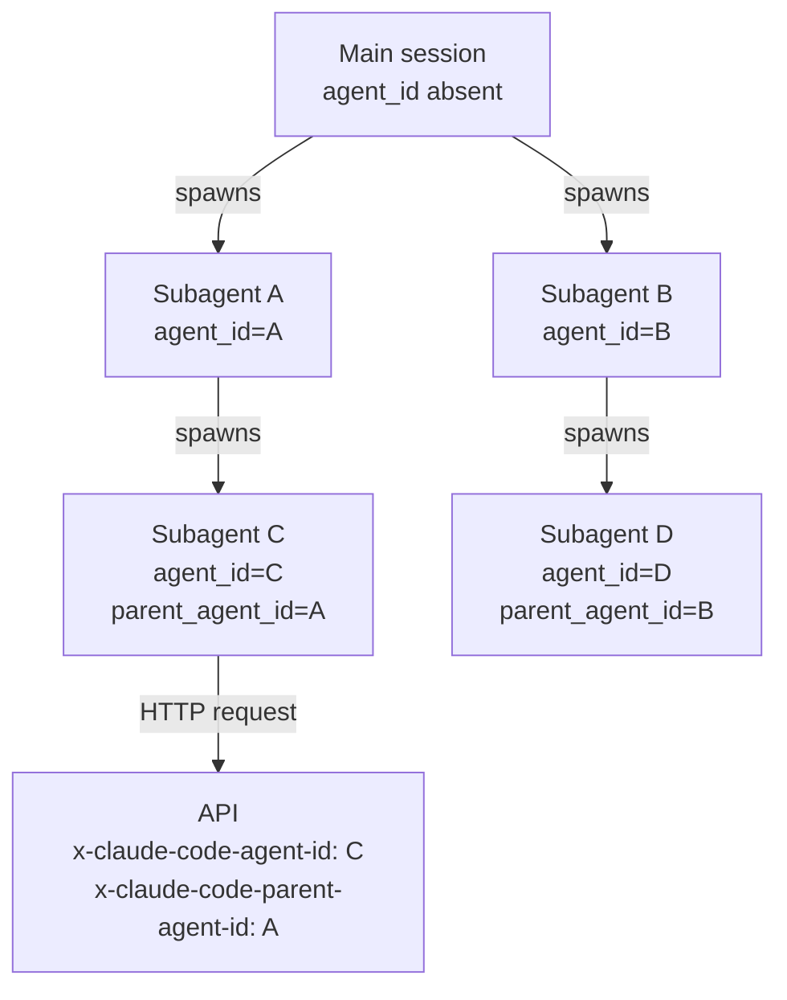

# Subagent OTel Trace Correlation via `agent_id` Attribute

> Propagate a stable agent identifier on outgoing HTTP headers and every OTEL span, keeping multi-agent traces queryable by agent identity, independent of span lineage.

## The Correlation Problem

Across 200 spans and 12 subagents, two questions span nesting alone does not answer cheaply: which spans belong to a given subagent, and which call chain caused this 429. Span hierarchy answers the first via tree traversal, but only inside a single Claude Code session. Once work crosses a boundary the instrumentation does not cover (shell-out, webhook, queue), lineage is gone.

The fix is a flat, propagated identifier that survives where the trace context ends.

## The Propagation Contract

Claude Code 2.1.139 ([changelog, May 11, 2026](https://code.claude.com/docs/en/changelog)) instruments subagents on two surfaces simultaneously:

| Surface | Mechanism | Carried value |
|---------|-----------|---------------|
| Outgoing HTTP | Request headers `x-claude-code-agent-id`, `x-claude-code-parent-agent-id` | Subagent + parent identity |
| OTEL spans | `claude_code.llm_request` span attributes `agent_id`, `parent_agent_id` | Same pair, queryable from the trace store |

From the [monitoring docs](https://code.claude.com/docs/en/monitoring-usage): `agent_id` identifies the subagent that issued the request (absent on the main session); `parent_agent_id` identifies the agent that spawned it (absent for the main session and for agents spawned directly from it).

The pair is load-bearing. `agent_id` supports "all work by this subagent"; `parent_agent_id` reconstructs the dispatch hierarchy from a flat query — "which subagent spawned this 429-emitting child" — without walking the span tree.



## Why Two Surfaces

Span lineage answers "what is the call structure inside this turn" — it needs the parent span live when the child starts. The propagated attribute answers "what work was caused by this agent identity, regardless of dispatch path" — it needs only that the identifier be copied onto every emission. OpenTelemetry separates trace context (`traceparent`) from cross-cutting context (span attributes, Baggage) for the same reason: neither alone suffices.

## Queries the Pattern Enables

With `agent_id` on every span and API event, the trace store becomes a per-agent analytics surface:

| Question | Query shape |
|----------|-------------|
| Token cost per subagent | `sum(input_tokens + output_tokens) group by agent_id` |
| p99 latency per subagent | `quantile(0.99, duration_ms) group by agent_id` |
| Error rate per subagent | `count(status='ERROR') / count(*) group by agent_id` |
| Call chain to a 429 | follow `parent_agent_id` from the failing span upward |
| Cost of an orchestrator's tree | `sum(cost) where agent_id IN (recursive descendants of root)` |

Without the attribute, the same queries require walking parent links per-trace — feasible at one trace, expensive at scale.

## Complementary Attributes

The contract sits within the attributes Claude Code emits on `claude_code.llm_request` spans ([attribute table](https://code.claude.com/docs/en/monitoring-usage)):

| Attribute | What it identifies |
|-----------|--------------------|
| `agent_id` / `parent_agent_id` | Per-instance identity (high cardinality — span attribute, not metric label) |
| `agent.name` | Subagent **type** — bounded set; safe as a metric label. User-defined names replaced with `"custom"` |
| `query_source` | `"main"`, `"subagent"`, or `"auxiliary"` |
| `skill.name`, `plugin.name` | Skill or plugin active for the request |

`agent.name` is the metric-safe partner: dashboards aggregate by it to avoid cardinality explosions; trace queries drill into a specific incident via `agent_id`.

## Where the Propagation Breaks

The contract holds only over surfaces Claude Code controls — off-protocol egress paths escape it:

- **Shell-out via Bash tool**: `curl -X POST https://api.example.com` produces a `claude_code.tool` span, but the request carries no `x-claude-code-agent-id` header — the service sees an anonymous request.
- **Subprocess work**: `TRACEPARENT` is auto-set for W3C inheritance, but nothing copies `agent_id` into subprocess env. Subprocess spans inherit the trace, not the agent identity.
- **Fire-and-forget queues**: enqueueing discards the header; the work runs untagged.

Mitigation: lift the call into an MCP tool, or wrap shell-outs with an explicit `x-claude-code-agent-id` header.

## When This Backfires

- **Treating `agent_id` as a metric label**: per-instance identifiers create unbounded time series. The [Agent Observability OTel](agent-observability-otel.md) page documents the same discipline for `prompt.id`. Use `agent.name` for metric slicing.
- **Reusing identifier values across sessions**: if `agent_id` collides across unrelated runs, per-agent queries silently mix sessions. Identifiers must be globally unique within the trace store's retention window.
- **Single-agent harnesses**: every span has `agent_id` absent. The attribute pays for itself only when fan-out exists.
- **Privacy assumption mismatch**: `agent_id` is opaque, but `agent.name` carries the subagent **type** verbatim for built-in and official-marketplace agents. Custom names are redacted to `"custom"` — yet skill or plugin names on the same span may still leak intent ([attribute redaction rules](https://code.claude.com/docs/en/monitoring-usage)).

## Example

A team running Claude Code with OTLP export to Tempo and Prometheus debugs a 429 storm during a fan-out.

**Before** — without per-agent attribution, only the parent's `tool_decision` event shows the dispatch; per-subagent cost requires manual span-tree traversal per trace, infeasible across thousands of traces:

```text
claude_code.interaction (root)
└── claude_code.tool (Task)
    ├── claude_code.llm_request   # which subagent? unknown without tree walk
    ├── claude_code.llm_request   # 429 here. caused by which dispatch path?
    └── claude_code.llm_request
```

**After** — with `agent_id` / `parent_agent_id` on every span, the trace store answers both questions with a flat query:

```text
claude_code.llm_request agent_id=fanout-3 parent_agent_id=orch status=ERROR status_code=429
claude_code.llm_request agent_id=fanout-3 parent_agent_id=orch input_tokens=12450
claude_code.llm_request agent_id=fanout-4 parent_agent_id=orch input_tokens=11820
```

The 429 belongs to `fanout-3`, spawned by `orch`. A cost-by-`agent.name` panel in Grafana attributes the burst to the `research-topic` subagent type. The fix — lower N for `research-topic` specifically — lands without instrumenting application code.

## Key Takeaways

- The contract is dual-surface: HTTP header on outgoing requests, span attribute on local emissions. Each covers a boundary the other does not.
- `agent_id` plus `parent_agent_id` is the load-bearing pair — flat per-instance identity plus a parent back-pointer reconstructs the hierarchy without span-tree traversal.
- Use `agent_id` as a span/event attribute, never a metric label. Use `agent.name` for bounded-cardinality metric slicing.
- The pattern breaks at off-protocol boundaries — shell-out to `curl`, fire-and-forget queues, raw subprocess spawn. Close the gap by lifting those into instrumented tool calls.
- The pattern generalises beyond Claude Code: any harness that propagates a stable agent identifier through HTTP headers and span attributes inherits the same query surface.

## Related

- [Agent Observability: OTel, Cost Tracking, Trajectory Logs](agent-observability-otel.md)
- [Sub-Agents for Fan-Out Research and Context Isolation](../multi-agent/sub-agents-fan-out.md)
- [Bounded Batch Dispatch](../multi-agent/bounded-batch-dispatch.md)
- [Agent Handoff Protocols](../multi-agent/agent-handoff-protocols.md)
