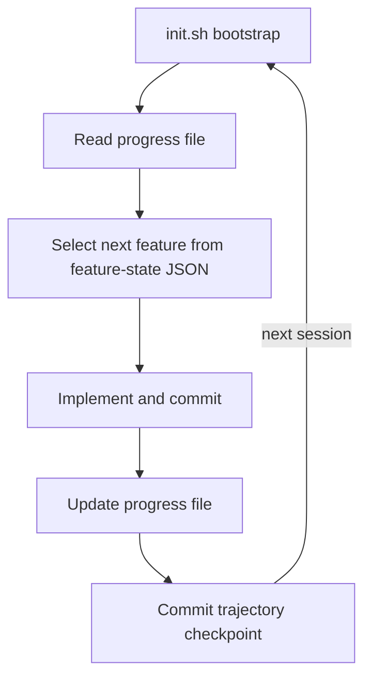

# Trajectory Logging via Progress Files and Git History

> Capture a full, replayable audit trail of agent decisions across sessions using only a progress file, git commits, feature-state JSON, and a bootstrap script — no observability backend required.

!!! info "Also known as"
    Agent Observability: OTel, Cost Tracking, Progress File Pattern, Audit Trail for Agent Decisions

## The Problem

Long-running agents produce decisions spread across multiple sessions. Without a persistent record, each new session loses the trajectory: what was tried, what failed, what the agent decided next. Rebuilding that context wastes tokens and produces inconsistent outcomes.

[OTel GenAI semantic conventions](../standards/opentelemetry-agent-observability.md) solve this at infrastructure level ([OTel GenAI span conventions](https://opentelemetry.io/docs/specs/semconv/gen-ai/gen-ai-spans/)). The filesystem pattern solves the same problem with no backend and no additional dependencies.

## The Four-Component Harness

[Anthropic's harness engineering guidance](https://www.anthropic.com/engineering/effective-harnesses-for-long-running-agents) describes a pattern for long-running agents built from four components that together form a complete trajectory log.



### 1. Progress File (`claude-progress.txt`)

A plain text or markdown file updated at session end and read at session start. It captures what was completed, what is next (in priority order), and any blockers. Reading it before work begins gives each fresh context window a recoverable record of prior decisions without re-analysing the full codebase.

### 2. Git Commits as Trajectory Checkpoints

Agents commit after each completed task with descriptive messages. The git history becomes a chronological, diff-linked record of every agent decision — readable by humans and queryable by future sessions via `git log`. [A community best-practices guide](https://github.com/shanraisshan/claude-code-best-practice) recommends committing at minimum once per completed task.

### 3. Feature-State JSON as Machine-Readable Snapshot

A JSON file tracks discrete features with `passes`/`fails` status. Agents toggle `passes` only after verification. The file survives context resets as an independent state snapshot, preventing premature completion.

### 4. `init.sh` as Environment Trajectory

The initializer agent writes `init.sh` to reconstruct the development environment. Subsequent sessions run it at startup to detect broken states before any code changes [unverified].

## Filesystem Write-on-Summarisation

When context is compressed, the [LangChain context management pattern](https://blog.langchain.com/context-management-for-deepagents/) writes full conversation messages to the filesystem alongside a structured summary (session intent, artifacts created, next steps). The trajectory is offloaded rather than discarded.

A visible failure mode when absent: [goal drift](../anti-patterns/objective-drift.md). After summarisation, agents request unnecessary clarification or declare premature completion — signals that trajectory was lost.

## Active Trajectory Monitoring

Two middleware patterns from [LangChain's harness engineering post](https://blog.langchain.com/improving-deep-agents-with-harness-engineering/) extend the static logging pattern into active monitoring:

- **LoopDetectionMiddleware** — tracks per-file edit counts via tool-call hooks; excessive edits inject a contextual reminder, catching doom loops before they exhaust the context budget.
- **PreCompletionChecklistMiddleware** — intercepts the agent before it signals completion and forces a verification pass against the task spec, preventing premature task closure.

## Example

The following shows the four-component harness in a real project layout. Each file is maintained by the agent across sessions and committed after every completed task.

```
my-project/
├── claude-progress.txt       # 1. progress file — read at start, updated at end
├── feature-state.json        # 3. machine-readable feature snapshot
├── init.sh                   # 4. environment trajectory / reproducibility check
└── src/
```

**1. `claude-progress.txt` — written by the agent at session end**

```
## Session 2026-03-11

Completed:
- Implemented POST /auth/login with RS256 JWT signing
- Private key loaded from env SECRET_KEY; verified with curl

Next (priority order):
1. Implement token refresh endpoint (POST /auth/refresh)
2. Write integration tests for /auth/login using pytest-httpx

Blockers:
- None
```

**3. `feature-state.json` — toggled only after verified completion**

```json
{
  "features": [
    { "name": "POST /auth/login",        "passes": true  },
    { "name": "POST /auth/refresh",      "passes": false },
    { "name": "auth integration tests",  "passes": false }
  ]
}
```

**4. `init.sh` — run at the start of every session**

```bash
#!/usr/bin/env bash
set -euo pipefail

node --version | grep -qF "$(cat .nvmrc)" || { echo "Wrong Node version"; exit 1; }
npm ci --prefer-offline
timeout 5 npm run start:check || { echo "Server health check failed"; exit 1; }
echo "Environment OK"
```

**2. Git commit as trajectory checkpoint**

```bash
git add src/auth/login.ts feature-state.json claude-progress.txt
git commit -m "feat(auth): implement POST /auth/login with RS256 JWT

- feature-state.json: /auth/login passes=true
- progress file: /auth/refresh listed as next task"
```

Each session runs `bash init.sh`, reads `claude-progress.txt` to recover prior decisions, consults `feature-state.json` to pick the next unfinished feature, implements and verifies it, then commits all artefacts — a replayable audit trail with no external backend.

## Key Takeaways

- A progress file read at session start and written at session end eliminates cold-start context loss.
- Git commit messages are a zero-cost audit trail when agents commit after each completed task.
- Feature-state JSON provides a machine-readable snapshot independent of LLM memory.
- LoopDetectionMiddleware and PreCompletionChecklistMiddleware extend passive logging into active trajectory monitoring.

## Related

- [Agent Observability in Practice: OTel, Cost Tracking, and Trajectory Logging](agent-observability-otel.md) — machine-readable OTel signals that complement this filesystem pattern
- [Session Initialization Ritual](../agent-design/session-initialization-ritual.md)
- [Loop Detection](loop-detection.md)
- [Circuit Breakers for Agent Loops](circuit-breakers.md)
- [Pre-Completion Checklists](../verification/pre-completion-checklists.md)
- [Context Compression Strategies](../context-engineering/context-compression-strategies.md)
- [Agent Memory Patterns: Learning Across Conversations](../agent-design/agent-memory-patterns.md)
- [Event Sourcing for Agents](event-sourcing-for-agents.md)
- [Agent Debugging](agent-debugging.md)
- [Observability Legible to Agents](observability-legible-to-agents.md)
