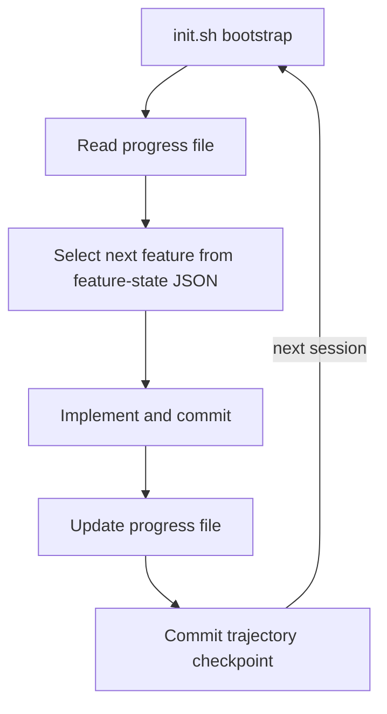

# Trajectory Logging via Progress Files and Git History

> A progress file, git commits, feature-state JSON, and a bootstrap script capture a replayable audit trail of agent decisions — no observability backend required.

Learn it hands-on with [Breaking the Loop](https://learn.agentpatterns.ai/observability/breaking-the-loop/) — a guided lesson with quizzes.

!!! info "Also known as"
    Progress File Pattern, Audit Trail for Agent Decisions

## The problem

Long-running agents make decisions across many sessions. Without a persistent record, each new session loses the trajectory: what was tried, what failed, and what the agent decided next. Rebuilding that context wastes tokens and produces inconsistent outcomes.

[OTel GenAI semantic conventions](../standards/opentelemetry-agent-observability.md) solve this at the infrastructure level ([OTel GenAI span conventions](https://opentelemetry.io/docs/specs/semconv/gen-ai/gen-ai-spans/)). The filesystem pattern solves the same problem with no backend and no extra dependencies.

## The four-component harness

[Anthropic's harness engineering guidance](https://www.anthropic.com/engineering/effective-harnesses-for-long-running-agents) describes a pattern for long-running agents. It uses four components that together form a complete trajectory log.


```mermaid
graph TD
    A[init.sh bootstrap] --> B[Read progress file]
    B --> C[Select next feature from feature-state JSON]
    C --> D[Implement and commit]
    D --> E[Update progress file]
    E --> F[Commit trajectory checkpoint]
    F -->|next session| A
```

### 1. Progress file (`claude-progress.txt`)

A plain text or markdown file, updated at session end and read at session start. It captures what was completed, what is next in priority order, and any blockers. [Reading it before work begins](../patterns/agent-design/session-initialization-ritual.md) gives each fresh context window a recoverable record of prior decisions, without re-analyzing the full codebase.

### 2. Git commits as trajectory checkpoints

Agents commit after each completed task with descriptive messages. The git history then becomes a chronological, diff-linked record of every agent decision. Humans can read it and future sessions can query it via `git log`. [A community best-practices guide](https://github.com/shanraisshan/claude-code-best-practice) recommends committing at least once per completed task.

### 3. Feature-state JSON as machine-readable snapshot

A JSON file tracks discrete features with `passes`/`fails` status. Agents set `passes` only after verification. The file survives context resets as an independent state snapshot, so the agent does not declare premature completion.

### 4. `init.sh` as environment trajectory

The initializer agent writes `init.sh` to rebuild the development environment. Later sessions run it at startup to confirm the environment is in a known-good state before any code changes.

## Filesystem write-on-summarization

When context is compressed, the [LangChain context management pattern](https://blog.langchain.com/context-management-for-deepagents/) writes full conversation messages to the filesystem alongside a structured summary: session intent, artifacts created, and next steps. The trajectory is offloaded rather than discarded.

When this is missing, a visible failure mode is [goal drift](../patterns/anti-patterns/objective-drift.md). After summarization, agents ask for clarification they do not need or declare premature completion. Both signal that the trajectory was lost.

## Active trajectory monitoring

Two middleware patterns from [LangChain's harness engineering post](https://blog.langchain.com/improving-deep-agents-with-harness-engineering/) extend the static logging pattern into active monitoring:

- LoopDetectionMiddleware tracks per-file edit counts via tool-call hooks. When edits pile up, it injects a contextual reminder that catches doom loops before they exhaust the context budget.
- PreCompletionChecklistMiddleware intercepts the agent before it signals completion. It forces a verification pass against the task spec, so the agent does not close the task too early.

## When this backfires

The filesystem pattern assumes a persistent, local working directory. That assumption breaks in three common cases:

- Serverless or ephemeral agents: containers spun up per request have no stable filesystem between invocations, so progress files and git state disappear on teardown.
- Parallel agent pools: several concurrent sessions writing to the same progress file or committing to the same branch produce conflicts and race conditions.
- Teams with existing observability infrastructure: when OTel pipelines, structured logging, or cost dashboards are already in place, copying trajectory data into flat files adds upkeep with no extra insight.

When any of these conditions apply, prefer structured observability backends (see [OTel GenAI span conventions](../standards/opentelemetry-agent-observability.md)) over the filesystem approach.

## Example

This shows the four-component harness in a real project layout. The agent maintains each file across sessions and commits it after every completed task.

```
my-project/
├── claude-progress.txt       # 1. progress file — read at start, updated at end
├── feature-state.json        # 3. machine-readable feature snapshot
├── init.sh                   # 4. environment trajectory / reproducibility check
└── src/
```

1. `claude-progress.txt`, written by the agent at session end:

```
## Session 2026-03-11

Completed:
- Implemented POST /auth/login with RS256 JWT signing
- Private key loaded from env SECRET_KEY; verified with curl

Next (priority order):
1. Implement token refresh endpoint (POST /auth/refresh)
2. Write integration tests for /auth/login using pytest-httpx

Blockers:
- None
```

3. `feature-state.json`, set only after verified completion:

```json
{
  "features": [
    { "name": "POST /auth/login",        "passes": true  },
    { "name": "POST /auth/refresh",      "passes": false },
    { "name": "auth integration tests",  "passes": false }
  ]
}
```

4. `init.sh`, run at the start of every session:

```bash
#!/usr/bin/env bash
set -euo pipefail

node --version | grep -qF "$(cat .nvmrc)" || { echo "Wrong Node version"; exit 1; }
npm ci --prefer-offline
timeout 5 npm run start:check || { echo "Server health check failed"; exit 1; }
echo "Environment OK"
```

2. Git commit as a trajectory checkpoint:

```bash
git add src/auth/login.ts feature-state.json claude-progress.txt
git commit -m "feat(auth): implement POST /auth/login with RS256 JWT

- feature-state.json: /auth/login passes=true
- progress file: /auth/refresh listed as next task"
```

Each session runs `bash init.sh`, reads `claude-progress.txt` to recover prior decisions, consults `feature-state.json` to pick the next unfinished feature, implements and verifies it, then commits all artifacts. The result is a replayable audit trail with no external backend.

## Key Takeaways

- A progress file read at session start and written at session end eliminates cold-start context loss.
- Git commit messages are a zero-cost audit trail when agents commit after each completed task.
- Feature-state JSON provides a machine-readable snapshot independent of LLM memory.
- [LoopDetectionMiddleware](loop-detection.md) and PreCompletionChecklistMiddleware extend passive logging into active trajectory monitoring.

## Related

- [Agent Observability in Practice: OTel, Cost Tracking, and Trajectory Logging](agent-observability-otel.md) — machine-readable OTel signals that complement this filesystem pattern
- [Agent Harness: Initializer and Coding Agent](../patterns/agent-design/agent-harness.md) — the four-component harness this page extends
- [Session Initialization Ritual](../patterns/agent-design/session-initialization-ritual.md) — `init.sh` and start-of-session checks
- [Pre-Completion Checklists](../verification/pre-completion-checklists.md) — the verification middleware referenced above
- [Loop Detection](loop-detection.md) — the active-monitoring counterpart
- [Context Compression Strategies](../context-engineering/context-compression-strategies.md) — filesystem write-on-summarisation
- [Agent Memory Patterns: Learning Across Conversations](../patterns/agent-design/agent-memory-patterns.md) — cross-session memory beyond the progress file
- [Event Sourcing for Agents](event-sourcing-for-agents.md) — an alternative audit-trail substrate
