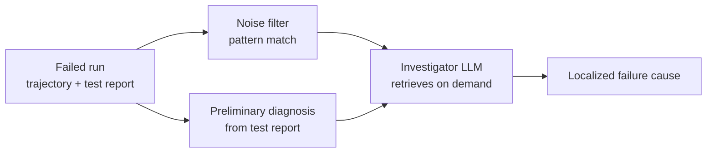

# Trajectory Pre-Filter for Failure Diagnosis (TrajAudit)

> Pre-filter long agent trajectories with pattern matching and seed an investigator LLM with a test-report-derived preliminary diagnosis so long-context attention concentrates on failure-relevant spans.

Two pre-filters wrap the investigator LLM after a coding agent has failed a repository-scale task: a pattern-matching noise filter that strips redundant program structure and verbose code context, and a preliminary diagnosis module that converts the test-failure report into prior hypotheses the investigator consults before traversing the trajectory ([TrajAudit, arxiv 2605.26563](https://arxiv.org/abs/2605.26563)).

## When This Applies

Confirm all three conditions before adopting:

- **Trajectory length exceeds the investigator's effective long-context budget.** TrajAudit targets repository-level runs whose trajectories are "very long, while long-context reasoning remains a known weakness of LLMs" ([arxiv 2605.26563](https://arxiv.org/abs/2605.26563)). Short trajectories that already fit the window do not benefit — the filter adds latency, not recall.
- **A structured test-failure report exists.** The preliminary diagnosis is seeded from the test-failure artifact; without one, the investigator has no prior to anchor on ([arxiv 2605.26563](https://arxiv.org/abs/2605.26563)).
- **Trajectory noise is dominated by predictable patterns.** Pattern matching only helps when "redundant program structure and verbose code context" compose the bulk of trajectory tokens ([arxiv 2605.26563](https://arxiv.org/abs/2605.26563)). Heterogeneous or context-dependent noise leaves the filter little to cut.

If any condition is missing, fall back to [agent debugging](agent-debugging.md) for the four-mode taxonomy, or [trajectory decomposition](../verification/trajectory-decomposition-diagnosis.md) when the goal is per-stage grading rather than root-cause localization.

## The Two Pre-Filters

### 1. Noise filter

Pattern matching and keyword detection strip failure-irrelevant content before the investigator sees it. The named targets are redundant program structure (repeated imports, scaffolding boilerplate) and verbose code context — full file dumps where a function suffices ([arxiv 2605.26563](https://arxiv.org/abs/2605.26563)). The filter is heuristic, not semantic: it compresses the attention budget, not the meaning.

### 2. Preliminary diagnosis

The test-failure report (stack trace, assertion failure, error message) becomes initial diagnostic hypotheses before the investigator traverses the trajectory. The hypotheses act as a prior — the investigator confirms, refines, or rejects them rather than starting from a blank slate against the full noisy trajectory ([arxiv 2605.26563](https://arxiv.org/abs/2605.26563)).

### 3. On-demand retrieval

The investigator pulls filtered spans on demand rather than ingesting everything — retrieval-augmented investigation, with the filter and the prior deciding what to pull next ([arxiv 2605.26563](https://arxiv.org/abs/2605.26563)).

## What the Evidence Shows

TrajAudit reports the following on RootSE, a benchmark of 93 real-world software-maintenance failure instances ([arxiv 2605.26563](https://arxiv.org/abs/2605.26563)):

| Metric | Result |
|--------|--------|
| Localization accuracy vs. baselines | +24.4 percentage points |
| Token consumption | At least 18% reduction |

These gains are RootSE-specific. Generalization to trajectories whose noise profile or test-report shape diverges from RootSE is not established.

## Why It Works

Long-context degradation is the load-bearing mechanism: models retrieve content at the start and end of a long window but lose it in the middle ([Liu et al., "Lost in the Middle", arxiv 2307.03172](https://arxiv.org/abs/2307.03172)). Trajectory noise consumes attention budget without aiding localization. Pre-filtering shifts it out of the budget, and the preliminary diagnosis anchors the first hypothesis so the investigator converges in fewer traversals ([arxiv 2605.26563](https://arxiv.org/abs/2605.26563)). Both compound: a shorter, denser, prior-anchored window is the regime LLMs handle best.

## When This Backfires

The technique adds infrastructure overhead and introduces failure modes of its own. Three conditions where it harms more than it helps:

1. **Bug lives in the filter's blind spot.** The noise filter is pattern-matching, not semantic. When the root cause sits in code the filter classifies as redundant — boilerplate that turned out to matter, a "scaffolding" file the bug routed through — the filter removes the evidence the investigator needs. Aggregate accuracy on a benchmark hides the false-negative rate on discarded spans.
2. **Symptom and cause are decoupled.** The preliminary diagnosis is seeded from the test-failure report, biasing the investigator toward the region consistent with the test's framing. When the symptom (assertion A fails) and root cause (state corrupted three calls earlier in module B) are decoupled, the prior anchors in the wrong place.
3. **No test-failure artifact.** Runtime bugs that pass tests but produce wrong output, agent loops without test runs, and open-ended generation tasks all lack the structured report the diagnosis module consumes. Without that seed, the second pre-filter contributes nothing and the noise-filter overhead remains.

A steelman of the opposite — feed the investigator the raw, unfiltered trajectory — is reasonable for small harnesses (<50k tokens), heterogeneous noise profiles, or workloads where dropping a critical line costs more than the latency saved. As long-context reasoning improves, the noise-filter layer's marginal value shrinks.

## Example

The TrajAudit evaluation runs on RootSE, 93 real-world failure instances drawn from software-maintenance tasks ([arxiv 2605.26563](https://arxiv.org/abs/2605.26563)). Walking through the pipeline on an illustrative instance from this class:

A repository-level coding agent fails a maintenance task. The captured trajectory holds file dumps, tool-call results, repeated imports, and intermediate diffs. The test runner emits an assertion failure with a stack trace pointing into one module.

**Without pre-filter** — the investigator LLM receives the full trajectory plus the test report. Localization scans the long trajectory against a vague prior; content near the centre is reached late or not at all.

**With pre-filter** —

1. Noise filter strips repeated imports, full file dumps where a function would suffice, and scaffolding boilerplate.
2. Preliminary diagnosis converts the stack trace into hypotheses anchored on the modules named in the trace and their direct callers.
3. The investigator retrieves filtered spans on demand, starting from those candidates, confirming or refining as it pulls more.

The LLM operates on a smaller, prior-anchored window — the regime its long-context attention handles well. The trade-off: if the root cause sits in code the noise filter classified as redundant, the investigator never sees it.

## Key Takeaways

- Two pre-filters wrap the investigator LLM: a pattern-matching noise filter and a preliminary diagnosis seeded from the test-failure report.
- The technique applies when trajectories are long enough that long-context degradation bites, a structured test-failure artifact exists, and trajectory noise is dominated by predictable patterns.
- Reported gains on RootSE are +24.4 percentage points in localization accuracy and at least 18% token reduction across 93 software-maintenance failure instances ([arxiv 2605.26563](https://arxiv.org/abs/2605.26563)).
- The mechanism is long-context degradation plus prior anchoring — the filter shifts irrelevant content out of the attention budget and the test-report-derived prior anchors the investigator's first hypothesis.
- Failure modes: filter blind spots drop evidence the investigator needs, symptom-cause decoupling anchors the prior in the wrong region, and absence of a test-failure artifact removes the second pre-filter's input.

## Related

- [Trajectory Decomposition: Diagnose Where Coding Agents Fail](../verification/trajectory-decomposition-diagnosis.md) — TRAJEVAL stage decomposition; grading-focused complement to this page's root-cause localization.
- [Agent Debugging: Diagnosing Bad Agent Output](agent-debugging.md) — the four-mode debugging taxonomy that classifies *why* an agent failed before tooling decides *where* in the trajectory.
- [Using the Agent to Analyze Its Own Evaluation Transcripts](../verification/agent-transcript-analysis.md) — manual / human-in-the-loop transcript review; this page automates a narrower failure-localization subset.
- [Offline Trajectory Replay for Multi-Agent Workflow Debugging](offline-trajectory-replay-multi-agent-debugging.md) — fixed-DAG replay with per-node rubrics; complementary localization tool for multi-agent workflows.
- [Observability Feedback Loop: A 7-Step Debug Runbook](observability-feedback-loop.md) — the broader runbook into which trajectory pre-filtering plugs as a localization step.
