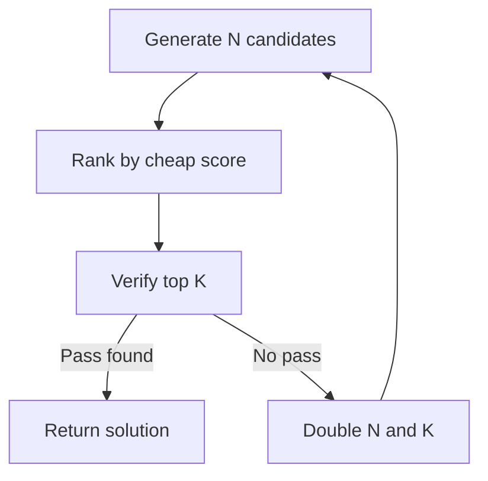

# Adaptive Generate-Rank-Verify Under Costly Verification

> Generate candidates cheaply, rank with a cheap signal, then spend the expensive verifier only on top-ranked candidates — used when verification dominates per-sample cost.

Adaptive Generate-Rank-Verify is a cost-sensitive search policy that runs at inference time. A generator emits N candidates. A cheap reward model scores each one. An expensive verifier then runs only on the top-ranked tail, following a progressive schedule. The verifier might be hidden-test execution, an LLM judge, or an external API check. The pattern applies when a single verifier call costs an order of magnitude more than a single generation, and when the cheap score is monotonically related to verifier-pass probability ([Dughmi et al., 2026](https://arxiv.org/abs/2605.17609)).

## When it applies

Three conditions must hold together. If any one fails, fixed-budget best-of-N is the right tool.

- Verifier cost far exceeds generator cost. Hidden-test execution for code candidates runs roughly 300 ms per sample, against negligible cost for exact-match rank scoring — a 300× ratio in code agents ([Aletheia, 2026](https://arxiv.org/pdf/2601.12186)). Below about 10×, orchestration overhead exceeds the saved verifier calls.
- Ranker is calibrated. Higher rank must mean higher verifier-pass probability. The formal assumption is monotonicity of the score-label relationship ([Dughmi et al., 2026](https://arxiv.org/abs/2605.17609)). Without it, the algorithm's optimality bound vanishes.
- N is large enough for the tail to matter. Below about 16 candidates with parallel verification, fixed-budget best-of-N wins on wall-clock latency, because the head of the rank distribution is sparse.

## The doubling schedule

ADAP is the algorithm proposed in [Dughmi et al. (2026)](https://arxiv.org/abs/2605.17609). It grows both the candidate pool and the number of top-ranked items verified, doubling at each shell until a pass appears or the budget runs out.



The expected cost stays within a constant factor of the distribution-aware optimum — the schedule an oracle would choose if it knew the score distribution and the success function ([Dughmi et al., 2026](https://arxiv.org/abs/2605.17609)). A lower bound, proved with centered star numbers, shows that no algorithm does better than constant-factor competitiveness without structural assumptions on the score-label relationship.

## Why it works

Under monotonicity, the information value per verifier call concentrates at the top of the rank distribution. The marginal probability that the next verification yields the first success is highest among top-ranked items, and it decays down the list ([Dughmi et al., 2026](https://arxiv.org/abs/2605.17609)). Meanwhile, an extra generation costs orders of magnitude less than an extra verification when verification runs tests or judge calls ([Aletheia, 2026](https://arxiv.org/pdf/2601.12186)). So you generate freely until the head of the rank distribution is dense, then spend verifier dollars only on that head. This is provably within a constant of optimal. [Snell et al. (2024)](https://arxiv.org/abs/2408.03314) measured the same broad principle at the test-time compute level: prompt-conditional adaptive allocation beat uniform scaling by over 4× under matched FLOPs on MATH. The doubling schedule produces the constant-factor guarantee, because each shell either finds a passing candidate or rules out the previous regime.

## When this backfires

The optimality result is conditional. The pattern degrades or inverts under common deployment regimes.

| Failure condition | Symptom | What to do instead |
|---|---|---|
| Reward-hacked ranker | High-rank candidates are systematically gamed — PRM reward >0.9 while ground-truth accuracy <4% on AIME ([Reward Under Attack, 2026](https://arxiv.org/pdf/2603.06621)) | Verify a random sample, not the rank top; or retrain the ranker with anti-hacking objectives |
| Cheap verifier | Verifier runs sub-second per candidate | Fixed-budget best-of-N with full parallelism |
| Small N (≤ 16) | Wall-clock latency dominated by sequential rank-verify dependencies | Parallel best-of-N; ADAP gains compound only at larger N |
| Outcome-only verifier with false positives | Verifier passes on right-answer-wrong-reasoning ([Right Is Not Enough, 2026](https://arxiv.org/pdf/2506.06877)) | Pair with stricter verifiers; use this pattern only when verifier ≈ ground truth |
| Heterogeneous query mix | Score distribution drifts across queries — easy lookups, hard math, ambiguous code share one pipeline | Bucket by query difficulty; apply ADAP within buckets, not across them |

If you run an LLM-judge that you have not calibrated against the production distribution, treat the monotonicity assumption as untested — and the optimality claim as unsupported.

## Example

A code-generation agent uses an LLM-judge verifier at about $0.03 per call and an embedding-based reranker at about $0.00003 per candidate — about a 1000× ratio:

```python
def adap_search(prompt, max_shells=4, initial_n=4):
    """Doubling-shell generate-rank-verify per Dughmi et al. (2026).

    Each shell: generate N, rank all, verify top K=N/2.
    On no pass, double N and re-enter.
    """
    n = initial_n
    for shell in range(max_shells):
        candidates = generator.sample(prompt, n=n)
        scores = ranker.score(candidates)            # cheap
        top_k = sorted(zip(scores, candidates), reverse=True)[: n // 2]
        for _, candidate in top_k:
            if verifier.run(candidate):              # expensive
                return candidate
        n *= 2
    return None
```

The order matters. Generating the full final-shell N up front is fine — generation is cheap. Verifying anything beyond the rank top of each shell is not — that is the budget the schedule is allocating.

## Key Takeaways

- Use when verifier-to-generator cost ratio exceeds ~10× and N is large; below that, fixed-budget best-of-N wins on latency.
- The monotonicity assumption — rank correlates with verifier-pass probability — is load-bearing. Reward-hacked rankers (PRMs trained against gameable signals) invert the gains.
- The doubling schedule gives a constant-factor guarantee against a distribution-aware oracle; the constant can be large when the score-label distribution is unknown ([Dughmi et al., 2026](https://arxiv.org/abs/2605.17609)).
- ADAP optimizes verifier-pass rate, not solution quality. Pair with strict verifiers or accept the false-positive floor of outcome-only checking ([Right Is Not Enough, 2026](https://arxiv.org/pdf/2506.06877)).

## Related

- [Dual-Budget Control for Search Agents](dual-budget-control-search-agents.md) — VOI-per-unit-budget allocation across retrieve/decompose/commit when both tool calls and tokens bind; ADAP allocates across generate/verify when verification dominates
- [Reasoning Budget Allocation: The Reasoning Sandwich](reasoning-budget-allocation.md) — Allocate reasoning depth across planning/execution/verification phases; ADAP allocates verifier calls across rank positions within a single phase
- [Evaluator-Optimizer Pattern](evaluator-optimizer.md) — Generator-evaluator refinement loop without cost asymmetry; ADAP is its cost-sensitive variant for the regime where the evaluator is the expensive step
- [Cost-Aware Agent Design](../../token-engineering/cost-aware-agent-design.md) — Match model capability to task complexity; ADAP is the sample-level analogue for matching verifier spend to candidate rank
- [Anti-Reward-Hacking](../../verification/anti-reward-hacking.md) — Counter-measures for when the cheap ranker can be gamed — required reading before relying on rank-top verification
