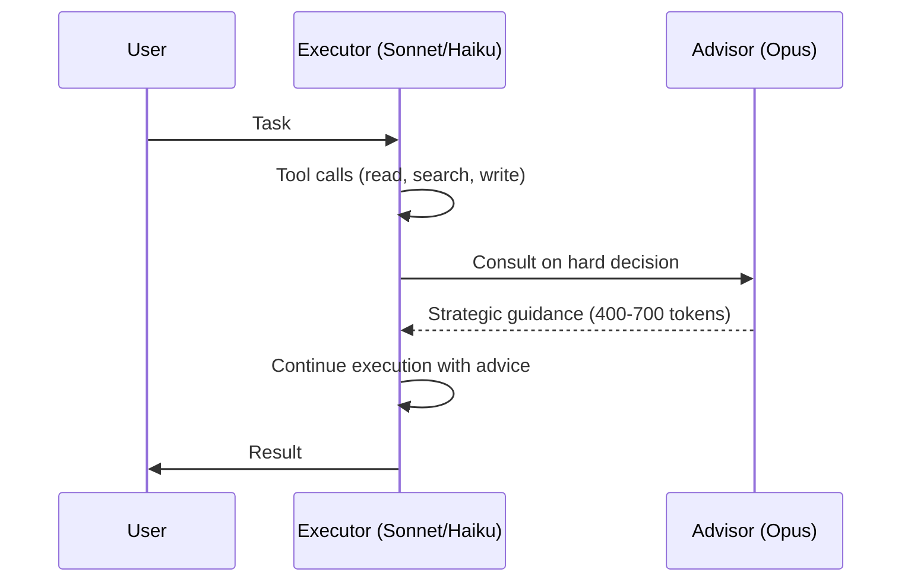

# The Advisor Strategy: Frontier Model as Strategic Advisor

> Pair a cost-effective executor model with a frontier advisor that provides strategic guidance on hard decisions — within a single API call, no orchestration required.

## The pattern

Most agent turns are mechanical: reading files, running commands, writing code. A few need strategic reasoning, such as choosing an architecture, recovering from a dead end, or verifying completeness. An Opus call on every turn wastes compute. A Haiku-class executor alone misses the critical decisions.

The advisor strategy separates these at the API level. A cost-effective executor (Sonnet or Haiku) handles tool use. On hard decisions it consults a frontier advisor (Opus) that reads the full transcript and returns strategic guidance. Anthropic's [`advisor_20260301` tool](https://platform.claude.com/docs/en/agents-and-tools/tool-use/advisor-tool) runs this server-side in a single `/v1/messages` request, with no decomposition logic and no extra round-trips.



## How it works

The executor decides when to call the advisor. The server then runs a separate inference pass over the executor's full transcript. The advisor returns text guidance only: the server drops thinking blocks, allows no tool calls, and produces no user-facing output. The executor takes that advice and resumes its own [reasoning-versus-execution](cognitive-reasoning-execution-separation.md) work.

## API integration

Add the advisor to `tools` alongside your existing tools. The beta header `advisor-tool-2026-03-01` is required ([API docs](https://platform.claude.com/docs/en/agents-and-tools/tool-use/advisor-tool)):

```python
response = client.beta.messages.create(
    model="claude-sonnet-5",            # executor
    max_tokens=4096,
    betas=["advisor-tool-2026-03-01"],
    tools=[
        {
            "type": "advisor_20260301",
            "name": "advisor",
            "model": "claude-opus-4-8",  # advisor
            "max_uses": 3,               # per-request cap
        },
        # ... your other tools
    ],
    messages=[...],
)
```

| Parameter  | Type    | Default   | Purpose |
|-----------|---------|-----------|---------|
| `type`     | string  | required  | Must be `"advisor_20260301"` |
| `model`    | string  | required  | Advisor model ID — billed at this model's rates |
| `max_uses` | integer | unlimited | Per-request cap on advisor calls |
| `caching`  | object  | off       | Advisor-side prompt caching; breaks even at ~3 calls per conversation |

The advisor must be Sonnet 4.6+ and at least as capable as the executor (equal-capability models can advise each other). It's beta on Claude API and AWS Claude Platform — not Bedrock, Google Cloud, or Foundry — and ZDR-eligible ([docs](https://platform.claude.com/docs/en/agents-and-tools/tool-use/advisor-tool)).

## Benchmark results

From [Anthropic's announcement](https://claude.com/blog/the-advisor-strategy):

| Configuration | Benchmark | Result | Cost Impact |
|--------------|-----------|--------|-------------|
| Haiku + Opus advisor | BrowseComp | 41.2% vs 19.7% solo (+109%) | 85% cheaper than Sonnet alone |
| Sonnet + Opus advisor | SWE-bench Multilingual | +2.7pp over Sonnet solo | -11.9% cost per agentic task |

## When to consult the advisor

The advisor pays off on decisions that cost a lot downstream if you get them wrong. Anthropic's [recommended timing](https://platform.claude.com/docs/en/agents-and-tools/tool-use/advisor-tool) for coding is:

1. After initial exploration. Once the executor understands the problem, consult the advisor before committing to an approach.
2. When stuck. Consult when errors keep recurring or the approach is not converging.
3. Before declaring done. Make the deliverable durable first by writing the file and committing the change, then consult for a final review.

## Cost controls

Advisor tokens bill at Opus rates, and executor tokens bill at executor rates. Savings come from the advisor producing only short guidance, not the full output ([API docs](https://platform.claude.com/docs/en/agents-and-tools/tool-use/advisor-tool)).

- Per-request cap: set `max_uses` to limit advisor calls per request.
- Conversation-level cap: track this client-side. At the ceiling, remove the advisor from `tools` and strip `advisor_tool_result` blocks from history.
- Output compression: a per-message instruction such as "keep guidance under 80 words" shortens the output. Anthropic recommends asking for about 80% of your true ceiling, since the advisor occasionally exceeds it.
- Effort pairing: Sonnet at medium [effort](https://platform.claude.com/docs/en/agents-and-tools/tool-use/advisor-tool) plus an Opus advisor matches Sonnet at default effort.

## When this backfires

Each consultation is a second inference pass at Opus rates. A single strong model is better when ([API docs](https://platform.claude.com/docs/en/agents-and-tools/tool-use/advisor-tool)):

- The executor consults often. Frequent calls shift the token mix toward Opus rates and can exceed the cost of Opus alone.
- Every turn needs frontier capability. Uniformly hard tasks offer no mechanical turns to offload.
- The task is single-turn question-and-answer or pass-through routing. There is no plan to form.
- Latency budgets are tight. Each call pauses the executor stream while Opus runs.
- Priority Tier covers only the executor. It does not cascade to the advisor, which rate-limits on its own.

## Relationship to general patterns

The advisor strategy is an API-native form of established patterns:

- [Cognitive reasoning versus execution separation](cognitive-reasoning-execution-separation.md): the advisor is the reasoning layer and the executor is the execution layer, with the boundary enforced server-side.
- [Cost-aware agent design](../../token-engineering/cost-aware-agent-design.md): route models by complexity without manual cascade logic.
- [Reasoning budget allocation](reasoning-budget-allocation.md): build the reasoning sandwich through selective advisor calls rather than per-phase model switching.

## Key Takeaways

- The advisor strategy pairs a cost-effective executor with a frontier advisor consulted only on hard decisions — no orchestration code required.
- A single API call handles the full flow: the executor invokes the advisor like any other tool, and the server manages context routing.
- Haiku + Opus advisor more than doubles standalone BrowseComp performance at 85% less cost than Sonnet alone.
- Cap advisor calls with `max_uses` (per-request) and client-side tracking (per-conversation) to control spend.
- Call the advisor after exploration, when stuck, and before declaring done — skip it on mechanical turns.

## Related

- [Cognitive Reasoning vs Execution: A Two-Layer Agent Architecture](cognitive-reasoning-execution-separation.md)
- [Cost-Aware Agent Design](../../token-engineering/cost-aware-agent-design.md)
- [Reasoning Budget Allocation](reasoning-budget-allocation.md)
- [Heuristic-Based Effort Scaling](heuristic-effort-scaling.md)
- [Evaluator-Optimizer Pattern](evaluator-optimizer.md)
- [Agent Turn Model](agent-turn-model.md)
