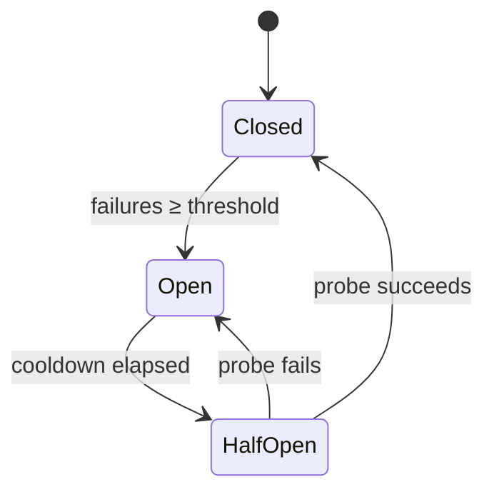

<!-- source: nibzard/awesome-agentic-patterns (Apache 2.0, https://github.com/nibzard/awesome-agentic-patterns) — retain attribution per license -->

# Agent Circuit Breaker

> A per-tool circuit breaker tracks each external tool's failures and blocks calls once it degrades, stopping agents from burning tokens on retry loops.

## The problem

When an external tool (API, search engine, code executor) degrades mid-session, most agents enter retry loops. Each failed call consumes tokens, and the loop runs until context is exhausted or the session is abandoned. Backoff does not solve this — it delays the waste rather than prevents it, a recovery gap cataloged in [Exception Handling and Recovery Patterns](exception-handling-recovery-patterns.md).

The circuit breaker pattern, adapted from distributed systems, tracks per-tool failure rates and disables broken endpoints. Agents then try alternatives or degrade gracefully instead of repeating calls that will fail.

## State machine

An independent three-state machine tracks each tool ([nibzard/awesome-agentic-patterns](https://github.com/nibzard/awesome-agentic-patterns/blob/main/patterns/agent-circuit-breaker.md)):

| State | Behavior |
|-------|----------|
| Closed | Normal operation. Failures are counted. |
| Open | All calls blocked immediately — the agent receives `CircuitOpenError`, no invocation, no tokens spent. |
| Half-Open | One probe call allowed to test recovery. Success resets to Closed; failure returns to Open. |

This is what sets the pattern apart from simple retry: in Open state the agent never makes the call.

## Configuration

Thresholds vary by tool class: fast tools fail and recover quickly; slow tools need more patience before declaring failure. The values below are starting-point heuristics from [nibzard/awesome-agentic-patterns](https://github.com/nibzard/awesome-agentic-patterns/blob/main/patterns/agent-circuit-breaker.md) — optimal values vary by latency profile and require empirical tuning per workload:

| Tool type | Failure threshold | Cooldown |
|-----------|-------------------|----------|
| Fast APIs (search, weather) | 3 failures | 30 s |
| Slow tools (web scraping, compilation) | 2 failures | 120 s |
| Code executors | 2 failures | 60 s |

State is session-scoped: breakers reset between sessions, since a tool degraded in one session may recover before the next.

## Graceful degradation

Circuit breakers only help if agents respond to `CircuitOpenError` by trying alternatives rather than stopping. This requires four things:

1. System prompt awareness — the agent must know which tools are unavailable. Update the system prompt or add a `tool-status` context block when a circuit opens.
2. Fallback routing — the agent tries an alternative tool for the same operation, for example a secondary search API when the primary opens.
3. Explicit acknowledgment — if no alternative exists, the agent reports the degradation to the user rather than silently looping.
4. Human escalation — for high-stakes operations with no alternative, route the circuit-open state to a [confirmation gate](../../security/human-in-the-loop-confirmation-gates.md) or [deferred permission request](deferred-permission-pattern.md). The breaker stops the waste; the gate keeps progress reachable.

Without this logic, the breaker stops token waste but also stops progress — both components are needed.

## Distinct from loop-level circuit breakers

This pattern operates at the tool call level — each tool has its own state machine. That differs from loop-level stopping mechanisms (iteration limits, cost thresholds, repetition detection) covered in [Circuit Breakers for Agent Loops](../../observability/circuit-breakers.md), which act on the overall execution loop.

The two are complementary: loop-level breakers prevent runaway agents; tool-level breakers prevent token waste from degraded dependencies.

## When this backfires

Circuit breakers add overhead that outweighs the benefit in several common scenarios:

- Tools are locally hosted or highly reliable — state tracking and threshold tuning add indirection with no payoff when the tool never degrades. Measure failure rates first.
- Single-shot or short sessions — the pattern assumes repeated invocations (a single [agent turn](agent-turn-model.md) is often many tool calls) where retry compounding is possible. An agent that calls each tool once pays the configuration cost for nothing.
- Transient errors are the norm — a fast API with brief blips opens circuits needlessly if the threshold is too tight, blocking calls that would succeed on retry. False positives are harder to debug than the waste they prevent.
- No fallback exists — without graceful degradation the circuit opens and the agent stalls anyway; pairing the breaker with a [confirmation gate](../../security/human-in-the-loop-confirmation-gates.md) keeps progress reachable while the state machine stops the waste.
- Agent updates system prompt dynamically — injecting tool-status context when a circuit opens risks prompt injection or context pollution in security-sensitive deployments.
- Failures are semantic, not transport-level — LLM-backed tools routinely return HTTP 200 while producing hallucinated output. A counter keyed on transport errors never trips, so the circuit stays Closed while the agent burns tokens on bad responses ([Hannecke, 2025](https://medium.com/@michael.hannecke/resilience-circuit-breakers-for-agentic-ai-cc7075101486); [Pan, 2026](https://tianpan.co/blog/2026-04-14-treating-your-llm-provider-as-an-unreliable-upstream)). Detecting these needs inline quality evaluation alongside the state machine.
- Multiple agents share the failing tool — per-session state cannot prevent retry storms when parallel agents hit the same endpoint; ten workers retrying three times each send thirty requests to a dead service. Multi-agent deployments need a shared breaker store (a `failed_services` reducer in graph state or a Redis-backed registry) with per-node retries disabled on shared tools ([LifeTidesHub, 2026](https://www.lifetideshub.com/retry-storms-multi-agent-systems/)).

## Key Takeaways

- Track failure state per-tool, not globally — one degraded API should not block unrelated tool calls
- Open state must block calls entirely, not just slow them — delayed retries still waste tokens
- Half-Open state enables automatic recovery without manual intervention or session restart
- Graceful degradation (fallback routing or user notification) is required alongside the circuit breaker; the state machine alone only stops waste, it does not preserve progress
- State is session-scoped by default; persistent state across sessions adds complexity without proportional benefit for most agent use cases

## Related

- [Exception Handling and Recovery Patterns](exception-handling-recovery-patterns.md) — broader taxonomy of agent failure modes and recovery strategies
- [Tail Control for Agent Workflows](tail-control-for-agent-workflows.md) — the workflow-level reliability framing the breaker fits inside; pairs the state-machine bound with hedged re-draws and percentile-based SLOs
- [Circuit Breakers for Agent Loops](../../observability/circuit-breakers.md) — loop-level stopping mechanisms (iteration limits, cost thresholds)
- [Rollback-First Design: Every Agent Action Should Be Reversible](rollback-first-design.md) — designing operations to be undoable when failures occur
- [Agent Backpressure: Automated Feedback for Self-Correction](agent-backpressure.md) — using automated signals to steer agents away from failure states
- [Human-in-the-Loop Confirmation Gates](../../security/human-in-the-loop-confirmation-gates.md) — the escalation target when a circuit opens on a high-stakes operation with no fallback
- [Deferred Permission Pattern](deferred-permission-pattern.md) — request approval at first attempt; circuit-open is a natural trigger for the deferral
- [Unbounded Consumption: Bounding Agent Resource Use Against DoS and Denial-of-Wallet](../../security/unbounded-consumption-resource-bounds.md) — the five-bound surface (per-call, per-task, fan-out, velocity, budget) that this tool-level breaker complements
