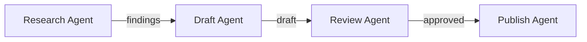
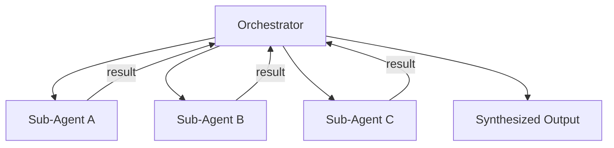
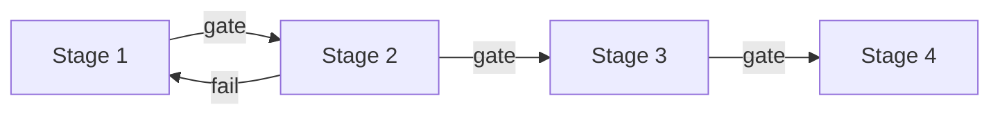

# Agent Composition Patterns for Multi-Agent Workflows

> Multi-agent workflows follow four structural patterns — sequential chains, parallel fan-out, staged pipelines, and supervisor coordination — each suited to a different task structure.

Related lesson: [Sub-Agents and Orchestration](https://learn.agentpatterns.ai/harness-engineering/sub-agents-and-orchestration/), a hands-on lesson with quizzes.

!!! note "Also known as"
    Parallel Dispatch, Scatter-Gather, Orchestrator-Worker, Sub-Agents Fan-Out. For specific variants, see [Fan-Out Synthesis](../multi-agent/fan-out-synthesis.md), [Orchestrator-Worker](../multi-agent/orchestrator-worker.md), and [Sub-Agents Fan-Out](../multi-agent/sub-agents-fan-out.md).

## Why composition

A single agent hits two limits: context runs out, and scope blurs across too many concerns. Composition splits the work across agents, each with a narrow scope and its own context. The wrong pattern adds overhead.

## Sequential chain

Each agent's output feeds the next. A → B → C.



When to use: strict dependencies, where B cannot start until A completes.

Trade-off: no parallelism, so latency accumulates across steps.

Example: a content pipeline (research → draft → review → publish), or the [evaluator-optimizer](evaluator-optimizer.md) loop as a two-stage chain.

### Multi-phase chain tactics

Production chains span four phases ([Source: ClaudeLog](https://claudelog.com/mechanics/custom-agent-tactics)): research, analysis, implementation, and validation. Each handoff is an explicit artifact: a findings document, patch set, or test report.

In Claude Code, chain subagents through the main conversation, each completing before the next dispatches ([Sub-Agents docs](https://code.claude.com/docs/en/sub-agents)):

```
Use the code-reviewer subagent to find performance issues,
then use the optimizer subagent to fix them
```

Subagents cannot spawn others — the main conversation coordinates chaining.

## Parallel fan-out

One agent spawns N sub-agents for independent work, then synthesizes the results.



When to use: N independent tasks, such as reviewing N files, fetching N URLs, or analyzing N data sources.

Trade-off: fast, because the work runs in parallel. The orchestrator must then synthesize the results (see [Fan-Out Synthesis](../multi-agent/fan-out-synthesis.md)).

Example: parallel reviewers for code quality, type safety, and test coverage, each with its own context window. See [Sub-Agents for Fan-Out](../multi-agent/sub-agents-fan-out.md) and [Specialized Agent Roles](specialized-agent-roles.md).

## Pipeline

Sequential stages with quality gates — chains with explicit validation at each boundary.



When to use: repeatable processes where each stage's output quality gates progress, like the [command](agents-vs-commands.md) layer.

Trade-off: explicit pass or fail at each boundary, with feedback loops on failure.

Example: a CI/CD pipeline — build → test → security scan → deploy. Each gate blocks until criteria are met.

## Supervisor

A coordinator agent decides what to delegate, to whom, and when.

When to use: tasks where the sequence and delegation targets are not known upfront.

Trade-off: more flexible but harder to debug. The supervisor needs enough context to delegate well (see [Delegation Decision](delegation-decision.md)).

Example: an agent receives "make this codebase production-ready" and decomposes it into security review, test coverage, and documentation.

## Choosing the right pattern

| Pattern | Task structure | Parallelism | Flexibility |
|---------|---------------|-------------|-------------|
| Chain | Strict dependencies | No | Low |
| Fan-Out | Independent parallel tasks | Yes | Low |
| Pipeline | Repeatable stages with gates | Stage-level | Medium |
| Supervisor | Unknown or dynamic task structure | Dynamic | High |

Start with the simplest pattern — chains and fan-out cover most cases.

## Agent portability

In Claude Code, a subagent is a `.md` file in `.claude/agents/` (project-scoped) or `~/.claude/agents/` (user-scoped) ([Sub-Agents docs](https://code.claude.com/docs/en/sub-agents)). Check agents into version control.

Use tool discovery (Glob, Grep) instead of hardcoded paths, so agents adapt to any repo.

## Weak-model specialization

Route narrow tasks to cheaper models (Haiku) and keep capable models (Sonnet) for complex work ([Anthropic: Building Effective Agents](https://www.anthropic.com/engineering/building-effective-agents); see [Anthropic's Effective Agents Framework](anthropic-effective-agents-framework.md) for the full map). Claude Code's Explore subagent defaults to Haiku for read-only search ([Sub-Agents docs](https://code.claude.com/docs/en/sub-agents)):

```yaml
---
name: lint-checker
description: Run linting and report issues
tools: Bash, Read
model: haiku
---
```

## Situational agent activation

Activate agents through CLI flags instead of coordinator judgment. Claude Code's `--agents` flag defines session-scoped agents as JSON ([Sub-Agents docs](https://code.claude.com/docs/en/sub-agents)):

```bash
claude --agents '{
  "code-reviewer": {
    "description": "Expert code reviewer. Use proactively after code changes.",
    "prompt": "You are a senior code reviewer...",
    "tools": ["Read", "Grep", "Glob", "Bash"],
    "model": "sonnet"
  }
}'
```

## Example

A documentation site audit needs to lint every page, check links, and validate frontmatter. The tasks are independent per page, so fan-out fits:

```markdown
<!-- .claude/agents/audit-orchestrator.md -->
---
description: Fan out one audit-worker per page, collect results
tools: Bash, Glob, Grep, Read
---

Glob for all `docs/**/*.md` files. For each file, dispatch the
`audit-worker` subagent with the file path. Collect each worker's
JSON result and merge into a single report.
```

```markdown
<!-- .claude/agents/audit-worker.md -->
---
description: Lint, check links, validate frontmatter for one page
tools: Bash, Read, Grep
---

1. Lint the page for formatting errors.
2. Extract internal links and verify each target exists.
3. Validate frontmatter has required fields.
Return a JSON object with the page path and findings.
```

Each worker runs a sequential chain internally (lint → links → frontmatter), while the orchestrator fans out across pages. This nests two patterns: fan-out at the top level, and a lint → links → frontmatter chain within each worker.

If the audit later needs a gate — pages with critical findings block deployment — wrap the fan-out in a pipeline with a quality gate after synthesis.

## Anti-patterns

One mega-agent: context fills before work completes. Decompose when one prompt cannot hold all concerns.

Over-decomposition: coordination costs tokens. Decompose only when context limits or parallelism require it.

## Production failure modes

Composition does not remove context exhaustion — it relocates it. Two failure modes recur across the four patterns:

- Silent drift in chains and supervisors: each downstream agent trusts the previous output as ground truth without checking it against the original task spec. A subtly wrong artifact at step 1 compounds through step N before anyone notices ([Glen Rhodes, March 2026](https://glenrhodes.com/agent-orchestration-failure-modes-silent-drift-reconciliation-and-the-supervision-mindset-shift/); [VentureBeat, April 2026](https://venturebeat.com/infrastructure/context-decay-orchestration-drift-and-the-rise-of-silent-failures-in-ai-systems)). Add a reconciliation step that checks each handoff against the brief.
- Orchestrator context overflow in fan-out: when N workers each return multi-thousand-token findings, the orchestrator's context fills before it can reason over all results ([Qubytes, May 2026](https://qubytes.substack.com/p/fan-out-agent-pipeline-production-failure-modes)). Compress worker outputs to summaries, or use external state with reference pointers, before the orchestrator synthesizes.

## FAQ

**Can subagents spawn their own subagents?**

No. In Claude Code, a subagent cannot dispatch further subagents — only the main conversation can chain agents together, dispatching each in turn as prior steps complete ([Sub-Agents docs](https://code.claude.com/docs/en/sub-agents)). This caps composition to one level of delegation: an orchestrator can fan out to workers, but those workers cannot recursively spawn their own sub-workers.

**What separates a pipeline from a plain sequential chain?**

A chain passes output from one agent to the next with no validation in between; a pipeline adds an explicit quality gate at each stage boundary, so a stage's output must meet criteria before the next stage starts, and a failing gate can loop back to an earlier stage. Use a pipeline when repeatable stages need enforced pass/fail checks, like a CI/CD flow of build → test → security scan → deploy.

**When does a supervisor pattern beat a fixed pipeline?**

Use a supervisor when the sequence of steps and which agents to delegate to aren't known upfront — a coordinator agent decides what to delegate, to whom, and when, rather than following a preset stage order. This trades a fixed, predictable flow for flexibility: for example, an agent given "make this codebase production-ready" decomposing that into security review, test coverage, and documentation work.

**How do I control cost when composing multiple agents?**

Route narrow, well-defined subtasks to cheaper models like Haiku and reserve capable models like Sonnet for complex reasoning ([Anthropic: Building Effective Agents](https://www.anthropic.com/engineering/building-effective-agents)). Claude Code's built-in Explore subagent already defaults to Haiku for read-only search ([Sub-Agents docs](https://code.claude.com/docs/en/sub-agents)), a pattern worth mirroring when defining custom subagents for narrow, repetitive work.

## Key Takeaways

- Four patterns cover most multi-agent work: chains for strict dependencies, fan-out for independent parallel tasks, pipelines for staged work with quality gates, and supervisors for dynamic delegation.
- Start with the simplest pattern. Chains and fan-out handle the majority of cases; reach for pipelines or supervisors only when gates or unknown task structure demand them.
- Composition relocates context exhaustion rather than removing it — guard against silent drift in chains/supervisors with handoff reconciliation, and against orchestrator context overflow in fan-out by compressing worker outputs ([Glen Rhodes, March 2026](https://glenrhodes.com/agent-orchestration-failure-modes-silent-drift-reconciliation-and-the-supervision-mindset-shift/)).
- Patterns nest: a fan-out of workers that each run an internal chain is common, and a fan-out can be wrapped in a pipeline when synthesis needs a quality gate.

## Related

- [Fan-Out Synthesis Pattern](../multi-agent/fan-out-synthesis.md)
- [Orchestrator-Worker Pattern](../multi-agent/orchestrator-worker.md)
- [Sub-Agents for Fan-Out Research and Context Isolation](../multi-agent/sub-agents-fan-out.md)
- [Specialized Agent Roles](specialized-agent-roles.md)
- [Agents vs Commands: Separation of Role and Workflow](agents-vs-commands.md)
- [Agent Handoff Protocols](../multi-agent/agent-handoff-protocols.md)
- [Delegation Decision](delegation-decision.md)
- [The Orchestrator's Attention Budget](orchestrator-attention-budget.md) — the attention-dilution counterpart to the overflow failure above
- [Evaluator-Optimizer](evaluator-optimizer.md)
