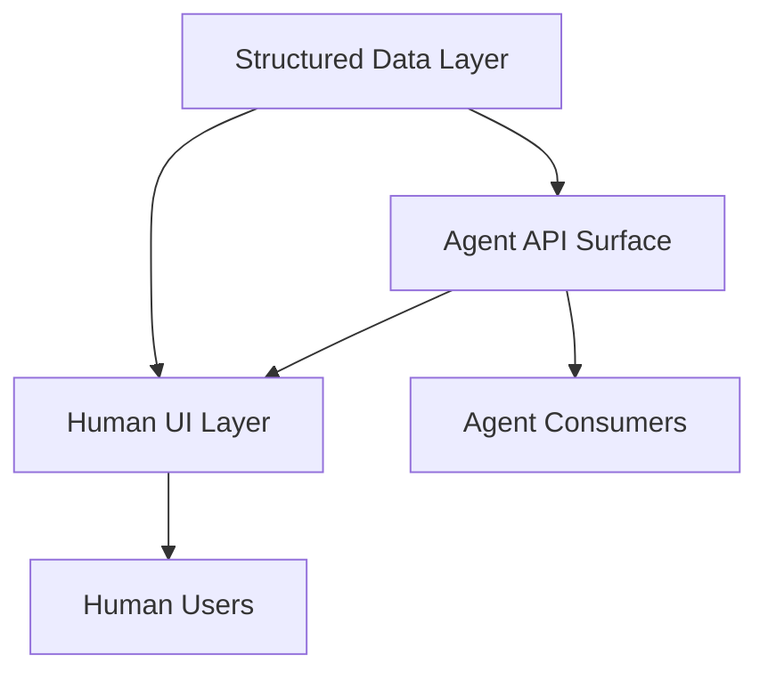

# Agent-First Software Design

> Agent-first software design architects systems where AI agents are primary consumers — machine-readable APIs and structured outputs replace visual UIs as the default interaction surface.

## The agent-first inversion

Traditional software design optimizes for human comprehension: dashboards, forms, and visual hierarchies. Agent-first design inverts this. The main consumer is a program that reads structured data, calls APIs, and acts on machine-readable state exposed through interfaces like MCP. Human interfaces become a layer on top, not the foundation.

This does not remove humans from the loop. You design the data and control plane for machines first, then render human-friendly views from the same source — the [agent-computer interface](../../tool-engineering/agent-computer-interface.md) approach. Anthropic frames this as the [agent-computer interface (ACI)](../../tool-engineering/agent-computer-interface.md), and puts the same design effort into machine-facing interfaces as into human-computer interfaces (HCI).

## Design principles

### Structured over visual

Replace dashboards with queryable APIs. Where a human reads a status page, an agent reads a JSON endpoint. The structured format is the primary artifact.

| Human-First | Agent-First |
|-------------|-------------|
| Status dashboard | `/status` JSON endpoint |
| Form-based configuration | Declarative config files |
| Visual diff viewer | Structured diff API |
| Notification emails | Webhook events with typed payloads |

### Self-describing interfaces

Agent-consumable APIs need richer metadata than human-facing ones. Anthropic recommends putting the same engineering effort into tool documentation as into the agent prompt itself. Every endpoint, parameter, and response field benefits from a description an LLM can read without external documentation. OpenAPI 3.0+ specifications with complete `description` fields on all components serve as both documentation and agent instruction.

### Poka-yoke tool design

Anthropic's SWE-bench work showed that [tool interfaces should make mistakes structurally impossible](https://www.anthropic.com/research/building-effective-agents). When their agent used relative filepaths, it made errors after changing directories. Switching to mandatory absolute filepaths removed the error class entirely. Design inputs so wrong usage fails at the interface level, not at runtime — the [poka-yoke](../../tool-engineering/poka-yoke-agent-tools.md) principle.

### Deterministic over probabilistic

Agents perform best against APIs with predictable behavior. [Idempotent operations](idempotent-agent-operations.md), consistent error formats, and stable response schemas cut the reasoning an agent must do per call. Every ambiguity in an API response is a potential failure point.

## Early examples

[llms.txt](https://llmstxt.org) is a standard file that gives LLM-friendly site metadata, so agents can navigate a project without crawling every page.

[Model Context Protocol (MCP)](https://modelcontextprotocol.io) is an open standard that connects agents to external tools and data sources. MCP servers expose capabilities in a structured, discoverable format that agents consume programmatically.

[Agent Cards](../../standards/agent-cards.md) are machine-readable capability declarations that let agents discover what other agents can do. The [A2A protocol](../../standards/a2a-protocol.md) made agent cards its discovery mechanism for multi-agent composition.

[OpenAPI as tool spec](../../standards/openapi-agent-tool-spec.md): API specifications written for human developers double as agent tool definitions once you enrich them with descriptive metadata and clear parameter constraints. An OpenAPI operation maps directly to the tool schema fields agents consume.

## The layering pattern

Agent-first does not mean agent-only. The pattern layers interfaces:



The structured data layer is the single source of truth. Both agent and human interfaces derive from it, preventing divergence between what the API and UI report.

## Trade-offs

Reduced human observability. When the main interface is machine-readable, you need an explicit human UI layer to see system state.

Higher upfront metadata cost. Self-describing APIs need a `description`, examples, and constraints for every field — more work than a minimal API with separate docs. The payoff: agents consume the API without custom integration code.

Premature optimization risk. This pattern pays off most for platforms that many agents consume, not for internal tools with a single human user.

## Example

This OpenAPI 3.1 fragment shows the same endpoint designed first for humans, then improved for agents. The agent-first version adds `description` fields on every parameter and response property so an LLM can interpret the interface without reading external documentation.

```yaml
# Before: human-first — minimal metadata
paths:
  /deployments:
    post:
      summary: Create deployment
      requestBody:
        content:
          application/json:
            schema:
              type: object
              properties:
                env:
                  type: string
                ref:
                  type: string
```

```yaml
# After: agent-first — self-describing, poka-yoke parameters
paths:
  /deployments:
    post:
      summary: Trigger a production deployment for a given git ref
      description: >
        Idempotent — submitting the same ref twice returns the existing
        deployment record rather than creating a duplicate.
      requestBody:
        required: true
        content:
          application/json:
            schema:
              type: object
              required: [env, ref]
              properties:
                env:
                  type: string
                  enum: [staging, production]
                  description: >
                    Target environment. Must be "production" for live traffic.
                    Use "staging" for pre-release validation.
                ref:
                  type: string
                  pattern: '^[0-9a-f]{40}$'
                  description: >
                    Full 40-character SHA-1 git commit hash. Short hashes and
                    branch names are rejected to prevent ambiguous deployments.
                  example: "a3f2c1d4e5b6789012345678901234567890abcd"
      responses:
        "200":
          description: Deployment already exists for this ref; returns existing record.
        "201":
          description: New deployment created and queued.
```

The `enum` constraint on `env` and the SHA-1 `pattern` on `ref` make wrong usage fail at the interface level — the [poka-yoke principle](../../tool-engineering/poka-yoke-agent-tools.md) applied to an API. An agent calling this endpoint cannot accidentally pass a branch name or an ambiguous short hash.

## Key Takeaways

- Design data and control planes for machine consumption first; render human views from the same substrate.
- Invest in agent-computer interfaces (ACI) with the same rigor as HCI.
- llms.txt, MCP, and enriched OpenAPI are early agent-first implementations.
- Agent-first does not mean agent-only — human observability requires explicit investment.

## Related

- [AX/UX/DX Triad](ax-ux-dx-triad.md) — treats agent experience, user experience, and developer experience as separate design surfaces in agent systems
- [Cognitive Reasoning vs Execution](cognitive-reasoning-execution-separation.md) — separating the agent layer that decides from the layer that acts, with typed tool interfaces enforcing the boundary
- [Token-Efficient Tool Design](../../token-engineering/token-efficient-tool-design.md) — shaping tool surfaces for agent consumption
- [llms.txt: Spec, Adoption, and Honest Limitations](../../geo/llms-txt.md) — an early agent-first standard for site metadata
- [MCP: The Plumbing Behind Agent Tool Access](../../standards/mcp-protocol.md) — protocol that exposes capabilities in agent-consumable form
- [Codebase Readiness for Agents](codebase-readiness.md) — preparing a repository as an agent-first system
- [Agent Turn Model](agent-turn-model.md) — the inference-tool-call loop that underlies agent execution
- [Harness Engineering](harness-engineering.md) — the runtime layer agents call into
