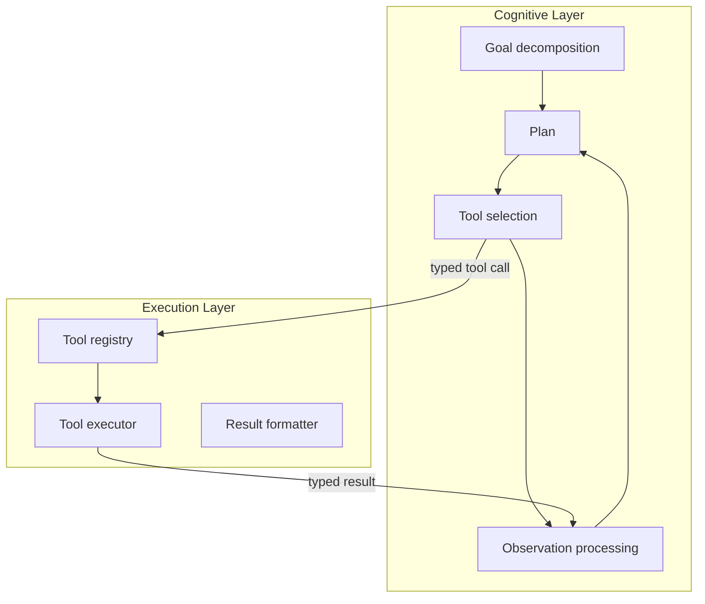

# Agentic AI Architecture: From Prompt to Goal-Directed

> Goal-directed agentic architecture separates cognitive reasoning from execution, adds a multi-agent topology taxonomy, and layers an enterprise hardening checklist over the prompt-response baseline.

## The architectural shift

Stateless prompt-response systems are the simplest way to deploy an LLM. Goal-directed systems add autonomous multi-turn execution. The agent takes an objective, breaks it into subtasks, runs tools, reads the results, and repeats until it meets the goal or hits a stopping condition.

[arXiv:2602.10479](https://arxiv.org/abs/2602.10479) traces this evolution from foundational theory (BDI, reactive, deliberative) through current LLM patterns. The shift is not incremental. It needs a structural separation of concerns prompt-response systems do not.

## Reference architecture

The core principle is to separate cognitive reasoning from execution using typed tool interfaces.

Cognitive layer — the LLM. It interprets the goal, plans, selects tools, and synthesizes results. It never changes external state, only emits typed tool calls (the [cognitive/execution split](cognitive-reasoning-execution-separation.md)).

Typed tool interfaces — the boundary. Calls and results are schema-validated, so the cognitive layer cannot send a malformed command. This is the main thing making behavior predictable — [typed schemas at the boundary](../multi-agent/typed-schemas-at-agent-boundaries.md).

Execution layer — deterministic infrastructure. It receives typed calls, runs them, and returns typed results. It holds no reasoning — only execution, error handling, and formatting.

This separation lets you test each layer and audit every call at the boundary — the [separation of knowledge and execution](separation-of-knowledge-and-execution.md) at runtime.

## Multi-agent topology taxonomy

Three coordination topologies each carry their own failure patterns. [Multi-Agent Topology Taxonomy](../multi-agent/multi-agent-topology-taxonomy.md) breaks them down; [arXiv:2601.01743](https://arxiv.org/abs/2601.01743) surveys the centralized versus decentralized tradeoffs.

Centralized orchestration — one orchestrator manages all workers, which run assigned tasks and return results, the shape covered in [Orchestrator-Worker Pattern](../multi-agent/orchestrator-worker.md).

- Advantage: a single point of coordination keeps reasoning traceable
- Failure mode: the orchestrator becomes a bottleneck, and its failure halts the system

Decentralized peer-to-peer — agents talk directly without a coordinator, making local decisions from shared state or messages, as in [decentralized memory for self-evolving multi-agent systems](../multi-agent/decentralized-memory-multi-agent.md).

- Advantage: no single point of failure, and it scales horizontally
- Failure mode: emergent coordination failures, race conditions, and inconsistent shared state are harder to debug

Hybrid — a lightweight coordinator handles routing and synthesis while workers talk directly to coordinate sub-tasks, the pattern [Magentic Orchestration](../multi-agent/magentic-orchestration.md) implements with a task ledger.

- Advantage: it eases the coordinator bottleneck while keeping traceability at the routing level
- Failure mode: the boundary between coordinator and peer-to-peer communication must be explicit, because crossing it implicitly creates inconsistent behavior

## Enterprise hardening checklist

Production agent deployments need three kinds of hardening beyond functional correctness.

Governance

- Audit trails: every agent action is logged with timestamp, agent identity, tool name, arguments, and result ([arXiv:2602.10479](https://arxiv.org/abs/2602.10479))
- Access control: agents operate with least-privilege permissions; no agent has broader access than its assigned task requires ([arXiv:2602.10479](https://arxiv.org/abs/2602.10479))
- Policy enforcement: organizational constraints (data residency, PII handling, approved models) are enforced at the harness level, not by agent prompt alone ([arXiv:2602.10479](https://arxiv.org/abs/2602.10479))

Observability

- [Trajectory logging](../../observability/trajectory-logging-progress-files.md): full turn-by-turn execution logs for post-hoc analysis and debugging ([arXiv:2602.10479](https://arxiv.org/abs/2602.10479))
- Cost tracking: per-session and per-agent token consumption reported in real time ([arXiv:2602.10479](https://arxiv.org/abs/2602.10479))
- Anomaly detection: alerts on deviation from expected trajectory length, tool call patterns, or cost bounds ([arXiv:2602.10479](https://arxiv.org/abs/2602.10479))

Reproducibility

- Deterministic seeding: where randomness affects agent behavior, seeds are captured in logs for replay ([arXiv:2602.10479](https://arxiv.org/abs/2602.10479))
- Idempotent operations: agent actions produce the same end state if executed more than once; no compounding side effects on retry ([arXiv:2602.10479](https://arxiv.org/abs/2602.10479))
- Snapshot-based rollback: system state is snapshotted before consequential actions; rollback is defined before execution begins ([arXiv:2602.10479](https://arxiv.org/abs/2602.10479)) — see [Rollback-First Design](rollback-first-design.md)

## Industry convergence pattern

The paper notes the industry converging on shared infrastructure, much as web services matured: standardized agent loops, tool registries, and auditable control mechanisms. Many frameworks now build in the cognitive/execution separation, typed tool interfaces, and governance checklists above ([arXiv:2602.10479](https://arxiv.org/abs/2602.10479)). Building on these patterns now saves you a retrofit later.

## When this backfires

The cognitive/execution separation adds structural overhead. It costs more than it returns in three cases.

1. Simple single-turn tasks. If the agent calls one tool and stops ([a single turn](agent-turn-model.md), not a loop), typed interfaces and a separate execution layer add overhead with no reliability gain. A direct function call is cheaper to test.
2. Rapid prototyping. Strict schema contracts slow iteration. Early-stage agents do better with fluid coupling; formal separation is a refactoring target once the interface stabilizes.
3. Low-throughput, human-supervised workflows. Auditability at the tool boundary ([trajectory logging](../../observability/trajectory-logging-progress-files.md)) matters at volume. A reviewer who inspects every action replaces much of what audit logging gives you, so the full harness too early is just maintenance cost.

## Example

A code review agent on this architecture:

Cognitive layer — the LLM receives `"Review PR #42 for security issues"`. It breaks the goal down: fetch the PR diff, identify changed files, scan each for known patterns, and summarize findings. For each step it emits a typed tool call, for example `{ "tool": "github_get_pr_diff", "pr": 42 }`.

Execution layer — `github_get_pr_diff` fetches the diff and returns a typed result `{ "files": [...], "additions": 310, "deletions": 45 }`. The LLM never calls GitHub directly. It only receives the formatted result and picks the next tool call.

Enterprise hardening applied:

- Every tool call is logged: timestamp, agent ID, tool name, arguments, result.
- The agent runs with a scoped GitHub token (read-only on the target repo).
- A cost guard halts the session if it exceeds 50k tokens before the agent self-terminates.

Each component maps onto the reference architecture: the LLM in the cognitive layer, the GitHub client in the execution layer, the typed tool interface at the boundary.

## Key Takeaways

- Goal-directed agents require structural separation of cognitive reasoning from execution — not a prompt-engineering refinement of the request-response model.
- Typed tool interfaces at the cognitive/execution boundary are the primary mechanism that makes agent behavior predictable and auditable.
- [Three multi-agent topologies](../multi-agent/multi-agent-topology-taxonomy.md) — centralized, decentralized peer-to-peer, and hybrid — each carry distinct failure modes that must be matched to task shape.
- Enterprise deployment adds three orthogonal concerns to functional correctness: governance, observability, and reproducibility.
- The full harness is overhead until volume justifies it; simple single-turn tasks, prototypes, and human-supervised workflows are cheaper without it.

## Related

- [Cognitive Reasoning vs Execution: A Two-Layer Agent](cognitive-reasoning-execution-separation.md)
- [Separation of Knowledge and Execution](separation-of-knowledge-and-execution.md)
- [Typed Schemas at Agent Boundaries](../multi-agent/typed-schemas-at-agent-boundaries.md)
- [Multi-Agent Topology Taxonomy](../multi-agent/multi-agent-topology-taxonomy.md)
- [Orchestrator-Worker Pattern](../multi-agent/orchestrator-worker.md)
- [Agent Composition Patterns: Chains, Fan-Out, Pipelines, Supervisors](agent-composition-patterns.md)
- [Trajectory Logging and Progress Files](../../observability/trajectory-logging-progress-files.md)
- [Blast Radius Containment: Least Privilege for AI Agents](../../security/blast-radius-containment.md)
