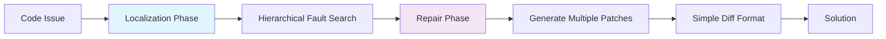

# Agentless vs Autonomous: When Simple Beats Complex

> Complex autonomous software agents are often unnecessary and counterproductive. Simple, constrained workflows frequently deliver better results at lower cost with reduced complexity debt.

Empirical evidence challenges the assumption that more AI autonomy gives better results. The [Agentless paper](https://arxiv.org/abs/2407.01489) showed that a simple two-phase process, localization then repair, reached 27.33% accuracy on SWE-bench Lite at $0.70 average cost. It outperformed existing open-source autonomous agents while using far less complexity.

## The agentless approach



- Localization phase: a hierarchical process to identify fault locations
- Repair phase: generate multiple candidate patches in diff format

This constrained approach avoided the complexity overhead of autonomous planning, tool selection, and execution coordination that agent-based systems carry. The argument extends beyond benchmarks. [Towards Data Science argues you probably do not need an agent framework](https://towardsdatascience.com/you-probably-dont-need-an-agent-framework/): explicit workflows serve many tasks better than reaching for an autonomous agent framework.

## When autonomy becomes counterproductive

### The 80% problem shift

As AI coding capability improved from 70% to 80%+, [failure modes shifted](https://addyo.substack.com/p/the-80-problem-in-agentic-coding) from syntax bugs to deeper logical mistakes and [comprehension debt](../anti-patterns/comprehension-debt.md). More autonomous agents compound these errors through:

- State accumulation: complex agents build incorrect assumptions over many turns
- Context drift: autonomous planning can diverge from the actual requirements
- Tool selection errors: agents choose unsuitable tools without human oversight
- Coordination overhead: multi-agent systems spend tokens on communication rather than solving the problem

### Cost-effectiveness analysis

| Approach | SWE-bench Lite Accuracy | Average Cost | Complexity |
|----------|------------------------|--------------|------------|
| Agentless (Two-phase) | 27.33% | $0.70 | Low |
| SWE-Agent | 12.00% | Higher | High |
| AutoCodeRover | 16.00% | Higher | High |

Simple approaches show better cost-performance ratios once you factor in the complexity overhead.

## Design principles for simple-first systems

### Start constrained, add autonomy selectively

[Anthropic's engineering guidance](https://www.anthropic.com/engineering/building-effective-agents) tells you to "find the simplest solution first" and to add agent complexity only "when it demonstrably improves outcomes."

Autonomy runs along a four-level path:
1. Manual workflow: a human drives the work and stays fully in control.
2. Assisted workflow: AI helps with specific steps.
3. Guided autonomy: AI executes within strict boundaries.
4. Full autonomy: AI plans and executes on its own.

Most tasks stop at level 2 or 3. The marginal benefits of full autonomy rarely outweigh the complexity, debugging overhead, and coordination costs that autonomous planning brings.

This gating shows up in production tooling. GitHub describes [making Copilot CLI more selective about delegation](https://github.blog/ai-and-ml/how-we-made-github-copilot-cli-more-selective-about-delegation/): it tunes the CLI agent to handle more tasks inline rather than spinning up delegated autonomous work by default. That is a first-party account of choosing the constrained path until autonomy is clearly warranted.

### Harness engineering over agent engineering

Instead of building more autonomous agents, constrain AI systems through architectural patterns:

- Typed interfaces: enforce correct tool use
- Bounded execution: limit scope and resource use
- Mechanical validation: automated checks catch errors before they spread
- [Rollback-first design](rollback-first-design.md): make every action easy to reverse

This [harness engineering approach](https://martinfowler.com/articles/exploring-gen-ai/harness-engineering.html) keeps reliability high while holding AI capabilities within safe boundaries.

## Example: code review workflow comparison

Autonomous agent approach:
```yaml
# High complexity, unpredictable paths
agent:
  - discover_files
  - analyze_architecture
  - identify_patterns
  - check_dependencies
  - run_tests
  - generate_report
  - suggest_improvements
  - coordinate_fixes
```

Agentless approach:
```yaml
# Constrained, predictable workflow
phases:
  locate: [lint_check, type_check, test_results]
  repair: [generate_fixes, validate_patches, apply_best]
```

The agentless version produces more consistent results. It avoids coordination complexity and uses AI strengths, pattern recognition and code generation, within bounded contexts.

## When this backfires

Simple-first defaults carry real costs when the task structure does not fit constrained workflows:

- Exploratory or open-ended tasks: when the problem space is poorly defined and needs iterative discovery, such as debugging novel production failures, fixed two-phase pipelines cannot adapt mid-execution.
- Long-horizon planning: tasks that span many interdependent steps, such as multi-file refactors or features that cross architectural boundaries, may need the planning capacity that autonomous agents provide.
- Rapidly maturing capability curve: benchmark results shift quickly. TDFlow reached [88.8% on SWE-bench Lite](https://arxiv.org/abs/2510.23761) and Live-SWE-agent reached [77.4% on SWE-bench Verified](https://arxiv.org/abs/2511.13646), both far above the Agentless 27.33% baseline from 2024. As model capability advances, the gap between simple and sophisticated designs narrows, which makes the complexity tradeoff worth reconsidering for higher-stakes tasks.

The agentless approach remains a strong default for well-scoped tasks. The case for it weakens as tasks grow more exploratory, models grow more capable, and teams develop better tooling to manage agent complexity.

## Key Takeaways

- Complexity debt compounds: Autonomous agents accumulate complexity costs that often exceed their benefits
- Constrained AI outperforms: Simple, bounded workflows frequently deliver better results than complex autonomous systems
- Start simple, add selectively: Only introduce autonomy when simpler approaches demonstrably fail
- Cost-effectiveness matters: Factor in development, maintenance, and debugging costs when choosing between approaches
- Evidence over intuition: Empirical results consistently favor constrained approaches for most coding tasks

The goal is not to avoid AI, but to apply it within architectures that maximize its strengths while minimizing complexity overhead.

## Related

- [Harness Engineering](harness-engineering.md) — The discipline of constraining agent environments so agents reliably produce correct results within safe boundaries
- [Delegation Decision](delegation-decision.md) — Framework for deciding when agent delegation overhead is justified versus simpler approaches
- [Cost-Aware Agent Design](../../token-engineering/cost-aware-agent-design.md) — Matching model capability to task complexity rather than defaulting to the most autonomous option
- [Cognitive Reasoning vs Execution Separation](cognitive-reasoning-execution-separation.md) — The two-layer architecture that the agentless approach implicitly follows
- [Discrete Phase Separation](discrete-phase-separation.md) — Running locate and repair in isolated contexts so only distilled artifacts cross the phase boundary
- [Agents vs Commands](agents-vs-commands.md) — Separating agent roles from workflow execution, reinforcing when command-style simplicity beats full autonomy
- [Specialized Agent Roles](specialized-agent-roles.md) — When parallel execution is warranted, how to assign distinct scopes so agents complement rather than duplicate
- [Domain-Scoped Parallel Exploration for Multi-File Change Localization](domain-scoped-parallel-localization.md) — When localization on multi-subsystem changes is the goal, partitioning along domain seams beats the agentless single-context approach
