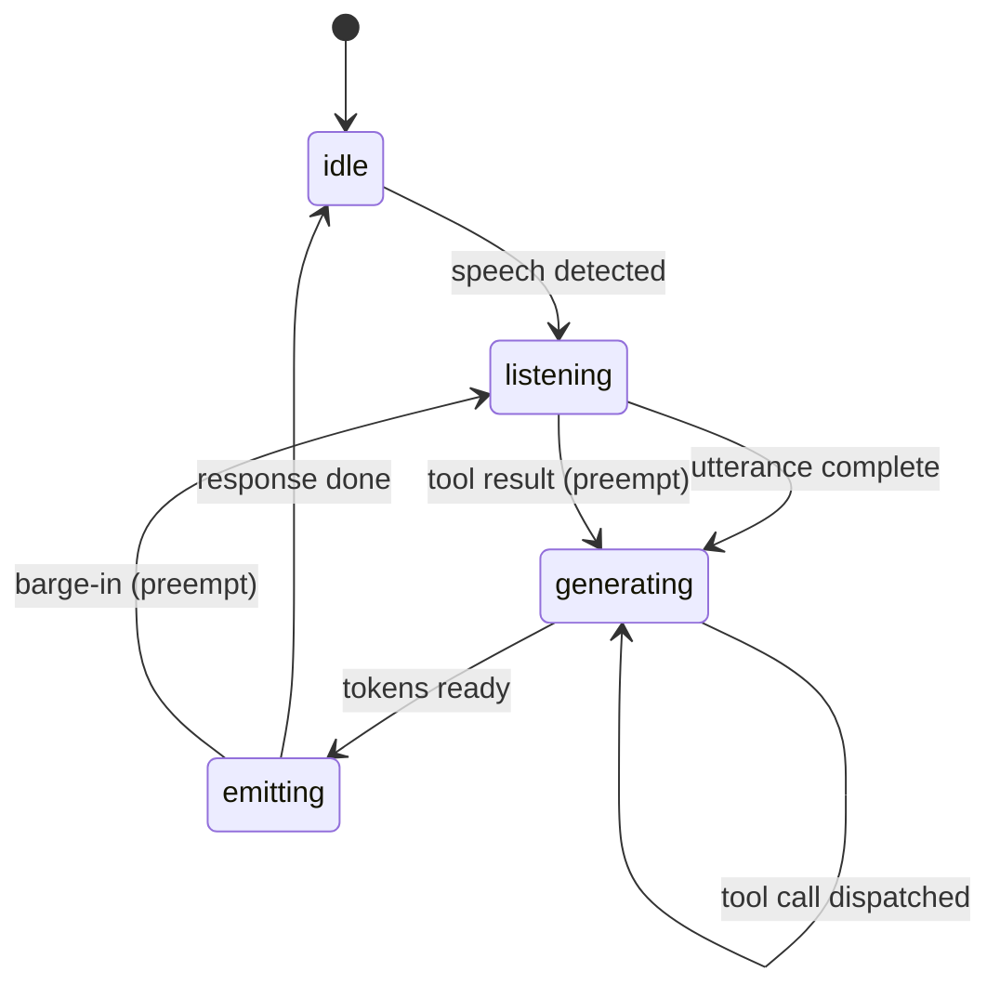

# Asynchronous Agent I/O and Speculative Tool Calling

> Asynchronous tool I/O runs an event-driven FSM so latency is bounded by dispatch time, not tool completion; speculative calls dispatch predicted tools early.

## The latency budget problem

Voice and real-time agent interfaces target sub-second responsiveness. Cresta documents 500 ms as the production budget, and cites 300 ms as the threshold for "human-like" conversation ([Cresta: engineering for real-time voice agent latency](https://cresta.com/blog/engineering-for-real-time-voice-agent-latency)). A synchronous loop spends `inference + tool_latency` per turn, so any slow tool blows the budget. Ginart et al. put it directly: typical LLM agents "operate in a strict turn-based fashion, oblivious to passage of time" ([arXiv:2410.21620](https://arxiv.org/html/2410.21620v1)).

## Asynchronous I/O: the event-driven FSM

Ginart et al. propose an event-driven finite-state machine adapted from real-time operating systems. The FSM holds four states — `idle`, `listening`, `generating`, `emitting` — and a priority queue dispatches events from speech-to-text, model generation, TTS streaming, and tool responses ([arXiv:2410.21620](https://arxiv.org/html/2410.21620v1)). Priority scheduling lets a fresh user utterance preempt TTS, the same way a real-time kernel preempts on interrupt. Tool calls run asynchronously, and once dispatched, the FSM stays responsive. The voice-concierge demo reports end-to-end latency under 300 ms.



Two consequences:

- The ledger is shared, not turn-locked. Tool requests, results, model tokens, and user utterances append to one event log. The model sees "request transmitted" and "response received" interleaved with normal turns ([arXiv:2410.21620](https://arxiv.org/html/2410.21620v1)).
- Frontier LLMs degrade on this ledger. The paper flags that models "struggle to operate in an asynchronous fashion under certain circumstances" and get confused by out-of-order messages. The AsyncTool benchmark confirms top models lose accuracy on temporal reasoning and parallel coordination ([AsyncTool, OpenReview 2025](https://openreview.net/forum?id=FfedFHs6Tx)). Evaluate the deployment model against the async ledger before you adopt it.

## Speculative tool calling: an optional extension

Once tool dispatch is decoupled from the model turn, the next move is to dispatch tools before the model authorizes them — speculative execution at the LLM-tool boundary. Three current approaches:

- PASTE, pattern-aware speculative tool execution ([Sui et al., arXiv:2603.18897v3](https://arxiv.org/abs/2603.18897v3)). It exploits stable control flow and predictable parameter passing. It reports a 43.5% reduction in average task completion time and 1.8× lower observed tool latency.
- Speculative Actions ([Ye et al., arXiv:2510.04371](https://arxiv.org/html/2510.04371v1)). A fast Speculator proposes k candidate actions, and a slow Actor validates them. Losslessness comes from semantic guards (state-transition equivalence), safety envelopes (only idempotent, reversible, or sandboxed effects allowed), and rollback paths. It reports up to 55% next-action accuracy.
- Engine-resident speculation ([Nichols et al., arXiv:2512.15834](https://arxiv.org/abs/2512.15834)). It keeps speculative sequences resident in the vLLM engine and proposes a "tool cache" provider API. It reports hundreds of extra tokens per second of throughput.

The mechanism: agent workflows have stable control flow that a smaller, faster model can predict — the same fast/slow split as [cognitive reasoning vs execution separation](cognitive-reasoning-execution-separation.md). When speculation hits, the tool result is already there when the slow model commits.

## When this architecture backfires

The async FSM and speculative tool calling are not free. Both add infrastructure cost that only pays back under specific conditions.

- Non-idempotent write-side tools. Payment APIs, deploy pipelines, `git push`, and outbound email cannot be rolled back, so speculative execution does not apply. Speculative Actions' losslessness depends on the side effect being reversible, sandboxed, or idempotent ([arXiv:2510.04371](https://arxiv.org/html/2510.04371v1)). Real enterprise integrations rarely qualify.
- Text-only coding agents with no real-time UX constraint. When the user is fine seeing a spinner and inference dominates latency, the FSM is dead weight. The benefit only appears when tool I/O is the dominant cost and the user-facing budget is sub-second — the 500 ms target above, not a multi-second batch job.
- Models that mishandle interleaved ledgers. If the deployment model degrades on the AsyncTool benchmark or the project's eval suite, the async ledger introduces more failures than the latency win is worth.
- Concurrency-throttled external APIs. Cresta notes that when external APIs lack idempotency or have heavy concurrency caps, the implementation may have to disable user interruptions during the call, which defeats the responsiveness the async architecture was meant to deliver ([Cresta](https://cresta.com/blog/engineering-for-real-time-voice-agent-latency)).
- Async and parallel calls drive up cost. Saving wall-clock seconds can cost more dollars in concurrent compute and API quota ([Arya AI: agentic system trade-offs](https://arya.ai/blog/navigating-trade-offs-in-agentic-systems)).

## Example

A travel-concierge voice agent receives "Find me a flight to Tokyo on Friday." The synchronous path looks like this:

Before — synchronous turn loop:

```
t=0ms   STT finalises user utterance
t=80ms  Model emits tool call: search_flights(...)
t=80ms  Agent blocks on flights API
t=2200ms Flights API returns
t=2280ms Model generates response
t=2400ms TTS starts emitting
```

The user waits 2.4 seconds before hearing anything — well past the 500 ms conversational budget.

After — async FSM with speculative dispatch:

```
t=0ms    STT finalises user utterance
t=80ms   FSM dispatches search_flights, emits filler token stream
t=200ms  TTS starts emitting "Checking flights to Tokyo..."
t=200ms  Speculator predicts likely next tool: get_user_preferences
t=200ms  FSM speculatively dispatches get_user_preferences in parallel
t=2200ms search_flights returns; speculation hit
t=2280ms Model commits, generates result; TTS continues without gap
```

Perceived response time is bounded by TTS dispatch (~200 ms), not by the flight API. The speculation against `get_user_preferences` either hits — saving its own round trip — or is discarded under a sandboxed read, costing only the duplicate API call. Implementation pattern from the primary paper's voice-concierge demo ([arXiv:2410.21620](https://arxiv.org/html/2410.21620v1)).

## Key Takeaways

- Synchronous agent loops blow the sub-second budget the moment any tool call is slow; voice and real-time agents need an event-driven FSM with priority scheduling, not bigger models.
- The FSM treats user speech, model tokens, TTS output, and tool results as preemptible events on a shared ledger — adapted from real-time operating systems.
- Speculative tool calling extends async I/O by dispatching predicted tools ahead of model authorization (PASTE reports a 48.5% task-time reduction); only safe when the tool is idempotent, reversible, or sandboxed.
- The primary failure mode is not architectural — it's the model itself. Frontier LLMs degrade on out-of-order async ledgers; evaluate before adopting.
- Skip both when latency is dominated by inference, the user is fine with a spinner, or the tools are non-idempotent write APIs.

## Related

- [Event-Driven Agent Routing](event-driven-agent-routing.md)
- [Persistent-Connection Agent Transport](persistent-connection-agent-transport.md)
- [Cognitive Reasoning Execution Separation](cognitive-reasoning-execution-separation.md)
- [Lane-Based Execution Queueing](lane-based-execution-queueing.md)
- [Agent Backpressure](agent-backpressure.md)
