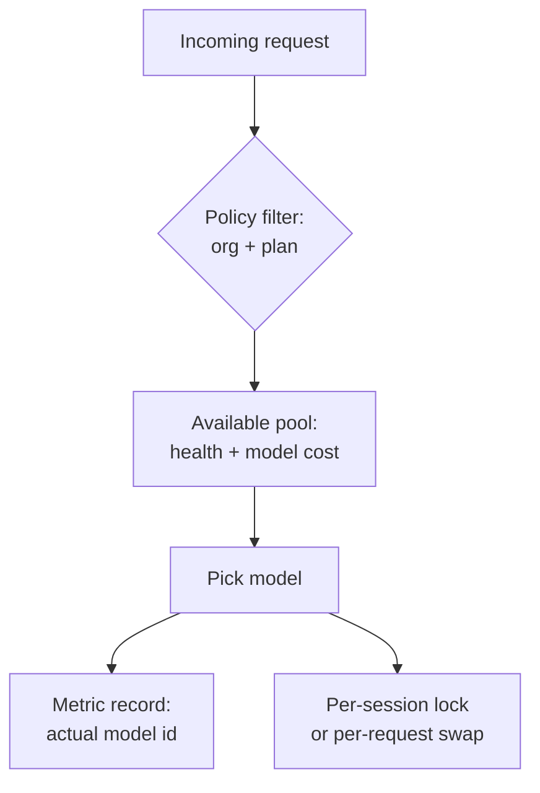
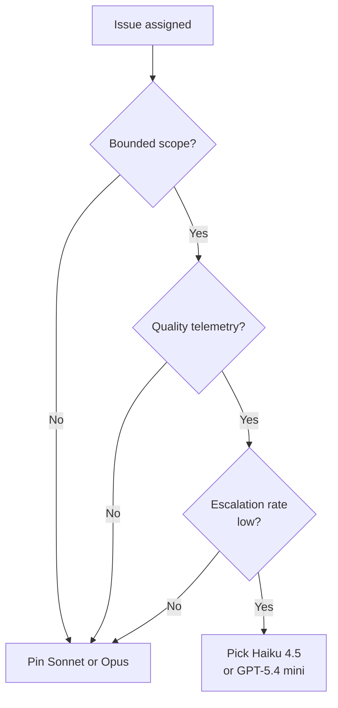
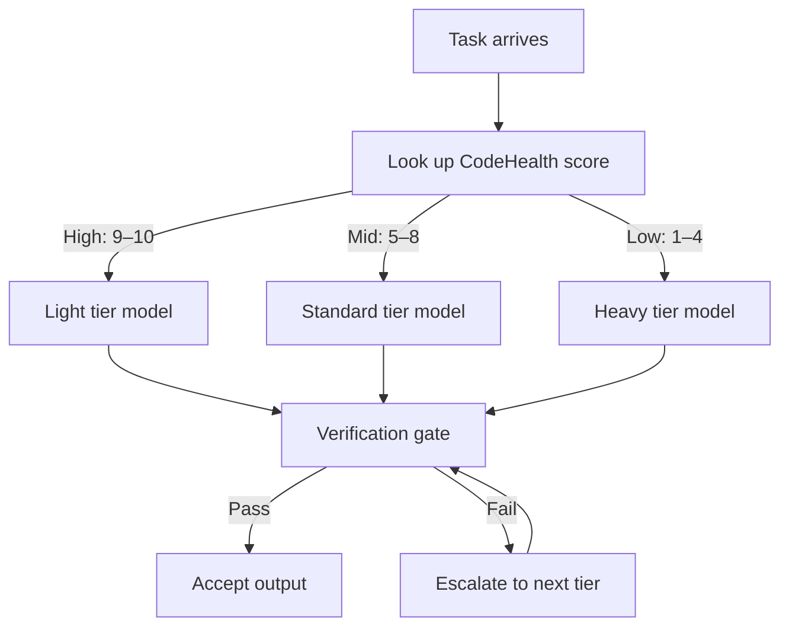
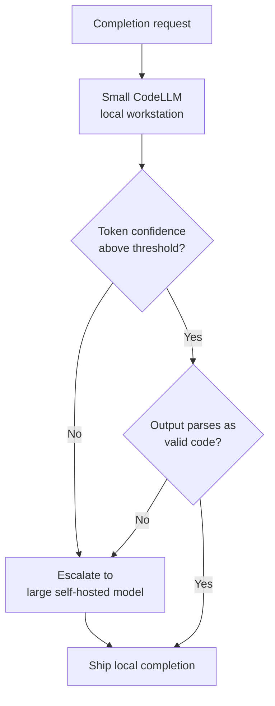

# Auto Model Selection

> Auto model selection hands per-task model choice to the harness, which picks from a vendor pool by health, policy, and plan — fit trails availability.

Auto model selection is a harness-side routing policy that picks the backing model per request from a vendor-managed pool, using availability and policy signals rather than a user-pinned choice. GitHub Copilot ships it across Chat, CLI, JetBrains, VS Code, and the cloud coding agent ([GitHub Changelog 2026-05-14](https://github.blog/changelog/2026-05-14-copilot-cloud-agent-supports-auto-model-selection/)). Copilot is not the only vendor shipping it: Cursor ships Cursor Router, first-party automatic per-request model routing built into the coding agent ([Cursor Changelog 2026-07-22](https://cursor.com/changelog/router)), so the pattern now has more than one shipping vendor instance. When the user is absent, as with a cloud agent on an issue or a scripted CLI call, the decision lives in the harness or never happens.

This is the harness policy layer, distinct from the gateway infrastructure layer ([Gateway Model Routing](gateway-model-routing.md)) and the per-tier budget layer ([Cost-Aware Agent Design](../../token-engineering/cost-aware-agent-design.md)).

## When this pays off

Three conditions hold together:

- Execution-class work inside a capability band — file edits, single-turn extractions, format passes, predictable refactors, the band the [Cognitive Reasoning vs Execution Separation](cognitive-reasoning-execution-separation.md) split names.
- First-choice models hit rate-limit ceilings. The broker reroutes a saturated model to a peer; without rate pressure, routing solves nothing.
- Per-request capability variance is acceptable — similar prompts can hit different backends, fine for a developer, poison for eval-gated CI.

When all three hold, the payoff is a 10% discount on model costs for individual plans ([GitHub Docs: usage-based billing for individuals](https://docs.github.com/en/copilot/concepts/billing/usage-based-billing-for-individuals)). Under the request-based billing model in force when Auto shipped in the CLI, that discount was a 10% multiplier reduction and carried exemption from weekly rate limits on the affected request ([GitHub Changelog 2026-04-17](https://github.blog/changelog/2026-04-17-github-copilot-cli-now-supports-copilot-auto-model-selection/)).

## The four design points



1. Routing dimensions. Copilot's published criteria are availability, model performance, plan, and admin policy — not declared task class or context size ([GitHub Changelog 2026-05-14](https://github.blog/changelog/2026-05-14-copilot-cloud-agent-supports-auto-model-selection/)). Visual Studio Magazine names the trade-off: the broker "currently prioritizes server health and regional availability over the specific technical requirements of a developer's prompt" ([VS Magazine 2026-02-06](https://visualstudiomagazine.com/articles/2026/02/06/why-copilots-auto-mode-for-ai-models-ignores-your-actual-task.aspx)). Cursor publishes its own account of how Cursor Router picks a model for a request ([Cursor 2026-08-06](https://cursor.com/blog/how-cursor-router-works)).
2. Session vs request scope. Copilot CLI keeps "the selected model consistent throughout a chat session" — the decision fires once, at session start ([GitHub Changelog 2026-04-17](https://github.blog/changelog/2026-04-17-github-copilot-cli-now-supports-copilot-auto-model-selection/)). Per-session locking preserves in-context state; per-request routing maximizes pool use.
3. Observability surface. Until 2026-03-20, Copilot dashboards collapsed all Auto traffic under a generic "Auto" label, so admins could not see "exactly which models are being used across your organization" ([GitHub Changelog 2026-03-20](https://github.blog/changelog/2026-03-20-copilot-usage-metrics-now-resolve-auto-model-selection-to-actual-models/)). A harness that hides the resolved `model_id` from telemetry is unauditable.
4. Policy and plan as routing inputs. Auto "honors all administrator model settings" and the pool is "subject to your policies and subscription type" ([GitHub Changelog 2026-05-14](https://github.blog/changelog/2026-05-14-copilot-cloud-agent-supports-auto-model-selection/)) — an org-level restriction shrinks the broker's choice set directly.

## Why it works

The mechanism is resource pooling across a fungible model fleet: treating capability as a band converts one user's rate-limit exhaustion into a peer's headroom. Most coding-agent traffic is execution-class work several pool members handle equivalently, so rerouting a saturated model to an in-band peer holds quality roughly constant at lower latency and cost — Auto just centralizes that decision with the vendor, not the team. It breaks down whenever the pool includes a member outside the band — a frontier task routed to a cheaper model, or an experimental model treated as a peer.

## When this backfires

- Long multi-turn sessions on hard tasks. A silent mid-conversation swap discards in-context learning. One VS Code reporter saw "context loss/continuity issues" and "repeated mistakes on things I'd corrected multiple times," fixed by pinning Sonnet 4.5 ([microsoft/vscode#285064](https://github.com/microsoft/vscode/issues/285064)). Per-session locking mitigates this in CLI, not every client.
- Eval-gated CI automation. Differential evals depend on response stability; routing variance masks the regression signal. Pin the model on any CI gate re-running an agent against a known input.
- Compliance attestation. Even after the metrics fix exposes the resolved model name, the decision logic ("why GPT-5.4 over Sonnet 4.6 at 14:03 UTC?") stays hidden. Pin and log explicitly when per-request attestation is required.
- Workloads where rework cost exceeds the discount. When the broker picks a cheaper-band model for a frontier-tier task, re-prompts and failed reviews dominate the 10% saving — the discount captures inference cost, not rework cost.
- Teams without per-request `model_id` telemetry. Auto's value is only legible when you can compare cost and quality across the pool — see [BYOK Model Token Visibility](../../observability/byok-model-token-visibility.md) for the equivalent gap on self-hosted routes.
- Individual plans, where the pool can include unvetted evaluation models. From 2026-06-01, Copilot's Auto pool on individual non-enterprise plans can route to experimental evaluation models, opt-out via Copilot settings ([GitHub Changelog 2026-06-01](https://github.blog/changelog/2026-06-01-evaluation-models-in-auto-for-individual-plans/)). An evaluation model is not a quality-equivalent peer, so the fungible-band premise no longer holds for these plans — disable evaluation routing or pin a model when output quality must be predictable.

## Example

The Copilot cloud agent picks up an issue assignment without a user present to choose a model. With Auto selected as the default in the model picker:

```text
Issue #4421 assigned to copilot/cloud-agent

→ Broker reads: org policy = {GPT-5.4, Sonnet 4.6 enabled}
→ Broker reads: plan = Business+
→ Broker reads: pool health = GPT-5.4 saturated, Sonnet 4.6 healthy
→ Broker selects: Sonnet 4.6 (in-band, available, allowed by policy)
→ Billed: session tokens metered in AI credits at Sonnet 4.6's published rate
→ Metric records: model_id = "claude-sonnet-4-6" (not "Auto")
```

The published pool: "Auto routes to models like GPT-5.4, GPT-5.3-Codex, Sonnet 4.6, and Haiku 4.5 based on your plan and policies" ([GitHub Changelog 2026-04-17](https://github.blog/changelog/2026-04-17-github-copilot-cli-now-supports-copilot-auto-model-selection/)). Under the retired request-based model, business and enterprise pools carried only 0x–1x-multiplier models, which capped the per-call cost; since 2026-06-01 the cost of a call is the tokens it consumes, priced at the routed model's published rate ([GitHub Blog: usage-based billing](https://github.blog/news-insights/company-news/github-copilot-is-moving-to-usage-based-billing/)). Either way, "the models auto will route to will change over time" — the model that ran is not stable across weeks.

To pin instead — when any failure condition above applies — the cloud agent switches the picker to a specific model per issue or per-PR. The escape hatch is per-request, not a permanent client-side default ([Disable Auto Model Selection discussion](https://github.com/orgs/community/discussions/187429)).

## Cloud-agent tiered model routing

Auto's per-request brokering is one end of a spectrum; at the other is operator-dispatched tier routing, where a human assigns each cloud-agent session to a capability tier — frontier, standard, or fast/cheap — at dispatch, before the session starts. GitHub's Copilot cloud agent ships this as a per-session model picker after the 2026-05-18 changelog added Claude Haiku 4.5 and GPT-5.4 mini, priced at a 0.33x multiplier under the request-based billing model then in force ([GitHub Changelog 2026-05-18](https://github.blog/changelog/2026-05-18-copilot-cloud-agent-fast-cost-efficient-models-for-simple-tasks/)). That model billed one premium request per session at the model's multiplier, never one per action ([GitHub Docs: Copilot requests](https://docs.github.com/en/copilot/concepts/billing/copilot-requests)); since 2026-06-01 a session bills by the total tokens it consumes, so the economics stay per-task but the per-session figure is no longer flat ([GitHub Blog: usage-based billing](https://github.blog/news-insights/company-news/github-copilot-is-moving-to-usage-based-billing/)). Where a picker is not exposed, the session falls through to Auto.

### Four conditions for the cheap tier

All four must hold, or the cheap default is a net loss:

- Bounded task scope. Cheap-tier sessions fit dependency bumps, changelog wording, small refactors, and single-issue fixes — not security-critical work, architectural decisions, or large migrations ([Igor's Lab, 2026-05-19](https://www.igorslab.de/en/github-copilot-cloud-agent-economy-models/)).
- Per-tier quality telemetry. Without PR acceptance, retry, and reviewer-rejection rates broken down by `model_id`, regressions hide behind the savings — the "silent quality degradation" failure ([Tianpan: LLM Routing](https://tianpan.co/blog/2025-10-19-llm-routing-production)).
- Bounded rework cost. A cheap session that escalates bills for both sessions' tokens, so the cheap default only pays while its escalation rate stays low — past that point pinning the stronger model is the cheaper option.
- Picker exposed at the entrypoint. Model selection is supported only when assigning an issue to Copilot on GitHub.com, mentioning `@copilot` in a pull-request comment, or starting from the agents tab/panel, GitHub Mobile, or Raycast; "where a model picker is not available, Auto will be used automatically" ([GitHub Docs: Changing the AI model](https://docs.github.com/en/copilot/how-tos/use-copilot-agents/cloud-agent/changing-the-ai-model)).

## Tiers and cost math

The cloud agent currently exposes Auto, Sonnet 4.5, Opus 4.7, Haiku 4.5, GPT-5.2-Codex, and GPT-5.4 mini.

Since 2026-06-01 a session costs the input, cached-input, and output tokens it consumed, priced in AI credits at the routed model's published rate. One credit is $0.01, and Copilot lists Haiku 4.5 at $1.00/$5.00 per million input/output tokens against $5.00/$25.00 for Opus 5, a five-fold spread ([GitHub Docs: models and pricing](https://docs.github.com/en/copilot/reference/copilot-billing/models-and-pricing)). Auto's 10% discount applies to that model cost on individual plans. Under the retired request-based model the same tiers were denominated as multipliers — 0.33x for Haiku 4.5 and GPT-5.4 mini — billed once per session ([GitHub Docs: Copilot requests](https://docs.github.com/en/copilot/concepts/billing/copilot-requests)).

Each `@copilot` steering comment adds another round of input and output tokens, so a five-round cheap-tier session can cost more than one clean session a tier up.

The cloud agent ships no automatic task-complexity classifier — the task-optimized Auto variant is "generally available in Copilot Chat in VS Code" only ([GitHub Docs: Auto Model Selection](https://docs.github.com/en/copilot/concepts/auto-model-selection)). For cloud-agent sessions the operator is the classifier: single-file edits and dependency bumps map to the cheap tier, multi-file refactors do not. When in doubt, default up: misrouting up wastes inference, down wastes review.



Capability scales sub-linearly with price across tiers, so most queries need no frontier model ([Tianpan: LLM Routing](https://tianpan.co/blog/2025-10-19-llm-routing-production)). Anthropic claims Haiku 4.5 "delivers similar levels of coding performance to Sonnet 4 but at one-third the cost and more than twice the speed" ([Anthropic: Claude Haiku 4.5](https://www.anthropic.com/news/claude-haiku-4-5)), and [FrugalGPT](https://arxiv.org/abs/2305.05176) shows a cascade upper bound of 98% cost reduction at GPT-4 quality. The tier-routing variant is its manual, human-classified instance.

Microsoft reports a comparable in-band claim for a cheaper model: in early developer workflows, MAI-Code-1-Flash used 67% to 94% fewer tokens than larger models ([VS Code, 2026-07-29](https://code.visualstudio.com/blogs/2026/07/29/mai-code-1-flash)). The same post rates its quality above Haiku 4.5 and GPT-5.4 Mini. Both are a vendor's own numbers on its own model, so confirm them against your traffic before you route to it.

Where it backfires: there is no documented in-session escalation — a failed cheap-tier PR is caught at human review after the session's tokens have already billed, and re-dispatching at Sonnet pays for both sessions. As budgets rise, "routers systematically default to the most capable and most expensive model even when cheaper models already suffice" ([arxiv:2602.03478](https://arxiv.org/abs/2602.03478)); the human picker likewise reverts to the safe default under shipping pressure. Long-context refactors widen the gap — Anthropic's "comparable to Sonnet 4" framing benchmarks short-context tasks, exactly where the canonical cloud-agent workload diverges.

## Code-health-gated tier routing

A second tier-routing variant changes the routing signal: instead of operator judgment or vendor pool health, it uses the health of the files the task will modify, computed before any model call. The hypothesis, proposed in [Madeyski (2026)](https://arxiv.org/abs/2604.07494), is that clean, well-structured files present lower intrinsic task complexity — lighter models resolve issues in healthy code without quality regression, while tangled files with high coupling and cyclomatic complexity require heavier models. This is a research proposal with stated conditions, not measured outcomes: the SWE-bench Lite evaluation (300 tasks, 2,700 agent runs) is pending. Apply the design pattern with that caveat.

[CodeHealth](https://arxiv.org/abs/2604.07494) is a composite score (1–10) aggregating 25+ sub-factors — cyclomatic complexity, coupling between modules, file size, code duplication, naming consistency. The routing signal is the score of the file(s) the patch will touch, not the codebase average.

| Tier | Model class | CodeHealth | Assigned to |
|------|-------------|-----------|-------------|
| Light | Haiku-class | 9–10 (healthy) | High-health files, low coupling |
| Standard | Sonnet-class | 5–8 (moderate) | Mid-range or ambiguous health signals |
| Heavy | Opus-class | 1–4 (unhealthy) | High coupling, complexity |

Assignment happens pre-generation, using features stored in a code health table, not at inference time.

Routing only saves cost when both conditions hold: (1) a cost gate — the light tier's pass rate must exceed the inter-tier cost ratio (for Haiku→Opus at current pricing, ~20%); and (2) a signal gate — CodeHealth must discriminate task difficulty with a measurable effect size (p̂ ≥ 0.56). Either failing makes the signal not predictive enough to justify routing overhead.



The [verification gate](../../workflows/verification-centric-development.md) — test suite, linter, type checker — is identical for all tiers and deterministic: a light-tier output passes only when it meets the same bar a heavy-tier output would. This separates the routing decision from the quality judgment. Without a composite score, proxy with a single correlated metric: cyclomatic complexity (per function, average > 10 routes heavy; [McCabe, 1976](https://doi.org/10.1109/TSE.1976.233837)), module coupling (fan-in/fan-out), or file churn rate from `git log`.

```python
import subprocess
import anthropic

def get_complexity(filepath: str) -> float:
    """Return average cyclomatic complexity for a file using radon."""
    result = subprocess.run(
        ["radon", "cc", "-a", "-s", filepath],
        capture_output=True, text=True
    )
    for line in result.stdout.splitlines():
        if "Average complexity" in line:
            return float(line.split("(")[-1].rstrip(")"))
    return 1.0

def route_model(filepath: str) -> str:
    complexity = get_complexity(filepath)
    if complexity > 10:
        return "claude-opus-4-5"      # heavy tier
    elif complexity > 5:
        return "claude-sonnet-4-5"    # standard tier
    else:
        return "claude-haiku-4-5"     # light tier
```

Limitations beyond the pending evaluation: clean code may correlate with simpler specs and better test coverage independently, confounding the health signal; the 20% cost-gate threshold is calibrated to current Haiku/Opus pricing and changes invalidate it; and Madeyski (2026) reports mid-tier models benefit from clean code while frontier models do not, with the mechanism unexplained.

## Syntax-aware completion routing

The finest-grained tier-routing variant decides per request, after generation, in a two-tier code-completion stack: a small model on a developer workstation plus a large model in self-hosted infrastructure. The naive signal is the small model's token-level confidence — but confidence alone is noisy: a small model can be highly confident on a syntactically broken completion (truncated identifier, unmatched brace) and under-confident on a clean one.

SynConfRoute, proposed by [Thangarajah, Chen, and Hassan (2026)](https://arxiv.org/abs/2605.04894), adds a second signal, namely whether the small model's own output parses as valid code, and reports +6.4 pass@1 over confidence-only routing on routine completions, up to +31 on harder multi-language tasks. The mechanism rests on a measured failure profile: 46% of the 3B model's incorrect completions are not valid code, so a parse check captures roughly half the failure mass at parse-time cost before the large model is invoked. This is `emerging` work: the figures come from a single 2026 preprint with abstract-level detail that does not name the 3B/480B models, the thresholds, or whether the validator is a parser, AST checker, or compiler — treat them as what the paper reports until the full PDF and any code can be checked.



Both gates must pass for the local completion to ship. The pipeline is training-free (off-the-shelf models, hand-tuned thresholds, no router fine-tuning) but thresholds couple to the specific small model and language: perplexity, the basis of the confidence gate, varies systematically by language ([Cao et al., 2026](https://arxiv.org/abs/2508.16131)), so one cutoff rarely transfers across a polyglot codebase. The paper reports routine pass@1 of 78.9%, 7.4 points higher than always invoking the 480B model, and 58% lower accelerator usage ([Thangarajah et al., 2026](https://arxiv.org/abs/2605.04894)).

How the three tier-routing signals compose:

| Signal | Unit of decision | Where it's measured | Coverage of failure modes |
|--------|------------------|---------------------|---------------------------|
| Code-health-gated routing | Per file, pre-generation | File complexity score before any inference | File difficulty, not output quality |
| Token confidence only | Per request | Inside the small model's decoding | Misses confident-but-broken outputs |
| Confidence + syntax (SynConfRoute) | Per request | Decoding stats + parse check on output | Catches the ~46% of small-model errors that fail to parse |
| [Cross-vendor competitive routing](cross-vendor-competitive-routing.md) | Per task | Run both, judge results | High cost — pays both sides |

Code-health routing decides before the small model runs; syntax-aware routing decides after, using the generated tokens as evidence — the two are stackable. Where it backfires: polyglot repos with partial parser coverage (tree-sitter grammar coverage sets the ceiling), embedded DSLs and string-interpolated code (SQL in Python, JSX in JavaScript) where partial completions are not parse-clean by construction, sub-100ms IDE completion budgets where a parse pass plus escalation round-trip costs too much, and single-developer or offline setups where escalation silently fails to a missing large model.

## Key Takeaways

- Auto model selection moves the per-task model decision from the user to the harness, picking from a vendor-managed pool by availability and policy — not by declared task class or context size.
- The mechanism is resource pooling across a fungible model fleet: capability is treated as a band, and the broker exchanges one user's rate-limited model for another peer's headroom inside that band.
- Per-session vs per-request scope is a separate design point — Copilot CLI locks per session; without that lock, in-context learning can be lost to a silent mid-conversation swap.
- Observability depends on the resolved `model_id` reaching per-request telemetry; a generic "Auto" label in dashboards is unauditable and was Copilot's state until 2026-03-20.
- Pin the model — do not trust Auto — for long multi-turn hard tasks, eval-gated CI, compliance attestation, individual plans where the pool can include evaluation models, and workloads where rework cost exceeds Auto's 10% model-cost discount.
- The tier-routing variants differ by routing signal and decision point: operator-dispatched tiering picks per session at dispatch, code-health-gated routing picks per file pre-generation from a complexity score, and syntax-aware routing picks per request post-generation from confidence plus a parse check.
- All three share one constraint — a deterministic verification gate (tests, linters, parse check) identical across tiers — and one failure mode: without per-`model_id` quality telemetry, cheap-tier regressions hide behind the per-token savings.

## Related

- [Gateway Model Routing](gateway-model-routing.md) — infrastructure layer that exposes many models behind one endpoint; Auto routing is the policy layer that picks among them.
- [Cost-Aware Agent Design](../../token-engineering/cost-aware-agent-design.md) — within-harness tier selection by task complexity; Auto is the vendor-side counterpart.
- [Cross-Vendor Competitive Routing](cross-vendor-competitive-routing.md) — fan-out across vendors at the agent level, complementary to within-vendor pool routing.
- [BYOK Model Token Visibility](../../observability/byok-model-token-visibility.md) — the parallel observability contract for self-hosted routes; both fail the same way when `model_id` is missing.
- [Utility Model Split](utility-model-split.md) — background-vs-foreground model routing and vendor model fleet partitioning; complements Auto's within-pool selection.
- [Cost-Aware Agent Design](../../token-engineering/cost-aware-agent-design.md) — the taxonomic framework for per-task tier routing across an entire harness; upstream of the tiered, code-health-gated, and syntax-aware variants folded above.
- [Verification-Centric Development](../../workflows/verification-centric-development.md) — the deterministic gate that makes tier equivalence measurable for code-health-gated routing.
- [Specialized Small Language Models as Agent Sub-Tools](specialized-slm-as-agent-tool.md) — a small model behind a tool boundary rather than a routed completion peer.
